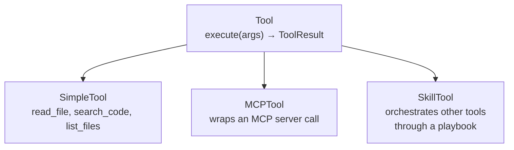
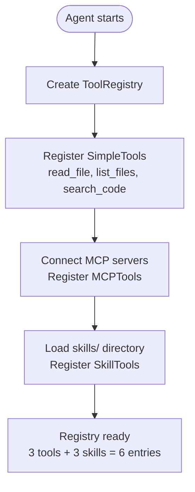
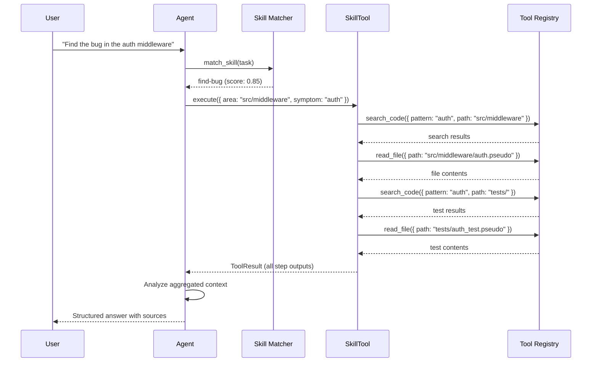
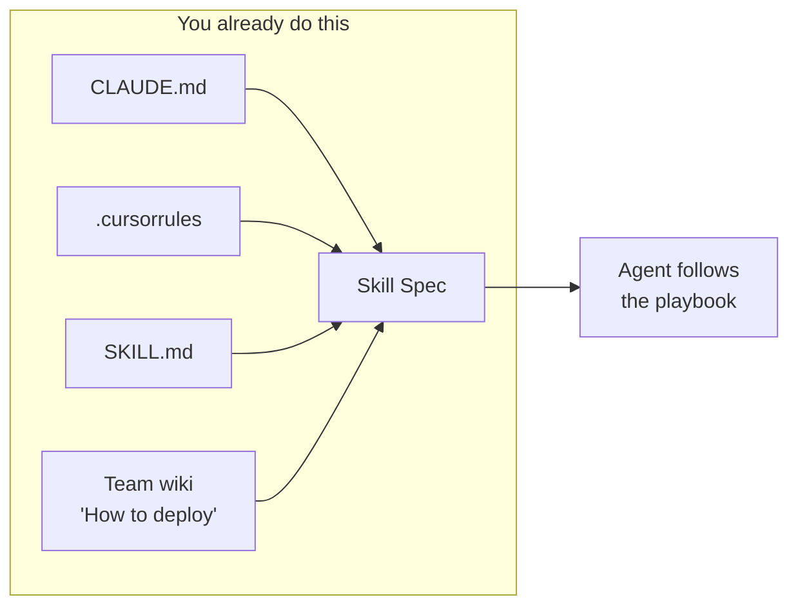
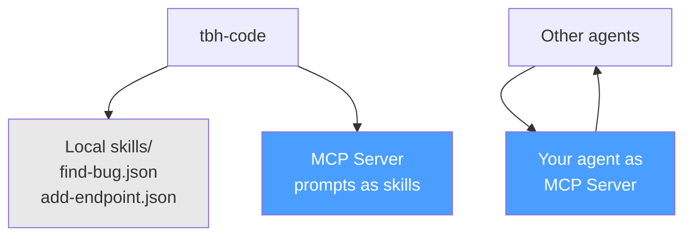
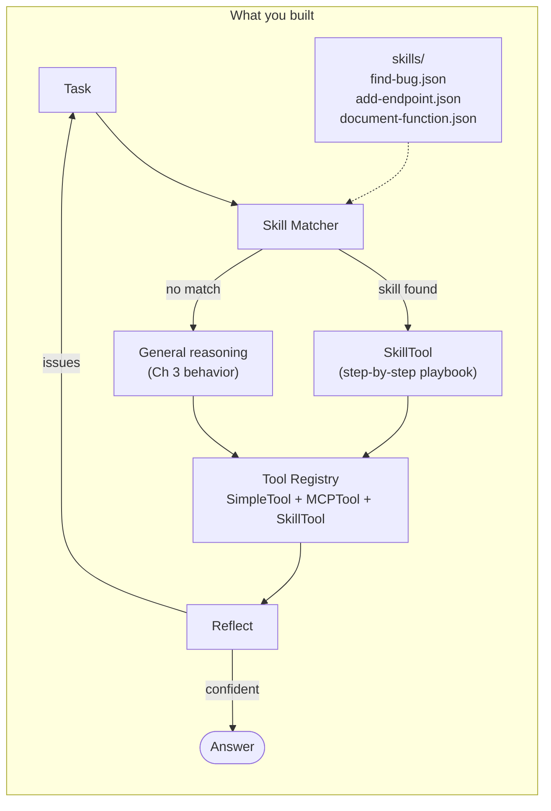

# Chapter 4: Skills: Teaching Your Agent What To Do

## You Are the Carpenter

You have a hammer. You have a saw. You have a tape measure, a level, a drill. Someone walks in and says:

*"Add a new endpoint to the todo-api."*

You pick up the hammer. You start swinging.

You read six random files. You write a route handler. You forget to register it in the router. You don't check what patterns the existing routes follow. You never look at the tests. You produce a file that compiles — maybe — and has no connection to the rest of the codebase.

This is your Ch 3 agent. It has tools. It can search code, read files, call MCP servers. It can *act*. But having tools and knowing what to do with them are different problems. A carpenter with every tool in the shop and no blueprint just makes noise.

Watch the trace:

```
[agent] Task: "Add a GET /tasks/:id/tags endpoint to todo-api"

[loop] Iteration 1:
  [think] I need to add an endpoint. Let me look at the codebase.
  [tool]  read_file({ path: "src/main.pseudo" })                  ← ok, found the entry point
  [tool]  read_file({ path: "src/models/task.pseudo" })            ← why this file?
  [tool]  read_file({ path: "README.md" })                         ← not helpful
  [tool]  search_code({ pattern: "tags" })                         ← found nothing
  [tool]  read_file({ path: "src/routes/auth.pseudo" })            ← auth? we're adding tags
  [tool]  read_file({ path: "tests/auth_test.pseudo" })            ← still auth
  [act]   "Here's the new endpoint: ..."
          Writes route handler. Doesn't register it. No tests.
  [reflect] confidence=0.7
```

Six tool calls. No strategy. The agent touched six files and missed the two that mattered: the existing route file it should have followed as a pattern, and the router it needed to update.

A human developer wouldn't work this way. Before writing a single line, you'd think: *What do existing routes look like? Where does the router register them? What's the test pattern?* You'd follow a recipe. A procedure. A playbook.

tbh, tools without a plan is just expensive random access.

---

## What You'll Learn

- Why tools alone don't produce structured behavior
- Tools are verbs. Skills are recipes. The difference changes everything.
- How to build SkillTool — a composite tool that orchestrates other tools through a playbook
- Skill specs: the file format that turns strategy into something an agent can execute
- Skill matching: how the agent picks the right playbook for the job
- MCP prompts as a skill delivery mechanism
- Why you already use skills — you just call them CLAUDE.md and .cursorrules

---

## Give It a Playbook

Instead of letting the agent fail, write down what a competent developer would do:

```
Find Bug:
  1. Search for code related to the symptom in the target area
  2. Read the most relevant source file
  3. Search for related tests
  4. Read the test file

Add Endpoint:
  1. List existing route files to understand the pattern
  2. Read an existing route file as a template
  3. Find where routes are registered
  4. Write the new route file following the pattern
  5. Update the router
  6. Write a test file

Document Function:
  1. Search for the function definition
  2. Read the file containing the function
  3. Search for usages
  4. Search for tests
```

These aren't tool calls. They're strategies. Each step describes an action in context — "search for code related to the symptom." The agent picks the right tool to execute it — `search_code({ pattern: "auth", path: "src/middleware" })`. The strategy says "search for the symptom." The tool does the searching.

The playbook doesn't name files. It doesn't hardcode paths. It describes a *process* — the same process a human would follow. The tools fill in the blanks.

Let's make this concrete. Here's the "find-bug" playbook as a structured file:

```json
{
  "name": "find-bug",
  "description": "Systematically search for bugs in a specific area of the codebase",
  "trigger": "find bug, debug, investigate, what's wrong, vulnerability, error",
  "tools_used": ["search_code", "read_file", "list_files"],
  "constraints": [
    "Always search before reading — don't guess file paths",
    "Read the actual code before diagnosing",
    "Check for related tests",
    "Report specific file paths and line numbers"
  ],
  "steps": [
    {
      "description": "Search for code related to the symptom",
      "tool": "search_code",
      "args_template": { "pattern": "{symptom}", "path": "{area}" },
      "output_key": "search_results"
    },
    {
      "description": "Read the most relevant file",
      "tool": "read_file",
      "args_template": { "path": "{search_results[0].file}" },
      "output_key": "source_code"
    },
    {
      "description": "Search for related tests",
      "tool": "search_code",
      "args_template": { "pattern": "{symptom}", "path": "tests/" },
      "output_key": "test_results",
      "optional": true
    },
    {
      "description": "Read the test file if found",
      "tool": "read_file",
      "args_template": { "path": "{test_results[0].file}" },
      "output_key": "test_code",
      "optional": true
    }
  ]
}
```

Read it top to bottom. Name, description, when to use it, what tools it needs, what rules to follow, and then the steps — in order. Each step names a tool, provides arguments (with `{placeholders}` that get filled from prior step outputs), and stores the result under a key.

Step 1 searches. Step 2 reads what step 1 found. Step 3 looks for tests. Step 4 reads them. The outputs chain — `{search_results[0].file}` in step 2 refers to what step 1 returned. The playbook is a pipeline.

Now look at the constraints: "Always search before reading." "Read the actual code before diagnosing." These are the exact rules the Ch 3 agent violated. The agent read six random files because it had no rule saying *search first*. The constraint makes the strategy explicit.

---

## Make It a Tool

Here's the design insight that makes everything clean: a skill *is* a tool.

In Ch 3, you built the `Tool` interface. `SimpleTool` implements it directly. `MCPTool` wraps an MCP server call. Now `SkillTool` extends the same interface — but instead of doing one thing, it orchestrates a sequence of other tool calls.




The agent doesn't care which kind it's calling. `execute(args)` in, `ToolResult` out. A skill is just a composite tool.

```
SkillTool extends Tool:
    name: string
    description: string
    parameters: ParameterSchema
    steps: SkillStep[]
    tools_used: string[]

    execute(args) → ToolResult:
        context = { ...args }
        for step in steps:
            tool = registry.find(step.tool)
            if tool is null:
                return ToolResult(
                    output=null, success=false,
                    error="Skill requires tool '{step.tool}' but it is not registered"
                )
            resolved_args = resolve_template(step.args_template, context)
            result = tool.execute(resolved_args)
            if not result.success and not step.optional:
                return ToolResult(
                    output=context, success=false,
                    error="Step '{step.description}' failed: {result.error}"
                )
            context[step.output_key] = result.output
        return ToolResult(output=context, success=true)
```

Walk through it. The skill receives args — say, `{ area: "src/middleware", symptom: "auth" }`. It loops through its steps. For each step, it finds the tool in the registry, fills in the argument template with values from the context, executes the tool, and stores the output. If a required step fails, the skill fails. If an optional step fails, it moves on. When all steps complete, it returns everything the steps collected.

The `resolve_template()` function is the glue. It takes `{ "pattern": "{symptom}", "path": "{area}" }` and the current context `{ symptom: "auth", area: "src/middleware" }` and produces `{ "pattern": "auth", "path": "src/middleware" }`. Step 2's template references `{search_results[0].file}` — the first file from step 1's output. Outputs flow forward.

---

## Load, Match, Execute

Three pieces connect skills to the agent.

**SkillLoader** reads skill files from a directory and registers them:

```
SkillLoader:
    load_directory(path) → SkillTool[]
        skills = []
        for file in list_files(path, pattern="*.json"):
            spec = parse_skill_spec(file)
            skill_tool = SkillTool(
                name=spec.name,
                description=spec.description,
                parameters=derive_parameters(spec),
                steps=spec.steps,
                tools_used=spec.tools_used
            )
            skills.append(skill_tool)
        return skills

    load_and_register(path, registry) → int
        skills = load_directory(path)
        for skill in skills:
            registry.register(skill)
        return len(skills)
```

**Skill matching** picks the right playbook for a task:

```
match_skill(task, registry) → SkillTool | null
    skill_tools = [t for t in registry.list() if isinstance(t, SkillTool)]
    best_match = null
    best_score = 0

    for skill in skill_tools:
        score = compute_match_score(task, skill.trigger_keywords)
        if score > best_score:
            best_score = score
            best_match = skill

    if best_score < MATCH_THRESHOLD:
        return null
    return best_match
```

The matching is deliberately simple — keyword overlap between the task description and the skill's trigger string. "Find the bug in the auth middleware" overlaps with "find bug, debug, investigate, what's wrong, vulnerability, error" on "find" and "bug." That's enough.

More sophisticated approaches exist — LLM-based matching, embedding similarity — but keyword overlap works for three skills. Start simple. Upgrade when it breaks.

**The startup flow** ties it together:




After startup, the registry holds SimpleTools, MCPTools, and SkillTools side by side. The agent sees six entries. Three are atomic tools. Three are composite playbooks. Same interface for all of them.

**The execution flow:**




The agent receives a task. The matcher finds the right skill. The agent calls `execute()` on the skill — same as any other tool. The skill runs its steps, calling tools from the registry. The agent gets back a `ToolResult` with everything the steps collected. It analyzes the aggregated context and produces an answer.

---

## Watch the Playbook Work

Run the same auth bug task, now with skills loaded:

```
$ tbh-code --codebase ./todo-api --ask "Find the bug in the auth middleware"

Loading codebase from ./todo-api ...
  Loaded 9 files
  Registered 3 tools: read_file, list_files, search_code
  Loading skills from skills/ ...
  Loaded 3 skills: find-bug, add-endpoint, document-function
  Total registry: 6 entries (3 tools + 3 skills)

[skill] Matched task to skill: find-bug (score: 0.85)
[skill] Executing skill: find-bug
[skill] Parameters: { "area": "src/middleware", "symptom": "auth" }

[skill] Step 1/4: Search for code related to the symptom
  [tool] search_code({ "pattern": "auth", "path": "src/middleware" })
  [tool] Result: success=true
    [
      { "file": "src/middleware/auth.pseudo", "line": 1, "content": "# Authentication Middleware" },
      { "file": "src/middleware/auth.pseudo", "line": 8, "content": "function auth_middleware(req, res, next):" }
    ]

[skill] Step 2/4: Read the most relevant file
  [tool] read_file({ "path": "src/middleware/auth.pseudo" })
  [tool] Result: success=true

[skill] Step 3/4: Search for related tests
  [tool] search_code({ "pattern": "auth", "path": "tests/" })
  [tool] Result: success=true
    [
      { "file": "tests/auth_test.pseudo", "line": 1, "content": "# Auth Tests" }
    ]

[skill] Step 4/4: Read the test file if found
  [tool] read_file({ "path": "tests/auth_test.pseudo" })
  [tool] Result: success=true

[skill] Skill "find-bug" completed successfully (4/4 steps)
```

```json
{
  "answer": "The auth middleware in src/middleware/auth.pseudo has a critical security bug. The auth_middleware() function (line 8) checks if the Authorization header exists and is non-empty, but performs NO actual token validation:\n\n1. The token is never decoded or parsed\n2. No signature verification\n3. No expiry check\n4. req.user is hardcoded to { id: 1, username: 'unknown' } for ALL tokens\n\nThis means ANY non-empty Authorization header grants access as user 1.\n\nTest gap: tests/auth_test.pseudo only tests /auth/register and /auth/login — there are no tests for the middleware itself.",
  "confidence": 0.95,
  "sources": [
    "src/middleware/auth.pseudo:8-15",
    "tests/auth_test.pseudo"
  ]
}
```

Four tool calls. Four *purposeful* tool calls. Compare that to the Ch 3 agent's six random reads:


|              | Ch 3 (Tools, No Skill)                      | Ch 4 (Skill-Guided)                           |
| ------------ | ------------------------------------------- | --------------------------------------------- |
| Tool calls   | 6 (scattered)                               | 4 (structured)                                |
| Strategy     | None — read random files                    | Search first, read what you find, check tests |
| Files missed | Existing route pattern, router registration | None — covered by steps                       |
| Result       | Wrote a route, forgot router and tests      | Found the bug with evidence and test gap      |
| Confidence   | 0.7 (shaky)                                 | 0.95 (grounded)                               |


Same tools. Same LLM. Same codebase. The only difference is a 30-line JSON file that says *what to do*.

---

## You Already Use Skills

This isn't a new idea. You've been writing skills for years — you just didn't call them that.

**CLAUDE.md.** Every time you write a project instruction file, you're writing a skill spec. "When modifying this codebase, always run tests after changes." "Follow the existing naming convention." "Don't modify files in the legacy/ directory." These are constraints. They're steps. They're a playbook.

**.cursorrules.** Same thing, different tool. "Use TypeScript strict mode." "Prefer functional style." "Always add JSDoc comments." You're encoding a strategy — a recipe for how the agent should approach work in this codebase. The tools do the individual steps. The rules say which steps and in what order.

**SKILL.md / AGENTS.md.** Some teams write explicit procedure files. "To add a new API endpoint: 1. Copy an existing route file. 2. Update the router. 3. Add tests. 4. Update the OpenAPI spec." That's a skill spec. You just wrote it in markdown instead of JSON.

Every time you write one of these files, you're encoding expertise into a format an agent can follow. The skill spec format in this chapter is just that — formalized.




The difference is that a formal skill spec is machine-readable. The agent can load it, match it to a task, and execute it step by step. Your CLAUDE.md is a skill spec written for an audience of one — the LLM processing the system prompt. The SkillSpec format makes it composable, discoverable, and eventually sharable. (Ch 11 is where agents broadcast skills to peers. But that's later.)

---

## MCP Prompts: Skills Over the Wire

In Ch 3, you connected to MCP servers and discovered tools. MCP has another primitive you didn't use yet: **prompts**.

An MCP prompt is a parameterized template — a name, a description, arguments, and a body. Sound familiar? That's a skill spec delivered over a protocol instead of loaded from a file.

```
MCPPrompt:
    name: string
    description: string
    arguments: ParameterSchema
    template: string
```

This means skills can come from three places:

1. **Local files** — SkillLoader reads `skills/find-bug.json`
2. **MCP servers** — MCPClient discovers prompts, converts them to SkillTools
3. **Your agent as a server** — other agents discover your skills via MCP




For now, skills are local JSON files. But the interface is the same — `SkillTool extends Tool`. When an MCP prompt arrives over the wire, you wrap it in a SkillTool and register it. The agent doesn't know the difference between a local skill and a remote one. Same `execute()`, same `ToolResult`.

---

## When the Playbook Hits a Wall

Try the "add-endpoint" skill:

```
$ tbh-code --codebase ./todo-api --skill "add-endpoint" \
    --task "Add a GET /tasks/:id/tags endpoint"

[skill] Using skill: add-endpoint
[skill] Parameters: { "endpoint": "/tasks/:id/tags", "method": "GET", "description": "Get tags for a task" }

[skill] Step 1/6: List existing route files to understand structure
  [tool] list_files({ "path": "src/routes" })
  [tool] Result: success=true

[skill] Step 2/6: Read an existing route file as a template
  [tool] read_file({ "path": "src/routes/tasks.pseudo" })
  [tool] Result: success=true

[skill] Step 3/6: Search for the router setup
  [tool] search_code({ "pattern": "app.use", "path": "src/main.pseudo" })
  [tool] Result: success=true

[skill] Step 4/6: Write the new route file
  [tool] write_file — ERROR: tool not registered
[skill] Skill "add-endpoint" failed at step 4: tool 'write_file' is not registered
```

```json
{
  "answer": "I was able to analyze the existing code structure and understand how routes are organized, but I cannot complete the 'add-endpoint' skill. Steps 4-6 require the write_file tool, which is not yet available.\n\nHere's what I found:\n- Routes are in src/routes/ (tasks.pseudo, auth.pseudo)\n- The router is set up in src/main.pseudo using app.use()\n- I know the pattern to follow, but I can't create or modify files.\n\nThe write_file tool needs to be implemented before this skill can run to completion.",
  "confidence": 0.3,
  "sources": [
    "src/routes/tasks.pseudo",
    "src/main.pseudo"
  ]
}
```

The skill has the full recipe — write a route file, update the router, create tests. It even knows the pattern — it read the existing route file. But step 4 calls `write_file`, and that tool doesn't exist yet. The skill fails gracefully: clear error, partial results, low confidence.

This is the bridge to Chapter 5. The skill has the strategy. The tools have the read-only capabilities. The gap is *action* — writing files, running commands. Chapter 5 fills that gap.

---

## Fallback: When No Skill Matches

```
$ tbh-code --codebase ./todo-api --ask "What is the meaning of life?"

[skill] No matching skill found for task (best score: 0.05, threshold: 0.3)
[skill] Falling back to general reasoning
```

```json
{
  "answer": "That's a philosophical question outside the scope of codebase analysis. I'm a coding agent — I can help you find bugs, add endpoints, document functions, or answer questions about the todo-api codebase. Try asking me about the code!",
  "confidence": 0.9,
  "sources": []
}
```

No skill matched, so the agent fell back to general reasoning — Ch 3 behavior. No crash, no forced match, no pretending "What is the meaning of life?" is a bug to investigate.

The fallback is important. Skills are shortcuts, not requirements. When no playbook fits, the agent still has tools and reasoning. A skill makes the agent faster and more structured; the absence of a skill doesn't make it helpless.

---

## Now Name What You Built

A tool is a **single capability** — one verb. Search. Read. Write. Execute. It doesn't know why you're calling it. It doesn't know what comes next. It does one thing and returns a result.

A skill is a **strategy** — a recipe. Step 1: search for the symptom. Step 2: read what you found. Step 3: check the tests. Step 4: diagnose. It sequences capabilities into a coherent approach. It knows the order. It knows the constraints. It carries context between steps.

```
Tool  = a verb       — search, read, write, execute (one action, context-free)
Skill = a recipe     — find-bug: search → read → check tests → diagnose (sequenced, context-aware)
```

The test is simple: **can you do it in one call?** `search_code("auth_middleware")` — one call, one result. That's a tool. "Find the security bug" — search for auth files, read middleware, read routes, cross-reference token generation with validation, check test coverage. Multiple calls, specific order, judgment at each step. That's a skill.

Your SkillTool is a composite tool — it orchestrates other tools through a step-by-step playbook. It extends the Tool interface. The agent calls `execute()` on it just like any other tool. The ToolRegistry holds SimpleTools, MCPTools, and SkillTools side by side. Uniform interface, different levels of complexity inside.


| Concept            | What It Is                                                         |
| ------------------ | ------------------------------------------------------------------ |
| **Tool**           | A single capability — one verb: read, search, write, execute       |
| **Skill**          | A strategy — a recipe: find-bug (search → read → check tests → diagnose) |
| **SkillSpec**      | The file that defines a skill: name, trigger, steps, constraints   |
| **SkillTool**      | A Tool that executes a SkillSpec — same interface as SimpleTool    |
| **SkillLoader**    | Reads spec files, creates SkillTools, registers them               |
| **Skill matching** | Maps a task to the best skill (or falls back to general reasoning) |


And here's the thing about skills that makes them different from everything else you've built so far: they're *files*. Not code. Not compiled logic. Text files that describe a process. Which means they can be edited. Rewritten. Improved.

Right now, you write them by hand. In Chapter 9, your agent will rewrite them itself — diagnosing what went wrong, adjusting the steps, adding new constraints. Skills become living documents that evolve with the agent's experience. But that's five chapters away. For now, you write the playbooks. The agent follows them.

---

## The Spec

Full spec for this chapter in `spec/ch04/`:

```
spec/ch04/
├── prompt-template.md     What to build (language-agnostic)
├── interface-spec.md      SkillTool, SkillSpec, SkillStep, SkillLoader, matching
├── expected-output.txt    Skill loading, matching, execution, fallback traces
└── validation/
    └── test_ch04.py       Tests: skill loading, matching, execution, fallback
```

The validation tests check: skills load from files on startup, SkillTool implements the Tool interface, the right skill matches the right task, steps execute in order with outputs flowing between them, missing tools cause graceful failure, and unmatched tasks fall back to general reasoning.

---

## Try It

1. **Write a fourth skill.** Design a "refactor-function" skill that extracts a function, finds all callers, and verifies nothing breaks. What steps do you need? What tools?
2. **Break the matcher.** Give two skills overlapping triggers — both trigger on "bug." Which one wins? Is that the right one? What would make matching smarter?
3. **Chain skills manually.** Run "find-bug" to identify the auth vulnerability, then run "document-function" on `auth_middleware`. Does the documentation mention the bug?
4. **Watch the add-endpoint wall.** Run the add-endpoint skill and watch it fail at step 4. Read the error. Then imagine what happens when Ch 5 adds `write_file` — the same skill spec, unchanged, suddenly works end-to-end.
5. **Write a CLAUDE.md for todo-api.** Then translate it into a skill spec. How much of what you wrote naturally maps to name, trigger, steps, and constraints?

---

## Three Playbook Pitfalls

### The God Skill

One skill to rule them all. Thirty steps. Uses every tool. Triggered by everything.

**Why it happens:** You don't want to maintain multiple skill files, so you cram everything into one. "code-assistant" — triggered by any coding task, steps for bug finding, endpoint creation, documentation, refactoring, deployment...

**Why it fails:** A 30-step playbook where 25 steps are irrelevant is worse than no playbook. The agent wastes tool calls on steps that don't apply. The constraints conflict. "Always search before reading" doesn't help when the task is "document this function I already found."

**Fix:** Small skills. One behavior each. Three to six steps. If you're describing two different activities, you have two skills.

### The Rigid Recipe

Hardcoded file paths in the skill spec. `{ "path": "src/routes/tasks.pseudo" }` instead of `{ "path": "{search_results[0].file}" }`. The skill works for exactly one codebase and breaks everywhere else.

**Why it happens:** You tested with todo-api, it worked, you shipped it. The path was right — for this project.

**Why it fails:** The whole point of skills is reusable strategy. "Search for the pattern, read what you find" works on any codebase. "Read src/routes/tasks.pseudo" works on one.

**Fix:** Templates, not literals. Every file path should come from a prior step's output, not from the spec itself. Skills describe *process*, not *data*.

### The Phantom Tool

The skill references `analyze_complexity` in step 3. That tool doesn't exist. The skill loads fine — it's just a JSON file. It even matches tasks. Then it blows up at runtime.

**Why it happens:** No validation at load time. The SkillLoader reads the file and creates the SkillTool without checking whether the tools it references are actually registered.

**Why it fails:** The failure is delayed and confusing. The agent matched the skill, started executing, then hit "tool not found" midway through.

**Fix:** Validate at load time. When SkillLoader creates a SkillTool, check that every tool in `tools_used` exists in the registry. Warn on startup, not at runtime. (The add-endpoint skill's `write_file` is a known future dependency — that's a deliberate design choice, not a phantom tool.)

---

## Skills Have Hands. The Agent Doesn't. Yet.

Your agent has playbooks now. The find-bug skill systematically searches, reads, and diagnoses. The document-function skill gathers context before writing docs. The add-endpoint skill knows the complete procedure for adding a route.

But you watched add-endpoint hit a wall. Step 4: `write_file` — tool not registered. The skill knows it should write a route file. It knows what pattern to follow. It read the existing routes. It found the router. It has everything it needs — except the ability to actually create a file.

And it's not just writing. The skill can't run tests. Can't execute shell commands. Can't verify that the endpoint it would create actually works. The playbook says "write the test file" and "run the tests" — but both steps fail because those tools are stubs.

Chapter 5 gives the agent a file system and a shell. `write_file`, `execute_shell`, sandboxing, permission gates. The same add-endpoint skill spec — unchanged, not a single line modified — will suddenly execute all six steps. The skill was always ready. It was waiting for the tools to catch up.

---

> **tbh-code after this chapter:**




> An agent with loadable skill specs that compose tools into structured behaviors. Skills are Tools — same `execute()` interface, registered alongside SimpleTools and MCPTools. The agent matches tasks to playbooks, follows step-by-step procedures, and falls back to general reasoning when no skill fits. Three sample skills. Skill files are static — for now.

---

## References

### Agent Architecture & Workflows

1. **"Building Effective Agents"** — Anthropic (2024). Defines the five composable workflow patterns (prompt chaining, routing, parallelization, orchestrator-workers, evaluator-optimizer) that underpin skill composition. [anthropic.com/research/building-effective-agents](https://www.anthropic.com/research/building-effective-agents)

2. **"A Practical Guide to Building Agents"** — OpenAI (2025). Frames agents as model + tools + instructions; introduces tool categories and the role of explicit instructions in steering agent behavior. [openai.com/business/guides-and-resources/a-practical-guide-to-building-ai-agents](https://openai.com/business/guides-and-resources/a-practical-guide-to-building-ai-agents/)

3. **"Orchestrating Agents: Routines and Handoffs"** — OpenAI Cookbook (2024). Defines a "routine" as a system prompt plus tools — the closest industry analogue to SkillTool. [cookbook.openai.com/examples/orchestrating_agents](https://cookbook.openai.com/examples/orchestrating_agents)

4. **"Writing Effective Tools for AI Agents"** — Anthropic Engineering (2025). Best practices for tool descriptions and specs as steering mechanisms. [anthropic.com/engineering/writing-tools-for-agents](https://www.anthropic.com/engineering/writing-tools-for-agents)

### Skill Specs & Standards

5. **"Equipping Agents for the Real World with Agent Skills"** — Anthropic Engineering (2025). Introduces the SKILL.md open standard: portable, cross-platform format for packaging agent expertise as composable playbooks. [anthropic.com/engineering/equipping-agents-for-the-real-world-with-agent-skills](https://www.anthropic.com/engineering/equipping-agents-for-the-real-world-with-agent-skills)

6. **"Agent Skills Specification"** — agentskills.io. The formal open specification for the SKILL.md format. [agentskills.io/home](https://agentskills.io/home)

7. **"MCP Prompts Specification"** — Model Context Protocol. Defines the MCP prompts primitive: reusable, parameterized prompt templates that servers expose to clients. [modelcontextprotocol.io/specification/2025-06-18/server/prompts](https://modelcontextprotocol.io/specification/2025-06-18/server/prompts)

8. **"Cursor Rules for AI"** — Cursor Documentation. Documents .cursorrules and project rules: per-project instruction files that steer AI behavior — real-world skill specs as config files. [docs.cursor.com/context/rules-for-ai](https://docs.cursor.com/context/rules-for-ai)

### Reasoning & Planning

9. **"ReAct: Synergizing Reasoning and Acting in Language Models"** — Yao et al. (2022). The observe-think-act loop that skills orchestrate at a higher level of abstraction. [arxiv.org/abs/2210.03629](https://arxiv.org/abs/2210.03629)

10. **"Chain-of-Thought Prompting Elicits Reasoning in Large Language Models"** — Wei et al. (2022). Step-by-step reasoning instructions improve performance — why skill specs with explicit steps outperform bare prompts. [arxiv.org/abs/2201.11903](https://arxiv.org/abs/2201.11903)

11. **"Plan-and-Solve Prompting"** — Wang et al., ACL 2023. Decomposing tasks into a plan then executing each subtask — maps directly to the skill pattern of trigger-then-steps. [arxiv.org/abs/2305.04091](https://arxiv.org/abs/2305.04091)

12. **"Plan-and-Execute Agents"** — LangChain Blog. Plan-and-execute architecture: planner generates steps, executor runs them — the implementation pattern SkillTool follows. [blog.langchain.com/planning-agents](https://blog.langchain.com/planning-agents/)

### Composite Tool Orchestration

13. **"HuggingGPT: Solving AI Tasks with ChatGPT and its Friends in Hugging Face"** — Shen et al., Microsoft (2023). LLM as controller that plans tasks, selects specialist models, and orchestrates execution order. [arxiv.org/abs/2303.17580](https://arxiv.org/abs/2303.17580)

14. **"Toolformer: Language Models Can Teach Themselves to Use Tools"** — Schick et al., Meta AI (2023). LLMs learning when and how to call tools — the tool-use capability that skills compose. [arxiv.org/abs/2302.04761](https://arxiv.org/abs/2302.04761)

15. **"ART: Automatic Multi-step Reasoning and Tool-use"** — Paranjape et al. (2023). Automatically generates multi-step reasoning programs interleaving reasoning with tool calls — a learned analogue to skill matching. [arxiv.org/abs/2303.09014](https://arxiv.org/abs/2303.09014)

### Surveys & Background

16. **"Understanding the Planning of LLM Agents: A Survey"** — Huang et al. (2024). Comprehensive survey covering task decomposition, plan selection, reflection, and memory in LLM agents. [arxiv.org/abs/2402.02716](https://arxiv.org/abs/2402.02716)

17. **"OpenAI Function Calling Guide"** — OpenAI. Official documentation on function/tool calling schemas — the mechanical layer that skills build on top of. [platform.openai.com/docs/guides/function-calling](https://platform.openai.com/docs/guides/function-calling)

18. **"An Overview of Hierarchical Task Network Planning"** — Georgievski & Aiello (2014). Classic survey on HTN planning: decomposing compound tasks into primitive actions — the AI planning tradition that skill specs formalize for LLM agents. [arxiv.org/abs/1403.7426](https://arxiv.org/abs/1403.7426)

