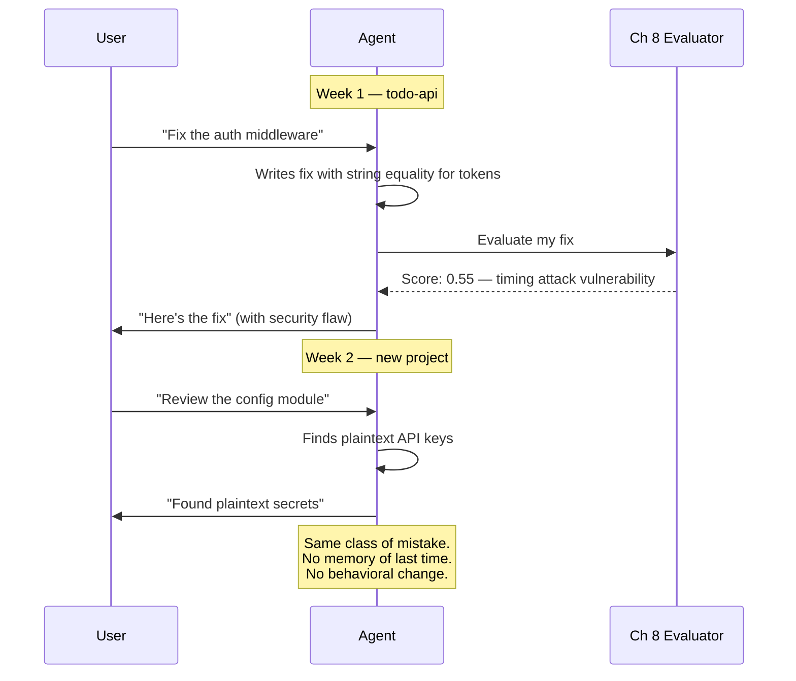
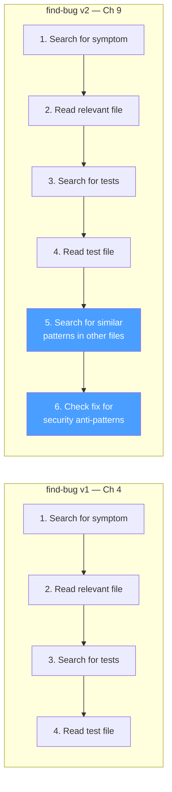
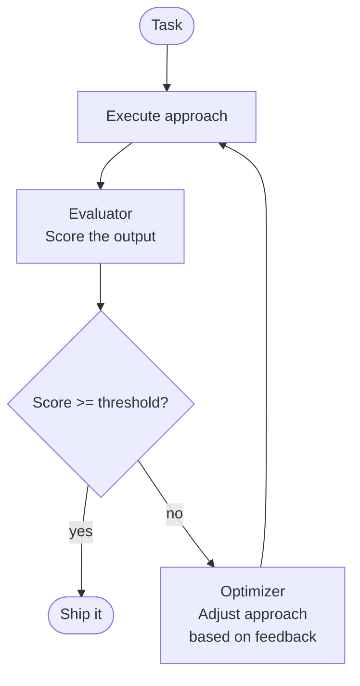
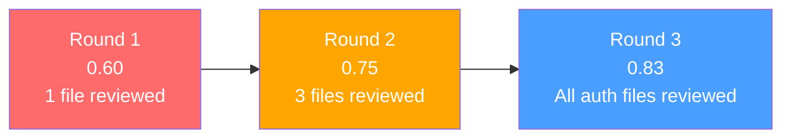
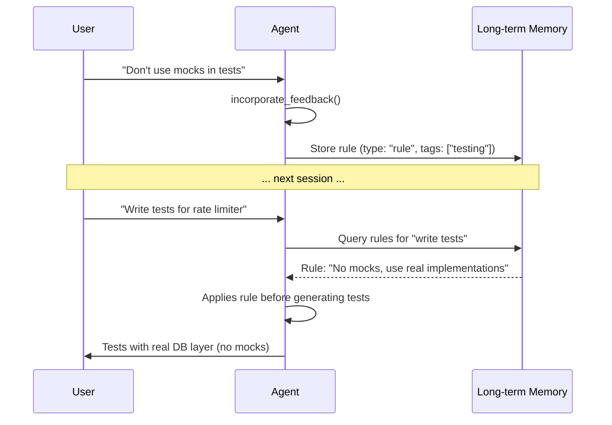
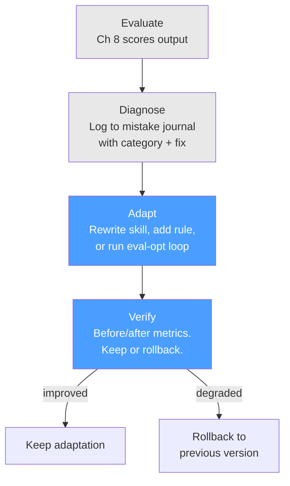
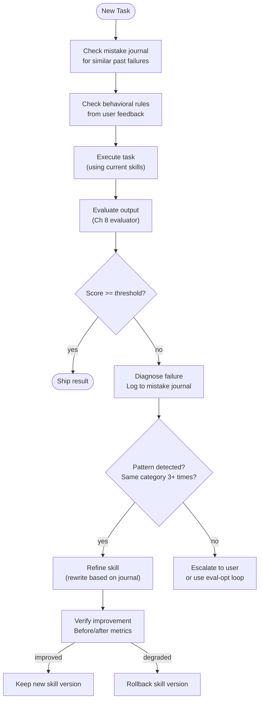
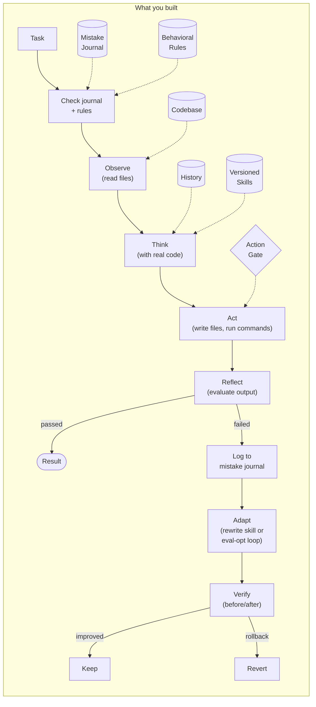

# Chapter 9: Self-Improvement: Agents That Get Better

## You Are the Agent (Again)

Last week you diagnosed the plaintext password problem in `todo-api`. The evaluator caught it, you flagged it, the user fixed it. Solid work. Chapter 8 gave you the ability to grade your own output and catch mistakes before the user did. You're not just acting — you're *judging* your actions.

Now it's Monday. Different project. New codebase. Someone asks:

*"Review the config module for security issues."*

You read the files. You spot it immediately — API keys stored in plaintext in `config.pseudo`. Clear text. No encryption. No environment variables. Just raw secrets sitting in a file that gets committed to version control.

You flag it. The evaluator scores it. Good work. Ship it.

Except — you did this *last week*. The plaintext password issue was the same class of problem. Sensitive data stored without protection. You diagnosed it, flagged it, moved on. And now here you are, diagnosing the same category of mistake on a different codebase, with zero memory of the last time.



The evaluator from Chapter 8 catches problems *in the moment*. It doesn't learn from them. It scores every task from scratch, with no memory of the patterns it's seen before. Your agent diagnoses the same categories of mistakes over and over — security oversights, incomplete fixes, missing edge cases — and never connects the dots.

A developer who makes the same mistake twice is having a bad week. A developer who makes the same *category* of mistake every week has a process problem. Your agent has a process problem.

tbh, diagnosis without learning is just expensive repetition.

---

## What You'll Learn

You're going to close the loop. The agent won't just catch mistakes — it'll remember them, find patterns, rewrite its own behavior, and prove the rewrite actually helped.

- The evaluate-diagnose-adapt-verify loop — the self-improvement cycle
- Mistake journals: structured failure logs the agent queries before acting
- Skill rewriting: the agent edits its own playbooks based on what went wrong
- The evaluator-optimizer pattern: two roles, one loop, iterative convergence
- User feedback as persistent behavioral rules, not just chat messages
- Verification: proving improvement is real, rolling back when it isn't

This is the chapter the book title promised. "Agents That Think and Self-Improve" — Chapter 8 gave you the thinking. Chapter 9 gives you the self-improvement.

---

## Not a Log. A Learning Artifact.

Your agent has been making mistakes since Chapter 1. The problem isn't the mistakes — it's that they vanish. The evaluation from Chapter 8 fires, produces a score, maybe escalates to the user, and then the diagnosis evaporates. Next session, the agent starts fresh. Same blind spots. Same failure modes.

The fix isn't a log file. You've got logs. What you need is a *structured record of what went wrong, why it went wrong, and what to do differently* — something the agent can query before it acts.

```
MistakeJournal:
    entries: MistakeEntry[]
    storage_path: string            # .tbh-code/journal/

    log(entry) → void               # persist immediately
    query(filters) → MistakeEntry[] # search by category, recency, task type
    categories() → dict             # mistake categories with counts

MistakeEntry:
    task: string                    # what the agent was trying to do
    output: string                  # what the agent produced
    diagnosis: string               # what went wrong and WHY
    suggested_fix: string           # what to do differently next time
    category: enum("security", "incomplete", "incorrect",
                   "inefficient", "style", "regression")
    skill_used: string | null       # which skill was active
    eval_score: float | null        # the score that triggered this
    timestamp: datetime
```

The `diagnosis` field is the difference between a log and a learning artifact. "Score: 0.55" is a log entry. "Used string equality for token comparison — vulnerable to timing attacks" is a diagnosis. One tells you something failed. The other tells you *why* and *what to change*.

### Three Entries That Tell a Story

Watch the journal build a pattern across three tasks.

**Entry 1: The timing attack.**

```
$ tbh-code --codebase ./todo-api --auto-approve --ask "Fix the auth middleware to properly validate tokens"

<agent plans, executes, evaluates...>

[eval] Overall score: 0.55
[eval] Correctness: 0.80 — Fix works, tokens validated
[eval] Completeness: 0.55 — Missing edge cases
[eval] Safety: 0.30 — Passwords compared with string equality (timing attack risk)
[eval] FAILED (0.55 < 0.7)

[journal] Logging mistake entry:
  {
    "task": "Fix auth middleware token validation",
    "output": "Rewrote middleware with base64 decoding and user lookup",
    "diagnosis": "Used string equality for token comparison. Vulnerable to timing attacks. Also missing test for expired tokens.",
    "suggested_fix": "Use constant-time comparison for secrets. Add token expiration check.",
    "category": "security",
    "skill_used": "find-bug",
    "eval_score": 0.55,
    "timestamp": "2025-01-15T14:30:00Z"
  }

[journal] Entry saved: .tbh-code/journal/2025-01-15T14:30:00Z.json
```

The agent didn't just record "failed." It captured: the task, the output, the diagnosis (timing attack via string equality), the fix (constant-time comparison), the category (security), and which skill was being used. Every field is queryable. Every field matters.

**Entry 2: The plaintext passwords.**

```
$ tbh-code --codebase ./todo-api --auto-approve --ask "Add user registration with password storage"

[eval] Overall score: 0.57
[eval] Safety: 0.30 — Passwords stored in plaintext

[journal] Logging mistake entry:
  {
    "task": "Add user registration with password storage",
    "output": "Created registration endpoint, passwords saved to DB",
    "diagnosis": "Passwords stored as plaintext strings. No hashing applied. Critical security vulnerability.",
    "suggested_fix": "Always hash passwords with bcrypt/argon2 before storage. Never store raw passwords.",
    "category": "security",
    "skill_used": null,
    "eval_score": 0.57
  }
```

**Entry 3: The partial validation.**

```
$ tbh-code --codebase ./todo-api --auto-approve --ask "Add input validation to POST /tasks"

[eval] Overall score: 0.65
[eval] Completeness: 0.50 — Only validated title, missed other fields

[journal] Logging mistake entry:
  {
    "task": "Add input validation to POST /tasks",
    "output": "Added title length check to POST handler",
    "diagnosis": "Only validated the title field mentioned in the task. Did not check completed field type or reject unknown fields.",
    "suggested_fix": "When adding validation, validate ALL fields in request body, not just the one explicitly mentioned.",
    "category": "incomplete",
    "skill_used": null,
    "eval_score": 0.65
  }
```

Three entries. Now query the journal:

```
$ tbh-code --codebase ./todo-api --show-journal

Mistake Journal (3 entries):

  Categories:
    security:   2 entries
    incomplete: 1 entry

  Recent entries:
    1. [security] "Fix auth middleware" — timing attack via string equality
    2. [security] "Add registration" — plaintext password storage
    3. [incomplete] "Add validation" — only validated one field

  Pattern detected: "security" category has 2+ entries.
  Recommendation: Refine skills that touch security-related code.
```

Two security mistakes. Not random. Not unrelated. The agent keeps missing security concerns — timing attacks, plaintext storage. Different tasks, same blind spot. A flat log would show three separate failures. The journal shows a *pattern*.

Patterns are where self-improvement starts.

---

## Rewriting Your Own Playbook

Remember skills from Chapter 4? Static playbooks. The find-bug skill had four steps:

```
find-bug v1 (Ch 4):
    Step 1: Search for code related to the symptom
    Step 2: Read the most relevant file
    Step 3: Search for related tests
    Step 4: Read the test file if found
```

Those four steps worked — the agent found bugs. But the journal says the agent found bugs *and introduced security flaws in the fixes*. The skill tells the agent how to find a bug. It doesn't tell the agent to check whether the fix creates new problems.

This is the second touch of the skills arc. Chapter 4 introduced skills as static files. Now they become living documents the agent rewrites.

```
refine_skill(skill, journal_entries) → SkillSpec
```

The agent reads its own skill spec. Queries the mistake journal for entries related to that skill (or that category). Asks the LLM to produce a v2 that addresses the patterns.

Watch it work:

```
$ tbh-code --codebase ./todo-api --auto-approve \
  --ask "Review and improve the find-bug skill based on recent mistakes"

[improve] Checking mistake journal for skill: find-bug
[improve] Found 1 direct entry (skill_used: find-bug)
[improve] Found 2 related entries (category: security)

[improve] Current skill: find-bug v1
  Step 1: Search for code related to the symptom
  Step 2: Read the most relevant file
  Step 3: Search for related tests
  Step 4: Read the test file if found

[improve] Refining skill based on 3 journal entries...
```

The LLM receives the current skill, the relevant mistakes, and the suggested fixes from each entry. It produces:

```
[improve] Refined skill: find-bug v2
  Step 1: Search for code related to the symptom
  Step 2: Read the most relevant file
  Step 3: Search for related tests
  Step 4: Read the test file if found
  Step 5: Search for similar patterns in other files        ← NEW
           Reason: Past mistake — incomplete fixes that
           missed similar issues in other files
  Step 6: Check fix for known security anti-patterns        ← NEW
           - String equality for secrets → use constant-time
           - Plaintext storage → use hashing
           - eval()/exec() → avoid or sanitize input
           - SQL concatenation → use parameterized queries
           Reason: 2 security mistakes in journal

  Version: 2
  Parent: 1
  Refinement reason: "2 security mistakes (timing attack,
    plaintext passwords) and 1 incomplete fix (missed similar
    patterns). Added security check step and cross-file search."

[improve] Skill saved: .tbh-code/skills/find-bug-v2.json
```

The original four steps are untouched — they worked. Two new steps address specific patterns from the journal. Step 5 targets the "incomplete" category: the agent used to fix one file and miss the same problem elsewhere. Step 6 targets the "security" category: a checklist of the exact anti-patterns the agent has been burned by.

### The Diff That Matters

Here's find-bug before and after, side by side:



Each new step cites which mistake it addresses. Step 5 exists because of Entry 3 (incomplete validation — only checked one field). Step 6 exists because of Entries 1 and 2 (timing attacks, plaintext passwords). The skill isn't randomly expanded — it's targeted improvement driven by data.

### Skill Versioning

Skills now carry version metadata:

```
SkillSpec (updated for Ch 9):
    name: string
    description: string
    steps: SkillStep[]
    tools_used: string[]

    version: int (default: 1)          # NEW
    parent_version: int | null          # NEW
    refinement_reason: string | null    # NEW
    refined_at: datetime | null         # NEW
```

Version 2 knows it came from version 1. It knows *why* it was refined. If v2 turns out to be worse (we'll verify shortly), the agent can roll back to v1. Skill evolution is reversible.

---

## Two Roles, One Loop

The evaluator from Chapter 8 scores output. But a score alone doesn't improve anything. "0.6 out of 1.0" tells the agent it underperformed — not how to fix it.

The **evaluator-optimizer pattern** adds the missing piece. Two roles. One loop. The evaluator scores. The optimizer reads the score and adjusts the approach. Loop until the score meets the threshold or you run out of rounds.



This isn't the agent loop from Chapter 1. That loop iterated on the same task with the same approach, hoping reflection would help. This loop has two distinct roles — one judges, one adapts — and the approach *changes* each round based on specific feedback.

### Watch Three Rounds Converge

Task: "Do a thorough code review of the auth routes — check for bugs, security issues, and missing error handling."

```
[eval-opt] Starting evaluator-optimizer loop (max 3 rounds, threshold 0.8)
```

**Round 1:**

```
[eval-opt] Round 1: Executing approach...
[think] Reviewing auth routes for bugs, security, and error handling.
[tool] Agent selected: read_file
[tool] Arguments: { "path": "src/routes/auth.pseudo" }
[tool] Result: success=true

[eval-opt] Round 1: Evaluating...
[eval] Correctness: 0.70 — Found the token generation issue but missed input validation
[eval] Completeness: 0.50 — Only reviewed auth.pseudo, not related middleware
[eval] Safety: 0.60 — Noted plaintext token but missed rate limiting absence

[eval-opt] Round 1: score 0.60 (below threshold 0.8)

[eval-opt] Optimizer adjusting approach:
  Issues: "Only reviewed one file, missed middleware, no rate limiting check"
  Focus: completeness (lowest at 0.50)
  Adjustment: "Review all auth-related files. Check middleware. Check for rate limiting."
```

Round 1 is superficial. One file read. Missed the middleware entirely. The evaluator flags completeness as the weakest criterion. The optimizer doesn't say "try harder" — it says "review all auth-related files" and "check for rate limiting."

**Round 2:**

```
[eval-opt] Round 2: Executing adjusted approach...
[tool] Agent selected: search_code
[tool] Arguments: { "pattern": "auth\\|token\\|login\\|password", "path": "src/" }
[tool] Result: success=true

[tool] Agent selected: read_file
[tool] Arguments: { "path": "src/middleware/auth.pseudo" }
[tool] Result: success=true

[tool] Agent selected: read_file
[tool] Arguments: { "path": "src/routes/auth.pseudo" }
[tool] Result: success=true

[eval-opt] Round 2: Evaluating...
[eval] Correctness: 0.80 — Found token issue, input validation gap, middleware bug
[eval] Completeness: 0.70 — Reviewed auth routes + middleware, still missing DB layer
[eval] Safety: 0.75 — Noted plaintext token, missing rate limit, no account lockout

[eval-opt] Round 2: score 0.75 (below threshold 0.8)

[eval-opt] Optimizer adjusting approach:
  Issues: "Missing DB layer review, no account lockout detection"
  Focus: completeness (still lowest at 0.70)
  Adjustment: "Also review db.pseudo for auth queries. Check for lockout mechanism."
```

Better. The optimizer's feedback worked — the agent now reads the middleware too. Score jumped from 0.60 to 0.75. But still below threshold. The evaluator notes the DB layer is unchecked. The optimizer adjusts again.

**Round 3:**

```
[eval-opt] Round 3: Executing adjusted approach...
[tool] Agent selected: read_file
[tool] Arguments: { "path": "src/db.pseudo" }
[tool] Result: success=true

[eval-opt] Round 3: Evaluating...
[eval] Correctness: 0.85 — Comprehensive bug list across all auth files
[eval] Completeness: 0.85 — All auth-related files reviewed, DB queries checked
[eval] Safety: 0.80 — All security issues cataloged with severity ratings

[eval-opt] Round 3: score 0.83 (meets threshold 0.8)
[eval-opt] Threshold met. Done.

[eval-opt] Score history: [0.60, 0.75, 0.83]
```

Three rounds. 0.60 to 0.75 to 0.83. Each round addressed specific weaknesses identified by the evaluator. The agent didn't just retry the same approach — it expanded its review scope each time based on targeted feedback.



The final output:

```json
{
  "answer": "Code review of auth routes completed (3 rounds of refinement).

Files reviewed: src/routes/auth.pseudo, src/middleware/auth.pseudo, src/db.pseudo

Findings:

Bugs:
1. Token generation uses base64 encoding without signing — tokens can be forged
2. No input validation on register/login request bodies
3. find_user query doesn't handle SQL injection

Security Issues (High):
1. Passwords stored as plaintext in DB — need bcrypt hashing
2. No rate limiting on login endpoint — brute force possible
3. No account lockout after failed attempts
4. Auth tokens don't expire

Security Issues (Medium):
5. Error messages reveal internal details ('user not found' vs generic 401)
6. No CSRF protection on auth forms

Missing Error Handling:
7. DB connection failure not caught in auth routes
8. No try/catch around token decode in middleware",

  "confidence": 0.83,
  "sources": [
    "src/routes/auth.pseudo",
    "src/middleware/auth.pseudo",
    "src/db.pseudo"
  ],
  "evaluation": {
    "score": 0.83,
    "rounds": 3,
    "score_history": [0.60, 0.75, 0.83]
  }
}
```

Compare Round 1's output (one file, three findings) to Round 3's (three files, eight findings across three severity categories). Same task. Same agent. The evaluator-optimizer loop turned a C-minus review into a solid one.

---

## Your Corrections Become Its Rules

The agent writes tests for the auth middleware. It uses mocks — `mock_request`, `mock_response`. Standard unit testing pattern. Reasonable output. The evaluator is fine with it.

You're not fine with it.

```
> Don't use mocks in the tests — use the real database layer.
```

In every chapter before this one, that correction lives in conversation history. It affects *this session*. Next session? Gone. The agent writes mocks again. You correct it again. Repeat forever.

Chapter 9 changes this. The correction isn't just a message — it's a behavioral rule.

```
[feedback] Extracting behavioral rule from user feedback...
[feedback] Stored rule:
  {
    "key": "rule/no-mocks-in-tests",
    "content": "Use real implementations instead of mocks in tests.
      Write integration-style tests that exercise the actual
      database layer and middleware stack.",
    "type": "rule",
    "tags": ["testing", "user-feedback", "behavioral-rule"],
    "timestamp": "2025-01-18T11:00:00Z"
  }
[feedback] Rule applies to: tasks involving writing tests
[feedback] Reason: User prefers integration-style tests over unit tests with mocks
```

The `incorporate_feedback()` function extracts a reusable rule from the user's correction and stores it in long-term memory with type `"rule"`. Not a conversation message. A behavioral constraint.

Now you ask the agent to rewrite the tests:

```
> OK, now rewrite the tests following that rule.

[memory] Retrieved rule: "Use real implementations instead of mocks in tests"
[memory] Applying rule to current task...

<agent rewrites tests using real DB layer>

{
  "answer": "Rewrote the auth middleware tests using the real database
    layer instead of mocks.

    Changes:
    - Replaced mock_request/mock_response with actual HTTP request helpers
    - Tests now create real users in the database before testing auth
    - Tests clean up database state after each test
    - Added setup/teardown for database connection

    This follows the rule: 'Use real implementations instead of mocks.'",
  "confidence": 0.9,
  "sources": ["tests/middleware_test.pseudo"]
}
```

Good. But here's the real test. Close the terminal. New session. Different task entirely:

```
$ tbh-code --codebase ./todo-api --ask "Write tests for the rate limiter middleware"

[memory] Retrieved rules for task "write tests":
  1. [rule] "Use real implementations instead of mocks in tests"

[think] I have a rule from user feedback — no mocks, use real
        implementations. I'll write integration-style tests.

<agent writes tests using real middleware stack, no mocks>

{
  "answer": "Added 3 tests for rate limiter middleware using the real
    middleware stack (no mocks, per your preference)...",
  "confidence": 0.9,
  "sources": ["tests/rate_limit_test.pseudo"]
}
```

Different session. Different task. Same rule applied automatically. The agent didn't need a reminder. The rule was retrieved from memory because it was tagged for testing tasks, and this is a testing task.



That's behavioral change, not just memory. The agent acts differently because of something you said once.

### How Rules Work

Before executing any task, the agent queries memory for applicable rules:

```
# In agent loop, before execution:
rules = memory_store.search(
    query=task,
    filters={ type: "rule" }
)
# Rules are injected into the system prompt:
# "Rules (always follow these): ..."
```

Rules live in the system prompt alongside the agent's identity and constraints. They're consulted on every task. They persist until explicitly removed.

---

## Self-Improvement Without Verification Is Self-Modification

The agent rewrote find-bug from v1 to v2. Added two new steps. Looks better on paper. But does it actually produce better results?

An agent that modifies its own behavior without checking whether the modification helped is not self-improving — it's self-mutating. You wouldn't deploy code without running the tests. Don't deploy a skill rewrite without running a comparison.

```
verify_improvement(task_type, before_metrics, after_metrics) → VerificationResult

VerificationResult:
    improved: bool
    overall_delta: float
    improved_criteria: dict[]
    degraded_criteria: dict[]
    recommendation: "keep" or "rollback"
```

The verification flow:

1. Pick a representative task for the skill being tested
2. Run the task with the old skill version. Record metrics.
3. Run the same task with the new version. Record metrics.
4. Compare across every criterion. Not just overall — each dimension.
5. If improved with no degradation: keep. If degraded anywhere: rollback.

Watch it:

```
$ tbh-code --codebase ./todo-api --auto-approve \
  --ask "Verify that the find-bug skill v2 is better than v1"

[improve] Verifying skill refinement: find-bug v1 → v2
```

**Before (v1):**

```
[improve] Running evaluation with find-bug v1...
[improve] Task: "Find and fix the auth middleware bug"
[improve] Using skill: find-bug v1 (4 steps)

<execution with v1>

[eval] Overall score: 0.72
[eval] Correctness: 0.80, Completeness: 0.65, Safety: 0.70
[improve] Before metrics: { overall: 0.72, correctness: 0.80,
                            completeness: 0.65, safety: 0.70 }
```

**After (v2):**

```
[improve] Running evaluation with find-bug v2...
[improve] Task: "Find and fix the auth middleware bug"
[improve] Using skill: find-bug v2 (6 steps)

<execution with v2 — includes security check and cross-file search>

[eval] Overall score: 0.85
[eval] Correctness: 0.85, Completeness: 0.80, Safety: 0.90
[improve] After metrics: { overall: 0.85, correctness: 0.85,
                           completeness: 0.80, safety: 0.90 }
```

**Comparison:**

```
[improve] Comparing before/after:
  Overall:      0.72 → 0.85  (+0.13)  IMPROVED
  Correctness:  0.80 → 0.85  (+0.05)  UNCHANGED (within threshold)
  Completeness: 0.65 → 0.80  (+0.15)  IMPROVED
  Safety:       0.70 → 0.90  (+0.20)  IMPROVED

[improve] Degraded criteria: none
[improve] Recommendation: KEEP v2

[improve] find-bug v2 is the active version.
```

Completeness jumped +0.15 — the cross-file search step found issues v1 missed. Safety jumped +0.20 — the security anti-pattern check caught timing attacks and plaintext storage that v1 sailed right past. No criterion degraded.

This is the full loop: evaluate, diagnose, adapt, *verify*.



If v2 had scored *lower* — or if completeness improved but safety degraded — the recommendation would be "rollback." The agent would revert to v1 and log why the adaptation failed. Even self-improvement can fail. The verification step makes failure safe.

---

## The Full Self-Improvement Loop

Here's everything wired together. The system prompt addition for Ch 9:

```
You are capable of self-improvement. Before acting:

1. Check your mistake journal for similar past failures
2. Check behavioral rules from user feedback
3. If a similar task failed before, use the suggested fix from the journal

After acting:
1. If evaluation fails, log the mistake with diagnosis
2. If you see a pattern (same category 3+ times), refine the relevant skill
3. If the user corrects you, extract and store the rule

Self-improvement rules:
- Never change behavior without verification
- If an adaptation makes things worse, roll back
- Log everything — your future self depends on it
```

And the loop, in full:



Before the task: consult the journal and rules. After the task: evaluate, diagnose, adapt, verify. The agent that fixed the auth middleware with a timing attack vulnerability last week? This week, it checks the journal, finds the security entry, reads the suggested fix ("use constant-time comparison"), and applies it *before* writing the code.

That's the difference. Not "catch the mistake again." *Don't make the mistake again.*

---

## The Spec

Full spec for this chapter in `spec/ch09/`:

```
spec/ch09/
├── prompt-template.md     What to build (language-agnostic)
├── interface-spec.md      MistakeJournal, EvaluatorOptimizerLoop,
│                          refine_skill, incorporate_feedback,
│                          verify_improvement contracts
├── expected-output.txt    Mistake logging, skill rewrite, eval-opt
│                          convergence, user feedback, verification
└── validation/
    └── test_ch09.py       Tests: journal persistence, skill versioning,
                           eval-opt convergence, rule retrieval,
                           before/after verification
```

The validation tests check: mistake entries have all required fields, journal queries filter correctly, skill v2 has more steps than v1, evaluator-optimizer score improves across rounds, user feedback persists as rules across sessions, and verification correctly recommends keep or rollback.

---

## Try It

1. **Build the journal from scratch.** Run three tasks that the evaluator fails. Check the journal. Do the categories cluster? Can you see a pattern the agent should learn from?

2. **Trigger a skill rewrite.** Accumulate 2+ entries in the same category. Run the skill refinement. Does the v2 skill include steps that address the specific mistakes? Are the original steps preserved?

3. **Watch the eval-opt loop plateau.** Set `max_rounds` to 5 and run a complex review task. Does the score improve monotonically? Does it plateau before hitting max rounds? What's the gap between Round 1 and the final round?

4. **Test rule persistence.** Give the agent a correction ("always use snake_case"). Close the session. Open a new one. Ask it to write code. Does it use snake_case without being reminded?

5. **Force a rollback.** Manually create a v2 skill that removes useful steps. Run verification. Does the agent recommend rollback? Does it actually revert to v1?

---

## Now Name What You Built

You added four capabilities to the agent. Let's put names on them.

The **mistake journal** is a structured learning artifact. Not a log — a queryable database of failures with diagnosis, category, and suggested fix. The agent reads it before acting. Patterns in the journal trigger behavior change.

**Skill rewriting** makes playbooks living documents. Chapter 4 introduced skills as static files loaded from disk. Now the agent reads its own skills, checks them against the journal, and produces updated versions with new steps targeting specific failure patterns. Skills evolve.

The **evaluator-optimizer loop** is the iterative quality pattern. The evaluator (from Ch 8) scores output. The optimizer reads the feedback and adjusts the approach. Two roles, one loop, convergent quality. This is a workflow pattern from the Anthropic taxonomy — not an agent pattern. The control flow is predefined: evaluate, optimize, repeat. The *content* of each step is LLM-driven.

**User feedback as rules** turns corrections into persistent behavioral constraints. Not conversation messages that vanish next session — typed, tagged memory entries that the agent retrieves and follows automatically.

And underneath all of them: **verification**. Before-after measurement. Keep or rollback. The principle that makes the whole system safe: *self-improvement without verification is self-modification.*

```
Ch 4:  Skills are static playbooks
Ch 9:  Skills are living documents the agent rewrites
Ch 11: Skills are shareable — agents broadcast skills to peers
```

That's the skills arc. Chapter 4 gave the agent recipes. Chapter 9 taught it to improve its own recipes. Chapter 11 will let it share what it learned with other agents.

---

## Four Ways to Corrupt Your Agent

### The Amnesia Improver

The agent rewrites skills but doesn't record why. Version 7 of find-bug has 14 steps and nobody — including the agent — knows which ones matter.

**Why it happens:** No `refinement_reason`. No `parent_version`. The skill accumulates steps without provenance.

**Fix:** Every refinement records which mistakes it addresses and which version it came from. If you can't trace *why* a step exists, you can't decide whether to keep it.

### The Trigger-Happy Optimizer

Every failed evaluation triggers a skill rewrite. One bad score and the agent is rewriting everything.

**Why it happens:** No pattern threshold. The agent treats one failure as a trend.

**Fix:** Require 2+ entries in the same category before triggering refinement. One failure is an incident. Two is a coincidence. Three is a pattern. Set the threshold and stick to it.

### The Unverified Improver

The agent rewrites skills and immediately starts using the new version. No before-after check. No rollback path.

**Why it happens:** Verification takes time. Running the same task twice — once with v1, once with v2 — feels like overhead.

**Fix:** This is the chapter's most important rule. Self-improvement without verification is self-modification. A skill that gets worse is worse than a skill that stays the same. Always verify. Always keep the rollback path.

### The Rule Hoarder

Fifty user rules, half contradictory. "Always use mocks." "Never use mocks." The agent retrieves both and freezes.

**Why it happens:** Every user correction becomes a permanent rule. No expiration. No conflict detection.

**Fix:** Rules have scope (what tasks they apply to) and can be overridden. When rules conflict, the most recent one wins — or the agent asks for clarification. Keep the rule set small and coherent.

---

## One Agent, Doing Everything

Your agent catches its own mistakes, remembers the patterns, rewrites its own playbooks, takes your corrections seriously, and proves that its improvements actually work. That's real self-improvement. Not "try harder next time." Structured, verified behavioral change.

But look at what it's doing. In a single run, the agent:

- Reads code and plans an approach (coder)
- Executes the plan and writes code (coder)
- Evaluates its own output (evaluator)
- Optimizes based on feedback (optimizer)
- Logs failures and rewrites skills (meta-learner)

Five distinct roles. One monolith. The evaluator is supposed to be independent — how independent is it when it's the same LLM that wrote the code? The coder and the reviewer share context, share biases, share blind spots. The optimizer adjusts the coder's approach but can't escape the coder's frame.

You've felt this. The evaluator is too generous. The optimizer makes the same kind of mistake the coder does. Self-improvement helps, but self-evaluation has a ceiling. You can't see your own blind spots.

What if the evaluator was a *different* agent? Different system prompt. Different context. Different biases. What if the coder and reviewer were separate entities that could disagree?

Chapter 10 splits the monolith.

---

> **tbh-code after this chapter:**



> An agent that learns from its mistakes. The mistake journal logs structured failures with diagnosis and category. Skill rewriting turns static playbooks into living documents. The evaluator-optimizer loop iterates to convergence. User corrections become persistent behavioral rules. Improvement verification proves changes help — or rolls them back. The self-improvement loop: evaluate, diagnose, adapt, verify. One agent, five roles, increasingly cramped quarters. Next: splitting into agents.

---

## References

### Core Self-Improvement

1. **"Reflexion: Language Agents with Verbal Reinforcement Learning"** — Shinn, Cassano et al., NeurIPS 2023. The foundational evaluate-reflect-retry loop — verbal self-reinforcement without weight updates. [arxiv.org/abs/2303.11366](https://arxiv.org/abs/2303.11366)

2. **"Self-Refine: Iterative Refinement with Self-Feedback"** — Madaan, Tandon et al., NeurIPS 2023. Single-model generate-critique-refine loop showing ~20% improvement across 7 tasks. [arxiv.org/abs/2303.17651](https://arxiv.org/abs/2303.17651)

3. **"ExpeL: LLM Agents Are Experiential Learners"** — Zhao, Huang et al., AAAI 2024. Agent extracts reusable insights from success/failure trajectories — closest analog to the mistake journal. [arxiv.org/abs/2308.10144](https://arxiv.org/abs/2308.10144)

4. **"Learning From Mistakes Makes LLM Better Reasoner" (LEMA)** — Yang, Yang et al., Microsoft (2023). Collects mistake-correction pairs and fine-tunes on them — supports learning from failures with diagnosis. [arxiv.org/abs/2310.20689](https://arxiv.org/abs/2310.20689)

### Planning, Search & Self-Correction

5. **"Language Agent Tree Search (LATS)"** — Zhou, Yan et al., ICML 2024. Combines MCTS with LLM self-reflection and environment feedback for better agent trajectories. [arxiv.org/abs/2310.04406](https://arxiv.org/abs/2310.04406)

6. **"Agent Q: Advanced Reasoning and Learning for Autonomous AI Agents"** — MultiOn Research (2024). MCTS + self-critique + iterative DPO fine-tuning, 340% improvement through autonomous self-play. [arxiv.org/abs/2408.07199](https://arxiv.org/abs/2408.07199)

7. **"DEPS: Describe, Explain, Plan and Select"** — Wang, Cai et al., NeurIPS 2023. Agent explains its own failures, then replans — the "explain" step is self-diagnosis. [arxiv.org/abs/2302.01560](https://arxiv.org/abs/2302.01560)

8. **"Trial and Error: Exploration-Based Trajectory Optimization (ETO)"** — Song et al., ACL 2024. Agents learn from failed trajectories via contrastive preference pairs. [arxiv.org/abs/2403.02502](https://arxiv.org/abs/2403.02502)

### Skill Libraries & Lifelong Learning

9. **"Voyager: An Open-Ended Embodied Agent with Large Language Models"** — Wang, Xie et al. (2023). The skill library paper — agent writes, verifies, and stores reusable code skills. Core reference for skill refinement. [arxiv.org/abs/2305.16291](https://arxiv.org/abs/2305.16291)

### Self-Play & Improvement at Scale

10. **"Self-Play Fine-Tuning Converts Weak Language Models to Strong" (SPIN)** — Chen, Deng et al., ICML 2024. LLM improves by playing against its previous self — no new human data needed. [arxiv.org/abs/2401.01335](https://arxiv.org/abs/2401.01335)

11. **"Constitutional AI: Harmlessness from AI Feedback"** — Bai et al., Anthropic (2022). AI critiques and revises its own outputs against principles — structural ancestor of agent self-improvement. [arxiv.org/abs/2212.08073](https://arxiv.org/abs/2212.08073)

### Meta-Learning

12. **"Meta-in-context Learning in Large Language Models"** — Coda-Forno, Binz et al., NeurIPS 2023. LLMs can recursively improve their in-context learning — core reference for meta-learning. [arxiv.org/abs/2305.12907](https://arxiv.org/abs/2305.12907)

### Surveys

13. **"A Survey of Self-Evolving Agents"** — (2025). Comprehensive survey organizing what/when/how to evolve. [arxiv.org/abs/2507.21046](https://arxiv.org/abs/2507.21046)

14. **"A Comprehensive Survey of Self-Evolving AI Agents"** — (2025). Covers experience accumulation to behavior adaptation in lifelong agentic systems. [arxiv.org/abs/2508.07407](https://arxiv.org/abs/2508.07407)

### Engineering

15. **"Building Effective Agents"** — Anthropic (2024). Defines the evaluator-optimizer workflow pattern — primary industry reference. [anthropic.com/research/building-effective-agents](https://www.anthropic.com/research/building-effective-agents)

16. **"How We Built Our Multi-Agent Research System"** — Anthropic Engineering (2025). Production multi-agent system with iterative refinement. [anthropic.com/engineering/multi-agent-research-system](https://www.anthropic.com/engineering/multi-agent-research-system)

17. **"LLM Powered Autonomous Agents"** — Lilian Weng, OpenAI (2023). Survey-style blog covering planning, memory, and tool use as the three pillars of LLM agents. [lilianweng.github.io/posts/2023-06-23-agent](https://lilianweng.github.io/posts/2023-06-23-agent/)
