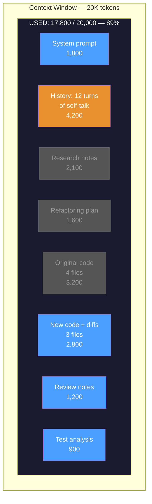
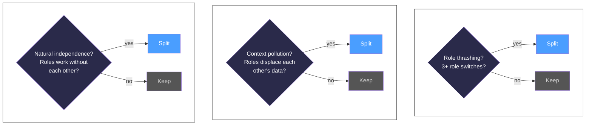
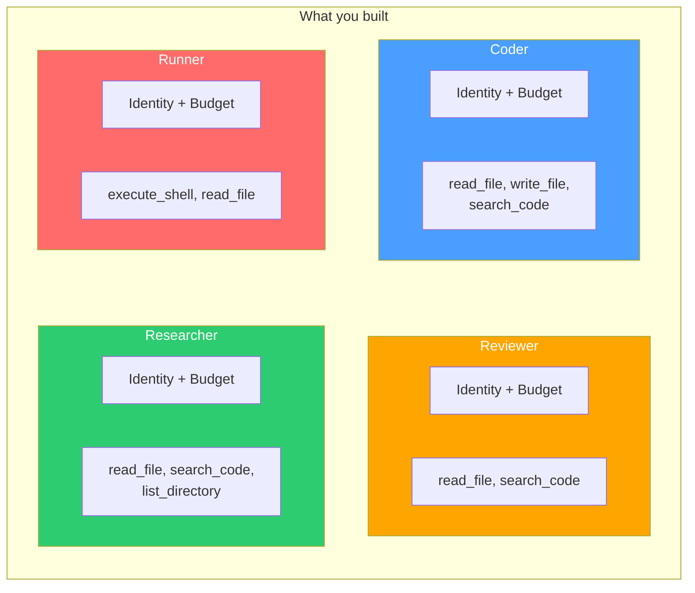

# Chapter 10: Splitting Into Agents

## You Are the Monolith

You're `tbh-code`. One agent. One system prompt. One context window. Someone asks you to refactor the authentication module in `todo-api`. Simple enough. You've done harder.

You start reading. Load `src/middleware/auth.pseudo`, `src/routes/auth.pseudo`, `src/db.pseudo`. Researcher mode. You scan the code, trace the data flow, build a mental model of how tokens move through the system. Good. Your context window fills with source files, function signatures, call chains.

Now you switch gears. Planner mode. You draft a refactoring plan: extract token validation into its own module, add signature verification, replace the hardcoded user lookup. The plan references the code you just read. You write it into your context alongside the source files.

Now coder mode. You start writing the new `token_validator.pseudo` module. You reference the plan. You reference the original code. You produce a diff. More context consumed. The window is getting crowded.

Now reviewer mode. You read your own diff. You check for bugs. You evaluate whether the refactoring matches the plan. But wait — did the original middleware handle the case where the Authorization header is missing? You need to re-read `auth.pseudo`. You scroll back through your context. It's buried under the plan, the diff, the token validator, the route changes. You find it. You think.

Now runner mode. You need to verify the tests still pass. You look at `tests/auth_test.pseudo`. You reason about whether your changes break existing tests. More files loaded. More context consumed.

By the time you finish the review, your context window looks like this:



The blue items are what the agent is actively using. The grey items are still *in* the window but fading — the research notes from step 1, the plan from step 2, the original code from step 3. They're there, but buried under 12 turns of self-talk and newer context. The agent can technically scroll back to them. In practice, the LLM's attention has moved on.

Everything is in there. Research context. Planning context. Coding context. Review context. Testing context. They compete for space. The review notes push out the original code you need to reference. The test analysis displaces the refactoring plan. You're a developer with five browser tabs open, each from a different task, and your screen is twelve inches wide.

And here's the real problem: you're reviewing your own code. The same LLM that wrote the diff is now evaluating it. Same biases. Same blind spots. The reviewer can't catch mistakes the coder doesn't know it's making. You're grading your own homework.

```mermaid
sequenceDiagram
    participant User
    participant Agent as tbh-code

    User->>Agent: "Refactor the auth module"

    rect rgb(60, 60, 90)
        Note right of Agent: 🔍 Researcher — read 4 files
        Note right of Agent: Context: 35%
    end

    rect rgb(60, 60, 90)
        Note right of Agent: 📋 Planner — draft 5-step plan
        Note right of Agent: Context: 52%
    end

    rect rgb(60, 60, 90)
        Note right of Agent: ✏️ Coder — write 3 new files
        Note right of Agent: Context: 71%
    end

    rect rgb(120, 60, 60)
        Note right of Agent: 👀 Reviewer — check own diff
        Note right of Agent: Context: 85%
        Note right of Agent: ⚠️ "Did auth.pseudo handle<br/>missing headers?"
        Note right of Agent: ❌ Can't find it — displaced<br/>by review notes
    end

    rect rgb(120, 60, 60)
        Note right of Agent: 🧪 Runner — analyze test impact
        Note right of Agent: Context: 89%
    end

    Agent->>User: "Refactoring complete"
    Note over User: Missed edge case.<br/>One agent, five roles,<br/>one overflowing window.
```



Five roles. One context window. Watch the percentage climb. Every mode switch costs you — the context from the previous role doesn't vanish, it just gets buried. By the time you're reviewing, the research details are grey. By the time you're analyzing tests, the review findings are fading.

tbh, one agent wearing five hats is just five hats on one head.

---

## What You'll Learn

The monolith has to go. You're going to split one overloaded agent into four focused specialists, each with its own identity, its own context window, and its own boundaries.

- When to split: decision criteria for breaking a monolith into agents
- Agent identity: name, capabilities, constraints, system prompt, tools, skills
- The four agents: Coder, Reviewer, Runner, Researcher
- Capability boundaries: what each agent can and cannot do
- Effort budgets: preventing runaway agents with hard limits
- How specialization beats generalization when context is the bottleneck

---

## When the Monolith Has to Go

Not every agent should be split. A single agent answering questions about a codebase? Fine. One context, one job. Splitting that into three agents would add coordination overhead for zero benefit.

But the refactoring task is different. You watched the monolith thrash between five roles, each polluting the other's context. That's the signal. Here's the decision framework:

**Role thrashing.** The agent switches roles more than three times per task. Researcher to planner to coder to reviewer to runner — that's five switches. Each switch means the agent is carrying context it doesn't need for its current role and missing context it does need.

**Context pollution.** Review notes displace source code. Test analysis displaces the refactoring plan. The agent's context window becomes a shared apartment where every roommate's stuff is everywhere and nobody can find their keys.

**Natural independence.** Reading code and running tests are independent tasks. The researcher doesn't need the runner's output to do its job. The runner doesn't need the researcher's notes. They can work in parallel — if they're separate entities.



The rule: **split when the context cost of generalization exceeds the coordination cost of specialization.**

One agent doing five jobs means one context window holding five jobs' worth of data. Four agents doing one job each means four clean context windows — but now they need to coordinate. Split only when the coordination cost is lower than the context cost.

For the `todo-api` refactoring task, it's not close. The monolith is drowning in its own context. Four specialists, each with a clean window, will do better work even without talking to each other.

---

## Identity Is the System Prompt

Every agent needs an identity. Not just a name — a complete definition of who it is, what it can do, and what it cannot do.

```
AgentIdentity:
    name: string                    # unique identifier
    description: string             # one-line purpose
    capabilities: string[]          # what this agent CAN do
    constraints: string[]           # what this agent CANNOT do
    tools: string[]                 # tools this agent has access to
    skills: string[]                # skills this agent can use
    system_prompt: string           # the full prompt (generated from above)
    budget: Budget                  # effort limits

Budget:
    max_tool_calls: int             # hard cap on tool invocations
    max_llm_calls: int              # hard cap on LLM calls
    max_tokens_per_task: int        # context budget per task
```

The system prompt isn't separate from the identity. The system prompt *is* the identity — rendered as text. Capabilities become "You can..." lines. Constraints become "You must never..." lines. Tools and skills are listed explicitly so the LLM knows what's available.

Here are the four agents. Read them like identity cards.

### The Coder

```
AgentIdentity:
    name: "coder"
    description: "Reads and writes code. Applies edits to files."
    capabilities:
        - "Read source files to understand existing code"
        - "Write new files and modify existing files"
        - "Apply diffs and refactoring changes"
        - "Follow coding standards and project conventions"
    constraints:
        - "Never run tests or execute commands"
        - "Never approve your own code — a reviewer must check it"
        - "Never delete files without explicit instruction"
    tools: ["read_file", "write_file", "search_code"]
    skills: ["find-bug", "refactor-safely", "write-tests"]
    budget:
        max_tool_calls: 25
        max_llm_calls: 10
        max_tokens_per_task: 50000
```

The coder has `write_file`. It can change things. But it can't run tests — that's the runner's job. And it can't approve its own work — that's the reviewer's job. The constraints aren't suggestions. They're boundaries enforced by which tools are available.

### The Reviewer

```
AgentIdentity:
    name: "reviewer"
    description: "Checks code quality, finds bugs, evaluates changes."
    capabilities:
        - "Read source files and diffs"
        - "Search code for patterns and anti-patterns"
        - "Evaluate code against quality criteria"
        - "Produce structured review feedback"
    constraints:
        - "Never write or modify files — you are read-only"
        - "Never run commands or execute code"
        - "Never fix bugs yourself — report them for the coder"
    tools: ["read_file", "search_code"]
    skills: ["code-review", "security-audit"]
    budget:
        max_tool_calls: 20
        max_llm_calls: 8
        max_tokens_per_task: 40000
```

No `write_file`. The reviewer physically cannot edit code. It reads, it evaluates, it reports. That's it. A reviewer that fixes bugs itself is a coder wearing a reviewer badge — and it defeats the purpose of having two agents.

### The Runner

```
AgentIdentity:
    name: "runner"
    description: "Executes commands, runs tests, reports results."
    capabilities:
        - "Run shell commands in a sandboxed environment"
        - "Execute test suites and report results"
        - "Check build status and compilation errors"
        - "Report command output verbatim"
    constraints:
        - "Never edit source files — you execute, you don't modify"
        - "Never interpret test results — report them as-is"
        - "Never run destructive commands (rm -rf, drop database)"
    tools: ["execute_shell", "read_file"]
    skills: ["run-tests", "check-build"]
    budget:
        max_tool_calls: 15
        max_llm_calls: 5
        max_tokens_per_task: 30000
```

The runner has `execute_shell` but not `write_file`. It runs tests. It reports what happened. It doesn't interpret results or fix failures. "3 passed, 1 failed, here's the output" — that's the runner's entire job. Interpretation is for the reviewer. Fixing is for the coder.

### The Researcher

```
AgentIdentity:
    name: "researcher"
    description: "Reads docs, searches code, provides context."
    capabilities:
        - "Read source files, documentation, and configuration"
        - "Search code for patterns, usages, and dependencies"
        - "Trace data flow across files"
        - "Summarize findings for other agents"
    constraints:
        - "Never write files — you are strictly read-only"
        - "Never execute commands — you read, you don't run"
        - "Never make changes — provide information, not action"
    tools: ["read_file", "search_code", "list_directory"]
    skills: ["trace-dataflow", "find-dependencies"]
    budget:
        max_tool_calls: 30
        max_llm_calls: 10
        max_tokens_per_task: 60000
```

The researcher has the biggest tool call budget because its job is information gathering. Read everything. Search everywhere. Build a comprehensive picture. But it can't change a single byte. Pure observation.

---

## Boundaries Aren't Bureaucracy

Look at the tool assignments:

|              | `read_file` | `write_file` | `search_code` | `execute_shell` | `list_directory` |
|--------------|:-----------:|:------------:|:--------------:|:----------------:|:----------------:|
| **Coder**    |      Y      |       Y      |        Y       |                  |                  |
| **Reviewer** |      Y      |              |        Y       |                  |                  |
| **Runner**   |      Y      |              |                |         Y        |                  |
| **Researcher**|     Y      |              |        Y       |                  |         Y        |

Only the coder can write. Only the runner can execute. The reviewer and researcher are read-only. These aren't arbitrary restrictions — they're the mechanism that makes specialization work.

When the monolith reviewed its own code, the reviewer role had access to `write_file`. Which means it could "review" a bug by fixing it inline. Sounds efficient. Here's why it's not: if the reviewer fixes the bug, nobody reviews the fix. The whole point of having a reviewer is independent evaluation. An independent evaluator that can also modify the thing it's evaluating isn't independent.

Boundaries make roles real. Without them, every agent is just the monolith with a different name tag.

### What Happens When Boundaries Are Enforced

The coder produces a diff for the auth refactoring. It includes a new `validate_token()` function. The function uses string equality to compare the token signature.

In the monolith, the reviewer role would see this, think "that's a timing attack risk," and fix it inline. The bug vanishes. Nobody learns. Nobody catches that the coder keeps making this mistake.

With boundaries:

```
[reviewer] Reading diff for auth refactoring...
[reviewer] Issue found: validate_token() uses string equality
           for signature comparison. Vulnerable to timing attacks.
[reviewer] Recommendation: Use constant-time comparison.
[reviewer] Severity: HIGH
[reviewer] Cannot fix — reporting to coder.
```

The reviewer finds the bug and *reports it*. The coder receives the report and fixes it. Now there's a record. The mistake journal (Ch 9) logs it. The skill refinement system notices the pattern. The system improves. Boundaries create accountability. Accountability creates learning.

---

## Effort Budgets: The Leash

An agent without limits will run forever. Not because it's thorough — because it's lost. It reads one more file. Then another. Then searches for one more pattern. Then reads the results. Twenty tool calls later, it's still "gathering context."

Every agent gets a budget:

```
Budget:
    max_tool_calls: int             # hard cap on tool invocations
    max_llm_calls: int              # hard cap on LLM calls
    max_tokens_per_task: int        # context budget per task

enforce_budget(agent, action) → bool:
    if action == "tool_call":
        return agent.tool_calls_used < agent.budget.max_tool_calls
    if action == "llm_call":
        return agent.llm_calls_used < agent.budget.max_llm_calls
    return false
```

When the budget runs out, the agent stops. Not crashes — stops gracefully, reports what it accomplished, and returns partial results. An agent that runs forever isn't thorough. It's broken.

```
[runner] Executing test suite...
[runner] Tool call 1/15: execute_shell("python -m pytest tests/")
[runner] Tool call 2/15: read_file("tests/auth_test.pseudo")
...
[runner] Tool call 15/15: execute_shell("python -m pytest tests/edge_cases/")
[runner] Budget exhausted (15/15 tool calls used)
[runner] Returning partial results: 12 test files executed, 3 remaining
```

The budgets are different per agent because the jobs are different. The researcher gets 30 tool calls because reading is cheap and information gathering is its purpose. The runner gets 15 because each `execute_shell` is expensive — it actually runs something. The reviewer gets 20 because it needs to read multiple files to evaluate a change, but it never writes.

These numbers aren't sacred. Tune them for your codebase. The principle is: every agent has a finite budget. No exceptions.

---

## Watch the Agents Work

Time to see the split in action. Same task: refactor the auth module in `todo-api`. But now four agents handle it instead of one.

### The Researcher Gathers Context

```
$ tbh-code --agent researcher --codebase ./todo-api \
  --ask "Map the authentication flow — all files, all functions, all data paths"

[researcher] Starting task: map auth flow
[researcher] Budget: 30 tool calls, 10 LLM calls

[tool] Agent selected: list_directory
[tool] Arguments: { "path": "src/" }
[tool] Result: ["main.pseudo", "routes/", "middleware/", "models/", "db.pseudo"]

[tool] Agent selected: search_code
[tool] Arguments: { "pattern": "auth|token|login|password", "path": "src/" }
[tool] Result: 14 matches across 4 files

[tool] Agent selected: read_file
[tool] Arguments: { "path": "src/middleware/auth.pseudo" }
[tool] Result: success=true (18 lines)

[tool] Agent selected: read_file
[tool] Arguments: { "path": "src/routes/auth.pseudo" }
[tool] Result: success=true (45 lines)

[tool] Agent selected: read_file
[tool] Arguments: { "path": "src/db.pseudo" }
[tool] Result: success=true (32 lines)

[tool] Agent selected: search_code
[tool] Arguments: { "pattern": "req.user", "path": "src/" }
[tool] Result: 6 matches — routes/tasks.pseudo, routes/auth.pseudo, middleware/auth.pseudo

[tool] Agent selected: read_file
[tool] Arguments: { "path": "src/routes/tasks.pseudo" }
[tool] Result: success=true (38 lines)

[researcher] Tool calls used: 7/30 | LLM calls used: 2/10

{
  "answer": "Authentication flow mapped across 4 files:

  1. LOGIN: src/routes/auth.pseudo:26-28
     - Accepts username/password
     - Looks up user in DB via find_user()
     - Generates token: base64_encode(username)
     - No signature, no expiry, no claims

  2. MIDDLEWARE: src/middleware/auth.pseudo:8-15
     - Checks Authorization header exists and is non-empty
     - Does NOT decode the token
     - Does NOT verify signature or look up user
     - Hardcodes req.user to { id: 1, username: 'unknown' }

  3. PROTECTED ROUTES: src/routes/tasks.pseudo
     - Uses req.user.id for WHERE clauses
     - All users see user 1's tasks (broken isolation)

  4. DATABASE: src/db.pseudo:12-18
     - find_user() does raw string concatenation (SQL injection risk)
     - No password hashing — plaintext comparison

  Data flow: login → base64(username) → header → middleware ignores it → hardcoded user

  Key vulnerabilities:
  - Any non-empty string passes authentication
  - All requests treated as user 1
  - SQL injection in find_user()
  - Plaintext password storage",

  "confidence": 0.95,
  "sources": [
    "src/middleware/auth.pseudo:8-15",
    "src/routes/auth.pseudo:26-28",
    "src/routes/tasks.pseudo:12-20",
    "src/db.pseudo:12-18"
  ]
}
```

Seven tool calls. Clean context — nothing but research artifacts. No planning noise, no code diffs, no test output cluttering the window. The researcher's entire context is dedicated to understanding the codebase. That's what specialization buys you.

### The Coder Writes the Fix

The coder receives the researcher's findings and writes the refactoring:

```
$ tbh-code --agent coder --codebase ./todo-api \
  --ask "Refactor the auth module: add real token validation, fix the hardcoded user, use constant-time comparison"

[coder] Starting task: auth refactoring
[coder] Budget: 25 tool calls, 10 LLM calls

[tool] Agent selected: read_file
[tool] Arguments: { "path": "src/middleware/auth.pseudo" }
[tool] Result: success=true

[tool] Agent selected: read_file
[tool] Arguments: { "path": "src/routes/auth.pseudo" }
[tool] Result: success=true

[tool] Agent selected: write_file
[tool] Arguments: { "path": "src/middleware/auth.pseudo" }
[tool] Content:
  function auth_middleware(req, res, next):
      header = req.headers["Authorization"]
      if header == null or header == "":
          return res.status(401).json({ error: "Missing token" })

      token = header.replace("Bearer ", "")

      try:
          decoded = base64_decode(token)
          user = db.find_user_by_username(decoded)
          if user == null:
              return res.status(401).json({ error: "Invalid token" })
          req.user = user
          next()
      catch error:
          return res.status(401).json({ error: "Invalid token" })

[tool] Result: success=true

[tool] Agent selected: write_file
[tool] Arguments: { "path": "src/db.pseudo" }
[tool] Content: (updated find_user to use parameterized queries)
[tool] Result: success=true

[tool] Agent selected: write_file
[tool] Arguments: { "path": "tests/auth_middleware_test.pseudo" }
[tool] Content:
  test "rejects missing Authorization header":
      req = create_request({ headers: {} })
      res = create_response()
      auth_middleware(req, res, no_op)
      assert res.status_code == 401

  test "rejects empty token":
      req = create_request({ headers: { "Authorization": "" } })
      res = create_response()
      auth_middleware(req, res, no_op)
      assert res.status_code == 401

  test "rejects token for nonexistent user":
      req = create_request({ headers: { "Authorization": "Bearer " + base64_encode("ghost") } })
      res = create_response()
      auth_middleware(req, res, no_op)
      assert res.status_code == 401

  test "accepts valid token and sets req.user":
      db.create_user("alice", "password123")
      token = base64_encode("alice")
      req = create_request({ headers: { "Authorization": "Bearer " + token } })
      res = create_response()
      auth_middleware(req, res, no_op)
      assert req.user.username == "alice"

[tool] Result: success=true

[coder] Tool calls used: 5/25 | LLM calls used: 3/10

{
  "answer": "Auth module refactored:

  1. src/middleware/auth.pseudo — Middleware now decodes token,
     looks up user in DB, rejects invalid tokens with 401.
     No more hardcoded user.

  2. src/db.pseudo — find_user_by_username uses parameterized
     query instead of string concatenation.

  3. tests/auth_middleware_test.pseudo — 4 new tests covering
     missing header, empty token, invalid user, and valid token.

  Files modified: 2
  Files created: 1",

  "confidence": 0.9,
  "sources": [
    "src/middleware/auth.pseudo",
    "src/db.pseudo",
    "tests/auth_middleware_test.pseudo"
  ]
}
```

Five tool calls. The coder read two files and wrote three. Its context window held only the code it needed to modify — no research notes, no review criteria, no test execution output. Clean.

### The Reviewer Evaluates

```
$ tbh-code --agent reviewer --codebase ./todo-api \
  --ask "Review the auth refactoring — check the new middleware, the DB changes, and the new tests"

[reviewer] Starting task: review auth refactoring
[reviewer] Budget: 20 tool calls, 8 LLM calls

[tool] Agent selected: read_file
[tool] Arguments: { "path": "src/middleware/auth.pseudo" }
[tool] Result: success=true

[tool] Agent selected: read_file
[tool] Arguments: { "path": "src/db.pseudo" }
[tool] Result: success=true

[tool] Agent selected: read_file
[tool] Arguments: { "path": "tests/auth_middleware_test.pseudo" }
[tool] Result: success=true

[tool] Agent selected: search_code
[tool] Arguments: { "pattern": "base64_decode|base64_encode", "path": "src/" }
[tool] Result: 3 matches

[tool] Agent selected: read_file
[tool] Arguments: { "path": "src/routes/auth.pseudo" }
[tool] Result: success=true

[reviewer] Tool calls used: 5/20 | LLM calls used: 3/8

{
  "answer": "Review of auth refactoring:

  PASS:
  - Middleware now decodes token and looks up user (fixes hardcoded user)
  - DB query uses parameterized query (fixes SQL injection)
  - 4 new tests cover key scenarios

  ISSUES:
  1. [HIGH] Token is still just base64(username) — no signature.
     Anyone who knows a username can forge a valid token.
     Recommendation: Add HMAC signature or switch to JWT.

  2. [MEDIUM] No token expiration. Once generated, a token
     works forever. Recommendation: Add expiry timestamp
     to token, check in middleware.

  3. [LOW] Tests use real DB but no cleanup. Test data will
     accumulate across runs. Recommendation: Add teardown
     that removes test users.

  4. [LOW] Error messages are identical ('Invalid token') for
     different failure modes. Good for security (no info leak),
     but add logging for debugging.

  VERDICT: Improvement over previous code, but token forgery
  (issue #1) is a blocking issue.",

  "confidence": 0.9,
  "sources": [
    "src/middleware/auth.pseudo:8-18",
    "src/routes/auth.pseudo:26-28",
    "tests/auth_middleware_test.pseudo"
  ]
}
```

The reviewer found something the coder missed: the token is still forgeable. base64 isn't a signature — anyone who knows a username can create a valid token. The coder was focused on fixing the hardcoded user and didn't step back to evaluate the token scheme.

A monolith reviewing its own code would likely miss this. Same LLM, same biases, same frame. The reviewer has a *different* system prompt — "check code quality, find bugs" — and a different context — no memory of writing the code, no attachment to the approach. Independent evaluation catches what self-evaluation misses.

### The Runner Executes

```
$ tbh-code --agent runner --codebase ./todo-api \
  --ask "Run the test suite and report results"

[runner] Starting task: run tests
[runner] Budget: 15 tool calls, 5 LLM calls

[tool] Agent selected: execute_shell
[tool] Arguments: { "command": "cd todo-api && python -m pytest tests/ -v" }
[tool] Result:
  tests/auth_test.pseudo::test_register_new_user PASSED
  tests/auth_test.pseudo::test_register_duplicate_user PASSED
  tests/auth_test.pseudo::test_login_valid_credentials PASSED
  tests/auth_test.pseudo::test_login_invalid_password PASSED
  tests/auth_middleware_test.pseudo::test_rejects_missing_header PASSED
  tests/auth_middleware_test.pseudo::test_rejects_empty_token PASSED
  tests/auth_middleware_test.pseudo::test_rejects_nonexistent_user PASSED
  tests/auth_middleware_test.pseudo::test_accepts_valid_token PASSED
  tests/tasks_test.pseudo::test_create_task PASSED
  tests/tasks_test.pseudo::test_list_tasks PASSED
  tests/tasks_test.pseudo::test_delete_task FAILED

  ============= 10 passed, 1 failed =============

  FAILED tests/tasks_test.pseudo::test_delete_task:
    AssertionError: Expected status 204, got 401
    > Task deletion now requires auth, but test doesn't send token

[runner] Tool calls used: 1/15 | LLM calls used: 1/5

{
  "answer": "Test results: 10 passed, 1 failed.

  Failed test:
    tests/tasks_test.pseudo::test_delete_task
    Expected status 204, got 401.
    The test sends a DELETE request without an Authorization
    header. With the new auth middleware, this is now rejected.

  The failure is in the test, not the code — the test needs
  to include a valid auth token.",

  "confidence": 1.0,
  "sources": ["tests/tasks_test.pseudo::test_delete_task"]
}
```

One tool call. The runner executed the test suite and reported the results verbatim. It noted that the failure is a test issue, not a code issue — but it didn't fix the test. It can't. No `write_file`. That's the coder's job.

### The Whole Picture

Four agents. Same refactoring task. Each saw only what it needed:

| Agent | Context | Tool Calls | Found |
|-------|---------|:----------:|-------|
| Researcher | Source files, data flow | 7/30 | Complete auth flow map, 4 vulnerabilities |
| Coder | Files to modify, researcher's findings | 5/25 | Wrote fix + 4 new tests |
| Reviewer | Modified files, original code | 5/20 | Token forgery issue (coder missed it) |
| Runner | Test execution output | 1/15 | 1 failing test (stale test, not a bug) |

Total tool calls: 18. Total context pollution: zero. Each agent's window held only what it needed for its specific role.

Compare this to the monolith doing the same task: one context window holding all four roles' artifacts, role-switching overhead, self-review bias, and a context window at 85% capacity before the review even started.

---

## Now Name What You Built

You split one agent into four. Let's put formal names on the patterns.

**Agent identity** is the complete definition of an agent — name, capabilities, constraints, tools, skills, budget, and the system prompt that renders all of this into text the LLM can follow. Identity isn't metadata *about* the agent. Identity *is* the agent. Two agents with the same LLM but different system prompts will behave like different entities.

**Capability boundaries** are the enforcement mechanism. The reviewer can't write files — not because the system prompt says "don't write files," but because `write_file` isn't in its tool list. The constraint is structural, not aspirational. You don't ask the agent to follow the rules. You make it impossible to break them.

**Effort budgets** are the finite resource allocation per agent per task. Max tool calls, max LLM calls, max tokens. When the budget runs out, the agent returns what it has. Budgets prevent runaway agents and force efficiency — if you only have 15 tool calls, you choose them carefully.

**Specialization through context** is the key insight. All four agents use the same LLM. Same weights. Same capabilities. The *only* difference is the system prompt and the tool list. Specialization isn't about using different models — it's about giving each agent the context it needs and nothing else. A general-purpose LLM with a focused system prompt and limited tools becomes a specialist.

The Anthropic taxonomy calls this the first step toward multi-agent systems: decomposing a monolith into components with clear interfaces. You haven't built workflows or coordination yet — each agent runs independently. But the decomposition is the foundation everything else builds on.

```
Ch 1-9:   One agent, growing capabilities
Ch 10:    One agent becomes four specialists
Ch 11:    Specialists discover each other
Ch 12:    Specialists communicate
Ch 13:    Specialists self-organize
```

### Additional Splitting Patterns to Know

**The Handoff Pattern**

OpenAI's Agents SDK is built on a simpler primitive than message buses: explicit control transfer. Agent A finishes its part and hands the conversation — context and all — directly to Agent B. No envelopes, no correlation IDs, no bus. Just "you take it from here."

```
def handoff(from_agent, to_agent, context):
    """Transfer control and conversation context to another agent."""
    to_agent.process(context)
    # from_agent is done — it doesn't wait for a response
```

It's simpler than what you'll build in Ch 12, but it only works for linear pipelines. The moment you need fan-out or consensus, you need structured messaging. Know it exists — many production systems start here.

**Phase-Based vs Capability-Based Splitting**

You split by capability: Coder writes, Reviewer reads, Runner executes. But you could also split by *phase*: Planner → Implementer → Tester → Deployer. Each agent owns a stage of the pipeline, not a type of action.

Phase-based is simpler when your workflow is linear. Capability-based is better when agents need to collaborate in unpredictable orders — which is where we're headed.

---

## The Spec

Full spec for this chapter in `spec/ch10/`:

```
spec/ch10/
├── prompt-template.md     What to build (language-agnostic)
├── interface-spec.md      AgentIdentity, Budget, Agent contracts,
│                          four agent definitions (coder, reviewer,
│                          runner, researcher)
├── expected-output.txt    Each agent processing a todo-api task
│                          within its boundaries
└── validation/
    └── test_ch10.py       Tests: agents respect boundaries,
                           budget limits enforced, correct agent
                           handles correct task type
```

The validation tests check: each agent has all required identity fields, agents cannot use tools not in their tool list, budget enforcement stops agents at the limit, the reviewer cannot write files, the runner cannot edit code, and each agent produces structured output within its specialization.

---

## Try It

1. **Build one agent identity from scratch.** Pick a role not in the four — maybe a "documenter" that reads code and writes documentation. Define its capabilities, constraints, tools, and budget. What tools does it need? What must it never do?

2. **Test boundary enforcement.** Give the reviewer access to `write_file`. Ask it to review code with a bug. Does it fix the bug instead of reporting it? Now remove `write_file`. Does the behavior change?

3. **Tune the budgets.** Set the researcher's tool call budget to 5 instead of 30. Run the same auth flow mapping task. Does it still produce useful results? At what budget does the output degrade?

4. **Run all four on the same task.** Give each agent the same refactoring task. Compare the outputs. Does the coder try to review? Does the reviewer try to code? Do the constraints hold?

5. **Measure context usage.** Run the monolith (one agent, all roles) on the refactoring task. Then run the four specialists. Compare token usage per agent vs the monolith's total. Is the sum of four specialists more or less than the monolith?

---

## Three Ways to Botch the Split

### The God Agent

One agent with every tool, every capability, and no constraints. The system prompt says "coder" but the tool list includes `execute_shell`, `write_file`, `search_code`, `list_directory`, and everything else. It's the monolith with a name tag.

**Why it happens:** Splitting feels like overhead. "Why can't the coder just run the tests too? It's right there."

**Fix:** If an agent can do everything, it's not specialized. Boundaries are the point. Remove tools that don't belong. If the coder needs test results, it gets them from the runner — not by running the tests itself.

### The Micro-Agent

Fifteen agents. One reads files. Another reads directories. A third searches code. A fourth reads search results. The coordination overhead dwarfs the actual work.

**Why it happens:** Over-application of the split principle. "Every responsibility should be its own agent!"

**Fix:** Split on *roles*, not on *actions*. Reading files isn't a role — it's an action that multiple roles perform. The researcher reads files to gather context. The reviewer reads files to evaluate code. Same tool, different purpose, both part of a coherent role. If you can't describe what an agent *is* in one sentence, it's too granular.

### The Leaky Boundary

The reviewer's system prompt says "never modify files." But `write_file` is in its tool list. The LLM follows the system prompt... most of the time. On complex tasks with strong enough signal, it ignores the prompt and writes a fix anyway. The boundary was a suggestion, not a wall.

**Why it happens:** Constraints enforced only by the system prompt are probabilistic, not deterministic. The LLM *usually* follows instructions. "Usually" isn't a security model.

**Fix:** Enforce boundaries structurally. If the reviewer shouldn't write files, don't give it `write_file`. If the runner shouldn't edit code, don't give it `write_file`. The tool list is the boundary. The system prompt explains *why* the boundary exists. Both matter. Only one is enforceable.

---

## Four Agents, Zero Awareness

You have four agents. Each is excellent at its job. The researcher mapped the auth flow thoroughly. The coder wrote a solid fix. The reviewer caught a vulnerability the coder missed. The runner found a broken test.

But look at what just happened. *You* orchestrated every step. You ran the researcher first. You took its output and fed it to the coder. You ran the reviewer on the coder's output. You ran the runner last. You were the coordinator.

The coder has no idea the reviewer exists. When it finishes writing code, it just... stops. Nobody reviews it. The reviewer doesn't know the coder just produced a diff. The runner sits idle until you manually ask it to run tests.

Four specialists, working in isolation. Each brilliant at its job. None aware of the others.

What if the coder could say "I just wrote a diff — who can review this?" What if the reviewer could announce "I check code quality" and the coder could discover that? What if, when the coder finishes, the reviewer *automatically* picks up the work?

Chapter 11 gives the agents eyes for each other. Broadcast, discovery, and the first moment one agent learns that another exists.

---

> **tbh-code after this chapter:**



> Four specialized agents, each with a distinct identity, bounded capabilities, and effort budgets. The Coder writes code but can't test. The Reviewer evaluates code but can't modify it. The Runner executes commands but can't edit files. The Researcher gathers context but can't change anything. Boundaries are structural — enforced by tool lists, not just system prompts. The monolith is dead. But the agents are islands. They can't see each other. Next: broadcast and discovery.

---

## References

### Multi-Agent Frameworks

1. **"AutoGen: Enabling Next-Gen LLM Applications via Multi-Agent Conversation"** — Wu, Bansal, Zhang et al., Microsoft Research (2023). Foundational framework for multi-agent conversation with customizable, conversable agents. [arxiv.org/abs/2308.08155](https://arxiv.org/abs/2308.08155)

2. **"CAMEL: Communicative Agents for 'Mind' Exploration"** — Li, Hammoud et al., NeurIPS 2023. Role-playing framework for multi-agent cooperation with inception prompting. [arxiv.org/abs/2303.17760](https://arxiv.org/abs/2303.17760)

3. **"ChatDev: Communicative Agents for Software Development"** — Qian, Liu et al., ACL 2024. Coder, Reviewer, Tester, Designer agents following a waterfall SOP — directly parallels the four-agent split. [arxiv.org/abs/2307.07924](https://arxiv.org/abs/2307.07924)

4. **"MetaGPT: Meta Programming for A Multi-Agent Collaborative Framework"** — Hong, Zheng et al. (2023). Standardized Operating Procedures encoded into agent roles — structured role boundaries reduce errors. [arxiv.org/abs/2308.00352](https://arxiv.org/abs/2308.00352)

### Agent Identity & Scaling

5. **"A Survey on Large Language Model based Autonomous Agents"** — Wang, Ma, Feng et al. (2023). Comprehensive taxonomy; the "profile" module maps directly to AgentIdentity. [arxiv.org/abs/2308.11432](https://arxiv.org/abs/2308.11432)

6. **"Towards a Science of Scaling Agent Systems"** — Google Research/DeepMind/MIT (2025). 180 multi-agent configurations; blindly adding agents can degrade performance by 70%. [arxiv.org/abs/2512.08296](https://arxiv.org/abs/2512.08296)

7. **"Two Tales of Persona in LLMs"** — Chen, Wang et al., EMNLP 2024. How assigned personas change LLM behavior — theoretical backing for agent identity. [arxiv.org/abs/2406.01171](https://arxiv.org/abs/2406.01171)

### Engineering

8. **"Building Effective Agents"** — Anthropic (2024). Workflows vs agents taxonomy, orchestrator-workers, and starting simple before splitting. [anthropic.com/research/building-effective-agents](https://www.anthropic.com/research/building-effective-agents)

9. **"How We Built Our Multi-Agent Research System"** — Anthropic Engineering (2025). Orchestrator + specialized subagents beating single-agent by 90%+. [anthropic.com/engineering/multi-agent-research-system](https://www.anthropic.com/engineering/multi-agent-research-system)

10. **"Don't Build Multi-Agents"** — Cognition AI / Devin team (2025). The counter-argument: context fragmentation hurts more than specialization helps. [cognition.ai/blog/dont-build-multi-agents](https://cognition.ai/blog/dont-build-multi-agents)

11. **"You Should Build Multi-Agents"** — Cosine AI (2025). Direct rebuttal: specialized agents with clear boundaries outperform monoliths. [cosine.sh/blog/why-you-should-build-multi-agent-ai](https://cosine.sh/blog/why-you-should-build-multi-agent-ai)

12. **"Orchestrating Agents: Routines and Handoffs"** — OpenAI Cookbook (2024). Routines-and-handoffs pattern — source for the handoff pattern. [cookbook.openai.com/examples/orchestrating_agents](https://cookbook.openai.com/examples/orchestrating_agents)

13. **"OpenAI Agents SDK — Handoffs"** — OpenAI (2025). Production handoff implementation. [openai.github.io/openai-agents-python/handoffs](https://openai.github.io/openai-agents-python/handoffs/)

14. **"How and When to Build Multi-Agent Systems"** — LangChain Blog (2025). Split decision framed around "reading" vs "writing" tasks. [blog.langchain.com/how-and-when-to-build-multi-agent-systems](https://blog.langchain.com/how-and-when-to-build-multi-agent-systems/)

15. **"Benchmarking Multi-Agent Architectures"** — LangChain Blog (2025). Single agents degrade with many tools — validates the "role thrashing" split signal. [blog.langchain.com/benchmarking-multi-agent-architectures](https://blog.langchain.com/benchmarking-multi-agent-architectures/)

16. **"AutoGen v0.4"** — Microsoft Research (2025). Redesigned agent architecture with event-driven messaging and agent identity. [microsoft.com/en-us/research/articles/autogen-v0-4](https://www.microsoft.com/en-us/research/articles/autogen-v0-4-reimagining-the-foundation-of-agentic-ai-for-scale-extensibility-and-robustness/)

17. **"Announcing the Agent2Agent Protocol (A2A)"** — Google (2025). AgentCard concept directly informs AgentIdentity design. [developers.googleblog.com/en/a2a-a-new-era-of-agent-interoperability](https://developers.googleblog.com/en/a2a-a-new-era-of-agent-interoperability/)

18. **"CrewAI: Role-Based Multi-Agent Orchestration"** — CrewAI. Role/goal/backstory per agent — practical reference for role-based identity. [docs.crewai.com/en/concepts/agents](https://docs.crewai.com/en/concepts/agents)
