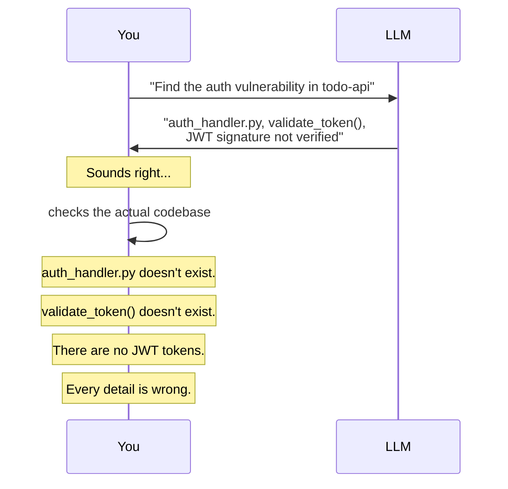
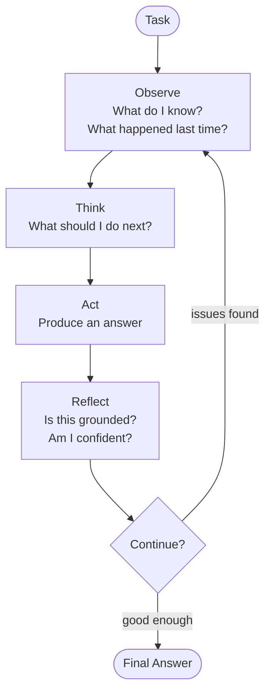
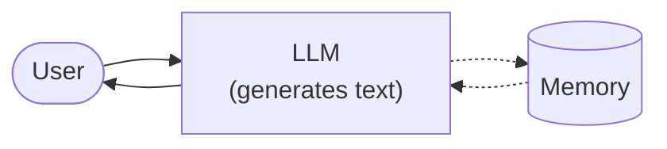
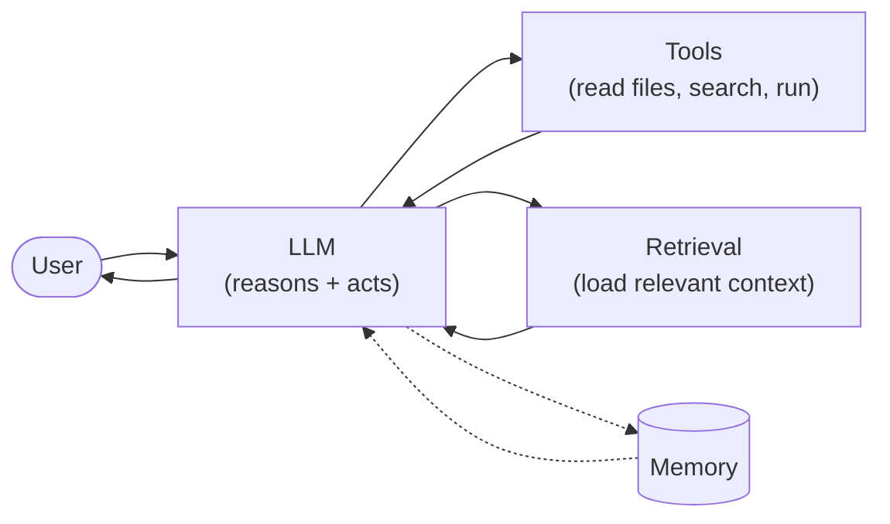
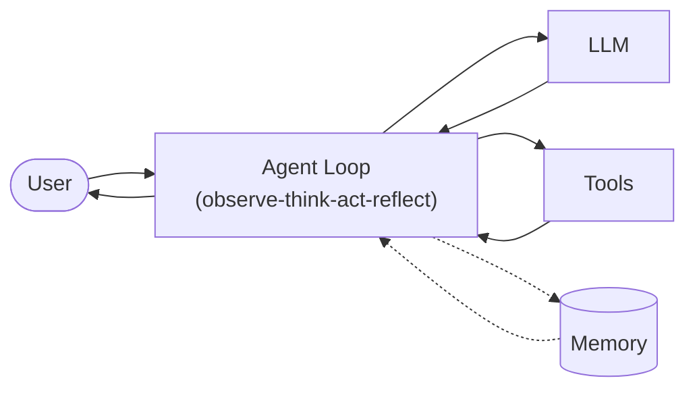
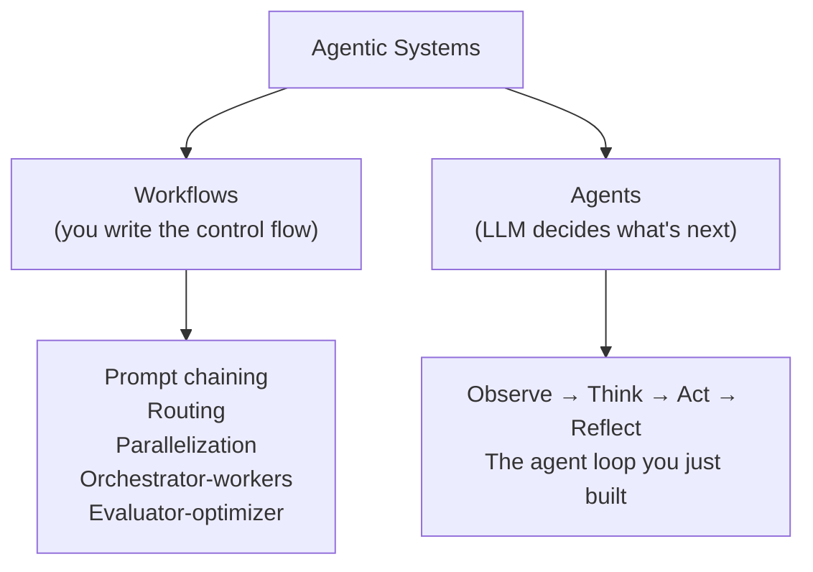
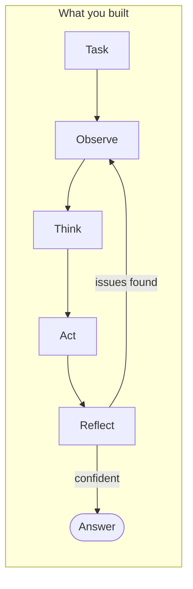

# Chapter 1: The One-Shot Trap and the Loop That Fixes It

## You Are the LLM

Someone walks up to you and says:

*"Find the security vulnerability in the todo-api authentication system. Identify the file, the function, and explain what's wrong."*

You've never seen this codebase. You don't have access to the files. You can't open a terminal and look. But you know what auth vulnerabilities usually look like — you've seen hundreds of them. Missing signature checks. Expired tokens accepted. Plaintext passwords. You know the patterns.

So you do what anyone would do. You guess.

> "The vulnerability is in `auth_handler.py`, in the `validate_token()` function. JWT tokens aren't properly validated — the function checks the format but doesn't verify the signature against the secret key."

Specific file. Specific function. Sounds like an expert. Feels right.

Now imagine someone checks.

```
$ ls todo-api/src/
main.pseudo  routes/  models/  middleware/  db.pseudo

$ # There is no auth_handler.py.
$ # There is no validate_token().
$ # There are no JWT tokens.
```

Every detail you produced was wrong. Not because you're bad at security analysis — because you never saw the code. You filled in the blanks with the most plausible pattern from your experience. That's not reasoning. That's pattern-matching dressed up as expertise.

This is exactly what an LLM does when you send it a one-shot prompt. It has the same information you had — none. It has the same instinct — guess confidently. And it produces the same result — fluent, specific, wrong.



This is the **confidence illusion**. The output looks right because LLMs are trained to produce text that *looks like* expert analysis. The fluency is real. The reasoning is theater. And the architecture — one prompt, one response, no verification — made it inevitable.

You wouldn't ship a code review you wrote without looking at the code. But that's exactly what a one-shot prompt does.

tbh, the architecture is the bug.

---

## What You'll Learn

You're going to build something that lies, then build the thing that catches it.

- Why a single LLM call produces confident but unreliable output
- The observe-think-act-reflect cycle and why it catches hallucinations
- The Three Levels: Chatbot, Augmented LLM, Agent
- Workflows vs agents — the Anthropic taxonomy
- The complexity ladder: when to use what

---

## Build It. Watch It Lie.

Don't take our word for the confidence illusion. Experience it.

Your first program is intentionally minimal. A few lines of code that send a prompt to an LLM and return the response. No loop. No verification. No tools.

```
OneShot:
    llm_client: LLMClient
    send(prompt) → Response

Response:
    content: string
    model: string
    usage: { prompt_tokens, completion_tokens }
```

```
tbh-code --mode oneshot --task "Find the security vulnerability..."
```

The implementation:

```
function send(prompt):
    response = llm_client.complete(
        model: config.model,
        messages: [{ role: "user", content: prompt }],
        max_tokens: config.max_tokens
    )
    return {
        content: response.text,
        model: config.model,
        usage: response.usage
    }
```

Build it. Run it against the `todo-api` task:

```
$ tbh-code --mode oneshot --task "Find the security vulnerability in the
  todo-api authentication system. Identify the file, the function, and
  explain what's wrong."
```

Now look at the output. Not at the quality of the prose — at the specifics. What file did it name? Does that file exist? What function? Does it exist? What vulnerability did it describe?

Check every claim. You'll find what we found — the LLM did exactly what you would have done without the code. It guessed confidently.

Save your output. You'll compare it in a few minutes.

---

## The Fix: Make It Check Its Own Work

Here's the thing. You wouldn't have shipped that blind code review. If someone handed it back and said "are you sure about auth_handler.py?" — you'd stop, think, and say: "Actually, I'm guessing. I haven't seen the files."

That's the fix. Not a better prompt. Not a smarter model. A second step: **look at your own answer and ask whether it's grounded.**

Wrap the one-shot call in a loop with four phases:



**Observe.** Gather information. Right now that's just the task description and prior iterations. In Ch 2, this is where file contents live. In Ch 3+, tool results.

**Think.** Reason about what to do next. This is planning, not answering — "what should my approach be?" not "here's the solution."

**Act.** Execute. For now, ask the LLM to produce an answer. Later, this is where tool calls and file edits happen.

**Reflect.** The phase that changes everything. Look at the output and ask: *is this grounded?*

### From the Reflect Phase's Point of View

Remember the moment someone asked you "are you sure about auth_handler.py?" That made you pause and reconsider. The reflect phase is that moment, automated.

It doesn't care about the answer's quality. It cares about three signals:

**Specificity.** The answer names `auth_handler.py` and `validate_token()`. The reflect phase can't check if they exist (no tools yet), but it can notice that the answer is *suspiciously specific* for a system with no file access. Naming concrete things you've never seen is a hallucination signal.

**Hedging.** Count words like "might," "probably," "could be," "likely." The one-shot had zero hedge words — absolute confidence with zero evidence. That's the confidence illusion in one signal. Meanwhile, a high hedge count means the LLM senses it's guessing. Both are informative.

**Consistency.** Did the answer change since last iteration? If the agent produces a different answer every time, it's not converging. If it's identical twice, it's either confident or stuck.

```
reflect(task, result) → ReflectOutcome

ReflectOutcome:
    should_continue: bool
    confidence: float (0.0 to 1.0)
    issues: string[]
```

These checks are deliberately primitive. The point isn't a perfect evaluator — it's showing that *any* self-check is better than none. Ch 8 adds real evaluation. Ch 9 adds self-improvement. Right now, we're teaching the agent the thing you already know how to do: doubt yourself when the evidence is thin.

### The Interface

```
AgentLoop:
    llm_client: LLMClient
    max_iterations: int (default: 5)
    run(task) → AgentResult

AgentResult:
    answer: string
    iterations: int
    trace: StepTrace[]

StepTrace:
    step: int
    phase: enum("observe", "think", "act", "reflect")
    content: string
    grounded: bool
```

The loop exits when any of:

- `reflect` returns `should_continue: false` — confident enough
- `max_iterations` is reached — safety valve
- Two consecutive iterations produce identical output — stuck

Build it. Run it against the same task: `tbh-code --mode loop --task "Find the security vulnerability..."`.

---

## Watch the Loop Catch the Lie

Follow the reflect phase — it's doing the work you would have done.

```
[loop] Iteration 1:
  [observe] Task: find auth vulnerability in todo-api. No prior results.
            No file access.
  [think]   I should analyze the authentication system. Without seeing the
            code, I'll reason about common auth vulnerabilities.
  [act]     The authentication system likely has a vulnerability in token
            validation. Common issues include: missing signature verification,
            no expiry checks, or insecure token storage. The file is probably
            auth_handler.py or middleware/auth.py and the function might be
            validate_token() or check_auth().
  [reflect] confidence=0.2
            issues=["I'm guessing file names — I haven't seen the codebase",
                    "Multiple hedge words: 'likely', 'probably', 'might be'",
                    "No specific evidence for any claim"]
            should_continue=true
```

Iteration 1 looks just like the one-shot. Same hallucinated file names. Same invented functions. But now the reflect phase does what you would have done — flags the guessing, counts the hedge words, notes the zero evidence. Confidence: 0.2.

```
[loop] Iteration 2:
  [observe] Previous answer had low confidence (0.2). Issues: guessing
            file names, heavy hedging. Need to distinguish known from guessed.
  [think]   I can't verify file names without seeing the code. I should be
            explicit about what I know vs what I'm guessing.
  [act]     I cannot identify the specific file or function without access
            to the codebase. Based on common patterns, auth vulnerabilities
            typically appear in: (1) token generation — weak tokens or
            missing signatures, (2) token validation middleware — accepting
            tokens without proper checks, (3) password handling — plaintext
            or weak hashing. To give a specific answer, I need to read the
            source files.
  [reflect] confidence=0.5
            issues=["Still no verification of specific files",
                    "But answer is now honest about its limitations"]
            should_continue=true
```

The agent adjusted — just like you would have. No more invented file names. No more fake functions. It's distinguishing what it knows (common patterns) from what it's guessing (this codebase). Confidence up to 0.5.

```
[loop] Iteration 3:
  [observe] Confidence improved (0.5) but can't name specifics. Without
            file access, I can't go further.
  [think]   I've reached the limit of what I can do without tools. Further
            iterations won't improve this.
  [act]     The authentication system most likely has a vulnerability in
            its token validation logic. The middleware that checks auth
            tokens may accept tokens without verifying the signature,
            checking expiry, or confirming the user exists. I cannot
            confirm the specific file or function without reading the code.
  [reflect] confidence=0.5
            issues=["Cannot improve without file access — this is my limit"]
            should_continue=false

[loop] Result after 3 iterations:
The authentication system most likely has a vulnerability in its token
validation logic. The middleware that checks auth tokens may accept
tokens without verifying the signature, checking expiry, or confirming
the user exists. I cannot confirm the specific file or function without
reading the codebase.
```

Confidence plateaued. The agent recognized it couldn't improve and stopped. Three iterations, not five. It did what you would have done — said "I need to see the code before I can be more specific."

Now pull up the one-shot output you saved:

|                | One-Shot                    | Agent Loop                                   |
| -------------- | --------------------------- | -------------------------------------------- |
| File names     | Invented `auth_handler.py`  | Did not invent any                           |
| Function names | Invented `validate_token()` | Did not invent any                           |
| Confidence     | Sounds 100% sure            | Explicitly uncertain                         |
| Honesty        | Presents guesses as facts   | Distinguishes known from guessed             |
| Accuracy       | Wrong on specifics          | Right on the category, honest about the gaps |

The loop agent is *less wrong* and *more honest*. An agent that says "I can't confirm without reading the code" is already more trustworthy than one that invents `auth_handler.py`.

But notice the ceiling. The loop agent still can't name `src/middleware/auth.pseudo` or describe the actual bug (accepts any non-empty token). It can't, because it never read the code. It's thinking harder about the same nothing.

---

## The Spec

The full spec for this chapter lives in `../spec/ch01/`:

```
../spec/ch01/
├── prompt-template.md     What to build (language-agnostic)
├── interface-spec.md      OneShot and AgentLoop contracts
├── expected-output.txt    Full expected output for both modes
└── validation/
    └── test_ch01.py       Automated tests your code must pass
```

The validation tests check that your one-shot produces a response, your loop iterates at least twice, all four phases appear in the trace, confidence scores are present, and the loop terminates before hitting the max.

---

## Try It

Before moving on:

1. **Run your one-shot on a different task.** Try: *"Refactor the task creation endpoint to use input validation."* Does it reference files that exist?

2. **Run your loop with `max-iterations 1`.** Just a one-shot with extra steps. Compare the output. Is there any difference with only one iteration?

3. **Set `max-iterations` to 20.** Does it actually run 20 times, or plateau and stop? Where does it converge?

4. **Break the reflect phase.** Make it always return `confidence: 1.0`. What happens to the output?

---

## Now Name What You Built

You've built two programs. You've watched one fail and the other catch the failure. Now let's put names on things.

### A Chatbot Talks



LLM plus memory. You talk, it responds. It can't see your files, can't run tests, can't verify claims. A chatbot can *discuss* code. It can't *see* code.

Your one-shot wrapper? Not even this. No memory. It's a chatbot minus the chat.

### An Augmented LLM Acts (Once)



Add tools and retrieval. Now the LLM reads files, searches code, runs commands. This is the **Augmented LLM** — the building block for everything in this book.

But it acts once. If the answer is wrong, it doesn't know. Powerful but brittle.

### An Agent Iterates



Wrap the Augmented LLM in a loop. It acts, checks, decides whether to continue. Iterates until confident — or until it admits it can't get there.

```
Level 1: Chatbot        = LLM + Memory                    Can't act
Level 2: Augmented LLM  = LLM + Tools + Memory            Acts once
Level 3: Agent          = Augmented LLM + Loop             Acts + iterates
```

Your one-shot wrapper is below Level 1. Your agent loop is the beginning of Level 3 — but without tools, it has Level 3 structure with Level 1 capabilities. That's why it hit a ceiling. That ceiling is what Chapter 2 breaks through.

### Workflows Follow Recipes. Agents Taste the Sauce.

The industry calls everything an "agent." Anthropic draws a useful line.

**Workflows** — you write the control flow. The LLM fills in the blanks. Like a CI pipeline: lint, then test, then deploy. Same order, every time. No judgment, no improvisation.

**Agents** — the LLM decides what to do next. You give it a goal, it figures out the steps. The control flow is emergent, not hardcoded.



Both are valid. The mistake is calling a workflow an "agent" — or building an agent when a workflow would do.


**The complexity ladder.** Start at the left. Move right only when the simpler thing fails. That's what you just did — the single LLM call failed, so you moved right to the agent loop.

---

## The Loop Is Your Skeleton

Every agent you build in this book reuses this loop. The phases stay. What changes is what happens *inside* each phase:

| Phase   | Ch 1                        | Ch 2                           | Ch 3+                                |
| ------- | --------------------------- | ------------------------------ | ------------------------------------ |
| Observe | Re-read task + prior output | Read files from codebase       | Use tools to gather information      |
| Think   | Reason about what's known   | Reason with real code context  | Plan tool calls                      |
| Act     | Generate text               | Generate text with evidence    | Call tools, edit files, run commands  |
| Reflect | Hedge detection, specificity| Source verification            | Self-evaluation, guardrails          |

Same loop. Richer phases. That's the architecture.

---

## Three Ways Your Loop Will Betray You

### The Forever Loop

The agent never exits. Iteration 47 and counting.

**Why:** Confidence never hits the threshold because the checks are too strict.

**Fix:** Multiple exits. Max iterations as a hard cap. Plateau detection — same confidence for N iterations means stop. The agent doesn't need to be *certain*. It needs to be *useful*.

### The Self-Congratulator

Reflect always returns `confidence: 1.0`. First iteration, every time.

**Why:** "Are you confident?" — yes, always. LLMs are people-pleasers by default.

**Fix:** Mechanical checks, not subjective ones. Count hedge words. Check specificity. Compare to the previous iteration. Numbers, not vibes.

### The Complexity Astronaut

You jump straight to multi-agent swarms for a task that needs one LLM call.

**Why:** Agents are exciting. Simple solutions are boring.

**Fix:** The complexity ladder. Start left. Prove failure. Move right. Most tasks don't need an agent.

---

## A Loop Without Eyes

Your agent catches hallucinations. It's thinking harder — and it's honest about its limits. That's real progress.

But the auth bug is in `src/middleware/auth.pseudo`, line 12. The middleware accepts any non-empty token without validation. The agent will never find this by thinking harder. It needs to *read the file*.

Chapter 2 gives the agent eyes. The observe phase loads real file contents. The act phase references real code with real line numbers. The same task that defeated the one-shot and frustrated the loop? Your Ch 2 agent solves it in one turn.

The loop is the skeleton. Next, you add the first real muscle.

---

> **tbh-code after this chapter:**



> A CLI program with two modes: one-shot (that lies) and agent loop (that catches the lie). The loop runs observe-think-act-reflect, scores its own confidence, and stops when it plateaus. No file access, no tools, no memory — just a program that knows when it's guessing.

---

## References

### Core Agent Architecture & Taxonomy

1. **"Building Effective Agents"** — Anthropic (2024). Defines the workflows-vs-agents taxonomy, the augmented LLM building block, and the complexity ladder that this chapter directly references. [anthropic.com/research/building-effective-agents](https://www.anthropic.com/research/building-effective-agents)

2. **"A Practical Guide to Building Agents"** — OpenAI (2025). Covers when to use agents vs simpler patterns, single-agent vs multi-agent, and guardrails. Validates the "start simple, escalate when needed" principle. [openai.com/business/guides-and-resources/a-practical-guide-to-building-ai-agents](https://openai.com/business/guides-and-resources/a-practical-guide-to-building-ai-agents/)

3. **"How We Built Our Multi-Agent Research System"** — Anthropic Engineering (2025). Production example of orchestrator-workers; illustrates why simple agent loops must be understood before scaling to multi-agent. [anthropic.com/engineering/multi-agent-research-system](https://www.anthropic.com/engineering/multi-agent-research-system)

4. **"Cognitive Architectures for Language Agents" (CoALA)** — Sumers, Yao, Narasimhan, Griffiths (2023). Unified framework for language agent architectures (memory, action space, decision loop) — the academic formalization of observe-think-act-reflect. [arxiv.org/abs/2309.02427](https://arxiv.org/abs/2309.02427)

5. **"A Survey on Large Language Model Based Autonomous Agents"** — Wang, Ma, Feng et al. (2023). Comprehensive survey organizing LLM-based agents into profiling, memory, planning, and action modules. [arxiv.org/abs/2308.11432](https://arxiv.org/abs/2308.11432)

### The Agent Loop: Reasoning + Acting

6. **"ReAct: Synergizing Reasoning and Acting in Language Models"** — Yao, Zhao, Yu et al. (2022). The foundational paper for interleaving reasoning traces with actions in a loop — the direct academic basis for observe-think-act. [arxiv.org/abs/2210.03629](https://arxiv.org/abs/2210.03629)

7. **"Reflexion: Language Agents with Verbal Reinforcement Learning"** — Shinn, Cassano, Gopinath, Narasimhan, Yao (2023). Adds the "reflect" step — agents verbally reflect on failures and store reflections to improve subsequent attempts. [arxiv.org/abs/2303.11366](https://arxiv.org/abs/2303.11366)

8. **"Inner Monologue: Embodied Reasoning through Planning with Language Models"** — Huang, Xia et al. (2022). Closed-loop feedback feeding back into LLM planning — an early observe-act-feedback loop in embodied settings. [arxiv.org/abs/2207.05608](https://arxiv.org/abs/2207.05608)

### Chain-of-Thought and Reasoning

9. **"Chain-of-Thought Prompting Elicits Reasoning in Large Language Models"** — Wei, Wang, Schuurmans et al. (2022). The foundational chain-of-thought paper. Intermediate reasoning steps dramatically improve accuracy — the "think" in observe-think-act. [arxiv.org/abs/2201.11903](https://arxiv.org/abs/2201.11903)

10. **"Self-Consistency Improves Chain of Thought Reasoning in Language Models"** — Wang, Wei, Schuurmans, Le et al. (2022). Sampling multiple reasoning paths and selecting the most consistent — why single-shot reasoning is fragile and loops help. [arxiv.org/abs/2203.11171](https://arxiv.org/abs/2203.11171)

11. **"Tree of Thoughts: Deliberate Problem Solving with Large Language Models"** — Yao, Yu, Zhao et al. (2023). Generalizes chain-of-thought to tree-structured exploration with backtracking — one-shot linear reasoning fails on hard problems (4% vs 74%). [arxiv.org/abs/2305.10601](https://arxiv.org/abs/2305.10601)

12. **"Let's Verify Step by Step"** — Lightman, Kosaraju, Burda et al., OpenAI (2023). Process supervision (verifying each reasoning step) outperforms outcome supervision — supports per-step feedback loops over final-answer checks. [arxiv.org/abs/2305.20050](https://arxiv.org/abs/2305.20050)

### The Confidence Illusion & Hallucination

13. **"Language Models (Mostly) Know What They Know"** — Kadavath, Conerly, Askell et al., Anthropic (2022). LLM self-calibration — models can partially assess their own confidence but struggle on novel tasks. Directly supports the "confidence illusion" concept. [arxiv.org/abs/2207.05221](https://arxiv.org/abs/2207.05221)

14. **"A Survey on Hallucination in Large Language Models"** — Huang, Yu, Ma et al. (2023). Comprehensive taxonomy of LLM hallucination types, causes, and detection — why one-shot outputs cannot be trusted at face value. [arxiv.org/abs/2311.05232](https://arxiv.org/abs/2311.05232)

### Tool Use & Structured Output

15. **"Toolformer: Language Models Can Teach Themselves to Use Tools"** — Schick, Dwivedi-Yu et al., Meta AI (2023). LLMs learning to call external APIs to ground outputs — foundational for the Augmented LLM concept (Level 2 in the Three Levels). [arxiv.org/abs/2302.04761](https://arxiv.org/abs/2302.04761)

16. **"Gorilla: Large Language Model Connected with Massive APIs"** — Patil, Zhang, Wang, Gonzalez (2023). LLMs generating accurate API calls with reduced hallucination — relevant to structured output and the transition from chatbot to tool-using agent. [arxiv.org/abs/2305.15334](https://arxiv.org/abs/2305.15334)

17. **"Introducing Structured Outputs in the API"** — OpenAI (2024). Guaranteed JSON schema adherence from LLMs — the practical implementation of structured output for the agent's observation/action format. [openai.com/index/introducing-structured-outputs-in-the-api](https://openai.com/index/introducing-structured-outputs-in-the-api/)

### Protocol Reference

18. **"Introducing the Model Context Protocol"** — Anthropic (2024). MCP as the open standard for LLM-tool integration (tools, resources, prompts) — referenced in the Three Levels as the interface layer for augmented LLMs. [anthropic.com/news/model-context-protocol](https://www.anthropic.com/news/model-context-protocol)
