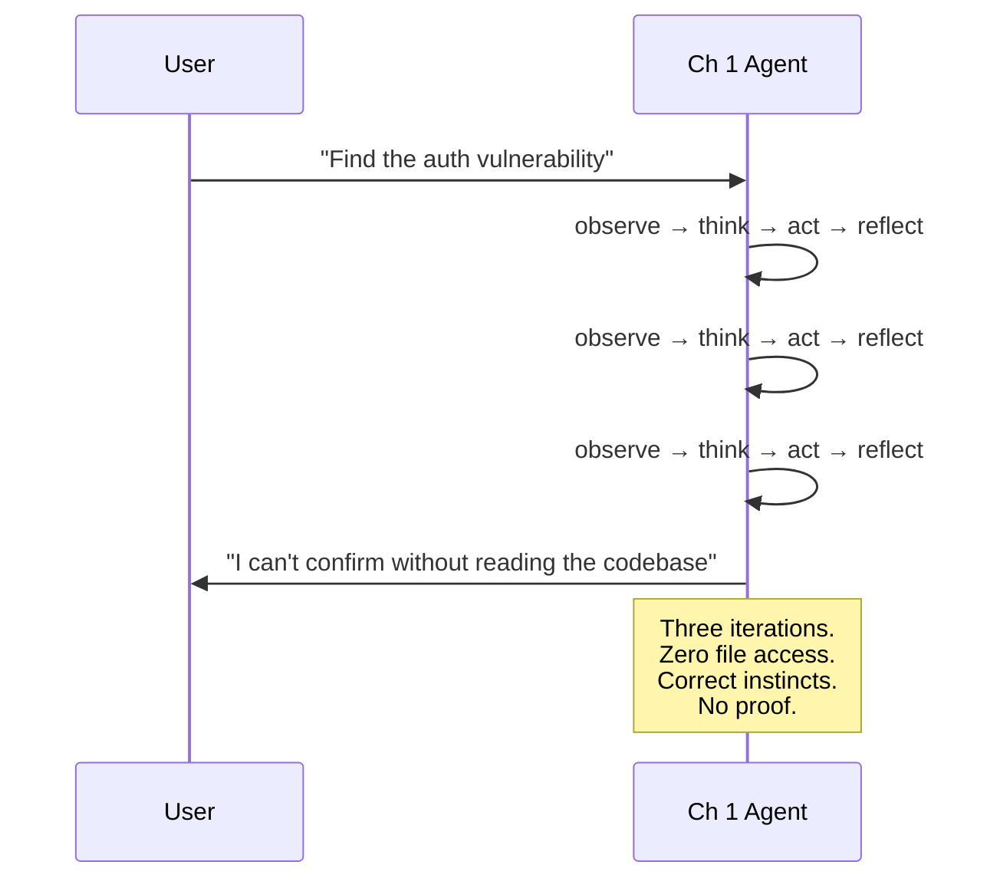
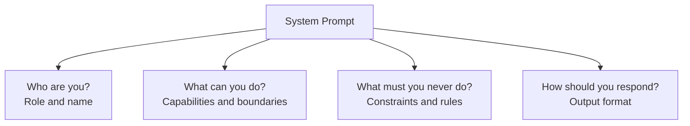
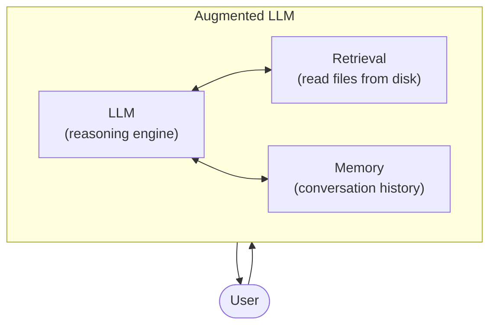
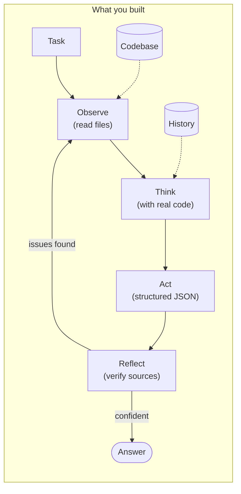

# Chapter 2: Your First Real Agent

## You Are the Agent

You're the Ch 1 agent now. You have the loop. Observe, think, act, reflect — the whole cycle. Someone hands you a task:

*"Find the security vulnerability in the todo-api authentication system."*

You think hard. You iterate. You catch yourself guessing. By iteration 3, you arrive at this:

```
The authentication system most likely has a vulnerability in its token
validation logic. I cannot confirm the specific file or function
without reading the codebase.
```

Honest. Self-aware. Useless.

You *know* the bug is in there somewhere. You can feel the shape of it — token validation, middleware, missing checks. But you can't name the file. Can't cite the line. Can't show your work. Because you've never seen the code. You're doing the mental equivalent of describing a painting you've never looked at.

And here's what kills you: the answer is sitting in `src/middleware/auth.pseudo`, line 12. Eight lines of code. The middleware accepts any non-empty token and hardcodes the user to `{ id: 1 }`. It's obvious — to anyone who can *read the file*.

You can't read the file.



The loop made you honest. It didn't make you useful. More iterations won't help. A better prompt won't help. You need *data*. You need to see the code.

tbh, a loop without data is just pacing in circles.

---

## What You'll Learn

You're going to upgrade this blind-but-honest agent into one that reads code, remembers conversations, and solves the auth bug on the first try.

- Why retrieval — not more iterations — breaks the Ch 1 ceiling
- System prompts as rules, not wishes ("never invent file names")
- Conversation history — how "it" gets a referent
- Structured JSON output — so code can act on answers, not just humans
- The Augmented LLM — the building block for everything in this book

---

## Give It Eyes

The fix isn't more thinking. It's one new capability in the observe phase: read files from disk.

```
FileContext:
    codebase_path: string
    files: FileEntry[]
    load(path) → void
    get_relevant(query) → FileEntry[]

FileEntry:
    path: string (relative to codebase root)
    content: string
    size: int (bytes)
    language: string (inferred from extension)
```

The loading strategy is deliberately naive:

1. Walk the directory tree
2. Skip binary files (images, executables)
3. Skip files larger than 10KB
4. Skip noise (`.git`, `node_modules`, `__pycache__`, `dist`)
5. Load up to 20 files
6. For relevance: keyword match — files whose path or content contains words from the query score higher

This won't scale. A real codebase has thousands of files. Loading 20 by keyword match is crude. But `todo-api` has ~10 files. They all fit. Start with a strategy that works for the current problem. Chapter 6 introduces proper retrieval.

Now when the LLM processes a request, it sees the actual source code between the system prompt and the conversation:

```
┌──────────────────────────────┐
│ System prompt                │  ← always first
├──────────────────────────────┤
│ File context                 │  ← relevant files for this query
│   src/middleware/auth.pseudo │
│   src/routes/auth.pseudo     │
│   tests/auth_test.pseudo     │
├──────────────────────────────┤
│ Conversation history         │  ← previous turns
│   [user] What does auth do?  │
│   [assistant] { answer: ...} │
├──────────────────────────────┤
│ Current message              │  ← this turn's question
│   "Is there a bug in it?"   │
└──────────────────────────────┘
```

The LLM sees the files as if they were part of the conversation. It can quote specific lines, trace logic across files, reference real function names. The difference between "I think the auth probably has an issue" and "line 12 hardcodes `req.user` to `{ id: 1 }` regardless of the token" is the difference between guessing and knowing.

---

## Stop It from Guessing

The Ch 1 one-shot hallucinated `auth_handler.py` because nothing told it not to. Even with file access, an LLM might still invent things. You need rules.

A system prompt answers four questions:



Here's the one for `tbh-code`:

```
You are tbh-code, a coding assistant that analyzes codebases.

Capabilities:
- You can read source files provided in your context
- You can answer questions about code structure, bugs, and design
- You can trace data flow across files

Constraints:
- Only reference files that appear in your context — never invent file names
- If you don't have enough information, say so — never guess
- Never fabricate function names, line numbers, or code that isn't in the files

Output format:
Respond with valid JSON:
{
  "answer": "your analysis here",
  "confidence": 0.0 to 1.0,
  "sources": ["file.ext:line_number"]
}
```

"Never invent file names." "Never guess." "Never fabricate." These directly target the Ch 1 failure.

From the LLM's point of view, a system prompt is the strongest steering signal it receives. Not a guarantee — the LLM can still hallucinate — but a strong prior. The system prompt reduces hallucinations. The reflect phase catches the ones that slip through. Defense in depth.

### Rules, Not Wishes

"Try not to guess" — the LLM will guess. "Never fabricate function names" — the LLM will fabricate less. The difference matters.

State constraints as rules. Include the exact output schema. Keep it under 500 tokens — the system prompt lives in every request and eats context budget on every turn.

---

## Teach It to Remember

Here's a conversation that breaks without memory:

```
Turn 1: "What does the auth middleware do?"
Turn 2: "Is there a bug in it?"
```

Turn 2 says "it." Without history, the agent says: "In what?" With history, it knows — the auth middleware from Turn 1.

This sounds trivial. It isn't. Multi-turn reasoning is how you actually debug code:

```
"Show me the auth flow."              → sees the middleware
"What tokens does the login return?"  → sees base64_encode(username)
"Does the middleware validate those?"  → connects the dots: no, it doesn't
```

Each turn builds on the last. Without history, each turn starts from zero. The agent can't build an understanding — it reassembles the world every time you speak.

### The Interface

```
Message:
    role: enum("system", "user", "assistant")
    content: string
    timestamp: ISO 8601 string

History:
    messages: Message[]
    add(message) → void
    get_messages() → Message[]
    token_count() → int
    truncate(max_tokens) → void
```

Every `chat()` call: append the user message, build the prompt, call the LLM, append the response, return.

### The History Grows. The Window Doesn't.

History gets bigger with every turn. Context windows are finite. Eventually, something has to give.

For Ch 2: **truncate from the front.** When history exceeds the budget, remove the oldest non-system messages. The system prompt always stays. Recent messages matter more than old ones.

This is lossy. A message from Turn 3 might have context that Turn 7 needs. But it's good enough for now. Chapter 6 introduces summarization, retrieval, and proper context budgeting. Right now, truncate. Ship simple, upgrade later.

---

## Make Answers Machine-Readable

Your Ch 1 agent returned prose. A human could read it. Code couldn't.

```
StructuredResponse:
    answer: string
    confidence: float (0.0 to 1.0)
    sources: string[] (file paths with line numbers)
    raw: string (original LLM output)
```

**Confidence score** — your code can act on it. Below 0.7? Ask a follow-up. Below 0.3? Warn the user. Above 0.9? Present the answer. The reflect phase uses this directly.

**Sources** — verifiable. Does `src/middleware/auth.pseudo` exist? Did the agent cite a real line? If the sources don't check out, the reflect phase catches it.

**Parseable** — downstream code, tests, and eventually other agents (Ch 10+) can consume this without regex hacks on prose.

### When the LLM Doesn't Cooperate

You told it to produce JSON. It usually will. But LLMs are stochastic — sometimes you get markdown preamble, sometimes invalid JSON, sometimes a polite refusal to use the format.

From the parser's point of view, this is a graceful degradation problem:

```
function parse_response(raw_text):
    json_str = extract_json(raw_text)     // find first { ... } block
    if json_str != null:
        parsed = json_parse(json_str)
        if has_required_fields(parsed, ["answer", "confidence", "sources"]):
            return StructuredResponse(
                answer: parsed.answer,
                confidence: clamp(parsed.confidence, 0.0, 1.0),
                sources: parsed.sources,
                raw: raw_text
            )

    // Fallback — don't crash, degrade
    return StructuredResponse(
        answer: raw_text,
        confidence: 0.0,       // unknown confidence
        sources: [],            // no verifiable sources
        raw: raw_text
    )
```

Don't crash when the LLM doesn't produce perfect JSON. Degrade. You get a less useful response, but the agent keeps running. Crashing on bad output is a one-shot mindset — an agent adapts.

---

## Wire It Together

Four components. One `chat()` function.

```
Agent:
    config: AgentConfig
    system_prompt: string
    history: Message[]
    context: FileContext

    chat(user_message) → StructuredResponse
    reset() → void
```

```
function chat(user_message):
    history.add({ role: "user", content: user_message })

    relevant_files = context.get_relevant(user_message)

    prompt = build_prompt(
        system_prompt,          // identity + constraints
        relevant_files,         // the eyes — real code
        history.get_messages(), // short-term memory
        user_message            // what the user asked
    )

    raw_response = llm_client.complete(prompt)
    response = parse_response(raw_response)

    history.add({ role: "assistant", content: raw_response })

    if history.token_count() > max_history_tokens:
        history.truncate(max_history_tokens)

    return response
```

Two CLI modes:

```
# Interactive REPL — multi-turn conversation
tbh-code --codebase ./todo-api

# Single question — one answer, exit
tbh-code --codebase ./todo-api --ask "Find the security vulnerability"
```

The Ch 1 loop is still there. But now:

| Phase       | Ch 1                        | Ch 2                              |
| ----------- | --------------------------- | --------------------------------- |
| **Observe** | Re-read the task            | Read files from the codebase      |
| **Think**   | Reason from nothing         | Reason from actual code           |
| **Act**     | Generate text               | Generate text with file evidence  |
| **Reflect** | Hedge detection, specificity| Source verification — files exist? |

The loop might not even iterate in Ch 2. When the agent has real code in context, it often nails the answer first pass. The loop is a safety net, not a crutch.

---

## Watch It Solve the Unsolvable

Run the task that defeated Chapter 1:

```
$ tbh-code --codebase ./todo-api --ask "Find the security vulnerability
  in the todo-api authentication system. Identify the file, the function,
  and explain what's wrong."
```

```json
{
  "answer": "The auth middleware in src/middleware/auth.pseudo has a critical
    vulnerability. The auth_middleware() function accepts any non-empty token
    as valid — it checks that the Authorization header exists, but never
    decodes the token, verifies a signature, checks expiry, or looks up the
    user. It hardcodes req.user to { id: 1, username: 'unknown' } for every
    request. Additionally, tests/auth_test.pseudo has no tests for the
    middleware itself — only for /auth/register and /auth/login.",
  "confidence": 0.95,
  "sources": [
    "src/middleware/auth.pseudo:8-15",
    "src/routes/auth.pseudo:26-28",
    "tests/auth_test.pseudo"
  ]
}
```

Same task. Same LLM. Same loop. The only difference is data.

Now pull up the outputs from all three attempts:

|          | Ch 1 One-Shot               | Ch 1 Loop                    | Ch 2 Agent                           |
| -------- | --------------------------- | ---------------------------- | ------------------------------------ |
| File     | `auth_handler.py` (invented)| "I can't confirm" (honest)   | `src/middleware/auth.pseudo` (correct)|
| Function | `validate_token()` (invented)| "I can't confirm" (honest)  | `auth_middleware()` (correct)        |
| Bug      | JWT signature (invented)    | "token validation" (vague)   | Accepts any non-empty token (correct)|
| Confidence| Sounds 100%                | 50%                          | 95%                                  |
| Sources  | None                        | None                         | 3 verified file references           |

The one-shot guessed confidently and got everything wrong. The loop caught the guessing and admitted defeat. The augmented agent read the code and solved it.

---

## Four Turns to Connect the Dots

The single-question mode is impressive. Multi-turn is where the agent thinks like a developer.

```
tbh-code> What does the auth middleware do?
```
```json
{
  "answer": "The auth middleware checks if the Authorization header exists
    and is non-empty. If missing, it returns 401. If present, it sets
    req.user to { id: 1, username: 'unknown' } — hardcoded, regardless
    of the token value.",
  "confidence": 0.95,
  "sources": ["src/middleware/auth.pseudo:8-15"]
}
```

```
tbh-code> What tokens does the login route actually generate?
```
```json
{
  "answer": "The login route generates tokens by base64-encoding the
    username: token = base64_encode(username). No signature, no expiry,
    no claims — just the username in base64.",
  "confidence": 0.95,
  "sources": ["src/routes/auth.pseudo:27"]
}
```

```
tbh-code> So the middleware doesn't even decode the base64?
```
```json
{
  "answer": "Correct. The login route generates base64(username) as the
    token, but the middleware never decodes it. It doesn't look at the
    token content at all — it only checks that the header is non-empty.
    This means: (1) any string passes authentication, (2) every request
    is treated as user 1, (3) the per-user isolation in task routes
    (WHERE user_id = ?) is broken — all users see all tasks.",
  "confidence": 0.95,
  "sources": ["src/middleware/auth.pseudo:12-14", "src/routes/auth.pseudo:27"]
}
```

```
tbh-code> Are there any tests for this?
```
```json
{
  "answer": "No. The auth tests only cover /auth/register and /auth/login.
    No test checks that invalid tokens are rejected, that the middleware
    decodes tokens, or that different users get different req.user values.
    The bug is invisible to the test suite.",
  "confidence": 1.0,
  "sources": ["tests/auth_test.pseudo"]
}
```

By Turn 3, the agent connected dots across three files — login generates base64 tokens, middleware ignores them, everyone is user 1. No single file tells that story. The conversation history lets the agent assemble it incrementally, just like a human debugging session.

### When It Doesn't Know

```
tbh-code> What CI/CD pipeline does this project use?
```
```json
{
  "answer": "I don't see any CI/CD configuration in the codebase. No
    .github/workflows, no Jenkinsfile, no .gitlab-ci.yml. The project
    may use an external CI system, but I can't determine that from the
    files available to me.",
  "confidence": 0.4,
  "sources": []
}
```

Confidence: 0.4. Sources: empty. The agent knows what it doesn't know. That's the system prompt constraints doing their job — "never guess," "never fabricate."

---

## Now Name What You Built

You've upgraded a blind loop into something that reads code, remembers conversations, and produces verifiable answers. Here's the name for it:



```
Augmented LLM = LLM + Retrieval + Memory
```

The LLM reasons. Retrieval gives it access to information it wasn't trained on — your codebase, your docs, your data. Memory lets it build on prior reasoning within a conversation.

That's the pattern. From this chapter's single-agent codebase analyzer to the multi-agent swarm in Chapter 13 — every one of them is an Augmented LLM with increasing capabilities bolted on.

Right now "retrieval" means reading files from disk. In Chapter 3, it means calling tools via MCP. In Chapter 6, querying a persistent memory store. The pattern stays. The capabilities grow.

```
Level 1: Chatbot        = LLM + Memory                    Can't act
Level 2: Augmented LLM  = LLM + Tools + Memory            Acts once
Level 3: Agent          = Augmented LLM + Loop             Acts + iterates
```

Your Ch 1 agent had Level 3 structure but Level 1 capabilities — a loop with nothing to loop over. Now it has Level 2 capabilities inside a Level 3 structure. The augmented LLM inside the agent loop. That's a real agent.

---

## The Spec

Full spec for this chapter in `../spec/ch02/`:

```
../spec/ch02/
├── prompt-template.md     What to build (language-agnostic)
├── interface-spec.md      Agent, History, FileContext, StructuredResponse contracts
├── expected-output.txt    Single-question, multi-turn, and honesty examples
└── validation/
    └── test_ch02.py       12 tests: structured output, file reading, history, honesty
```

The validation tests check: JSON output with required fields, correct identification of the auth bug, real file references (no hallucinated paths), multi-turn context retention, and honest "I don't know" responses.

---

## Try It

1. **Ask about something subtle.** *"Is there an N+1 query in the task routes?"* (There is — `list_tasks` loads tags in a loop.) Does the agent find it? Does it cite the right lines?

2. **Test the limits of history.** Have a 10-turn conversation. Does the agent still reference things from Turn 2? At what point does truncation lose important context?

3. **Feed it a huge codebase.** Point the agent at a project with 500+ files. Watch the keyword-match strategy break. The 20-file limit means it probably won't load the relevant files. This is the problem Ch 6 solves.

4. **Break the system prompt.** Remove the constraints. Ask the same auth vulnerability question. Does the agent hallucinate file names like the Ch 1 one-shot did?

5. **Compare structured vs raw.** Remove the JSON output format from the system prompt. Is the raw prose answer better or worse? Can your code still do anything useful with it?

---

## Three Ways to Cripple Your Agent

### The Identity Crisis

No system prompt. Or: "You are a helpful assistant." The agent has no identity, no constraints, no output format. It defaults to chatbot behavior — verbose, eager to please, happy to hallucinate.

**Fix:** Role, capabilities, constraints, output format. Four things. Every agent needs them.

### The Context Hoarder

Load every file in the project. 200 files. 500,000 tokens. The LLM drowns in irrelevant context, the request costs a dollar, and the answer gets worse — not better.

**Fix:** Load fewer files. Prioritize by relevance. For Ch 2, keyword matching is fine. For real codebases, Ch 6 has the answer.

### The Amnesia Agent

No history. Every turn is Turn 1. The user says "Is there a bug in it?" and the agent says "In what?"

**Fix:** Append every message. Truncate from the front when it gets too long. The system prompt stays. Recent turns stay. Old turns get cut.

---

## Opinions Without Hands

Your agent reads the codebase. It references real code. It builds understanding across turns. It finds the auth bug in one shot.

Now ask it to *fix* the bug.

It'll describe the fix beautifully: "Decode the base64 token, look up the user in the database, verify the user exists, set `req.user` to the actual user object." Clear. Correct. Actionable.

Then it stops. Because it can't write files. Can't run tests. Can't execute the fix it just described. It's a brilliant analyst with no hands.

In Chapter 3, you give the agent hands. Tools — typed functions the agent calls at runtime. Not a custom tool interface — MCP, the Model Context Protocol, the standard that lets any agent discover and invoke any tool. Your agent stops observing and starts acting.

---

> **tbh-code after this chapter:**



> An augmented agent with file access, system prompt identity, conversation history, and structured JSON output. It reads real code, cites real lines, remembers prior turns, and knows when it doesn't know. The same task that defeated the one-shot and stalled the loop — solved in one turn.

---

## References

### Foundational Architecture & Agent Patterns

1. **"Building Effective Agents"** — Schluntz, Zhang, Anthropic (2024). Defines the Augmented LLM (LLM + tools + retrieval + memory) as the core building block of agentic systems. Primary source for this chapter's architectural framework. [anthropic.com/research/building-effective-agents](https://www.anthropic.com/research/building-effective-agents)

2. **"How We Built Our Multi-Agent Research System"** — Anthropic Engineering (2025). Production prompt engineering for agent behavior, system prompt design, and structured outputs in practice. [anthropic.com/engineering/multi-agent-research-system](https://www.anthropic.com/engineering/multi-agent-research-system)

3. **"ReAct: Synergizing Reasoning and Acting in Language Models"** — Yao, Zhao, Yu et al. (2022). Formalizes the interleaved reasoning-and-acting loop that this chapter's agent implements. [arxiv.org/abs/2210.03629](https://arxiv.org/abs/2210.03629)

4. **"Toolformer: Language Models Can Teach Themselves to Use Tools"** — Schick, Dwivedi-Yu et al., Meta AI (2023). LLMs learning when and how to call external tools — the conceptual basis for the augmented LLM pattern. [arxiv.org/abs/2302.04761](https://arxiv.org/abs/2302.04761)

### Retrieval-Augmented Generation

5. **"Retrieval-Augmented Generation for Knowledge-Intensive NLP Tasks"** — Lewis, Perez, Piktus et al., Meta AI (2020). The original RAG paper. Loading codebase files as context before querying the LLM is a direct application of retrieval-augmented generation. [arxiv.org/abs/2005.11401](https://arxiv.org/abs/2005.11401)

6. **"Retrieval-Augmented Generation for Large Language Models: A Survey"** — Gao, Xiong, Gao et al. (2023). Comprehensive survey of RAG paradigms (Naive, Advanced, Modular) — how this chapter's simple file-loading approach fits into the broader RAG landscape. [arxiv.org/abs/2312.10997](https://arxiv.org/abs/2312.10997)

### Context Window & Attention

7. **"Attention Is All You Need"** — Vaswani, Shazeer, Parmar et al. (2017). The transformer paper defining the attention mechanism underlying every modern LLM. Essential background for why context windows are finite. [arxiv.org/abs/1706.03762](https://arxiv.org/abs/1706.03762)

8. **"Lost in the Middle: How Language Models Use Long Contexts"** — Liu, Lin, Hewitt et al., Stanford/Meta (2023). LLMs degrade when relevant information is in the middle of long contexts. Where you place codebase files in the prompt matters. [arxiv.org/abs/2307.03172](https://arxiv.org/abs/2307.03172)

9. **"Why Does the Effective Context Length of LLMs Fall Short?"** — (2024). The gap between nominal context window size and effective context utilization — having 128K tokens doesn't mean 128K tokens of context will all be used effectively. [arxiv.org/abs/2410.18745](https://arxiv.org/abs/2410.18745)

### System Prompts & Prompt Engineering

10. **"Prompt Engineering"** — OpenAI. Canonical reference for system prompt design, including role assignment, output formatting, and grounding the model with context. [platform.openai.com/docs/guides/prompt-engineering](https://platform.openai.com/docs/guides/prompt-engineering)

11. **"Prompt Engineering Overview"** — Anthropic. Official guidance on system prompts, XML structuring, and how Claude processes instructions. [docs.anthropic.com/en/docs/build-with-claude/prompt-engineering/overview](https://docs.anthropic.com/en/docs/build-with-claude/prompt-engineering/overview)

12. **"Effective Context Engineering for AI Agents"** — Anthropic Engineering (2025). Frames prompt engineering as "context engineering" — managing the entire context state (system instructions, tools, history, external data) across multi-turn agent loops. [anthropic.com/engineering/effective-context-engineering-for-ai-agents](https://www.anthropic.com/engineering/effective-context-engineering-for-ai-agents)

### Structured Output & Reasoning

13. **"Introducing Structured Outputs in the API"** — OpenAI (2024). Guaranteed JSON Schema conformance in LLM outputs — the mechanism behind this chapter's structured JSON with answer, confidence, and sources. [openai.com/index/introducing-structured-outputs-in-the-api](https://openai.com/index/introducing-structured-outputs-in-the-api/)

14. **"Chain-of-Thought Prompting Elicits Reasoning in Large Language Models"** — Wei, Wang, Schuurmans et al. (2022). Chain-of-thought as a prompting technique. The agent's structured output includes reasoning/confidence — CoT is the mechanism that makes the agent "show its work." [arxiv.org/abs/2201.11903](https://arxiv.org/abs/2201.11903)

### Code Understanding with LLMs

15. **"Evaluating Large Language Models Trained on Code" (Codex)** — Chen, Tworek, Jun et al., OpenAI (2021). First major demonstration that LLMs can understand and generate code — foundational for the premise that an agent can answer questions about a codebase. [arxiv.org/abs/2107.03374](https://arxiv.org/abs/2107.03374)

16. **"CodeBERT: A Pre-Trained Model for Programming and Natural Languages"** — Feng, Guo, Tang et al., Microsoft Research (2020). Bimodal pre-trained model bridging natural language questions and code structure — the core capability this chapter's agent relies on. [arxiv.org/abs/2002.08155](https://arxiv.org/abs/2002.08155)

### Engineering: Building Coding Agents

17. **"Lessons from Building AI Coding Assistants: Context Retrieval and Evaluation"** — Hartman, Sourcegraph (2024). Practical engineering lessons on context retrieval for codebase-aware AI, including two-stage retrieval-then-ranking — the production version of this chapter's file-loading approach. [sourcegraph.com/blog/lessons-from-building-ai-coding-assistants-context-retrieval-and-evaluation](https://sourcegraph.com/blog/lessons-from-building-ai-coding-assistants-context-retrieval-and-evaluation)
