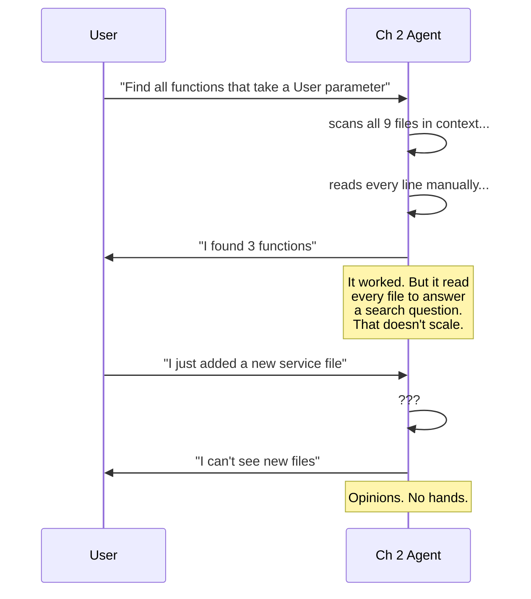
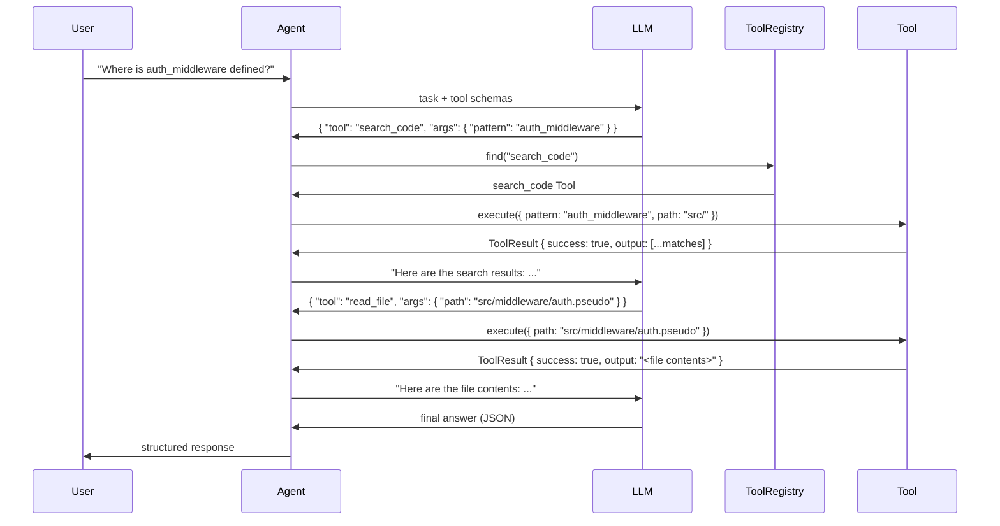
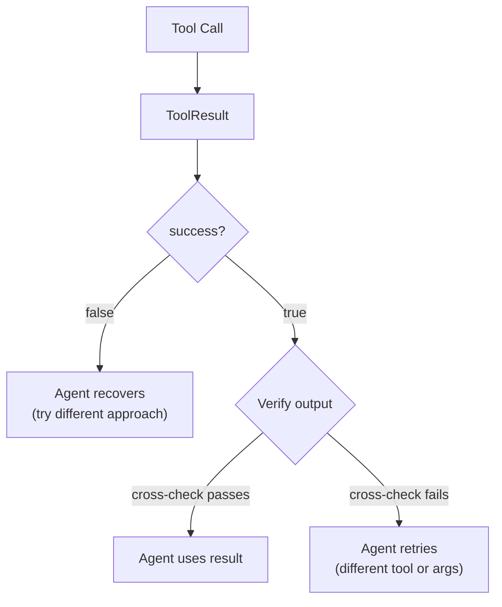
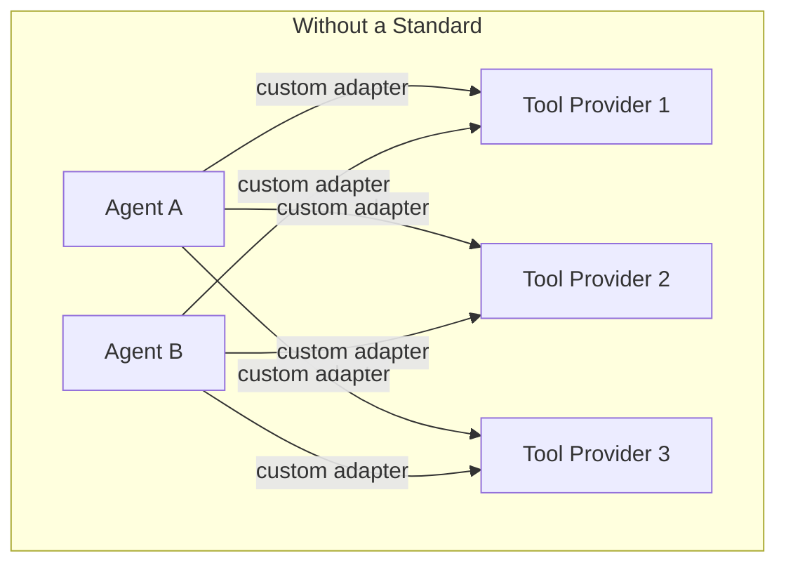
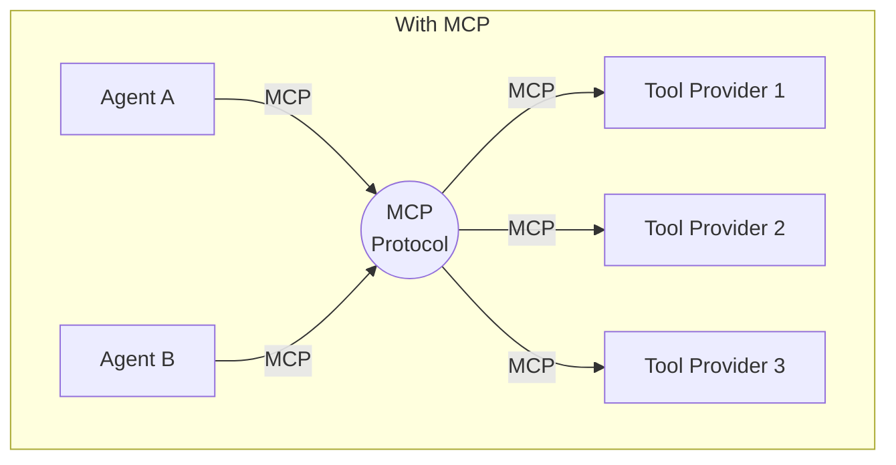
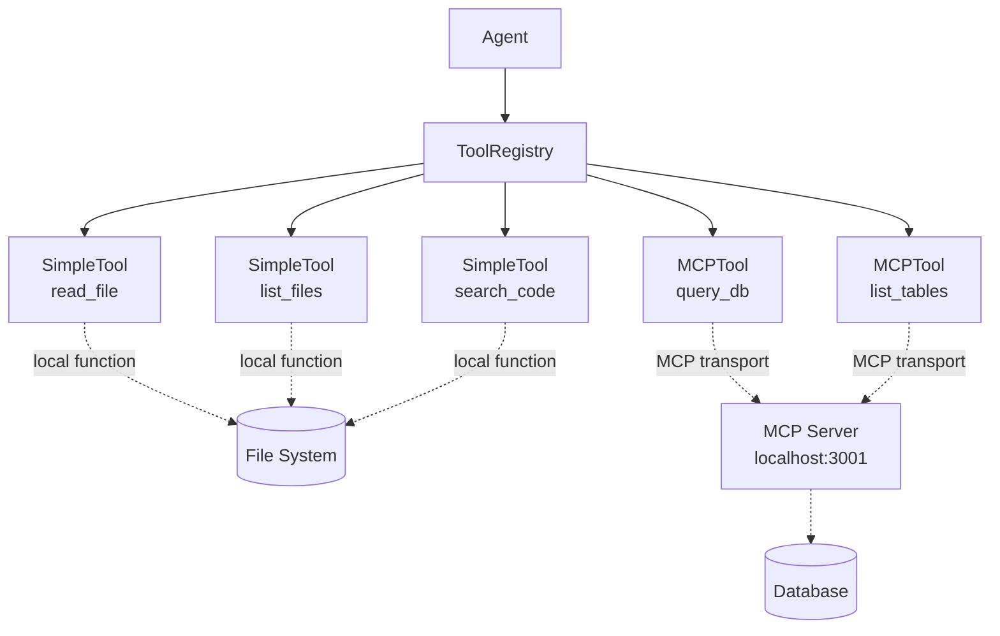
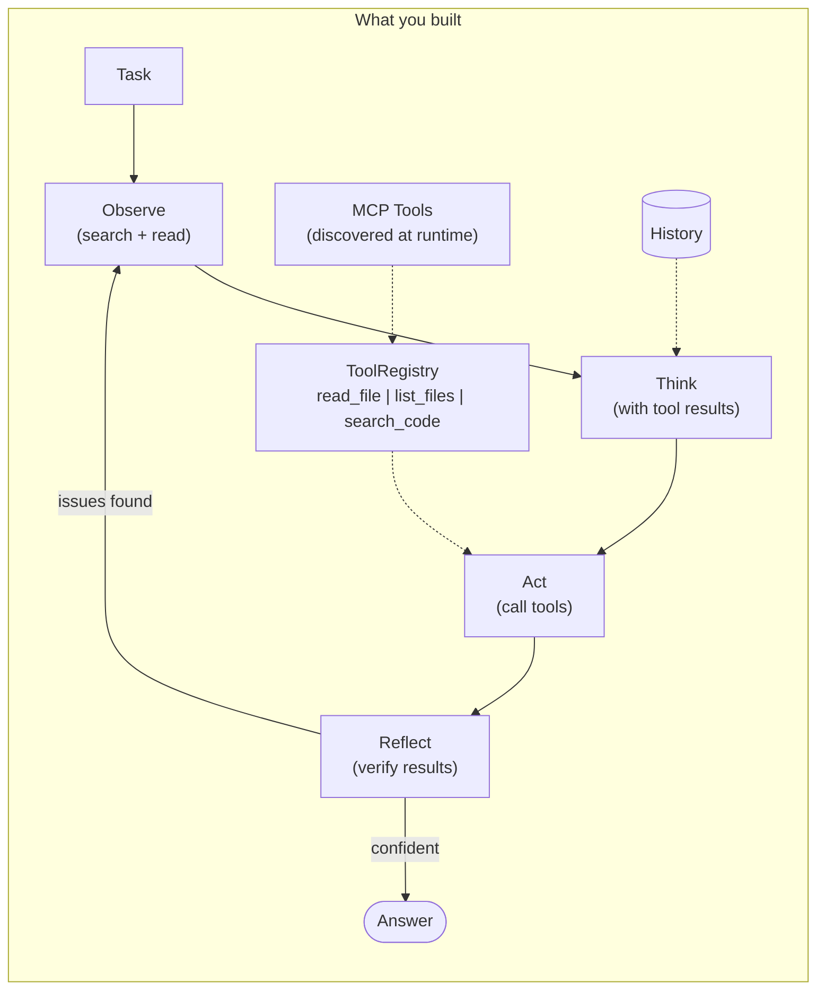

# Chapter 3: Tool Use + MCP

## You Are the Agent (With Opinions but No Hands)

You're the Ch 2 agent. You've got the loop, the file context, the conversation history. Someone asks:

*"Find all functions in todo-api that take a User parameter."*

You know the codebase. You've got 9 files loaded in context. You can see `src/models/user.pseudo` and you can see `src/db.pseudo`. You scan the code, spot `create_user`, `find_user`, `save_user`. You give a solid answer with line numbers. Life is good.

Now someone asks:

*"Actually, I just added a new service file. Can you check it?"*

You can't. Your files were loaded at startup. You see a frozen snapshot of the codebase — whatever was there when you started. New files? Changed files? You're blind to them.

But the real frustration is subtler. Go back to that first question — "find all functions that take a User parameter." You answered it, sure. But how? You loaded every file and scanned them yourself, line by line, in your context window. That's not searching. That's reading every page in a book to find one sentence.

What you actually wanted to do was *search*. Grep the codebase. Get back a list of matches. Then read only the files that matter.

You wanted to say: "Let me search for that." But you can't search. You can't list a directory. You can't run a command. You have opinions about code. You have no hands.




tbh, an agent that can't act is just a chatbot with better prompts.

---

## What You'll Learn

You're going to give `tbh-code` hands — typed functions it can call at runtime. Then you're going to discover why every agent team eventually builds the same wrapper, and why a standard (MCP) means you never have to.

- The `Tool` interface — one contract that every tool satisfies
- Three local tools: `read_file`, `list_files`, `search_code`
- A `ToolRegistry` that lets the agent ask "what can I do?"
- MCP — the Model Context Protocol — USB for agent tools
- let 
- Ground-truth verification — don't trust tool results blindly

---

## Build the First Tool

Start from the problem. The agent wants to search the codebase for a pattern. Right now it can't. Give it a function it can call.

What does the agent need to know about a tool? Four things:

1. **Name** — what to call it ("search_code")
2. **Description** — what it does (so the LLM can decide when to use it)
3. **Parameters** — what arguments it takes (so the LLM can provide them)
4. **Execute** — what happens when you call it

That's the interface:

```
Tool:
    name: string
    description: string
    parameters: ParameterSchema
    execute(args) → ToolResult

ToolResult:
    output: any
    success: bool
    error: string | null
```

Every tool returns a `ToolResult`. Not raw data — a result with a success flag and an error slot. The agent checks `success` before using `output`. Always.

### search_code

The first tool. The one the agent was wishing it had.

```
search_code:
    name: "search_code"
    description: "Search for a pattern in files across the codebase"
    parameters:
        pattern: string (required) — "Search pattern (regex or literal)"
        path: string (optional, default: ".") — "Directory to search in"
        file_pattern: string (optional, default: "*") — "Glob for file names"

    execute({ pattern, path, file_pattern }):
        matches = grep(pattern, codebase_root / path, file_pattern)
        results = []
        for match in matches:
            results.append({
                file: match.file,
                line: match.line_number,
                content: match.line_content
            })
        return ToolResult(output=results, success=true, error=null)
```

Build it. Call it directly:

```
result = search_code.execute({ pattern: "User", path: "src/" })
```

```json
{
  "output": [
    { "file": "src/models/user.pseudo", "line": 1, "content": "model User:" },
    { "file": "src/models/user.pseudo", "line": 8, "content": "function create_user(username: string, password: string) -> User:" },
    { "file": "src/db.pseudo", "line": 15, "content": "function find_user(username: string) -> User | null:" },
    { "file": "src/db.pseudo", "line": 22, "content": "function save_user(user: User) -> void:" }
  ],
  "success": true,
  "error": null
}
```

Six lines of matching code. Specific files, specific line numbers. The agent didn't read every file — it searched. That's the difference between scanning a library shelf-by-shelf and using the card catalog.

### read_file

The agent found matches. Now it wants to see the full context — what's around line 22 of `src/db.pseudo`?

```
read_file:
    name: "read_file"
    description: "Read the contents of a file at the given path"
    parameters:
        path: string (required) — "File path relative to codebase root"

    execute({ path }):
        if not file_exists(codebase_root / path):
            return ToolResult(output=null, success=false,
                              error="File not found: {path}")
        content = read(codebase_root / path)
        return ToolResult(output=content, success=true, error=null)
```

Notice the error path. If the file doesn't exist, the tool doesn't crash — it returns `success: false` with a message. The agent can recover. A crash is a one-shot mindset. An error is data.

### list_files

The agent wants to know what's in the codebase. Not read every file — just see what's there.

```
list_files:
    name: "list_files"
    description: "List files and directories at the given path"
    parameters:
        path: string (optional, default: ".") — "Directory path relative to codebase root"
        recursive: bool (optional, default: false) — "Include subdirectories"

    execute({ path, recursive }):
        if not directory_exists(codebase_root / path):
            return ToolResult(output=null, success=false,
                              error="Directory not found: {path}")
        entries = list_directory(codebase_root / path, recursive=recursive)
        return ToolResult(output=entries, success=true, error=null)
```

Three tools. All read-only. All return `ToolResult`. All follow the same `Tool` interface. The agent now has hands — but only for reading. Writing comes in Ch 5.

---

## Give the Agent a Toolbox

Three tools exist. The agent needs to know about them. Not hardcoded — it should be able to ask "what tools do I have?" at runtime.

```
ToolRegistry:
    tools: dict[string, Tool]

    register(tool) → void      # add a tool
    find(name) → Tool | null   # look up by name
    list() → Tool[]            # everything registered
    list_schemas() → dict[]    # schemas for the LLM
```

`list_schemas()` is the one the LLM sees. It returns the name, description, and parameter definitions for every registered tool — the menu.

```
registry = ToolRegistry()
registry.register(read_file)
registry.register(list_files)
registry.register(search_code)
```

Now wire it into the system prompt. Add this to the Ch 2 prompt:

```
You have access to the following tools:
{registry.list_schemas()}

To use a tool, respond with:
{
  "tool": "tool_name",
  "args": { "param1": "value1" }
}

After receiving a tool result, analyze it and either:
- Use another tool if needed
- Provide your final answer

Always verify tool results before trusting them.
```

The LLM reads the tool schemas, picks the right tool, provides the arguments. Your code validates the arguments, calls `execute()`, and feeds the result back.




Two tool calls. Search first, then read. The agent chose this sequence — nobody hardcoded it. The LLM looked at the schemas, decided `search_code` was the right starting point, then used `read_file` to confirm. That's tool selection, and it's happening dynamically.

---

## Watch It Use Its Hands

Run the task that frustrated the Ch 2 agent:

```
$ tbh-code --codebase ./todo-api --ask "Where is the auth middleware defined?"
```

```
Loading codebase from ./todo-api ...
  Loaded 9 files
  Registered 3 tools: read_file, list_files, search_code

[tool] Agent selected: search_code
[tool] Arguments: { "pattern": "auth_middleware", "path": "src/" }
[tool] Result: success=true
  [
    { "file": "src/middleware/auth.pseudo", "line": 8,
      "content": "function auth_middleware(req, res, next):" },
    { "file": "src/main.pseudo", "line": 12,
      "content": "app.use(\"/tasks\", auth_middleware)" }
  ]

[tool] Agent selected: read_file
[tool] Arguments: { "path": "src/middleware/auth.pseudo" }
[tool] Result: success=true
  <file contents>
```

```json
{
  "answer": "The auth middleware is defined in src/middleware/auth.pseudo at line 8. The function auth_middleware(req, res, next) checks for an Authorization header and, if present, sets req.user to a hardcoded value. It is applied to the /tasks routes in src/main.pseudo at line 12.",
  "confidence": 0.95,
  "sources": [
    "src/middleware/auth.pseudo:8",
    "src/main.pseudo:12"
  ]
}
```

The agent *searched*, then *read*, then answered. Every tool call is visible in the trace. You can see exactly what the agent did and why.

Ch 2 would have answered this too — it had the files in context. But Ch 2 scanned all 9 files to find the answer. Ch 3 made two targeted calls. On a codebase with 500 files, that difference is everything.

---

## Now the Real Test

The task from the spec — the one that shows the full power of tool use:

```
$ tbh-code --codebase ./todo-api --ask "Find all functions in todo-api that take a User parameter"
```

```
[tool] Agent selected: search_code
[tool] Arguments: { "pattern": "User", "path": "src/" }
[tool] Result: success=true
  [
    { "file": "src/models/user.pseudo", "line": 1, "content": "model User:" },
    { "file": "src/models/user.pseudo", "line": 8,
      "content": "function create_user(username: string, password: string) -> User:" },
    { "file": "src/routes/auth.pseudo", "line": 10,
      "content": "function register(req, res):" },
    { "file": "src/routes/auth.pseudo", "line": 27,
      "content": "    token = base64_encode(user.username)" },
    { "file": "src/db.pseudo", "line": 15,
      "content": "function find_user(username: string) -> User | null:" },
    { "file": "src/db.pseudo", "line": 22,
      "content": "function save_user(user: User) -> void:" }
  ]

[tool] Agent selected: read_file
[tool] Arguments: { "path": "src/models/user.pseudo" }
[tool] Result: success=true
  <file contents>

[tool] Agent selected: read_file
[tool] Arguments: { "path": "src/db.pseudo" }
[tool] Result: success=true
  <file contents>

[verify] Cross-check: search results reference real files — PASS
[verify] Cross-check: read_file confirms function signatures — PASS
```

```json
{
  "answer": "I found the following functions that take or return a User parameter:\n\n1. src/models/user.pseudo:8 — create_user(username, password) -> User\n   Creates a new User record.\n\n2. src/db.pseudo:15 — find_user(username) -> User | null\n   Looks up a user by username, returns User or null.\n\n3. src/db.pseudo:22 — save_user(user: User) -> void\n   Persists a User object to the database. Takes User as a direct parameter.\n\nNote: The auth middleware (src/middleware/auth.pseudo) sets req.user to a hardcoded object { id: 1, username: 'unknown' } — this is NOT a real User parameter, it's a hardcoded stub.",
  "confidence": 0.9,
  "sources": [
    "src/models/user.pseudo:8",
    "src/db.pseudo:15",
    "src/db.pseudo:22",
    "src/middleware/auth.pseudo:12"
  ]
}
```

Three tool calls. Search first to find candidates. Two reads to confirm the signatures. Verification to cross-check. And the agent even distinguished the hardcoded `req.user` stub from actual `User` parameters — that's not a tool feature, that's the LLM reasoning about tool output.


|                           | Ch 2 (Files in Context)   | Ch 3 (Tool Use)                   |
| ------------------------- | ------------------------- | --------------------------------- |
| How it found matches      | Scanned all loaded files  | `search_code` — targeted grep     |
| How it confirmed          | Already had file contents | `read_file` — read specific files |
| Handles new files         | No — snapshot at startup  | Yes — tools read live filesystem  |
| Scales to large codebases | No — 20-file limit        | Yes — search then read            |
| Trace visibility          | "I found..." (no trace)   | Every tool call visible           |


---

## When a Tool Lies

Run this:

```
$ tbh-code --codebase ./todo-api --ask "Read the file src/services/auth_service.pseudo"
```

```
[tool] Agent selected: read_file
[tool] Arguments: { "path": "src/services/auth_service.pseudo" }
[tool] Result: success=false, error="File not found: src/services/auth_service.pseudo"
[verify] File does not exist — FAIL
```

```json
{
  "answer": "The file src/services/auth_service.pseudo does not exist in the todo-api codebase. The authentication logic is in src/middleware/auth.pseudo and src/routes/auth.pseudo instead.",
  "confidence": 0.95,
  "sources": ["src/middleware/auth.pseudo", "src/routes/auth.pseudo"]
}
```

The tool returned `success: false`. The agent didn't panic. It didn't hallucinate file contents. It told the user the file doesn't exist and pointed to the files that do. That's verification doing its job.

Without verification, you get something worse: the LLM might *pretend* the tool succeeded and fabricate the file's contents. This is why you check `success` before using `output`. Trust the tool's word — but verify it.

### Verification Strategies

Not all verification is the same:

1. **Existence check** — the tool says a file exists. Does it?
2. **Content check** — the tool returned file contents. Does the content contain the patterns you expected?
3. **Count check** — the search returned 6 matches. Is that plausible, or did it miss some?
4. **Cross-tool check** — `search_code` says `auth_middleware` is at line 8. `read_file` confirms line 8 actually contains that function.

The cross-tool check is the most powerful. Use one tool to verify another. That's what the agent did above — searched, then read to confirm.




---

## The N×M Problem

You've got three tools. They work. Life is good.

Now imagine you want to add more: `query_db`, `list_tables`, `run_tests`, `lint_file`. Four more tools, four more implementations. Still manageable.

But `query_db` is different. The database isn't a local file — it's a running service. Maybe it's a PostgreSQL instance, maybe it's SQLite behind an API. The tool needs to connect to infrastructure your agent doesn't own.

Now imagine someone else built tools for *their* stack — a documentation searcher, a dependency checker, a Kubernetes inspector. You want to use their tools. They want to use yours.

Without a standard, every integration is custom. Your agent speaks one format. Theirs speaks another. To connect N agents to M tool providers, you need N×M adapters.




Six adapters for 2 agents and 3 providers. Scale it to 10 agents and 20 providers and you're writing 200 adapters. Each one slightly different. Each one a maintenance burden.




MCP — the **Model Context Protocol** — is the standard. Every agent speaks MCP. Every tool provider speaks MCP. N agents + M providers = N + M implementations. Not N × M.

Think USB. Before USB, every device had its own proprietary connector. Printers, keyboards, cameras — all different cables. USB said: one plug, one protocol. Now anything plugs into anything.

tbh, a protocol beats a hack every time.

---

## Build the MCP Pieces

MCP defines three primitives that a server can expose:


| Primitive     | What It Is                   | How Agents Use It                              |
| ------------- | ---------------------------- | ---------------------------------------------- |
| **Tools**     | Functions the agent can call | `search_code`, `read_file`, etc.               |
| **Resources** | Data the agent can read      | File contents, database records, API responses |
| **Prompts**   | Reusable prompt templates    | "Analyze this file for security issues"        |


Ch 3 focuses on **tools**. Resources and prompts come later — resources in Ch 5 when the agent needs structured data access, prompts in Ch 4 when they become skills.

### MCP Server

An MCP server exposes tools over a standard transport. Your `tbh-code` agent can run an MCP server that exposes its three SimpleTools to any MCP client:

```
MCPServer:
    name: string
    tools: Tool[]

    list_tools() → ToolDefinition[]
        # Return schemas for all tools this server exposes
        return [{ name: t.name, description: t.description,
                  parameters: t.parameters } for t in tools]

    call_tool(name, args) → MCPResponse
        # Execute a tool by name
        tool = find_tool(name)
        if tool is null:
            return MCPResponse(content=null, is_error=true,
                               error="Unknown tool: {name}")
        result = tool.execute(args)
        return MCPResponse(content=result.output,
                           is_error=not result.success,
                           error=result.error)
```

Two operations: list what's available, call what you need. That's the entire server interface.

### MCP Client

The other side. Your agent can also be a client — connecting to external MCP servers to discover tools it didn't build:

```
MCPClient:
    connect(server_url) → MCPServerConnection
    discover_tools(connection) → MCPTool[]
```

Connect, discover, use. The client asks the server "what tools do you have?" and gets back schemas. It wraps each one as an `MCPTool` and registers it in the `ToolRegistry`. Done.

### MCPTool — The Key Insight

Here's where it clicks. `MCPTool` implements the same `Tool` interface as `SimpleTool`:

```
MCPTool extends Tool:
    server_url: string
    transport: MCPTransport

    execute(args) → ToolResult:
        mcp_response = transport.call_tool(name, args)
        return ToolResult(
            output=mcp_response.content,
            success=not mcp_response.is_error,
            error=mcp_response.error if mcp_response.is_error else null
        )
```

Same `execute(args) → ToolResult`. The agent doesn't know — and doesn't care — whether a tool is a `SimpleTool` running locally or an `MCPTool` routing through a remote server. It calls `execute()` and gets a `ToolResult`. That's polymorphism doing exactly what it's supposed to do.

```
registry.find("search_code").execute(args)    // SimpleTool — runs locally
registry.find("query_db").execute(args)        // MCPTool — routes through MCP
```

Same call. Same return type. Different plumbing. The agent is blissfully ignorant.

---

## See It: MCP Discovery

```
$ tbh-code --codebase ./todo-api --mcp-server http://localhost:3001 --list-tools

Connecting to MCP server at http://localhost:3001 ...
  Discovered 2 tools from MCP server

Available tools (5):

  Local tools:
    read_file — Read the contents of a file at the given path
    list_files — List files and directories at the given path
    search_code — Search for a pattern in files across the codebase

  MCP tools (from http://localhost:3001):
    query_db — Execute a read-only SQL query against the application database
    list_tables — List all tables and their columns in the database
```

Five tools. Three local, two discovered via MCP. The "Local" vs "MCP" labels are for your understanding — the agent just sees five tools with schemas. When it picks `query_db`, it calls `execute()` the same way it calls `read_file`. The registry handles the routing.

Notice the difference: `read_file` runs in your process — it opens a file. `query_db` runs on an MCP server — it connects to a database your agent doesn't have credentials for. The MCP server handles auth, connection pooling, read-only enforcement. Your agent just sends a query and gets rows back. Same interface.



One interface. Two implementations. Infinite extensibility. Any tool provider that speaks MCP can plug into your agent without you writing a single adapter.

---

## Now Name What You Built

You solved three problems:

1. The agent couldn't act — you gave it tools
2. Tools needed a common shape — you built the `Tool` interface
3. External tools needed discovery — MCP handles that

Here's the vocabulary:

**Tool interface** — the contract: `{ name, description, parameters, execute(args) → ToolResult }`. Every tool satisfies it. The agent programs against the interface, never the implementation.

**SimpleTool** — a local implementation. The function runs in your process. No network, no protocol. Fast and simple.

**MCPTool** — a remote implementation. The function runs on an MCP server. `execute()` routes through the transport, but returns the same `ToolResult`. The agent can't tell the difference.

**ToolRegistry** — the single source of truth. "What tools do I have?" lives here. Register local tools, discover MCP tools, list schemas for the LLM.

**MCP (Model Context Protocol)** — the standard protocol for tool discovery and invocation. USB for agent tools. Your agent speaks it as a client (discovering external tools) and can expose tools as a server (for other agents to discover).

**Ground-truth verification** — don't trust tool results blindly. Check `success`. Cross-reference with other tools. The gap between "the LLM asked for it" and "the tool confirmed it" is where hallucinations die.

```
Level 1: Chatbot        = LLM + Memory                    Can't act
Level 2: Augmented LLM  = LLM + Tools + Memory            Acts once
Level 3: Agent          = Augmented LLM + Loop             Acts + iterates
```

Ch 2 gave the agent eyes (file reading). Ch 3 gave it hands (tools). The agent is now firmly at Level 2 — an Augmented LLM that acts through a standard tool interface. Inside the Ch 1 loop, that's Level 3: an agent that can search, read, verify, and iterate.

---

## The Spec

Full spec in [spec/ch03/](../spec/ch03/):

📁 [spec/ch03/](../spec/ch03/)

| File | Description |
|------|-------------|
| [prompt-template.md](../spec/ch03/prompt-template.md) | What to build (language-agnostic) |
| [interface-spec.md](../spec/ch03/interface-spec.md) | Tool, SimpleTool, MCPTool, ToolRegistry, MCP contracts |
| [expected-output.txt](../spec/ch03/expected-output.txt) | Tool calls, MCP discovery, verification traces |
| [test_ch03.py](../spec/ch03/validation/test_ch03.py) | Tests: tool interface, registry, MCP, verification |

The validation tests check: all three SimpleTools work correctly, ToolRegistry registers and finds tools, MCP discovery wraps remote tools as MCPTools, the agent selects appropriate tools for a task, and verification catches non-existent files.

---

## Try It

1. **Ask a question that needs two tools.** *"What files are in the src/routes/ directory and what does each one do?"* Does the agent use `list_files` first, then `read_file` on each result?
2. **Point it at a non-existent path.** *"Read src/services/magic.pseudo."* Does the tool return `success: false`? Does the agent recover gracefully?
3. **Run --list-tools.** Look at the schemas. Can you tell from the descriptions alone which tool to use for a given task? If you can't, neither can the LLM.
4. **Break tool selection.** Give all three tools identical descriptions: "Does things with files." Watch the agent struggle to choose. Descriptions aren't decoration — they're the LLM's decision criteria.
5. **Add a fourth tool.** Implement `count_lines` — takes a path, returns the line count. Register it. Does the agent discover and use it without any other changes?

---

## Three Ways to Fumble Your Tools

### The Duct-Tape Toolbox

Every tool returns a different shape. `read_file` returns a string. `list_files` returns an array. `search_code` returns a dict with custom keys. The agent has to special-case every tool result.

**Why:** You skipped the interface. Each tool was built ad-hoc, returns whatever felt convenient.

**Fix:** `ToolResult`. Every tool. Every time. `{ output, success, error }`. The agent checks one shape and it works for every tool in the registry.

### The Blind Caller

The agent calls a tool and trusts the output without checking. `read_file` returns content — the agent quotes it. But the content is from a cached version, or the path was wrong, or the file was empty.

**Why:** No verification step. Tool call → answer. One hop.

**Fix:** Verify. Check `success`. Cross-reference with another tool. `search_code` says the function is at line 8? `read_file` and confirm. Two tools, one truth.

### The Protocol Procrastinator

"I'll add MCP later. For now, let me just hardcode the integration."

Three months later, you're maintaining 14 custom adapters, each with slightly different error handling, each with its own authentication quirks, each slowly rotting.

**Why:** Custom integrations are faster to build and slower to maintain. MCP is slower to build and faster to maintain. The math crosses over around tool number four.

**Fix:** Build the Tool interface from day one. Wrap locals as SimpleTools. When external tools show up — and they will — MCPTool fits right in. The interface was ready.

---

## Hands Without a Plan

Your agent has hands now. It can search, read, and verify. It found every function that takes a User parameter. It traced the auth middleware. It verified files exist before citing them.

But watch what it does on a complex task:

*"Review the authentication system for security issues."*

It'll call `search_code` for "auth". Read every matching file. Call `search_code` for "token". Read more files. Call `search_code` for "password". More files. It'll thrash — calling tools in whatever order the LLM feels like, revisiting files it already read, missing patterns because it has no strategy.

The agent has tools but no playbook. It knows *how* to search and read. It doesn't know *what* to search for when reviewing auth systems. It doesn't have a strategy like "first map all auth endpoints, then check token validation, then verify password hashing."

That's a skill — a reusable playbook that composes tools into a coherent behavior. Chapter 4 gives the agent skills: structured instructions that turn chaotic tool use into deliberate action.

---

> **tbh-code after this chapter:**




> An agent with a uniform tool interface, three local tools, MCP discovery for external tools, and ground-truth verification. It searches before it reads, verifies before it trusts, and treats local and remote tools identically. The same `execute(args) → ToolResult` — whether the tool is a function in your process or a server across the network.

---

## References

### MCP Protocol & Specification

1. **"Introducing the Model Context Protocol"** — Anthropic (2024). Official announcement of MCP as an open standard for connecting AI assistants to external tools and data sources — the "USB-C for AI." [anthropic.com/news/model-context-protocol](https://www.anthropic.com/news/model-context-protocol)

2. **"Model Context Protocol — Specification"** — MCP Project / Linux Foundation (2025). The formal MCP spec defining JSON-RPC message types, server/client roles, and the three primitives: Tools, Resources, and Prompts. [modelcontextprotocol.io/specification/2025-11-25](https://modelcontextprotocol.io/specification/2025-11-25)

3. **"Model Context Protocol — GitHub Repository"** — MCP Project. Open-source specification repo with SDKs, reference server implementations, and community contributions. [github.com/modelcontextprotocol/modelcontextprotocol](https://github.com/modelcontextprotocol/modelcontextprotocol)

### Function Calling & Tool Use

4. **"Function Calling and Other API Updates"** — OpenAI (2023). Announcement introducing function calling — the capability that lets models output structured JSON to invoke external functions. [openai.com/index/function-calling-and-other-api-updates](https://openai.com/index/function-calling-and-other-api-updates/)

5. **"Function Calling — OpenAI API Guide"** — OpenAI. Official documentation for function calling interface, including JSON Schema-based tool definitions and structured outputs. [platform.openai.com/docs/guides/function-calling](https://platform.openai.com/docs/guides/function-calling)

6. **"Tool Use with Claude"** — Anthropic. Official guide to tool use in Claude, covering client tools, server tools, the agentic loop, and best practices. [docs.anthropic.com](https://docs.anthropic.com/en/docs/build-with-claude/tool-use/overview)

7. **"Introducing Structured Outputs in the API"** — OpenAI (2024). Guaranteed JSON Schema conformance for function call arguments — directly relevant to reliable tool invocation. [openai.com/index/introducing-structured-outputs-in-the-api](https://openai.com/index/introducing-structured-outputs-in-the-api/)

### Research Papers — Tool Use in LLMs

8. **"Toolformer: Language Models Can Teach Themselves to Use Tools"** — Schick, Dwivedi-Yu et al., Meta AI (2023). LLMs learning to insert API calls into their own generation in a self-supervised manner. [arxiv.org/abs/2302.04761](https://arxiv.org/abs/2302.04761)

9. **"Gorilla: Large Language Model Connected with Massive APIs"** — Patil, Zhang, Wang, Gonzalez, UC Berkeley (2023). LLM surpassing GPT-4 on API call generation; introduces APIBench and retrieval-augmented tool use. [arxiv.org/abs/2305.15334](https://arxiv.org/abs/2305.15334)

10. **"ToolLLM: Facilitating Large Language Models to Master 16000+ Real-world APIs"** — Qin et al., OpenBMB/Tsinghua (2023). ToolBench with 16,000+ real REST APIs and ToolEval for evaluating multi-tool reasoning. ICLR 2024 spotlight. [arxiv.org/abs/2307.16789](https://arxiv.org/abs/2307.16789)

11. **"Tool Learning with Foundation Models"** — Qin et al. (2023). Comprehensive survey of tool learning covering tool selection, invocation, and verification. [arxiv.org/abs/2304.08354](https://arxiv.org/abs/2304.08354)

12. **"The Berkeley Function Calling Leaderboard (BFCL)"** — Patil et al., UC Berkeley. De facto benchmark for evaluating function calling across models. [gorilla.cs.berkeley.edu/leaderboard.html](https://gorilla.cs.berkeley.edu/leaderboard.html)

### Reasoning + Acting with Tools

13. **"ReAct: Synergizing Reasoning and Acting in Language Models"** — Yao, Zhao, Yu et al. (2022). Interleaving reasoning traces with API calls to ground responses and reduce hallucination. [arxiv.org/abs/2210.03629](https://arxiv.org/abs/2210.03629)

14. **"ART: Automatic Multi-step Reasoning and Tool-use for Large Language Models"** — Paranjape et al. (2023). Framework automatically selecting demonstrations of multi-step reasoning with tool calls. [arxiv.org/abs/2303.09014](https://arxiv.org/abs/2303.09014)

### Agent Architecture

15. **"Building Effective Agents"** — Anthropic (2024). Defines the augmented LLM building block (LLM + tools + memory) that this chapter implements. [anthropic.com/research/building-effective-agents](https://www.anthropic.com/research/building-effective-agents)

16. **"HuggingGPT: Solving AI Tasks with ChatGPT and its Friends in Hugging Face"** — Shen, Song et al., Microsoft (2023). One LLM controller dispatching to hundreds of specialist models via a unified tool registry — the N+M principle behind MCP. [arxiv.org/abs/2303.17580](https://arxiv.org/abs/2303.17580)

### Verification & Grounding

17. **"API-Bank: A Comprehensive Benchmark for Tool-Augmented LLMs"** — Li et al. (2023). 73 runnable API tools and 753 annotated API calls; evaluates planning, retrieval, and call correctness. [arxiv.org/abs/2304.08244](https://arxiv.org/abs/2304.08244)

### Underlying Standards

18. **"JSON-RPC 2.0 Specification"** — JSON-RPC Working Group. The transport protocol underlying MCP; defines request/response/notification message format. [jsonrpc.org/specification](https://www.jsonrpc.org/specification)

19. **"JSON Schema Specification"** — JSON Schema Project. The schema language used to define tool input parameters in both OpenAI function calling and MCP tool definitions. [json-schema.org/specification](https://json-schema.org/specification)

