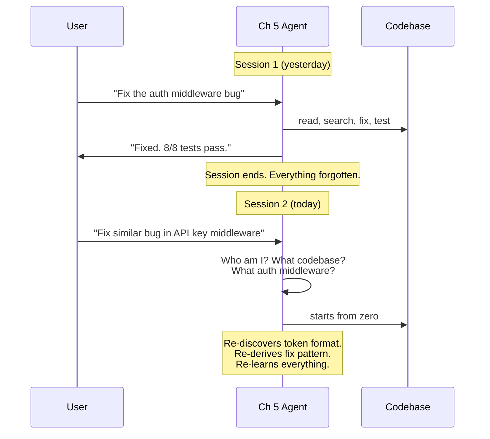
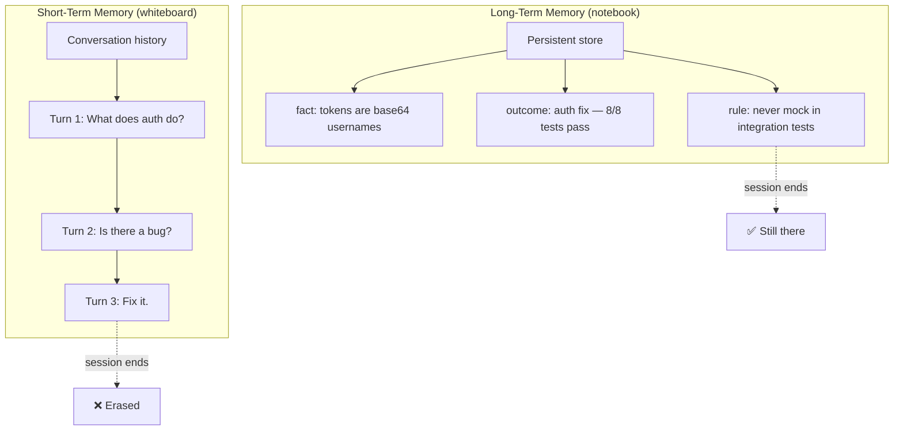
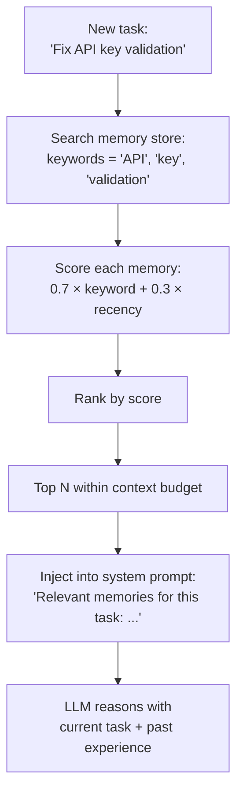
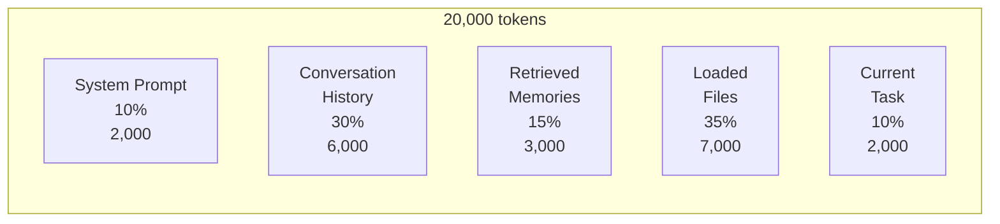
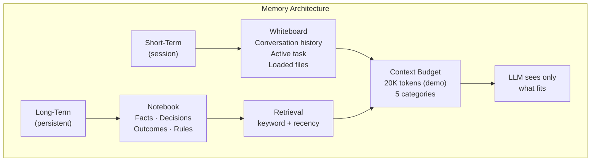
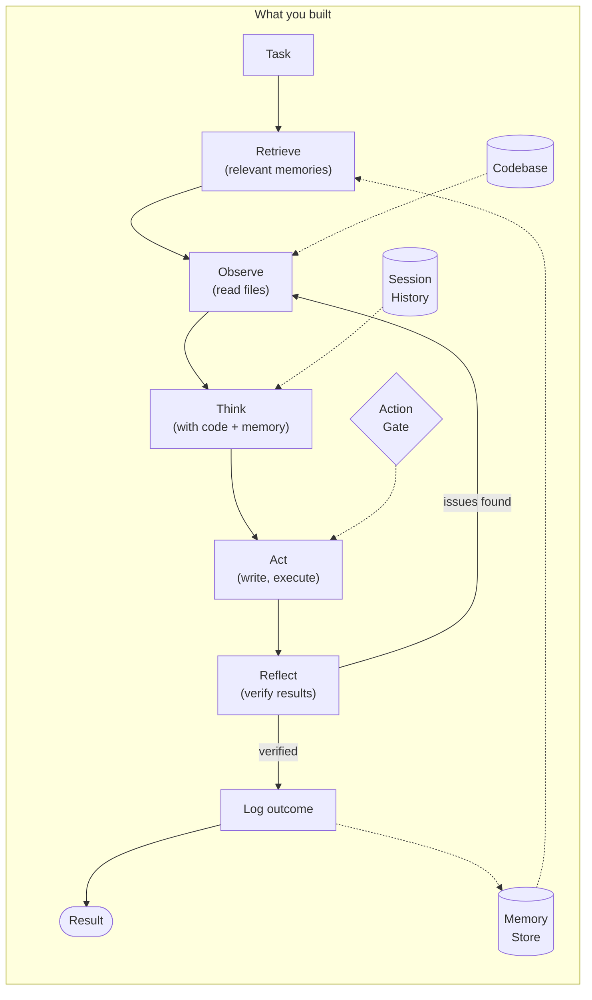

# Chapter 6: Memory & Context

## You Are the Notebook

You're sitting on a desk in a developer's office. You're the notebook — the one with the bent cover and the coffee stain on page 12. Every time the developer fixes a bug, debugs a weird issue, or learns something surprising about the codebase, they jot it down. "Auth tokens are base64-encoded usernames." "The N+1 query in task routes — fixed with batched lookup." "Never use mocks in integration tests — learned that the hard way."

The developer comes in Monday morning. Picks you up. Flips to last Friday's notes. Reads: "Fixed auth middleware — it was accepting any token. Decoded base64, looked up user in DB. Same pattern might apply to the API key middleware."

They don't re-read every file. They don't re-discover the token format. They already know, because you remember.

Now put yourself down. Be the agent again. The Ch 5 agent. The one that fixed the auth middleware bug beautifully — found the file, wrote the fix, wrote the tests, ran them, 8/8 pass.

Close the terminal. Open it again.

```
$ tbh-code --codebase ./todo-api --ask "Fix a similar token validation
  issue in the API key middleware"

Loading codebase from ./todo-api ...
  Registered 6 tools + 3 skills

{
  "answer": "I'll look into the API key middleware for token validation
    issues. Let me search the codebase...",
  "confidence": 0.3,
  "sources": []
}
```

It starts from scratch. No memory of the auth fix. No memory of the approach that worked. No memory of the token format it already figured out. It's going to re-read the auth routes, re-discover that tokens are base64-encoded usernames, and re-derive the fix pattern — all of which it did yesterday.

It's the developer without the notebook. Every Monday is their first day.




tbh, an agent without memory is a contractor who shreds their notes at the end of every shift.

---

## What You'll Learn

You're going to give the agent a notebook. Two kinds, actually — and a budget to keep it from stuffing the entire notebook into every conversation.

- Why conversation history (Ch 2) isn't enough — and what persistent memory adds
- Short-term vs long-term memory: the whiteboard and the notebook
- Session persistence — save state on exit, resume on start
- The `MemoryStore` — facts, decisions, outcomes, and rules that survive across sessions
- Context budgeting — how to divide a finite token window across competing needs
- Retrieval — given a task, which memories matter? Keyword + recency ranking
- Outcome tracking — not just *what* the agent did, but *whether it worked*

---

## Two Kinds of Remembering

You already built one kind of memory in Chapter 2. Conversation history — the list of messages that lets the agent resolve "it" in "Is there a bug in it?" That's **short-term memory**. It lives for the duration of a session. When the terminal closes, it's gone.

Think of it as a whiteboard. You scribble notes during a meeting. They're useful right now. When the next meeting starts, someone erases the board.

What you need is a **notebook**. A place where things persist. Where "I fixed the auth middleware using base64 decoding and DB lookup" survives across sessions. Where "todo-api uses base64-encoded usernames as tokens" is a fact the agent knows tomorrow without re-discovering it.




Short-term memory is what you're thinking about. Long-term memory is what you know. Both matter. The Ch 2 agent had the whiteboard. Now you add the notebook.

---

## Save Where You Left Off

Before long-term memory, there's a simpler problem: the agent can't even resume a session. You're halfway through debugging, you close the terminal, and the conversation — the active task, the files you loaded, the reasoning chain — evaporates.

The fix is straightforward. Save state on exit, restore on start.

```
SessionState:
    session_id: string
    conversation_history: Message[]
    active_task: string | null
    loaded_files: string[]
    tool_calls: ToolCallRecord[]
    timestamp: datetime

Session:
    save_state(session_id, state) -> void
        # Serialize to .tbh-code/sessions/{session_id}.json

    restore_state(session_id) -> SessionState | null
        # Load from disk. Returns null if not found.

    list_sessions() -> SessionSummary[]
        # List all saved sessions: { session_id, active_task, timestamp }
```

The lifecycle:

1. Agent starts. If `--session <id>` provided, restore that session. Otherwise, generate a new session ID.
2. During execution, the session ID appears in output: `[session: f7a2c1]`.
3. On exit, save everything — conversation history, active task, loaded files, tool calls.
4. Print: `Session saved: f7a2c1. Resume with --session f7a2c1`

```
$ tbh-code --codebase ./todo-api --ask "Fix the auth middleware bug"

Loading codebase from ./todo-api ...
  Session: f7a2c1 (new)

[session: f7a2c1]
...
Session saved: f7a2c1. Resume with --session f7a2c1
```

Next day:

```
$ tbh-code --codebase ./todo-api --session f7a2c1

Loading codebase from ./todo-api ...
  Restoring session: f7a2c1
  Session restored: conversation (12 messages), active task: none

[session: f7a2c1] Resumed. Last active: 2025-01-15T14:30:00Z
```

The conversation is back. The agent knows what it was working on. But session persistence only restores the *whiteboard*. The conversation from that session. It doesn't give the agent durable knowledge it can apply to new tasks in new sessions.

That's what the `MemoryStore` does.

---

## Build the Notebook

A memory entry is a single thing the agent knows:

```
MemoryEntry:
    key: string               # unique ID, e.g. "todo-api/auth-fix-outcome"
    content: string           # human-readable memory content
    type: MemoryType          # what kind of memory
    tags: string[]            # searchable tags: ["auth", "bug-fix", "todo-api"]
    timestamp: datetime       # when created
    session_id: string | null # which session created it
```

Four types:

```
MemoryType: enum("fact", "decision", "outcome", "rule")
```


| Type     | What It Stores                         | Example                                               |
| -------- | -------------------------------------- | ----------------------------------------------------- |
| fact     | Something learned about the codebase   | "todo-api uses base64-encoded username as auth token" |
| decision | A choice the agent made and why        | "Chose batched query over lazy loading for N+1 fix"   |
| outcome  | What happened when an action was taken | "Fixed auth middleware — 8/8 tests pass"              |
| rule     | A behavioral constraint                | "Never use mocks in integration tests"                |


Facts are what the agent observed. Decisions are why it chose one path over another. Outcomes are what happened. Rules are constraints — from user feedback, from project conventions, from hard-won experience.

The store itself:

```
MemoryStore:
    storage_path: string      # e.g. ".tbh-code/memory/"

    save(entry: MemoryEntry) -> void
        # Persist to disk. Overwrite if key exists.

    retrieve(key: string) -> MemoryEntry | null
        # Look up by exact key.

    search(query: string, filters: SearchFilters | null, limit: int = 10)
        -> MemoryEntry[]
        # Keyword + recency ranking. The core retrieval function.

    list(type: MemoryType | null) -> MemoryEntry[]
        # List all, optionally filtered by type.
```

Storage is dead simple. One JSON file per entry, organized by type:

```
.tbh-code/
  memory/
    facts/
      todo-api-uses-express.json
    decisions/
      auth-fix-batched-query.json
    outcomes/
      auth-middleware-fix-2025-01-15.json
    rules/
      no-mocks-in-integration.json
```

No database. No embedding index. Files on disk. You can open them, read them, edit them. The agent's memory is as inspectable as the codebase it works on.

Build it. Register it. Now teach the agent to use it.

---

## Remember What Worked

Saving memories is half the job. The other half: knowing which memories matter for the current task.

Given a new task, the agent queries the store:

```
search(query, filters, limit) -> MemoryEntry[]:
    candidates = all_entries()

    if filters:
        candidates = apply_filters(candidates, filters)

    scored = []
    for entry in candidates:
        keyword_score = count_keyword_matches(
            query,
            entry.content + " ".join(entry.tags)
        )
        recency_score = recency_weight(entry.timestamp)  # newer = higher
        scored.append((entry, keyword_score * 0.7 + recency_score * 0.3))

    scored.sort(by=score, descending=true)
    return scored[:limit]
```

Two signals, weighted:

**Keyword match (70%).** The query "Fix token validation in API key middleware" matches memories tagged "token," "validation," "middleware." The auth middleware outcome scores high because its content contains "token," "middleware," and "validation."

**Recency (30%).** Yesterday's outcome ranks higher than last month's. Not because old memories are wrong — because recent context is more likely relevant. The codebase changes. Last month's architecture overview might be stale. Yesterday's fix is probably still accurate.

This is deliberately unsophisticated. No embeddings. No semantic similarity. No vector database. Keywords and timestamps. It works for a local agent with a few dozen memories, and it's transparent — you can read the scores and understand why a memory was retrieved.

### The Retrieval Flow




The agent doesn't dump all memories into context. It searches, scores, ranks, and takes the top results that fit within the memory budget. Which brings us to the next problem.

---

## The Finite Window

Here's the math that changes everything.

Your context window might be 200,000 tokens. Maybe 1M. The ceiling keeps rising. But it doesn't matter how big the window gets — you'll fill it. A system prompt, a dozen conversation turns, some memories, a handful of source files, and the current task. At 200K, that's tight. At 1M, you load more files and longer histories and you're tight again. More context also means more noise, more cost per call, and slower responses. Models perform better with *focused* context than with everything you have.

The meta-point: **the goal isn't to fill the window. It's to budget it.** Optimize for what the agent actually needs, not what the window can hold.

For the rest of this chapter, we'll use a **20,000-token window**. That's small — deliberately small. At 20K, the budget bites immediately. Files get trimmed. Memories compete for space. You'll see the allocator *work*. In production, scale the number to whatever your model supports — 128K, 200K, 1M. The technique doesn't change. The percentages don't change. Only the headroom changes.

You need a budget.

```
ContextBudget:
    total_tokens: int           # max window, e.g. 20000

    DEFAULT_ALLOCATIONS:
        system_prompt:          0.10    # 10%
        conversation_history:   0.30    # 30%
        retrieved_memories:     0.15    # 15%
        loaded_files:           0.35    # 35%
        current_task:           0.10    # 10%

    allocate(items: BudgetItem[]) -> BudgetItem[]
    usage() -> BudgetUsage
```

Five categories. Fixed percentages. Every piece of context competes within its category:

```
20,000 tokens total

  system_prompt:           2,000 tokens (10%)
  conversation_history:    6,000 tokens (30%)
  retrieved_memories:      3,000 tokens (15%)
  loaded_files:            7,000 tokens (35%)
  current_task:            2,000 tokens (10%)
```

When memories need 4,500 tokens but the budget is 3,000, the allocator ranks by relevance and takes the top entries that fit. The rest are dropped. When files exceed their 7,000-token budget, the lowest-priority files get trimmed. The budget enforces limits without crashing.

```
allocate(items):
    selected = []
    remaining = {}
    for category, pct in DEFAULT_ALLOCATIONS:
        remaining[category] = int(total_tokens * pct)

    for item in sorted(items, by=priority, descending=true):
        if remaining[item.category] >= item.token_count:
            selected.append(item)
            remaining[item.category] -= item.token_count

    return selected
```

The algorithm is greedy — highest priority first, fill until budget is exhausted. Not optimal. Not fair. But fast and predictable. You can look at the output and understand why something was included or dropped.




The percentages are defaults. A fresh session with no history shifts budget toward files. A long conversation with no file access shifts toward history. But the defaults work for the common case: an agent resuming a session with some prior context and a handful of relevant files.

---

## See the Notebook in Action

Let's run it. Two sessions, same codebase. Watch the difference.

### Session 1: Fix the auth bug (with memory)

```
$ tbh-code --codebase ./todo-api --ask "Fix the auth middleware bug so it
  properly validates tokens, then run the tests"

Loading codebase from ./todo-api ...
  Registered 6 tools + 3 skills
  Memory store: .tbh-code/memory/ (0 entries)
  Session: f7a2c1 (new)

[session: f7a2c1]

[tool] Agent selected: search_code
[tool] Arguments: { "pattern": "auth_middleware", "path": "src/" }
[tool] Result: success=true

[tool] Agent selected: read_file
[tool] Arguments: { "path": "src/middleware/auth.pseudo" }
[tool] Result: success=true

[tool] Agent selected: write_file
[tool] Arguments: { "path": "src/middleware/auth.pseudo", "content": "<fixed auth middleware>" }
[gate] write operation: Agent wants to write src/middleware/auth.pseudo
[gate] Approved
[tool] Result: success=true

[tool] Agent selected: execute_shell
[tool] Arguments: { "command": "run-tests tests/", "timeout": 30 }
[gate] DANGEROUS operation: Agent wants to execute: run-tests tests/
[gate] Approved
[tool] Result: success=true
  { "stdout": "8 passed, 0 failed", "exit_code": 0 }

[memory] Saving outcome: todo-api/auth-middleware-fix
  {
    "key": "todo-api/auth-middleware-fix",
    "content": "Fixed auth middleware to decode base64 tokens and look up
      users in DB. Previously accepted any non-empty token and hardcoded user.",
    "type": "outcome",
    "tags": ["auth", "bug-fix", "todo-api", "middleware"],
    "timestamp": "2025-01-15T14:30:00Z"
  }
[memory] Saving fact: todo-api/token-format
  {
    "key": "todo-api/token-format",
    "content": "todo-api uses base64-encoded username as auth token.
      Tokens are generated in src/routes/auth.pseudo during login.",
    "type": "fact",
    "tags": ["auth", "token", "todo-api"],
    "timestamp": "2025-01-15T14:30:00Z"
  }
[memory] Outcome metrics: { "tests_before": "4 pass, 1 fail",
  "tests_after": "8 pass, 0 fail", "files_modified": 2 }

{
  "answer": "Fixed the auth middleware bug. The middleware now decodes base64
    tokens, looks up users in the database, and rejects invalid tokens.
    All 8 tests pass.",
  "confidence": 0.95,
  "sources": ["src/middleware/auth.pseudo", "tests/middleware_test.pseudo"]
}

Session saved: f7a2c1. Resume with --session f7a2c1
```

Two new things happened at the end. The agent saved an *outcome* — what it did, what happened, structured metrics. And it saved a *fact* — the token format it discovered along the way. Both persist to disk.

### Session 2: A similar bug, next day

```
$ tbh-code --codebase ./todo-api --session f7a2c1

Loading codebase from ./todo-api ...
  Registered 6 tools + 3 skills
  Memory store: .tbh-code/memory/ (2 entries)
  Restoring session: f7a2c1
  Session restored: conversation (12 messages), active task: none

[session: f7a2c1] Resumed. Last active: 2025-01-15T14:30:00Z

> Fix a similar token validation issue in the API key middleware

[memory] Searching for relevant memories: "token validation middleware"
[memory] Retrieved 2 entries:
  1. [outcome] todo-api/auth-middleware-fix (score: 0.92)
     "Fixed auth middleware to decode base64 tokens and look up users in DB"
  2. [fact] todo-api/token-format (score: 0.78)
     "todo-api uses base64-encoded username as auth token"

[context] Budget allocation:
  system_prompt:        1,800 / 2,000 tokens
  conversation_history: 2,400 / 6,000 tokens (12 messages from prior session)
  retrieved_memories:     600 / 3,000 tokens (2 entries)
  loaded_files:             0 / 7,000 tokens
  current_task:           350 / 2,000 tokens
  TOTAL:                5,150 / 20,000 tokens

[tool] Agent selected: search_code
[tool] Arguments: { "pattern": "api_key", "path": "src/" }
[tool] Result: success=true

[tool] Agent selected: read_file
[tool] Arguments: { "path": "src/middleware/api_key.pseudo" }
[tool] Result: success=true

{
  "answer": "I found the API key middleware in src/middleware/api_key.pseudo.
    It has the same pattern as the auth middleware bug I fixed previously —
    it accepts any non-empty API key without validation. Based on my prior
    fix, the approach is: 1) decode/parse the API key, 2) validate against
    stored keys in the database, 3) reject invalid keys with 401.
    Want me to write the fix?",
  "confidence": 0.9,
  "sources": [
    "src/middleware/api_key.pseudo",
    "memory:todo-api/auth-middleware-fix"
  ]
}
```

Read that response. "The same pattern as the auth middleware bug I fixed previously." "Based on my prior fix." The agent didn't re-derive the approach. It remembered. The outcome from Session 1 — stored as a memory entry, retrieved by keyword match — gave it a head start.

Look at the sources. `memory:todo-api/auth-middleware-fix` — the agent cited a memory alongside a file reference. It's telling you where its knowledge comes from. Verifiable, just like file citations.

And look at the context budget. 5,150 tokens used out of 20,000. The memories added 600 tokens. The conversation history from the restored session added 2,400. Everything fits — for now. But notice: the system prompt alone ate 90% of its 2,000-token slot. Add a few more tool schemas and it overflows. At 20K, every category is one bad day from full.

---

## When the Budget Gets Tight

At 20K, "tight" isn't hypothetical. It's the default.

```
$ tbh-code --codebase ./todo-api --ask "Read every file in the codebase
  and summarize the architecture"

Loading codebase from ./todo-api ...
  Memory store: .tbh-code/memory/ (4 entries)
  Session: c8f1a0 (new)

[tool] Agent selected: list_files
[tool] Arguments: { "path": ".", "recursive": true }
[tool] Result: success=true (14 files)

[context] Loading files by priority:
  src/main.pseudo          →    480 tokens  ✓ loaded (entry point)
  src/routes/tasks.pseudo  →  1,120 tokens  ✓ loaded
  src/routes/auth.pseudo   →    760 tokens  ✓ loaded
  src/middleware/auth.pseudo →   560 tokens  ✓ loaded
  src/models/task.pseudo   →    440 tokens  ✓ loaded
  src/models/user.pseudo   →    320 tokens  ✓ loaded
  src/db.pseudo            →    880 tokens  ✓ loaded
  tests/tasks_test.pseudo  →  1,240 tokens  ✓ loaded
  tests/auth_test.pseudo   →    960 tokens  ✓ loaded
  ... remaining 5 files    →  2,640 tokens  ✓ loaded
  TOTAL files loaded: 14    →  9,400 tokens

[context] WARNING: loaded_files (9,400) exceeds budget (7,000)
[context] Trimming lowest-priority files:
  DROPPED: tests/middleware_test.pseudo (920 tokens, lowest priority)
  DROPPED: tests/auth_test.pseudo (960 tokens, lowest priority)
  DROPPED: config.pseudo (320 tokens, lowest priority)
  DROPPED: README.pseudo (240 tokens, lowest priority)
  Adjusted: 6,960 tokens ✓ within budget

[context] Final allocation:
  system_prompt:         1,800 / 2,000  (90.0%)
  conversation_history:      0 / 6,000  (0.0%)
  retrieved_memories:      400 / 3,000  (13.3%)
  loaded_files:          6,960 / 7,000  (99.4%)  ← nearly full
  current_task:            200 / 2,000  (10.0%)
  TOTAL:                 9,360 / 20,000 (46.8%)

{
  "answer": "Here's the architecture of todo-api:
    Entry point: src/main.pseudo — sets up the Express-style app.
    Routes: tasks.pseudo (CRUD), auth.pseudo (register/login).
    Middleware: auth.pseudo — validates auth tokens.
    Models: task.pseudo, user.pseudo.
    Database: db.pseudo — in-memory store.
    Note: I loaded 10 of 14 files within context budget.
    Four files were trimmed to stay within limits — two test files,
    a config file, and the README.",
  "confidence": 0.75,
  "sources": ["src/main.pseudo", "src/routes/tasks.pseudo",
    "src/routes/auth.pseudo", "src/db.pseudo"]
}
```

14 files. Only 10 fit. The budget dropped four — two test files, a config, and a README — and the agent told you about it. Confidence dropped to 0.75 because it knows it's working with an incomplete picture. No crash. No silent truncation. Transparent limits.

This is what "context management" actually means. Not "load everything and hope." Not "summarize aggressively and lose detail." Just: here's the budget, here's what fits, here's what got dropped, here's why. At 20K the constraint is obvious. At 200K the same thing happens — just with bigger files and more of them.

---

## Track Whether It Worked

Storing what the agent *did* is useful. Storing whether it *worked* is transformative.

Every completed task gets an `OutcomeEntry`:

```
OutcomeEntry:
    task: string              # what the agent was trying to do
    action: string            # what it actually did
    result: string            # success or failure description
    metrics: dict             # measurable results
    diagnosis: string         # why it worked or didn't
    timestamp: datetime
```

This gets saved as a `MemoryEntry` with `type: "outcome"`. Here's a real one:

```
[memory] Saving outcome: todo-api/input-validation-post-tasks
  {
    "key": "todo-api/input-validation-post-tasks",
    "type": "outcome",
    "content": "Added input validation to POST /tasks: title must be
      non-empty string under 200 characters.",
    "tags": ["validation", "tasks", "todo-api", "input-validation"]
  }
[memory] Outcome metrics:
  {
    "task": "Add input validation to POST /tasks",
    "action": "Added title length check (1-200 chars) with 400 response",
    "result": "success",
    "metrics": {
      "tests_before": "8 pass, 0 fail",
      "tests_after": "9 pass, 0 fail",
      "files_modified": 1,
      "lines_changed": 12
    },
    "diagnosis": "Straightforward validation. Added guard clause at top
      of POST handler. One new test added. All existing tests still pass."
  }
```

Not just "it worked." *How* it worked — before/after test counts, files modified, lines changed. And *why* it worked — the diagnosis. "Straightforward validation. Guard clause."

This matters for two reasons.

**Right now:** retrieval. When a future task involves validation, the agent retrieves this outcome and knows the pattern that worked — guard clause at the top of the handler.

**In Chapter 9:** self-improvement. The agent will read its own outcomes, find patterns in what fails, and rewrite its own approach. But it can only do that if the raw data exists. Outcome tracking is the foundation. Chapter 9 is the building you put on it.

Outcomes are logged when:

1. A task completes — success or failure
2. A skill finishes executing
3. The user confirms or rejects output

Intermediate steps don't get outcomes. The agent doesn't log "read a file" or "searched for code." It logs "fixed the auth bug — here's what happened."

---

## The System Prompt Gets a Memory Section

The agent's system prompt from Ch 5 stays. Add one section:

```
You have access to long-term memory from previous sessions.

Relevant memories for this task:
{retrieved_memories}

Rules (always follow these):
{rules}

When you complete a task, log the outcome:
- What you tried
- Whether it worked
- Key metrics
- Brief diagnosis
```

`{retrieved_memories}` gets filled by the retrieval step — the top-scoring memories for the current task. `{rules}` gets filled with all entries of `type: "rule"` — rules always load, regardless of relevance score. A rule like "never use mocks in integration tests" applies to every task that involves tests.

The rest of the system prompt is unchanged. Identity, capabilities, constraints, output format. Memory is additive.

---

## Now Name What You Built

You added four things. Let's put names on them.

**Session persistence** saves and restores the whiteboard. The conversation history, the active task, the loaded files — they survive a restart. This is short-term memory made durable.

**The MemoryStore** is the notebook. Facts, decisions, outcomes, rules — organized by type, searchable by keyword and tag, ranked by relevance and recency. This is long-term memory.

**The ContextBudget** is the constraint that makes it all work. A finite window divided into five categories. Each category gets a percentage. Items compete within their category by priority. What fits, stays. What doesn't, gets dropped — transparently.

**Outcome tracking** is what makes memory useful for learning. Not just "what happened" but "did it work" and "why." Structured metrics. Diagnosis. The raw material that Chapter 9 turns into self-improvement.




Together: the agent starts a session, restores the whiteboard (if resuming), queries the notebook for relevant memories, packs everything into the context budget, and reasons with both current data and past experience.

---

## The Spec

Full spec for this chapter in `../spec/ch06/`:

```
../spec/ch06/
├── prompt-template.md     What to build (language-agnostic)
├── interface-spec.md      MemoryStore, Session, ContextBudget,
│                          OutcomeEntry contracts
├── expected-output.txt    Session persistence, retrieval, budget math,
│                          outcome tracking across sessions
└── validation/
    └── test_ch06.py       Tests: memory save/search, session restore,
                           budget limits, outcome structure
```

---

## Try It

1. **Cross-session recall.** Fix the auth bug in Session 1. Start a fresh Session 2 (no `--session` flag — brand new). Ask: "What do you know about how this codebase handles authentication?" Does the agent answer from memory without reading files?
2. **Memory search.** After a few tasks, run `tbh-code --list-sessions` and manually inspect `.tbh-code/memory/outcomes/`. Are the entries structured? Do the tags make sense? Could a human read them?
3. **Budget pressure.** Point the agent at a larger codebase — 50+ files. Ask it to summarize the architecture. Watch the context budget trim files. Which files get dropped? Does the priority ranking make sense?
4. **Rule enforcement.** Manually create a rule: save a `MemoryEntry` with `type: "rule"` and content "Always write tests before writing the fix — TDD style." Give the agent a bug fix task. Does it write the test first?
5. **Outcome failure.** Give the agent a task that fails — ask it to fix a bug that doesn't exist, or write a test that can't pass. Does the outcome entry capture the failure? Is the diagnosis useful?

---

## Three Ways to Corrupt Your Memory

### The Hoarder

Save everything. Every tool call, every intermediate thought, every file read. The memory store balloons to 500 entries in a week. Retrieval returns noise. The agent wastes context budget on memories like "read src/main.pseudo — success" instead of actual insights.

**Why it happens:** Logging feels safe. More data seems better. You don't want to miss anything.

**Fix:** Log outcomes, not steps. The agent doesn't need to remember that it read a file. It needs to remember that the fix worked and why. One outcome entry per completed task. Facts and rules are rare — a few per session, not dozens.

### The Amnesiac Budget

Context budget set to 100% for loaded files. Zero for memories. Zero for conversation history. The agent has a notebook full of useful knowledge and never opens it.

**Why it happens:** Files feel more important. "The code is the truth." Memories feel optional.

**Fix:** The defaults are 15% for memories and 30% for history. They're there for a reason. A memory that says "this approach worked last time" is worth more than a low-priority test file. The budget categories exist to prevent any one type of context from crowding out the others.

### The Stale Notebook

Memories from six months ago still rank high. The codebase has been refactored twice. The agent retrieves "todo-api uses Express-style routing" — but the project moved to a different framework.

**Why it happens:** Keyword match doesn't know about refactors. "Express" still matches "Express" even if the codebase no longer uses it.

**Fix:** The recency weight (30% of the score) helps but doesn't solve this fully. For now: the agent should treat old memories as hints, not facts. Verify against the current codebase. In a more sophisticated system, you'd add memory expiration or confidence decay. For now, recency weighting and human oversight are enough.

---

## Memory Without a Map

Your agent remembers. It resumes sessions. It retrieves relevant experience. It tracks what worked and what didn't. It manages a finite context window without crashing or silently losing information.

That's real progress. The agent that fixed the auth bug yesterday knows it fixed the auth bug today. It applies the same approach to similar problems. It cites its memories alongside its file references.

But watch what happens when you give it something complex:

```
$ tbh-code --codebase ./todo-api --ask "Refactor the task routes to
  support pagination, filtering by status, and sorting by date"

[memory] Retrieved: todo-api/input-validation-post-tasks (score: 0.61)

{
  "answer": "I'll add pagination, filtering, and sorting to the task
    routes. Let me start by reading the current implementation..."
}
```

It dives straight in. No plan. No decomposition. Three requirements — pagination, filtering, sorting — and the agent treats them as one blob. It starts writing code, hits a conflict between pagination and filtering, backtracks, writes more code, realizes sorting interacts with both, and ends up with a tangled diff that's hard to review and harder to test.

A developer with a notebook would do something different. They'd write a plan first:

1. Add pagination (limit/offset params)
2. Add status filter (WHERE clause)
3. Add date sorting (ORDER BY)
4. Wire them together
5. Test each one

The agent has memory but no planning. It remembers the past but doesn't think about the future. Chapter 7 gives it both — task decomposition, step-by-step execution, and the ability to backtrack when a step fails. The agent stops charging in and starts thinking ahead.

---

> **tbh-code after this chapter:**




> An agent with persistent memory across sessions. The `MemoryStore` holds facts, decisions, outcomes, and rules — retrieved by keyword + recency, packed into a `ContextBudget` that respects the finite context window. Sessions save and restore. Outcomes track not just what happened, but whether it worked and why. The agent that fixed the auth bug yesterday remembers it today. What it can't do: plan ahead. It dives into complex tasks without decomposing them, and tangles itself in conflicting changes.

---

## References

### Memory Architecture

1. **"MemGPT: Towards LLMs as Operating Systems"** — Packer, Wooders, Lin et al. (2023). OS-inspired virtual context management with hierarchical memory tiers — the most directly relevant paper for MemoryStore and context budget. [arxiv.org/abs/2310.08560](https://arxiv.org/abs/2310.08560)

2. **"Generative Agents: Interactive Simulacra of Human Behavior"** — Park, O'Brien, Cai et al., UIST 2023. Memory stream architecture with recency/relevance/importance scoring for retrieval, plus reflection as higher-order memory synthesis. [arxiv.org/abs/2304.03442](https://arxiv.org/abs/2304.03442)

3. **"Cognitive Architectures for Language Agents" (CoALA)** — Sumers, Yao, Narasimhan, Griffiths (2023). Unified framework organizing agent memory into working memory and long-term memory (episodic, semantic, procedural). [arxiv.org/abs/2309.02427](https://arxiv.org/abs/2309.02427)

4. **"A-MEM: Agentic Memory for LLM Agents"** — Xu, Liang, Mei et al., NeurIPS 2025. Self-organizing memory using Zettelkasten-style interconnected notes with dynamic indexing. [arxiv.org/abs/2502.12110](https://arxiv.org/abs/2502.12110)

### Retrieval & Context

5. **"Retrieval-Augmented Generation for Knowledge-Intensive NLP Tasks"** — Lewis et al., NeurIPS 2020. The original RAG paper — foundational for the retrieval mechanism that finds relevant memories. [arxiv.org/abs/2005.11401](https://arxiv.org/abs/2005.11401)

6. **"Lost in the Middle: How Language Models Use Long Contexts"** — Liu, Lin, Hewitt et al., Stanford/Meta (2023). LLMs degrade when relevant information is in the middle — motivates careful context budget allocation. [arxiv.org/abs/2307.03172](https://arxiv.org/abs/2307.03172)

7. **"Reflexion: Language Agents with Verbal Reinforcement Learning"** — Shinn, Cassano et al., NeurIPS 2023. Agents maintain episodic memory of verbal reflections on past failures — directly relevant to outcome tracking. [arxiv.org/abs/2303.11366](https://arxiv.org/abs/2303.11366)

### Surveys

8. **"A Survey on the Memory Mechanism of Large Language Model-based Agents"** — ACM TOIS (2025). Comprehensive survey covering short-term, long-term, episodic, semantic, and procedural memory. [dl.acm.org/doi/10.1145/3748302](https://dl.acm.org/doi/10.1145/3748302)

9. **"Memory in the Age of AI Agents: A Survey"** — Liu et al. (2024). Taxonomy of factual, experiential, and working memory with benchmarks and frameworks. [arxiv.org/abs/2512.13564](https://arxiv.org/abs/2512.13564)

10. **"Mem0: Building Production-Ready AI Agents with Scalable Long-Term Memory"** — Mem0 team (2025). 90% token reduction vs full history replay — directly relevant to context budget optimization. [arxiv.org/abs/2504.19413](https://arxiv.org/abs/2504.19413)

### Engineering

11. **"Building Effective Agents"** — Anthropic (2024). Augmented LLM building block and the patterns the book uses throughout. [anthropic.com/research/building-effective-agents](https://www.anthropic.com/research/building-effective-agents)

12. **"Agent Memory: How to Build Agents that Learn and Remember"** — Letta (2024). Core/recall/archival memory, summarization-based eviction, and context engineering for stateful agents. [letta.com/blog/agent-memory](https://www.letta.com/blog/agent-memory)

13. **"Context Engineering for Agents"** — LangChain (2025). Four strategies (write, select, compress, isolate) mapping to context budget allocation. [blog.langchain.com/context-engineering-for-agents](https://blog.langchain.com/context-engineering-for-agents/)

14. **"Memory for Agents"** — LangChain (2024). Short-term vs long-term memory with semantic/episodic/procedural types. [blog.langchain.com/memory-for-agents](https://blog.langchain.com/memory-for-agents/)

15. **"Cutting Through the Noise: Smarter Context Management for LLM-Powered Agents"** — JetBrains Research, NeurIPS 2025 Workshop. Simple observation masking matches LLM-based summarization at ~50% cost. [blog.jetbrains.com/research/2025/12/efficient-context-management](https://blog.jetbrains.com/research/2025/12/efficient-context-management/)

16. **"Context Engineering"** — Simon Willison (2025). Popularized "context engineering" as successor to "prompt engineering." [simonwillison.net/2025/jun/27/context-engineering](https://simonwillison.net/2025/jun/27/context-engineering/)

17. **"Memory and New Controls for ChatGPT"** — OpenAI (2024). Production implementation of cross-session memory. [openai.com/index/memory-and-new-controls-for-chatgpt](https://openai.com/index/memory-and-new-controls-for-chatgpt/)

