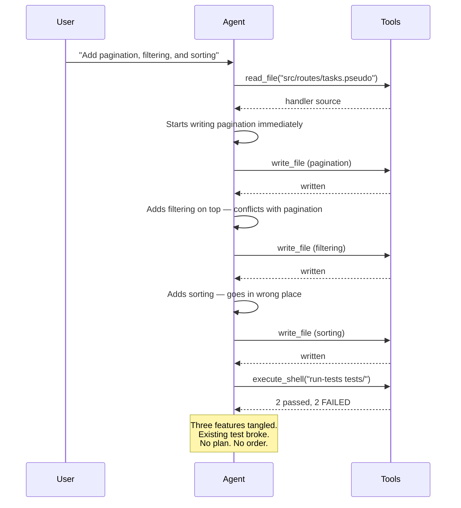
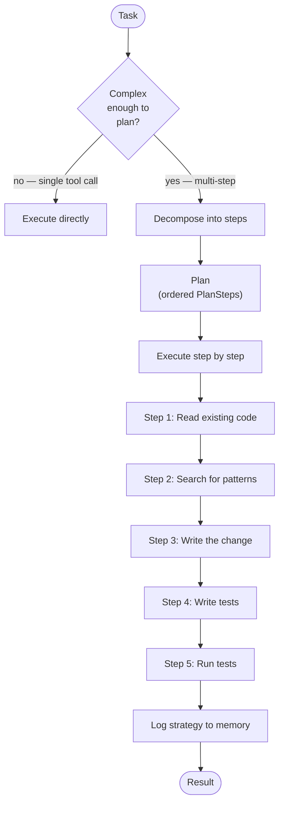
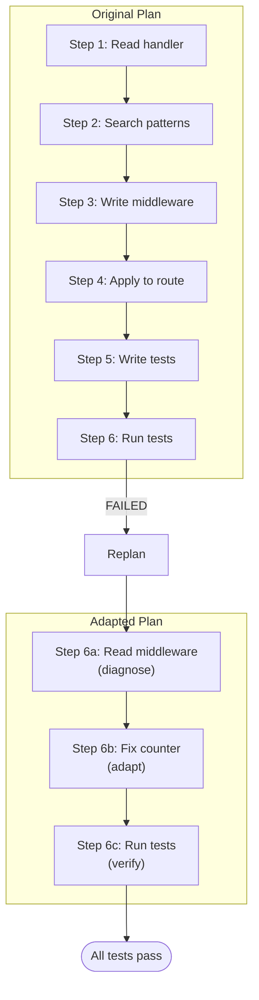
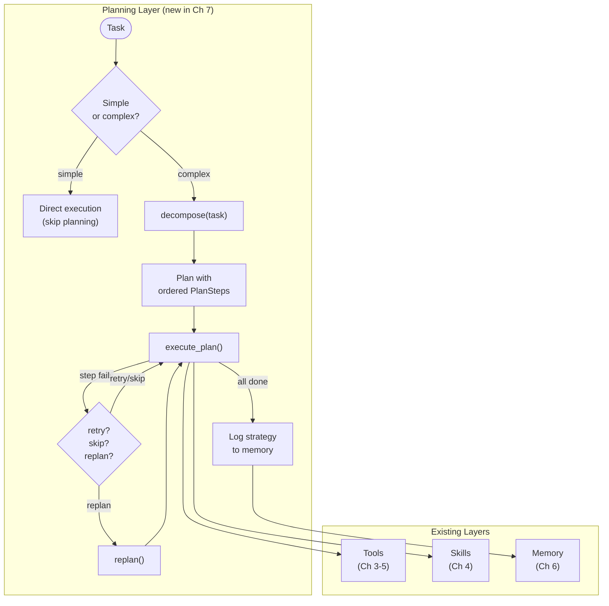
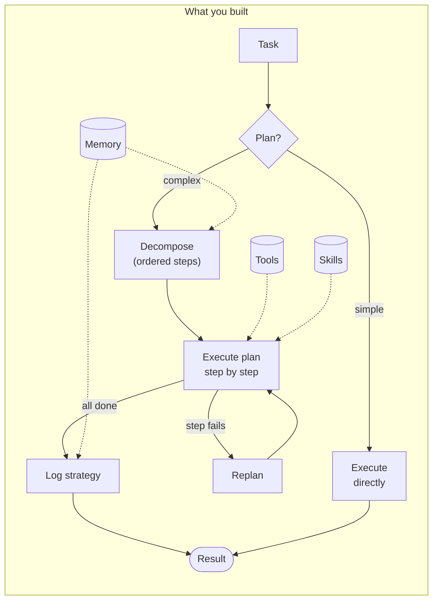

# Chapter 7: Planning & Reasoning

## You Are the Agent (Again)

You're the Ch 6 agent. Six tools, three skills, memory across sessions, a context budget that keeps you from drowning. You remember the auth middleware fix from yesterday. You know the token format without re-discovering it. You cite memories alongside file references.

Someone hands you a task:

*"Refactor the task routes to support pagination, filtering by status, and sorting by date."*

Three requirements in one sentence. You've got the tools. You've got memory — you even retrieve a prior outcome about the task routes. So you start.

```
$ tbh-code --codebase ./todo-api --session f7a2c1 --ask "Refactor the task
  routes to support pagination, filtering by status, and sorting by date"

Loading codebase from ./todo-api ...
  Registered 6 tools + 3 skills
  Memory store: .tbh-code/memory/ (4 entries)
  Restoring session: f7a2c1

[memory] Retrieved: todo-api/input-validation-post-tasks (score: 0.61)

[context] Budget allocation:
  system_prompt:        1,800 / 2,000 tokens
  conversation_history: 2,400 / 6,000 tokens
  retrieved_memories:     300 / 3,000 tokens (1 entry)
  loaded_files:             0 / 7,000 tokens
  current_task:           280 / 2,000 tokens
  TOTAL:                4,780 / 20,000 tokens
```

Memory works. Budget works. The agent reads the route file and starts writing — pagination first. Adds `limit` and `offset` params to the GET handler. Writes it. Moves on to filtering. Adds a `status` query param. But wait — filtering changes the query, and pagination wraps the query. The offset calculation depends on whether a filter is active. The agent didn't think about that. It writes filtering on top of pagination and the two interact badly.

Sorting. The agent adds an `ORDER BY` clause. But sorting has to happen *before* pagination (you sort first, then take a page), and the agent already wrote pagination first. The sort goes in the wrong place. The query returns the right number of results in the wrong order.

Run the tests.

```
[tool] Agent selected: execute_shell
[tool] Arguments: { "command": "run-tests tests/", "timeout": 30 }
[tool] Result: success=false
  {
    "stdout": "Running tests...\n  PASS  test_create_task\n  FAIL  test_get_tasks\n    Error: expected 3 tasks, got 2\n  FAIL  test_get_tasks_paginated\n    Error: expected tasks sorted by date, got unsorted\n  PASS  test_register_user\n\n2 passed, 2 failed",
    "exit_code": 1
  }
```

Two failures. The existing `test_get_tasks` broke — the pagination wrapper changed the default response. The new pagination test fails because sorting was bolted on after the fact. The agent wrote three features as one blob and they stepped on each other.



The agent has every tool it needs. It has memory. It has a context budget. What it doesn't have is a *sequence*. It treated three interdependent requirements as one task and wrote them in whatever order came to mind. Pagination before sorting. Filtering jammed in between. No consideration of how the pieces interact, which should come first, or what existing tests might break.

This isn't a tool problem. It isn't a memory problem. It's a *sequencing* problem. The agent doesn't think about the order of operations before it starts operating.

tbh, ready-fire-aim is not a strategy.

---

## What You'll Learn

You're going to teach the agent to think before it acts. Decompose a complex task into ordered steps, execute them in sequence, and adapt the plan when things go wrong.

- Task decomposition — big task to ordered subtasks
- Plan-then-execute — generate the plan first, run it second
- Chain-of-thought — explain reasoning before every step
- Failure handling — retry, skip, or replan when a step fails
- Strategy tracking — record what worked for future reference
- Complexity detection — simple tasks skip planning entirely

---

## Think First, Then Act

The fix is a phase between "I got the task" and "I'm using tools." A planning phase. Before the agent touches a file, it decomposes the task into ordered steps.



The agent now does what you do when someone assigns you a complex task. You don't start typing immediately. You think: *What files do I need to read? What's already there? What do I need to change? How do I verify it worked?* Then you execute.

### The Plan

```
Plan:
    goal: string                    # the original task
    steps: PlanStep[]               # ordered list of steps
    status: PlanStatus              # "pending", "in_progress", "completed", "failed", "replanned"
    created_at: datetime
    completed_at: datetime | null

PlanStep:
    id: int                         # step number (1-indexed)
    description: string             # human-readable: what this step does
    tool_or_skill: string           # which tool or skill to use
    args: dict                      # arguments (may reference prior step results)
    depends_on: int[]               # step IDs that must complete first
    status: StepStatus              # "pending", "running", "completed", "failed", "skipped"
    result: ToolResult | null       # result after execution
    reasoning: string               # chain-of-thought: WHY this step is needed
```

Every step has a `reasoning` field. Not "what" it does — that's the `description`. The `reasoning` is *why*. "I need to read the current handler first to understand the existing code structure before I make changes." That's chain-of-thought made explicit. The agent explains its logic before every action, in the output where you can see it.

Steps declare dependencies. Step 3 depends on steps 1 and 2. The executor checks that dependencies are satisfied before running each step. For now, dependencies are linear — step N depends on step N-1. The interface supports DAGs for future use, but don't over-engineer it.

### Result References

Steps can reference results from prior steps:

```
# Step 3 uses the file found in step 1
step_3.args = {
    "path": "$step_1.result.output[0].file"
}
```

The executor resolves `$step_N.result.*` references before running each step. Step 1 searches for a file, step 3 writes to the file that step 1 found. Data flows forward.

---

## Decompose

Given a complex task, the agent produces a plan. This is an LLM call — you're asking the model to think about the task structure before acting on it.

```
decompose(task: string, context: AgentContext) -> Plan

    prompt = """
    Decompose this task into ordered steps.
    For each step, specify:
    - What to do (description)
    - Which tool or skill to use
    - What arguments to pass
    - What this step depends on
    - Why this step is needed (reasoning)

    Available tools: {tool_schemas}
    Available skills: {skill_schemas}
    Relevant past strategies: {strategy_memories}

    Task: {task}
    """

    plan = llm.generate(prompt, response_format=Plan)
    plan.status = "pending"
    return plan
```

The prompt includes available tools and skills — the agent can only plan with what it has. It also includes past strategies from memory. The first time the agent decomposes an "add validation" task, it has no history. The second time, it remembers what worked.

### Decomposition Rules

1. Each step should be accomplishable with a single tool or skill call
2. Steps are ordered by dependency — read before write, write before test
3. A plan has at minimum 2 steps (otherwise skip planning)
4. Every step must include reasoning

---

## Execute the Plan

Step by step. In order. Results flow forward.

```
execute_plan(plan: Plan, agent: Agent) -> PlanResult

    plan.status = "in_progress"

    for step in plan.steps:
        # Check dependencies
        for dep_id in step.depends_on:
            dep_step = plan.steps[dep_id - 1]
            if dep_step.status not in ("completed", "skipped"):
                step.status = "failed"
                step.result = ToolResult(
                    output=null, success=false,
                    error="Dependency step {dep_id} not completed"
                )
                break

        # Show the reasoning — chain-of-thought is visible
        print("[think] Step {step.id}: {step.reasoning}")

        # Resolve result references from prior steps
        resolved_args = resolve_references(step.args, plan.steps)

        # Execute
        step.status = "running"
        tool_or_skill = agent.registry.find(step.tool_or_skill)
        step.result = tool_or_skill.execute(resolved_args)

        if step.result.success:
            step.status = "completed"
        else:
            step.status = "failed"
            decision = handle_failure(plan, step)
            # ... retry, skip, or replan
```

Notice the `[think]` trace. Before every tool call, the agent's reasoning is printed to the terminal. You can see *why* the agent is about to do what it's about to do. Not just "read_file" — but "I need to read the current handler first to understand the existing code structure before I make changes."

This is chain-of-thought as a feature, not an internal monologue. The user sees the reasoning. Trust comes from transparency.

---

## Watch It Plan

Let's start with a cleaner task to see the mechanics. The pagination refactor has three interacting requirements — we'll come back to tasks like that. First, a single-feature change where the difference between "dive in" and "plan first" is stark:

*"Add input validation to POST /tasks — title must be non-empty and under 200 chars."*

Same agent. Same tools. But now it thinks first.

```
$ tbh-code --codebase ./todo-api --auto-approve --ask "Add input validation
  to POST /tasks — title must be non-empty and under 200 chars"

Loading codebase from ./todo-api ...
  Registered 6 tools + 3 skills
  Memory store: .tbh-code/memory/ (3 entries)
  Session: a1b2c3 (new)
```

The agent doesn't jump to `write_file`. It decomposes first:

```
[plan] Decomposing task: "Add input validation to POST /tasks — title must
       be non-empty and under 200 chars"

[memory] Searching for relevant strategies: "add validation"
[memory] Retrieved 0 strategy entries (first time for this task type)

[plan] Generated plan (5 steps):
  Step 1: Read the current POST /tasks handler          [read_file]
  Step 2: Search for existing validation patterns        [search_code]
  Step 3: Write updated handler with title validation    [write_file]
  Step 4: Write test for title validation                [write_file]
  Step 5: Run test suite to verify                       [execute_shell]

[plan] Executing...
```

Five steps. Ordered. Read before write. Write before test. Now execution:

```
--- Step 1/5 ---
[think] Step 1: I need to read the current POST /tasks handler to understand
        the existing code structure before I make changes. Can't write a fix
        without knowing what I'm fixing.
[tool] Agent selected: read_file
[tool] Arguments: { "path": "src/routes/tasks.pseudo" }
[tool] Result: success=true
[plan] Step 1 completed: Read the current POST /tasks handler
```

```
--- Step 2/5 ---
[think] Step 2: Before writing validation, I should check if there are existing
        validation patterns in the codebase I should follow for consistency.
[tool] Agent selected: search_code
[tool] Arguments: { "pattern": "validate\\|validation\\|required", "path": "src/" }
[tool] Result: success=true
  [
    { "file": "src/routes/auth.pseudo", "line": 12,
      "content": "if not username or not password:" }
  ]
[plan] Step 2 completed: Search for existing validation patterns
```

Step 2 is the difference. The agent that dove in skipped this. The planning agent checks for existing patterns — and finds one. The auth route already validates required fields with guard clauses. Now the validation code will match the existing style.

```
--- Step 3/5 ---
[think] Step 3: Now I know the existing handler structure and the validation
        pattern used in auth routes. I'll add a guard clause at the top of
        the POST handler, matching the style in auth routes.
[tool] Agent selected: write_file
[tool] Arguments: {
  "path": "src/routes/tasks.pseudo",
  "content": "<updated with validation: guard clause checking title
              is non-empty string under 200 chars, returns 400>"
}
[gate] Approved (auto-approve)
[tool] Result: success=true
  { "written": true, "path": "src/routes/tasks.pseudo", "bytes": 1847 }
[plan] Step 3 completed: Write updated handler with title validation
```

```
--- Step 4/5 ---
[think] Step 4: I need to verify my validation works. I'll write tests for
        three cases: empty title (should fail), title over 200 chars (should
        fail), and valid title (should succeed).
[tool] Agent selected: write_file
[tool] Arguments: {
  "path": "tests/validation_test.pseudo",
  "content": "<test file with test_rejects_empty_title,
              test_rejects_long_title, test_accepts_valid_title>"
}
[gate] Approved (auto-approve)
[tool] Result: success=true
  { "written": true, "path": "tests/validation_test.pseudo", "bytes": 934 }
[plan] Step 4 completed: Write test for title validation
```

```
--- Step 5/5 ---
[think] Step 5: Run the full test suite to make sure my changes don't break
        existing functionality and the new validation tests pass.
[tool] Agent selected: execute_shell
[tool] Arguments: { "command": "run-tests tests/", "timeout": 30 }
[gate] Approved (auto-approve)
[tool] Result: success=true
  {
    "stdout": "Running tests...\n  PASS  test_create_task\n  PASS  test_get_tasks\n  PASS  test_register_user\n  PASS  test_login_user\n  PASS  test_rejects_empty_title\n  PASS  test_rejects_long_title\n  PASS  test_accepts_valid_title\n\n7 passed, 0 failed",
    "exit_code": 0
  }
[plan] Step 5 completed: Run test suite to verify

[plan] Plan completed: 5/5 steps succeeded
```

Seven tests. Seven passes. Zero broken. The existing `test_get_tasks` that broke in the opening? Still passing. Because the agent read the handler first, understood the structure, matched existing patterns, *then* wrote the change.

```
[memory] Saving strategy: add-feature/input-validation
  {
    "task_type": "add-feature",
    "strategy_used": "read-existing -> search-patterns -> write-code -> write-tests -> run-tests",
    "steps_count": 5,
    "steps_completed": 5,
    "outcome": "success",
    "replanned": false
  }

{
  "answer": "Added input validation to POST /tasks.\n\nChanges:\n1. src/routes/tasks.pseudo — Added guard clause: title must be non-empty string under 200 characters. Returns 400 with descriptive error.\n2. tests/validation_test.pseudo — Added 3 test cases:\n   - test_rejects_empty_title (400 response)\n   - test_rejects_long_title (400 response)\n   - test_accepts_valid_title (201 response)\n\nAll 7 tests pass (4 existing + 3 new).",
  "confidence": 0.95,
  "sources": ["src/routes/tasks.pseudo", "tests/validation_test.pseudo"]
}
```

Compare the two approaches — the pagination disaster from the opening and the validation success here:

|          | Dive In (pagination) | Plan First (validation) |
|----------|---------------------|------------------------|
| Steps    | Improvised, tangled | 5 ordered steps |
| Read first? | Glanced at the file | Read handler + searched for patterns |
| Dependencies? | Ignored — features stepped on each other | Considered — read before write, write before test |
| Style match? | No — wrote from scratch | Yes — matched auth route guard clauses |
| Existing tests | 2 FAILED | All pass |
| Result | Tangled diff, broken tests | Clean diff, nothing broke |

Same tools. Same LLM. Same memory. Same codebase. The difference is thinking before doing. And the pagination task? With planning, the agent would decompose it: read existing query → add sorting (ORDER BY) → add filtering (WHERE) → add pagination (LIMIT/OFFSET, applied last) → wire together → test each. The order matters. Planning finds the order.

---

## When Steps Fail

Plans aren't prophecy. Steps fail. The interesting question is: what does the agent do next?

```
$ tbh-code --codebase ./todo-api --auto-approve --ask "Add rate limiting
  to POST /tasks — max 10 requests per minute per user"

[plan] Decomposing task: "Add rate limiting to POST /tasks"

[memory] Searching for relevant strategies: "add rate limiting"
[memory] Retrieved 1 strategy entry:
  1. [strategy] add-feature/input-validation (score: 0.72)
     "read-existing -> search-patterns -> write-code -> write-tests -> run-tests"

[plan] Generated plan (6 steps):
  Step 1: Read the current POST /tasks handler          [read_file]
  Step 2: Search for existing rate limiting patterns     [search_code]
  Step 3: Write rate limiter middleware                   [write_file]
  Step 4: Apply rate limiter to POST /tasks route        [write_file]
  Step 5: Write rate limiting tests                      [write_file]
  Step 6: Run test suite                                 [execute_shell]

[plan] Executing...
```

Notice — the agent found a prior strategy. "Add feature" from the validation task. Similar enough to inform the decomposition: read first, search for patterns, write code, write tests, run tests. The agent is already learning from its own history.

Steps 1 through 5 execute cleanly. Then:

```
--- Step 6/6 ---
[think] Step 6: Run tests to confirm rate limiting works and nothing else broke.
[tool] Agent selected: execute_shell
[tool] Arguments: { "command": "run-tests tests/", "timeout": 30 }
[gate] Approved (auto-approve)
[tool] Result: success=false
  {
    "stdout": "Running tests...\n  PASS  test_create_task\n  PASS  test_get_tasks\n  FAIL  test_rate_limit_blocks_excess\n    Error: expected status 429, got 200\n  PASS  test_rate_limit_allows_under_limit\n\n3 passed, 1 failed",
    "exit_code": 1
  }

[plan] Step 6 FAILED: test_rate_limit_blocks_excess — rate limiter not blocking
```

A test failed. The rate limiter doesn't actually block excess requests. The agent wrote code that didn't work. This is normal. This is why you run tests.

A Ch 5 agent would report the failure and stop. A planning agent adapts.

### The Decision

```
handle_failure(plan, failed_step) -> "retry" | "skip" | "replan"

    # 1. Transient error? Retry.
    if is_transient_error(failed_step.result.error):
        return "retry"

    # 2. No other steps depend on this? Skip.
    has_dependents = any(
        failed_step.id in s.depends_on
        for s in plan.steps if s.status == "pending"
    )
    if not has_dependents:
        return "skip"

    # 3. Critical failure. Replan.
    return "replan"
```

Three strategies:

**Retry** — the error is transient. Timeout, network blip. Try the same thing again. One retry max.

**Skip** — the step failed but nothing else depends on it. Move on. A skipped step is tracked but doesn't block the plan.

**Replan** — the step is critical and the approach was wrong. Generate a new plan from the failure point.

The test failure here isn't transient and other logic depends on the rate limiter working. The agent replans.

```
--- REPLANNING ---

[plan] Failure analysis: The rate limiter middleware was written but isn't
       correctly counting requests. The test expects 429 but gets 200.
[plan] Generating new plan from failure point...

[plan] Replan (3 steps):
  Step 6a: Read the rate limiter middleware to find the bug     [read_file]
  Step 6b: Fix the rate limiter counter logic                    [write_file]
  Step 6c: Run tests again                                       [execute_shell]
```



The replan doesn't start from scratch. Steps 1-5 already completed. The agent builds a new plan starting from the failure — diagnose, fix, verify. Three steps.

```
--- Step 6a ---
[think] Step 6a: I need to read the rate limiter to find why it's not blocking.
        The counter might not be incrementing properly.
[tool] Agent selected: read_file
[tool] Arguments: { "path": "src/middleware/rate_limiter.pseudo" }
[tool] Result: success=true

--- Step 6b ---
[think] Step 6b: Found the bug — the counter resets on every request instead of
        accumulating. The window check was comparing timestamps incorrectly.
        Fixing the counter to persist across requests.
[tool] Agent selected: write_file
[tool] Arguments: { "path": "src/middleware/rate_limiter.pseudo",
                    "content": "<fixed rate limiter>" }
[gate] Approved (auto-approve)
[tool] Result: success=true

--- Step 6c ---
[think] Step 6c: Re-running tests after the fix.
[tool] Agent selected: execute_shell
[tool] Arguments: { "command": "run-tests tests/", "timeout": 30 }
[gate] Approved (auto-approve)
[tool] Result: success=true
  {
    "stdout": "Running tests...\n  PASS  test_create_task\n  PASS  test_get_tasks\n  PASS  test_rate_limit_blocks_excess\n  PASS  test_rate_limit_allows_under_limit\n\n4 passed, 0 failed",
    "exit_code": 0
  }

[plan] Replan completed: 3/3 steps succeeded
[plan] Overall: 8 steps total (5 original + 3 replan), all completed
```

The agent didn't crash. Didn't give up. Didn't start over from scratch. It diagnosed the bug in its own code, fixed it, and verified the fix. And it reported the whole thing transparently:

```
[memory] Saving strategy: add-feature/rate-limiting
  {
    "task_type": "add-feature",
    "strategy_used": "read-existing -> search-patterns -> write-middleware -> apply-middleware -> write-tests -> run-tests (replanned: fix-middleware -> rerun-tests)",
    "steps_count": 8,
    "steps_completed": 8,
    "outcome": "success",
    "replanned": true
  }

{
  "answer": "Added rate limiting to POST /tasks — max 10 per minute per user.\n\nChanges:\n1. src/middleware/rate_limiter.pseudo — Sliding window counter, 60s window, 10 request limit. Returns 429 when exceeded.\n2. src/main.pseudo — Applied rate limiter to task routes.\n3. tests/rate_limit_test.pseudo — 2 test cases.\n\nNote: Initial implementation had a counter bug (reset on each request). Detected by tests, fixed via replanning. All 4 tests pass.",
  "confidence": 0.9,
  "sources": [
    "src/middleware/rate_limiter.pseudo",
    "src/main.pseudo",
    "tests/rate_limit_test.pseudo"
  ]
}
```

The agent told the user about the replan. "Initial implementation had a counter bug. Detected by tests, fixed via replanning." No cover-up. The strategy log records that replanning was needed — future decompositions for similar tasks can anticipate the pattern.

---

## The Replan Function

```
replan(plan: Plan, failed_step: PlanStep, error: string) -> Plan

    completed = [s for s in plan.steps if s.status == "completed"]

    prompt = """
    The original plan failed at step {failed_step.id}.

    Goal: {plan.goal}

    Completed steps:
    {format_completed_steps(completed)}

    Failed step: {failed_step.description}
    Error: {error}

    Generate a new plan to accomplish the goal, starting from where
    we left off. Use a different approach for the failed step.

    Available tools: {tool_schemas}
    Available skills: {skill_schemas}
    """

    new_plan = llm.generate(prompt, response_format=Plan)
    new_plan.goal = plan.goal
    new_plan.status = "pending"

    # Preserve completed steps
    for completed_step in completed:
        new_plan.steps.insert(0, completed_step)

    return new_plan
```

The key: the LLM gets the full picture. What succeeded. What failed. Why it failed. And the instruction to use a *different approach*. The replan doesn't repeat the mistake — it adapts.

---

## Strategies That Learn

After every plan execution, the agent logs a `StrategyLog` to memory:

```
StrategyLog:
    task_type: string           # "add-feature", "fix-bug", "refactor"
    strategy_used: string       # the decomposition approach
    steps_count: int
    steps_completed: int
    outcome: string             # "success", "partial", "failed"
    replanned: bool
    timestamp: datetime
```

This is the self-improvement thread. Right now, it's just a record. In Chapter 9, the agent consults strategy history to choose better approaches. "Last time I added a feature, the read-search-write-test-run pattern worked in 5 steps with no replanning. Let me use that again."

You already saw this in the rate limiting task. The agent found a prior strategy:

```
[memory] Retrieved 1 strategy entry:
  1. [strategy] add-feature/input-validation (score: 0.72)
     "read-existing -> search-patterns -> write-code -> write-tests -> run-tests"
```

It used that strategy as a template and adapted it — adding a middleware step because rate limiting needs a separate module. The agent didn't invent a decomposition from nothing. It started from what worked before.

Watch it pay off again. A third task, similar to the first:

```
$ tbh-code --codebase ./todo-api --auto-approve --ask "Add input validation
  to the PUT /tasks/:id endpoint — title same rules as POST"

[plan] Decomposing task: "Add input validation to PUT /tasks/:id"

[memory] Searching for relevant strategies: "add validation"
[memory] Retrieved 1 strategy entry:
  1. [strategy] add-feature/input-validation (score: 0.95)
     "read-existing -> search-patterns -> write-code -> write-tests -> run-tests"
     Outcome: success (5/5 steps, no replan needed)

[plan] Using prior strategy: read-existing -> search-patterns ->
       write-code -> write-tests -> run-tests
[plan] Generated plan (5 steps):
  Step 1: Read the current PUT /tasks/:id handler        [read_file]
  Step 2: Read the POST validation as reference           [read_file]
  Step 3: Write updated PUT handler with same validation  [write_file]
  Step 4: Write test for PUT validation                   [write_file]
  Step 5: Run test suite                                  [execute_shell]

<steps execute successfully — 5/5 completed, all tests pass>

[plan] Plan completed: 5/5 steps succeeded

{
  "answer": "Added input validation to PUT /tasks/:id with the same rules
    as POST (title must be non-empty, under 200 chars). Reused the
    validation pattern from the earlier POST implementation. All tests pass.",
  "confidence": 0.95,
  "sources": ["src/routes/tasks.pseudo", "tests/validation_test.pseudo"]
}
```

Score 0.95. The agent recognized "add validation to PUT" as nearly identical to "add validation to POST." Same strategy, adapted step 2 — instead of searching for patterns, it reads the existing POST validation as a reference. Five steps, no replanning, first try.

The strategy log is a primitive form of learning. Chapter 9 turns it into real self-improvement — the agent rewrites its own skills based on what worked. For now, it's enough that the agent remembers what approaches succeeded.

---

## Not Everything Needs a Plan

Ask the agent something simple:

```
$ tbh-code --codebase ./todo-api --ask "What files are in the src/ directory?"

[plan] Task complexity: simple (single tool call expected)
[plan] Skipping decomposition — executing directly

[tool] Agent selected: list_files
[tool] Arguments: { "path": "src/", "recursive": true }
[tool] Result: success=true

{
  "answer": "The src/ directory contains:\n- main.pseudo\n- routes/tasks.pseudo\n- routes/auth.pseudo\n- middleware/auth.pseudo\n- middleware/rate_limiter.pseudo\n- models/task.pseudo\n- models/user.pseudo\n- db.pseudo",
  "confidence": 1.0,
  "sources": ["src/"]
}
```

No plan. No decomposition. One tool call, one answer.

Planning adds overhead. An LLM call to decompose, structured output to parse, step tracking to manage. For a task that requires one tool call, that overhead is waste. The agent needs to recognize the difference.

The heuristic is simple: if the task maps to a single tool or skill call with no dependencies, skip planning. If it requires multiple tools, multiple files, or multiple phases (read-modify-verify), decompose.

"What files are in src?" — single tool. Skip.

"Add input validation to POST /tasks" — read, search, write, test, verify. Plan.

The boundary doesn't need to be perfect. Occasionally planning a simple task wastes one LLM call. Occasionally skipping a complex task causes the agent to fumble. The cost of over-planning is time. The cost of under-planning is broken tests. Err toward planning.

---

## Now Name What You Built

You added a planning layer between the task and the tools. Let's put names on the pieces.

**Task decomposition** is the act of breaking a big task into smaller, ordered steps. Each step is a single tool or skill call. The decomposition is an LLM call — you're using the model's reasoning to figure out the right sequence before executing any of it.

**Plan-then-execute** is the architecture. Two distinct phases: generate the plan (decompose), then run the plan (execute). The plan is a data structure — inspectable, modifiable, loggable. The execution is mechanical — walk the steps, resolve references, call tools.

**Chain-of-thought** is the `[think]` trace before every step. The agent explains its reasoning in the output. Not hidden internal monologue — visible logic. "I need to read the handler first because I can't write a fix without understanding the existing structure." This improves both output quality (the LLM reasons better when it explains itself) and user trust (you can see why it's doing what it's doing).

**Replanning** is adaptive failure handling. When a step fails, the agent doesn't crash or give up. It generates a new plan that accounts for the failure. The original completed steps are preserved. The failed step is approached differently.

**Strategy tracking** is the memory bridge to self-improvement. After every plan execution, the agent records what it did and whether it worked. This feeds Chapter 9.



---

## The Spec

Full spec for this chapter in [spec/ch07/](../spec/ch07/):

📁 [spec/ch07/](../spec/ch07/)

| File | Description |
|------|-------------|
| [prompt-template.md](../spec/ch07/prompt-template.md) | What to build (language-agnostic) |
| [interface-spec.md](../spec/ch07/interface-spec.md) | Plan, PlanStep, decompose, execute_plan, replan, StrategyLog contracts |
| [expected-output.txt](../spec/ch07/expected-output.txt) | Multi-step plan, replanning, strategy reuse, simple task skip |
| [test_ch07.py](../spec/ch07/validation/test_ch07.py) | Tests: decomposition, step execution, failure handling, strategy logging, complexity detection |

---

## Try It

1. **Plan a refactor.** Ask: *"Rename the task model's 'title' field to 'name' across the entire codebase."* How many steps does the plan have? Does it find every reference? Does it update tests?

2. **Force a replan.** Ask the agent to write code that deliberately fails tests (you can rig the test file). Does it detect the failure and replan? Does the second attempt succeed?

3. **Compare with and without planning.** Run the same complex task twice — once with decomposition enabled, once disabled (direct execution). Count the broken tests.

4. **Stress the strategy log.** Run five "add feature" tasks in a row. Does the fifth decomposition look smarter than the first? Does the agent reuse strategies?

5. **Test the complexity threshold.** Ask progressively more complex questions. Where does the agent switch from direct execution to planning? Is the boundary reasonable?

---

## Three Ways to Plan Yourself Into a Corner

### The Over-Planner

Every task gets a 12-step plan. "What files are in src?" — Step 1: Read directory. Step 2: Analyze file types. Step 3: Categorize by module. Step 4: Generate summary...

**Why it happens:** Planning feels productive. The agent (or you) defaults to decomposition even when the task is trivial. The overhead of planning exceeds the time saved by having a plan.

**Fix:** Complexity detection. Single-tool tasks skip planning. Set a minimum complexity threshold. A plan with fewer than 2 meaningful steps isn't a plan — it's bureaucracy.

### The Rigid Planner

The plan says step 4 is "write tests." Step 3 revealed that tests already exist. The agent writes new tests anyway because the plan says to. It follows the plan even when the plan is wrong.

**Why it happens:** The agent treats the plan as a script to execute, not a guide to follow. Plans are generated before execution — they can't account for everything the agent discovers along the way.

**Fix:** Replanning isn't just for failures. If a step's reasoning no longer applies (tests already exist), the agent should adapt. The plan is a starting point, not a contract.

### The Amnesiac Planner

Every task gets a fresh decomposition from scratch. The agent decomposed "add validation to POST" yesterday. Today it decomposes "add validation to PUT" and invents a completely different approach. No memory of what worked.

**Why it happens:** The strategy log exists but the decomposition prompt doesn't query it. Or the memory retrieval returns nothing because the query doesn't match.

**Fix:** Always include past strategies in the decomposition prompt. Score by task similarity, not exact match. "Add validation" is close enough to "add validation" — the prior strategy should influence the new plan.

---

## It Doesn't Check Its Own Work

Your agent plans. It decomposes complex tasks into ordered steps. It executes them in sequence with chain-of-thought reasoning. When steps fail, it replans. It logs strategies for future reference. It even skips planning for simple tasks.

And then it says "done."

```
{
  "answer": "Added input validation to POST /tasks...",
  "confidence": 0.95,
  "sources": ["src/routes/tasks.pseudo", "tests/validation_test.pseudo"]
}
```

Done. The tests pass. Ship it.

But did the validation error messages make sense? Is the 400 response body structured consistently with other error responses in the API? Did the agent handle the edge case where title is exactly 200 characters? Is the guard clause in the right position in the handler — before or after authentication?

The agent didn't check any of that. It ran the tests, the tests passed, and it declared victory. The plan was "execute steps and report results" — not "execute steps, evaluate quality, and improve."

The agent has a plan. It doesn't have standards.

Chapter 8 gives the agent an inner critic. Evaluation and guardrails — the agent checks its own work before calling it done. Not just "did the tests pass?" but "is this good?"

---

> **tbh-code after this chapter:**



> An agent that thinks before it acts. `decompose()` breaks complex tasks into ordered `PlanStep` entries with chain-of-thought reasoning. `execute_plan()` runs steps in sequence, passing results forward. When a step fails, `handle_failure()` decides: retry, skip, or replan. `StrategyLog` records what worked for next time. Simple tasks skip planning entirely. The agent plans and executes — but doesn't evaluate quality. It says "done" without asking "is this good?"

---

## References

### Foundational Reasoning

1. **"Chain-of-Thought Prompting Elicits Reasoning in Large Language Models"** — Wei, Wang, Schuurmans et al. (2022). The foundational chain-of-thought paper — intermediate reasoning steps unlock multi-step reasoning. [arxiv.org/abs/2201.11903](https://arxiv.org/abs/2201.11903)

2. **"Self-Consistency Improves Chain of Thought Reasoning"** — Wang, Wei, Schuurmans, Le et al. (2022). Sampling multiple reasoning paths and selecting the most consistent — relevant to strategy selection among candidate plans. [arxiv.org/abs/2203.11171](https://arxiv.org/abs/2203.11171)

3. **"Tree of Thoughts: Deliberate Problem Solving with Large Language Models"** — Yao, Yu, Zhao et al. (2023). Generalizes CoT into tree search with backtracking — core reference for the backtracking and replanning sections. [arxiv.org/abs/2305.10601](https://arxiv.org/abs/2305.10601)

4. **"Least-to-Most Prompting Enables Complex Reasoning"** — Zhou, Scharli, Hou, Wei et al. (2022). Decomposes complex problems into ordered subproblems — direct ancestor of Plan/PlanStep decomposition. [arxiv.org/abs/2205.10625](https://arxiv.org/abs/2205.10625)

5. **"Plan-and-Solve Prompting"** — Wang, Xu, Lan et al., ACL 2023. Explicitly separates planning from execution in prompts — the prompting-level analog of plan-then-execute. [arxiv.org/abs/2305.04091](https://arxiv.org/abs/2305.04091)

### Agent Planning Architectures

6. **"ReAct: Synergizing Reasoning and Acting in Language Models"** — Yao, Zhao, Yu et al. (2022). Interleaves reasoning with tool actions — canonical reference for interleaved planning. [arxiv.org/abs/2210.03629](https://arxiv.org/abs/2210.03629)

7. **"HuggingGPT: Solving AI Tasks with ChatGPT and its Friends"** — Shen, Song et al., Microsoft (2023). LLM as task planner: parses requests into dependency-ordered task lists. [arxiv.org/abs/2303.17580](https://arxiv.org/abs/2303.17580)

8. **"TaskWeaver: A Code-First Agent Framework"** — Qiao, Li, Zhang et al., Microsoft Research (2023). Planner decomposes requests into subtasks with replanning on failure. [arxiv.org/abs/2311.17541](https://arxiv.org/abs/2311.17541)

9. **"ADaPT: As-Needed Decomposition and Planning with Language Models"** — Prasad, Koller et al. (2023). Recursively decomposes sub-tasks only when execution fails — key reference for adaptive replanning. [arxiv.org/abs/2311.05772](https://arxiv.org/abs/2311.05772)

10. **"Voyager: An Open-Ended Embodied Agent with Large Language Models"** — Wang, Xie et al., NVIDIA/Caltech/Stanford (2023). Growing skill library through iterative planning, execution, and self-verification — relevant to StrategyLog. [arxiv.org/abs/2305.16291](https://arxiv.org/abs/2305.16291)

11. **"Reflexion: Language Agents with Verbal Reinforcement Learning"** — Shinn, Cassano et al. (2023). Agent reflects on failed plans and retries with updated strategy — core reference for replanning. [arxiv.org/abs/2303.11366](https://arxiv.org/abs/2303.11366)

### Feedback-Driven Planning

12. **"Inner Monologue: Embodied Reasoning through Planning with Language Models"** — Huang, Xia et al. (2022). Closed-loop planning where environment feedback drives replanning. [arxiv.org/abs/2207.05608](https://arxiv.org/abs/2207.05608)

13. **"DEPS: Describe, Explain, Plan and Select"** — Wang, Cai et al., NeurIPS 2023. Four-phase interactive planning with self-explanation on failure — relevant to error-driven replanning. [arxiv.org/abs/2302.01560](https://arxiv.org/abs/2302.01560)

### Planning Limitations

14. **"On the Planning Abilities of Large Language Models — A Critical Investigation"** — Valmeekam, Marquez et al. (2023). LLMs achieve only 3-12% success on classical planning — explains why structured Plan/PlanStep is needed. [arxiv.org/abs/2305.15771](https://arxiv.org/abs/2305.15771)

15. **"LLM+P: Empowering Large Language Models with Optimal Planning Proficiency"** — Liu, Jiang et al. (2023). Combines LLMs with classical PDDL planners for provably correct plans. [arxiv.org/abs/2304.11477](https://arxiv.org/abs/2304.11477)

### Surveys & Overviews

16. **"Understanding the Planning of LLM Agents: A Survey"** — Huang, Liu et al. (2024). First systematic survey of LLM agent planning — taxonomizes decomposition, selection, reflection, and memory. [arxiv.org/abs/2402.02716](https://arxiv.org/abs/2402.02716)

17. **"LLM Powered Autonomous Agents"** — Lilian Weng, OpenAI (2023). Widely-read blog covering planning, memory, and tool use as the three pillars of LLM agents. [lilianweng.github.io/posts/2023-06-23-agent](https://lilianweng.github.io/posts/2023-06-23-agent/)

18. **"Building Effective Agents"** — Anthropic (2024). Practitioner guide covering prompt chaining, orchestrator-workers, and the complexity ladder. [anthropic.com/research/building-effective-agents](https://www.anthropic.com/research/building-effective-agents)

19. **"Plan-and-Execute Agents"** — LangChain. Engineering blog describing plan-and-execute architecture in LangGraph. [blog.langchain.com/planning-agents](https://blog.langchain.com/planning-agents/)
