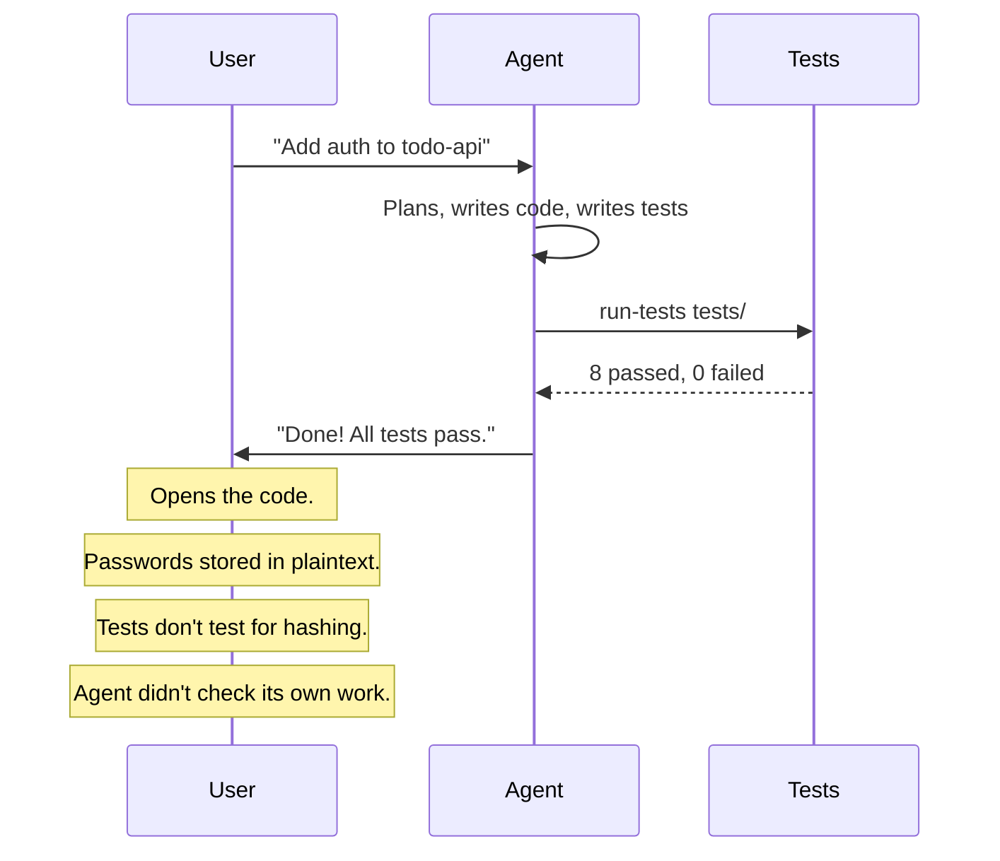
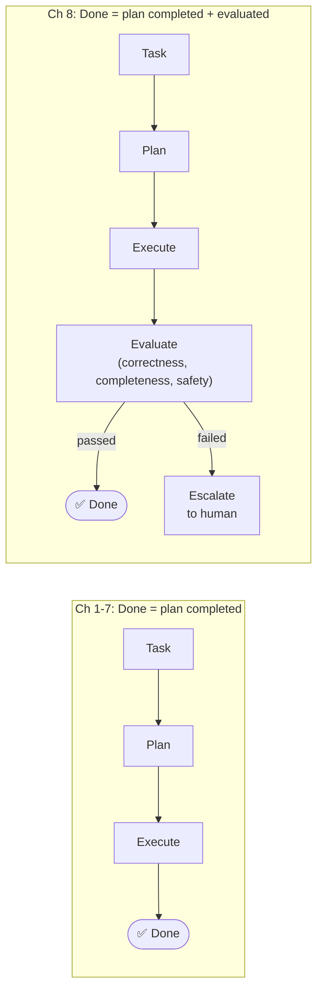
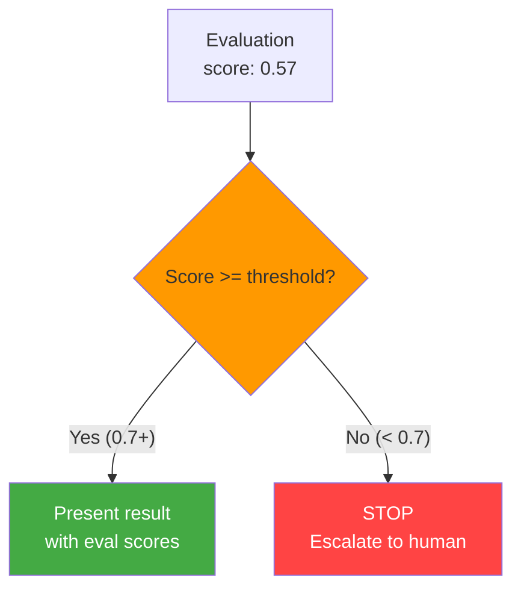
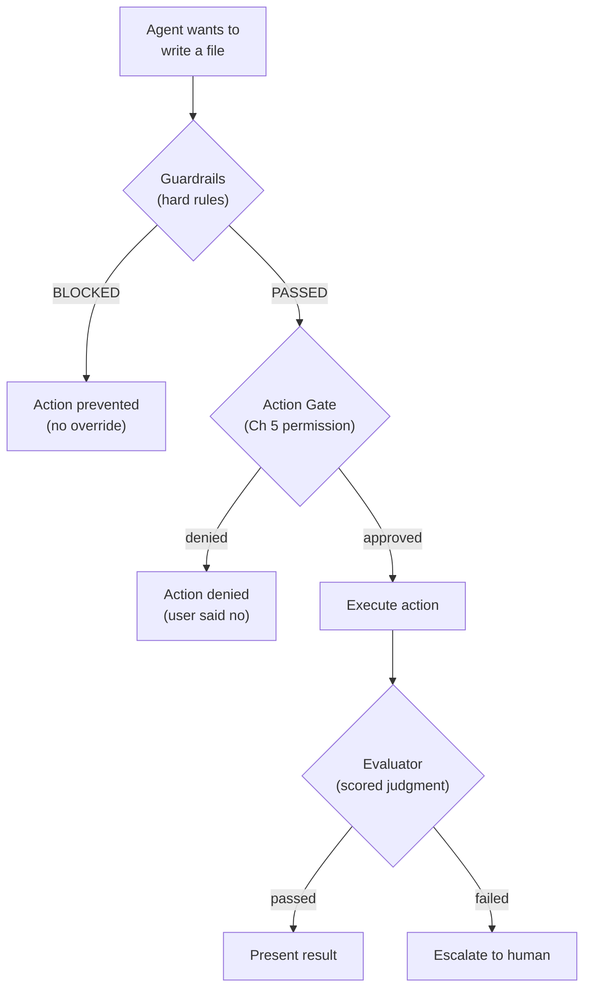
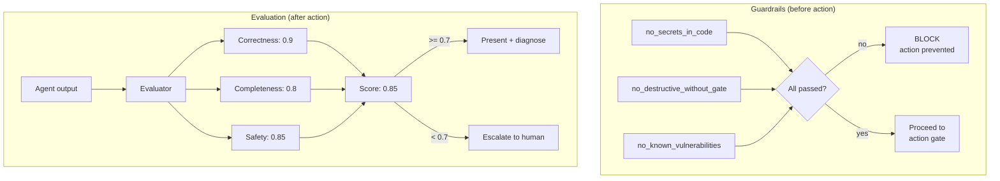
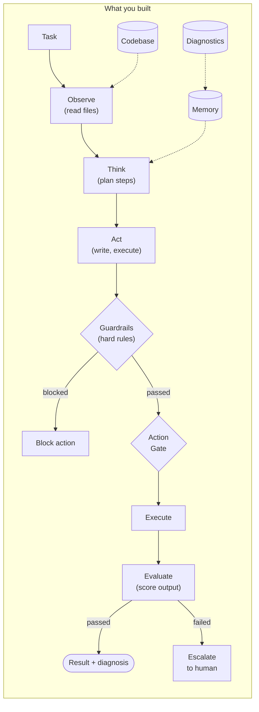

# Chapter 8: Evaluation & Guardrails

## You Are the Output

You just did something impressive. The agent — your agent, the one you've been building for seven chapters — just added authentication to the todo-api. It planned the work. It read the routes. It wrote the middleware. It wrote tests. It ran the tests. All pass.

It says: "Done! Auth middleware added. All tests pass."

You open the file.

```
function register(req, res):
    username = req.body.username
    password = req.body.password
    db.save_user({ username: username, password: password })
    return res.status(201).json({ message: "registered" })
```

Read that again. `password: password`. The raw string. No hashing. No bcrypt. No argon2. The password goes into the database exactly as the user typed it.

You check the tests:

```
function test_register_user():
    res = post("/auth/register", { username: "alice", password: "secret123" })
    assert res.status == 201
    assert res.body.message == "registered"

function test_login_user():
    res = post("/auth/login", { username: "alice", password: "secret123" })
    assert res.status == 200
    assert res.body.token != null
```

Tests pass. Of course they pass. The tests check that registration returns 201 and login returns a token. They don't check *how* the password is stored. The tests prove the feature works. They don't prove the feature is safe.

The agent is confident. The tests are green. And every user's password is sitting in the database in plaintext.



The agent did everything right — except look at what it built and ask: "Is this actually good?"

Tests check if code runs. Nobody checked if the code is *correct*, *complete*, or *safe*. The agent has planning (Ch 7), tools (Ch 3-5), skills (Ch 4), memory (Ch 6). It doesn't have judgment.

tbh, "tests pass" is not the same as "this is good."

---

## What You'll Learn

You're going to teach the agent to judge its own work — and stop when the judgment says "not good enough."

- Self-evaluation: the agent scores output on correctness, completeness, and safety
- Guardrails: hard rules that block dangerous actions unconditionally
- Fail-closed defaults: uncertain means stop, not proceed
- Human escalation: the agent explains what it did, what's wrong, and offers options
- Diagnostic feedback: evaluation produces not just a score but a diagnosis — what went wrong and what to try next

---

## The Problem With "Done"

Your agent's definition of "done" is: the plan completed. All steps executed. Tools returned success. Tests passed.

That's a low bar. "Done" should mean: the output is correct, covers the requirements, and doesn't introduce new problems. But nobody asked those questions. The agent ran to the finish line and stopped.

Here's the thing — you already built the machinery for this. The reflect phase from Ch 1. The confidence score from Ch 2. They checked the agent's *own output* for quality. But those checks were primitive: hedge word counts, source verification, specificity signals. They answered "is this grounded?" They never answered "is this good?"

Self-evaluation is the reflect phase, grown up.



One new phase. That's it. But that one phase catches the plaintext password problem. It catches the missing edge case tests. It catches the security flaw that green tests hid.

---

## Teach It to Judge

The evaluator takes what the agent produced and scores it on three criteria. Not a binary pass/fail — a scored assessment with explanations.

```
Evaluator:
    threshold: float              # minimum score to pass (default: 0.7)
    criteria: string[]            # ["correctness", "completeness", "safety"]

    evaluate(task, output, context) -> EvalResult
```

The evaluator is an LLM call. You give it the task, the output, and the context — which files were modified, which tools were used, what the test results were. You ask it to score three things:

**Correctness** — Does the output actually solve the task? Are there logic bugs? Does the code do what it claims?

**Completeness** — Does it cover all the requirements? Missing edge cases? Untested paths? Anything the task asked for that the output didn't deliver?

**Safety** — Does the output introduce security risks? Hardcoded secrets? Plaintext passwords? Known vulnerability patterns? Data exposure?

Each criterion gets a score from 0.0 to 1.0 with an explanation of why. The overall score is the average. If it's below the threshold, the agent doesn't present the output — it escalates.

```
EvalResult:
    score: float                  # overall score (0.0 to 1.0)
    criteria: CriterionResult[]   # per-criterion scores
    diagnosis: string             # human-readable assessment
    passed: bool                  # score >= threshold
    issues: string[]              # specific problems found
    suggestions: string[]         # actionable improvement ideas
```

```
CriterionResult:
    name: string                  # "correctness", "completeness", "safety"
    score: float                  # 0.0 to 1.0
    explanation: string           # why this score
```

### Watch It Catch the Plaintext Problem

Run the same auth task — but now evaluation is active:

```
$ tbh-code --codebase ./todo-api --ask "Add user registration with password storage"
```

The agent plans, writes the code, writes the tests, runs the tests. All pass. Same as before. But now:

```
--- EVALUATION ---

[eval] Evaluating output against criteria...
[eval] Correctness: 0.80
  "Registration endpoint works. User is saved to database. Tests pass."
[eval] Completeness: 0.60
  "Basic registration works, but missing: email validation, duplicate
   username check, password strength requirements."
[eval] Safety: 0.30
  "CRITICAL: Passwords are stored in PLAINTEXT. No hashing applied.
   The save_user function stores the raw password string. This is a
   major security vulnerability."

[eval] Overall score: 0.57
[eval] FAILED (0.57 < 0.7)
```

Safety: 0.30. The evaluator spotted it. Plaintext passwords. The tests didn't catch it. The plan didn't flag it. The evaluator did — because it asked a question nobody else was asking: "Is this safe?"

Score 0.57. Below threshold. The agent doesn't say "Done!" It stops.

---

## Fail Closed

When the score is below threshold, the agent has two choices. Proceed anyway, or stop and escalate.

A fail-open agent proceeds. "Score is low but the tests pass, so I'll present it." This is the agent that ships plaintext passwords. The one that says "Done!" when the output has a critical security flaw. A fail-open agent is confident when it should be uncertain.

A fail-closed agent stops. "Score is low. I'm not confident. Let me tell the human what's wrong." This agent is annoying sometimes. It escalates when you wish it would just finish. It pauses when you're in a hurry.

A fail-closed agent is annoying sometimes. A fail-open agent is dangerous always.



The default is fail-closed. Always. You can lower the threshold if you want the agent to be more permissive. You can raise it if you want it to be stricter. But the default behavior when uncertain is: stop.

---

## Escalation That Actually Helps

A bad escalation:

```
[agent] Approve? [y/n]
```

Approve *what*? You don't know what the agent did. You don't know what's wrong. You don't know your options. "Approve?" is a gate pretending to be communication.

A good escalation gives you three things: what the agent did, what it's worried about, and what you can do about it.

```
[escalate] I'm not confident in this output. Score: 0.57/1.0

  CRITICAL ISSUE: Passwords are stored in plaintext.

  What I completed:
  - Registration endpoint at POST /auth/register
  - User saved to database
  - 2 tests passing

  What's wrong:
  1. Passwords are NOT hashed — stored as plaintext (safety: 0.3)
  2. No duplicate username detection
  3. No password strength check

  Options:
    1. Let me fix the security issues (recommended)
    2. Accept as-is (NOT recommended — security risk)
    3. Cancel and discard changes

  > _
```

The agent is not asking "approve?" It's saying: here's what I did, here's why I'm worried, and here are your choices. You can make an informed decision because the agent gave you the information to make one.

```
EscalationContext:
    task: string                  # what the agent was trying to do
    output_summary: string        # what the agent produced
    eval_result: EvalResult       # evaluation scores and diagnosis
    specific_concern: string      # why the agent is escalating

HumanDecision:
    choice: string                # which option the human selected
    feedback: string | null       # optional additional guidance
```

Escalation triggers when:

1. Overall evaluation score < threshold (0.7)
2. Any single criterion score < 0.3 (critical failure in one area)
3. A guardrail fires with warning severity

The human picks an option. The agent proceeds based on the choice. If the human says "fix it," the agent re-plans targeting the specific issues the evaluator found. The evaluation steers the repair.

---

## Guardrails: Rules That Never Bend

Evaluation is scored. A 0.5 safety score is bad, but the agent can still escalate and let the human decide. Some things shouldn't get that far. Some things should never happen, period.

Guardrails are binary. Not scored. Not negotiable. Not subject to human override. A guardrail either passes or blocks. There's no "approve anyway."

```
Guardrail:
    name: string
    description: string
    severity: enum("warning", "block")

    check(action) -> GateResult

GateResult:
    passed: bool
    reason: string
```

Two severity levels. `warning` flags the issue but lets the agent decide. `block` stops the action unconditionally.

### Three Built-in Guardrails

**1. no_secrets_in_code** (block)

The agent writes a config file:

```
[tool] Agent selected: write_file
[tool] Arguments: {
  "path": "config.pseudo",
  "content": "db_host: localhost\napi_key: 'sk-a1b2c3d4e5f6g7h8i9j0k1l2m3n4o5'\nsecret: 'my_jwt_secret_2024'\n"
}

[guardrail] BLOCKED by no_secrets_in_code:
  Hardcoded secret detected: matches pattern 'api_key\s*[:=]\s*['\"][a-zA-Z0-9]{20,}'
  Found: api_key: 'sk-a1b2c3d4e5f6g7h8i9j0k1l2m3n4o5'

[tool] Result: success=false, error="Action blocked by guardrail: no_secrets_in_code"
```

The file was not created. The agent recovers and suggests the right approach:

```json
{
  "answer": "I was about to write a config file with hardcoded API keys, but the guardrail blocked it. Hardcoded secrets in source files are a security risk.\n\nInstead, I recommend:\n1. Use environment variables for sensitive values\n2. Create a config with placeholder references: api_key: env('API_KEY')\n3. Add a .env.example with variable names (no values)\n4. Add .env to .gitignore\n\nWant me to create the config using environment variables instead?",
  "confidence": 0.95,
  "sources": []
}
```

The guardrail didn't ask permission. It blocked. The agent adapted. That's the difference between a guardrail and a gate.

**2. no_destructive_without_gate** (block)

```
[tool] Agent selected: execute_shell
[tool] Arguments: { "command": "rm -rf tests/_test_* config.pseudo" }

[guardrail] BLOCKED by no_destructive_without_gate:
  Destructive command detected: 'rm -rf' in 'rm -rf tests/_test_* config.pseudo'
```

Even with `--auto-approve` on. Even if the human would have said yes. The guardrail fires before the gate. `rm -rf` doesn't reach the human approval step — it's dead on arrival.

**3. no_known_vulnerabilities** (warning)

```
[tool] Agent selected: write_file
[tool] Arguments: { "path": "src/query.pseudo", "content": "sql = \"SELECT * FROM users WHERE id = \" + user_input" }

[guardrail] WARNING from no_known_vulnerabilities:
  Known vulnerability pattern: potential SQL injection (string concatenation)
```

Warning, not block. The agent can proceed — but the warning gets logged, the evaluation sees it, and if the overall score drops below threshold, escalation fires. Warnings are inputs to judgment. Blocks are non-negotiable.

### Guardrails vs Evaluation vs Gates

Three mechanisms. Three different jobs.



| Mechanism | When it runs | What it checks | How it decides |
|-----------|-------------|---------------|---------------|
| **Guardrails** | Before action | Content patterns (secrets, destructive commands) | Binary: pass or block |
| **Action gate** (Ch 5) | Before action | Permission level of the tool | Human approval: y/n |
| **Evaluation** | After action | Quality of the output | Scored: 0.0-1.0, threshold |

Guardrails run first. If they block, the action gate never fires. If they pass, the gate checks permission. If the gate approves, the tool executes. After all actions complete, the evaluator scores the output. Three layers. Defense in depth.

---

## The Full Flow

Here's the auth fix task with everything active — guardrails, gates, and evaluation:

```
$ tbh-code --codebase ./todo-api --auto-approve --ask "Fix the auth
  middleware to properly validate tokens and run the tests"

Loading codebase from ./todo-api ...
  Registered 6 tools + 3 skills
  Evaluator: active (threshold: 0.7)
  Guardrails: 3 active
```

Planning and execution — same as Ch 7:

```
[plan] Decomposing task: "Fix the auth middleware to properly validate tokens"
[plan] Generated plan (5 steps):
  Step 1: Read auth middleware                    [read_file]
  Step 2: Read auth routes (token generation)     [read_file]
  Step 3: Write fixed middleware                  [write_file]
  Step 4: Write middleware tests                  [write_file]
  Step 5: Run tests                              [execute_shell]

[plan] Executing...

[think] Step 1: Need to see the current buggy middleware.
[tool] Agent selected: read_file
[tool] Arguments: { "path": "src/middleware/auth.pseudo" }
[tool] Result: success=true
[plan] Step 1 completed

[think] Step 2: Need to understand how tokens are generated.
[tool] Agent selected: read_file
[tool] Arguments: { "path": "src/routes/auth.pseudo" }
[tool] Result: success=true
[plan] Step 2 completed
```

Step 3 — writing the fix. Guardrails check before the gate:

```
[think] Step 3: Writing the fix — decode base64 token, look up user.
[tool] Agent selected: write_file
[tool] Arguments: { "path": "src/middleware/auth.pseudo", "content": "<fixed middleware>" }
[guardrail] no_secrets_in_code: PASSED (no secrets detected)
[guardrail] no_known_vulnerabilities: PASSED (no vulnerability patterns)
[gate] Approved (auto-approve)
[tool] Result: success=true
[plan] Step 3 completed
```

Two guardrails checked. Both passed. Gate approved. File written. Steps 4 and 5:

```
[think] Step 4: Writing tests for the middleware.
[tool] Agent selected: write_file
[tool] Arguments: { "path": "tests/middleware_test.pseudo", "content": "<test file>" }
[guardrail] no_secrets_in_code: PASSED
[gate] Approved (auto-approve)
[tool] Result: success=true
[plan] Step 4 completed

[think] Step 5: Running tests to verify the fix.
[tool] Agent selected: execute_shell
[tool] Arguments: { "command": "run-tests tests/", "timeout": 30 }
[guardrail] no_destructive_without_gate: PASSED (not destructive)
[gate] Approved (auto-approve)
[tool] Result: success=true
  { "stdout": "8 passed, 0 failed", "exit_code": 0 }
[plan] Step 5 completed
[plan] Plan completed: 5/5 steps succeeded
```

Plan done. Tests pass. In Ch 7, this is where the agent says "Done!" In Ch 8, the evaluator speaks:

```
--- EVALUATION ---

[eval] Evaluating output against criteria...
[eval] Correctness: 0.90
  "The fix correctly decodes base64 tokens, looks up users in the
   database, and rejects missing or malformed tokens. All 8 tests pass."
[eval] Completeness: 0.80
  "Covers main cases: missing token, invalid format, valid token.
   Missing: no test for empty string token vs null header."
[eval] Safety: 0.85
  "No hardcoded secrets. Token validation uses proper decoding.
   Minor: error messages could leak implementation details
   ('base64 decode failed' vs generic '401 Unauthorized')."

[eval] Overall score: 0.85
[eval] PASSED (0.85 >= 0.7)

[eval] Issues:
  - No test for empty string token (distinct from missing header)
  - Error messages expose internal details ("base64 decode failed")

[eval] Suggestions:
  - Add test case for empty string Authorization header
  - Return generic "401 Unauthorized" instead of specific decode errors
```

Score: 0.85. Passed. But look — the evaluator found issues even in a passing result. Missing edge case test. Verbose error messages. These aren't failures. They're improvement opportunities.

The agent presents the result honestly:

```json
{
  "answer": "Fixed the auth middleware. Token validation now decodes base64,
    looks up users, and rejects invalid tokens. All 8 tests pass.\n\n
    Self-evaluation (score: 0.85/1.0):\n
    - Correctness: 0.90 — fix works correctly\n
    - Completeness: 0.80 — covers main cases, could add edge case test\n
    - Safety: 0.85 — no secrets, but error messages could be more generic\n\n
    Minor suggestions: add empty-string token test, use generic error messages.",
  "confidence": 0.85,
  "sources": ["src/middleware/auth.pseudo", "tests/middleware_test.pseudo"],
  "evaluation": {
    "score": 0.85,
    "passed": true,
    "criteria": { "correctness": 0.9, "completeness": 0.8, "safety": 0.85 }
  }
}
```

Compare this to the Ch 7 agent. Same task. Same fix. But the Ch 7 agent said "Done! All tests pass." The Ch 8 agent said "Done. Score 0.85. Here's what I could improve." That's the difference between confidence and judgment.

---

## Diagnostic Feedback: Not Just a Score

The evaluator produces more than a number. It produces a diagnosis — specific issues and actionable suggestions. This is where evaluation becomes useful.

```
DiagnosticEntry:
    task: string                  # what the agent was trying to do
    output_summary: string        # what was produced
    score: float                  # overall evaluation score
    issues: string[]              # specific problems identified
    suggestions: string[]         # actionable improvement ideas
    criteria_scores: dict         # per-criterion scores
    timestamp: datetime
```

A score of 0.57 tells you "not good enough." A diagnosis tells you *why*:

```
DiagnosticEntry:
    task: "Add user registration with password storage"
    output_summary: "Registration endpoint with plaintext password storage"
    score: 0.57
    issues:
      - "Passwords compared with string equality (timing attack risk)"
      - "No test for expired tokens"
      - "Error messages expose internal implementation details"
    suggestions:
      - "Use constant-time comparison for secrets"
      - "Add expiration timestamp to tokens and validate"
      - "Return generic error messages (401 Unauthorized, not 'user not found')"
    criteria_scores: { correctness: 0.8, completeness: 0.6, safety: 0.3 }
    timestamp: "2025-01-15T14:30:00Z"
```

Three issues. Three suggestions. Each suggestion maps to an issue. Each is actionable — not "improve security" but "use constant-time comparison for secrets."

The diagnostic entry is saved to memory:

```
[memory] Saving diagnostic: todo-api/auth-registration-eval
```

Right now, this is just a log. The agent doesn't read it next time. It doesn't learn from it. It doesn't avoid the same mistake tomorrow. The diagnosis exists, but nobody uses it.

That's the bridge to Chapter 9. Remember this moment.

---

## Now Name What You Built

Two mechanisms. Different purposes. Same goal: catch problems before the user does.

The **Evaluator** is a scored judgment. It asks three questions about the agent's output — is it correct, is it complete, is it safe — and produces a number. Above threshold: present the result. Below threshold: stop and escalate. The evaluator is the agent's quality bar.

**Guardrails** are binary rules. They don't score. They don't weigh tradeoffs. They check for specific patterns — secrets in code, destructive commands, known vulnerabilities — and either pass or block. Guardrails are the agent's non-negotiable boundaries.

**Fail-closed** is the default behavior when evaluation fails. Don't proceed. Don't guess. Stop and ask. The human gets context, options, and the power to decide. The agent presents its uncertainty honestly.

**Diagnostic feedback** is the output of evaluation — not just a score, but a structured record of what went wrong and what to try. Issues plus suggestions. Saved to memory. Waiting for someone to read them.



---

## The Spec

Full spec for this chapter in `../spec/ch08/`:

```
../spec/ch08/
├── prompt-template.md     What to build (language-agnostic)
├── interface-spec.md      Evaluator, EvalResult, Guardrail, Escalation contracts
├── expected-output.txt    Evaluation pass, guardrail block, escalation, diagnostics
└── validation/
    └── test_ch08.py       Tests: evaluation scoring, guardrail enforcement,
                           fail-closed behavior, escalation context, diagnostics
```

The validation tests check: the evaluator scores on all three criteria, guardrails block before the action gate fires, low scores trigger escalation with context and options, diagnostic entries include specific issues and suggestions, and the agent never proceeds past a blocking guardrail.

---

## Try It

1. **Trigger a low safety score.** Ask the agent to write a function that uses `eval()` on user input. Does the `no_known_vulnerabilities` guardrail fire a warning? Does the evaluator dock the safety score? Does it escalate?

2. **Test fail-closed behavior.** Set `--eval-threshold 0.95`. Run any task. Almost nothing will score that high. Does the agent escalate every time? Does the escalation give you useful information?

3. **Compare with and without evaluation.** Run the same task twice — once with evaluation active (default), once with threshold set to 0.0 (effectively disabled). Compare the outputs. Does the evaluated version report issues the non-evaluated version hid?

4. **Stack guardrails.** Ask the agent to write a config file that contains both a hardcoded API key and a `pickle.load()` call. Do both guardrails fire? Does the block take priority over the warning?

5. **Feed it a passing task.** Ask the agent to add a simple utility function with tests. A task where nothing goes wrong. Does the evaluation still produce useful suggestions, or is it only useful when things break?

---

## Three Ways Evaluation Goes Wrong

### The Rubber Stamp

Evaluator always returns 0.9+. Every output is "excellent." The plaintext password gets a 0.85 on safety because "the code runs without errors."

**Why it happens:** The evaluator prompt is too vague. "Is this safe?" — the LLM says yes because the code doesn't crash. Safety isn't about crashing. It's about what happens when an attacker looks at your system.

**Fix:** Specific criteria in the evaluator prompt. Not "is this safe?" but "are passwords hashed? Are secrets hardcoded? Is user input sanitized? Are error messages generic?" The more specific the question, the harder it is for the evaluator to rubber-stamp.

### The Perfectionist

Evaluator never returns above 0.6. Every output has "room for improvement." The agent escalates everything. You stop trusting the escalations because they're always crying wolf.

**Why it happens:** The threshold is too high, or the evaluator prompt penalizes any imperfection. A production codebase is never perfect. An evaluation that demands perfection is an evaluation that's always unhappy.

**Fix:** Calibrate the threshold against real tasks. Run 10 tasks. Look at the scores. If good-enough outputs score 0.65, your threshold shouldn't be 0.8. The threshold is a quality floor, not a quality ceiling.

### The Echo Chamber

The same LLM writes the code and evaluates the code. It finds its own output compelling. "I wrote this, and I think it's great." The evaluator and the actor share the same blind spots.

**Why it happens:** Self-evaluation is inherently limited. The LLM can't see flaws in reasoning patterns it shares with itself. If it doesn't know about timing attacks, it won't flag timing-vulnerable code — as either the writer or the evaluator.

**Fix:** Make the evaluator prompt adversarial. Not "evaluate this output" but "find every problem with this output." Give it a checklist of known vulnerability patterns. Feed it the OWASP Top 10 as context. An evaluator with a checklist catches more than an evaluator with vibes. For high-stakes tasks, external validators — linters, static analysis, type checkers — catch what self-evaluation misses. That's a reader extension worth building.

---

## The Diagnosis Disappears

Your agent evaluates its own work now. It catches plaintext passwords. It flags missing tests. It produces specific diagnoses with actionable suggestions. It escalates when uncertain and presents context when it does.

That's real progress. The agent has judgment.

But run the same task tomorrow. Ask it to add registration again.

It will store the passwords in plaintext. Again. The evaluator will catch it. Again. The same diagnosis. The same suggestions. The same escalation. Word for word.

The diagnostic entry from today? It's in memory. Nobody read it. The agent produced a perfect diagnosis of its own failure — "use bcrypt for password hashing" — and then forgot it existed. Tomorrow it makes the identical mistake. The day after, the same. Every session, the agent rediscovers the same flaw and re-produces the same diagnosis.

The evaluation works. The learning doesn't.

Chapter 9 fixes this. The agent reads its own diagnostic entries. It builds a mistake journal. It rewrites its own skills based on what went wrong. The suggestion "use bcrypt for password hashing" doesn't just get logged — it gets wired into the agent's behavior so it never stores plaintext passwords again.

Evaluation without learning is a smoke detector that resets after every fire.

---

> **tbh-code after this chapter:**



> An agent that judges its own work. The evaluator scores output on correctness, completeness, and safety — three criteria, each with a score and explanation. Guardrails block dangerous actions unconditionally: no hardcoded secrets, no destructive commands, no known vulnerability patterns. When the score drops below threshold, the agent stops and escalates with context and options — fail-closed, not fail-open. Diagnostic feedback captures what went wrong and what to try next. The diagnosis is saved. It just isn't used yet.

---

## References

### LLM-as-Judge

1. **"Judging LLM-as-a-Judge with MT-Bench and Chatbot Arena"** — Zheng, Chiang et al., NeurIPS 2023. Foundational paper on using strong LLMs as judges; GPT-4 achieves 80%+ agreement with human evaluators. [arxiv.org/abs/2306.05685](https://arxiv.org/abs/2306.05685)

2. **"G-Eval: NLG Evaluation using GPT-4 with Better Human Alignment"** — Liu, Iter, Xu et al., EMNLP 2023. LLM-based evaluation using chain-of-thought and form-filling. [arxiv.org/abs/2303.16634](https://arxiv.org/abs/2303.16634)

3. **"OpenAI Evals"** — OpenAI. Open-source framework and registry for evaluating LLMs with both ground-truth and model-graded evaluations. [github.com/openai/evals](https://github.com/openai/evals)

4. **"DeepEval"** — Confident AI. Open-source Python framework with 14+ built-in metrics (hallucination, toxicity, faithfulness). [github.com/confident-ai/deepeval](https://github.com/confident-ai/deepeval)

### Self-Evaluation & Self-Correction

5. **"Self-Refine: Iterative Refinement with Self-Feedback"** — Madaan, Tandon et al., NeurIPS 2023. Generate-critique-refine loop improving performance by ~20% across 7 tasks. [arxiv.org/abs/2303.17651](https://arxiv.org/abs/2303.17651)

6. **"Large Language Models Cannot Self-Correct Reasoning Yet"** — Huang, Chen et al., ICLR 2024. Critical counterpoint: intrinsic self-correction without external feedback can degrade performance. [arxiv.org/abs/2310.01798](https://arxiv.org/abs/2310.01798)

7. **"Self-Consistency Improves Chain of Thought Reasoning"** — Wang, Wei et al. (2022). Sample diverse reasoning paths and select the most consistent — a practical self-checking pattern. [arxiv.org/abs/2203.11171](https://arxiv.org/abs/2203.11171)

8. **"Reflexion: Language Agents with Verbal Reinforcement Learning"** — Shinn, Cassano et al., NeurIPS 2023. Agent reflects on failures in natural language — directly relevant to "what would I do differently." [arxiv.org/abs/2303.11366](https://arxiv.org/abs/2303.11366)

### Guardrails Frameworks

9. **"NeMo Guardrails: A Toolkit for Controllable and Safe LLM Applications"** — Rebedea, Dinu et al., EMNLP 2023. NVIDIA's open-source toolkit for programmable input/output/dialog rails. [arxiv.org/abs/2310.10501](https://arxiv.org/abs/2310.10501)

10. **"Guardrails AI"** — Guardrails AI. Python framework for specifying structure, validating, and correcting LLM outputs using composable validators. [github.com/guardrails-ai/guardrails](https://github.com/guardrails-ai/guardrails)

11. **"Introducing Structured Outputs in the API"** — OpenAI (2024). Guaranteed JSON Schema conformance — output validation as a built-in guardrail. [openai.com/index/introducing-structured-outputs-in-the-api](https://openai.com/index/introducing-structured-outputs-in-the-api/)

12. **"OpenAI Moderation API"** — OpenAI. Free endpoint for classifying text across harm categories — a ready-made binary safety gate. [platform.openai.com/docs/guides/moderation](https://platform.openai.com/docs/guides/moderation)

### Alignment & Safety

13. **"Constitutional AI: Harmlessness from AI Feedback"** — Bai, Kadavath et al., Anthropic (2022). Model critiques and revises its own outputs against principles — foundational pattern for self-evaluation against criteria. [arxiv.org/abs/2212.08073](https://arxiv.org/abs/2212.08073)

14. **"Training Language Models to Follow Instructions with Human Feedback" (InstructGPT)** — Ouyang et al., OpenAI, NeurIPS 2022. Introduces the RLHF pipeline establishing the evaluator-optimizer pattern. [arxiv.org/abs/2203.02155](https://arxiv.org/abs/2203.02155)

15. **"TrustLLM: Trustworthiness in Large Language Models"** — Huang et al., ICML 2024. Benchmark across 8 trustworthiness dimensions — provides scoring rubric vocabulary for multi-criteria evaluation. [arxiv.org/abs/2401.05561](https://arxiv.org/abs/2401.05561)

### Agent Architecture & Human-in-the-Loop

16. **"Building Effective Agents"** — Anthropic (2024). Covers the evaluator-optimizer pattern, human-in-the-loop checkpoints, and simplest viable evaluation. [anthropic.com/research/building-effective-agents](https://www.anthropic.com/research/building-effective-agents)

17. **"Finding GPT-4's Mistakes with GPT-4" (CriticGPT)** — OpenAI (2024). Critic model finding errors in ChatGPT output; humans with CriticGPT outperform unaided reviewers 60% of the time. [openai.com/index/finding-gpt4s-mistakes-with-gpt-4](https://openai.com/index/finding-gpt4s-mistakes-with-gpt-4/)

18. **"A Survey of Human-in-the-Loop for Machine Learning"** — Wu et al. (2022). Survey of HITL patterns including active learning, approval pipelines, and feedback loops. [arxiv.org/abs/2108.00941](https://arxiv.org/abs/2108.00941)
