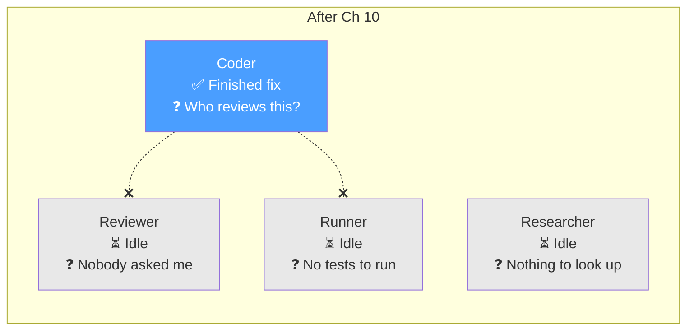
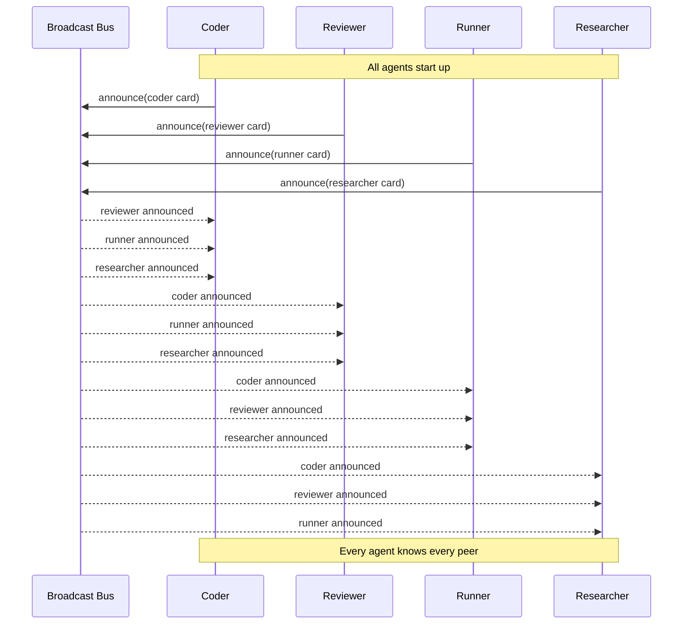
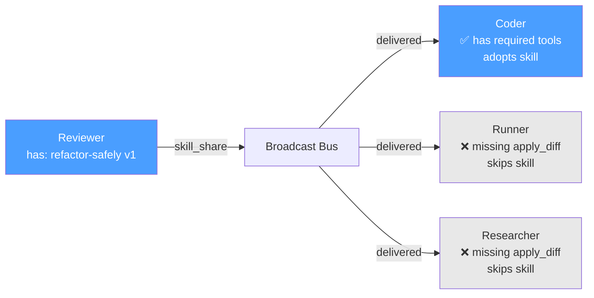
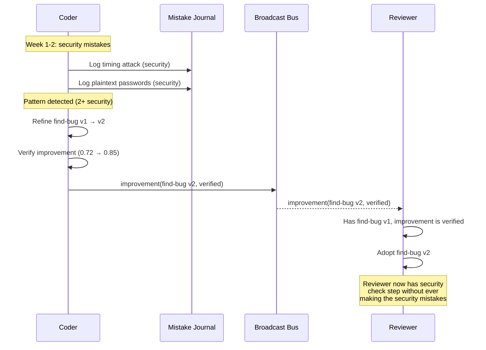
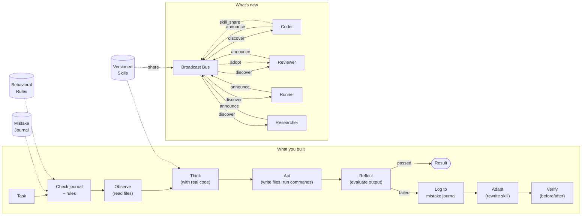

# Chapter 11: Broadcast & Discovery

## You Are the Coder

You just finished writing the fix. The auth middleware — the one that accepted any non-empty token — now decodes base64, looks up the user, verifies the account exists, and returns a proper `req.user`. You even added constant-time comparison for the token check, because the mistake journal reminded you about timing attacks. Good fix. Clean diff.

Now what?

You know the fix needs a review. You've seen bad code slip through — your own included. Chapter 8 taught you to evaluate your output, Chapter 9 taught you to learn from mistakes, and Chapter 10 split the monolith so that Reviewer exists as a separate agent with its own system prompt, its own biases, its own perspective. Someone who isn't you can check your work.

Except you can't find Reviewer.

You have your identity card. You know your capabilities. You have your tools and your skills. But your peer registry is empty. You're shouting into an empty room.




Four agents. Four separate processes. Zero awareness of each other. Coder finishes its work and returns the result to the user. Reviewer sits idle. Runner never runs the tests. Researcher never gets asked for context.

Chapter 10 gave each agent a job. It didn't give them a way to find each other.

tbh, specialization without discovery is just four flavors of lonely.

---

## What You'll Learn

You're going to wire the agents together — not with hardcoded addresses, but with a broadcast system where agents announce themselves and discover peers automatically.

- The broadcast bus: local pub/sub where agents publish and listen, no central registry
- Agent cards: structured announcements — name, capabilities, skills, connection info
- Discovery protocol: announce on startup, build a peer registry in seconds
- Skill sharing: agents broadcast skill specs, peers adopt them (the skills arc, third touch)
- Improvement sharing: one agent rewrites a skill, broadcasts it, another agent picks it up

By the end of this chapter, every agent will know every other agent exists. They still can't *talk* — that's Chapter 12. But they'll have the address book.

---

## Give Them a Radio

The simplest way for agents to find each other: a shared channel everyone listens to. No central registry. No coordinator. Just a bus.

Think of it as a shared radio frequency. Every agent tunes in when it starts. When an agent has something to announce, it broadcasts. Everyone else hears it. Nobody owns the channel.

```
BroadcastBus:
    channel_path: string             # e.g., .tbh-code/bus/
    subscribe(callback) → void       # start listening
    publish(message) → void          # broadcast to all listeners
    unsubscribe() → void             # stop listening

BroadcastMessage:
    type: enum("announce", "withdraw", "skill_share", "improvement")
    sender: string                   # agent name
    payload: any                     # depends on type
    timestamp: ISO 8601 string
    message_id: string               # unique ID for dedup
```

### Implementation: Just Files

The broadcast bus doesn't need infrastructure. For a local swarm — agents running on the same machine — a shared directory works.

```
.tbh-code/bus/
├── 2025-01-20T10:00:01Z-coder-announce.json
├── 2025-01-20T10:00:01Z-reviewer-announce.json
├── 2025-01-20T10:00:02Z-runner-announce.json
├── 2025-01-20T10:00:02Z-researcher-announce.json
└── 2025-01-20T10:00:05Z-reviewer-skill_share.json
```

Each agent writes a JSON file to the directory. Each agent watches the directory for new files. Publish is a file write. Subscribe is a file watcher. It's a message queue with the filesystem as the transport.

```
function publish(message):
    filename = "{timestamp}-{sender}-{type}.json"
    write_file(channel_path / filename, json_serialize(message))

function subscribe(callback):
    watch_directory(channel_path, on_new_file=callback)
```

Could you use Unix sockets? Sure. A Redis pub/sub? Sure. A proper message queue? Sure. But files work, they're debuggable (you can `ls` the bus), and they're sufficient for a local swarm. Start simple.

---

## Your Agent's Business Card

When an agent announces itself, what does it say? Not just "I exist." The announcement needs to carry enough information for any peer to understand what this agent does, what skills it has, and how to reach it.

This is the **agent card** — inspired by A2A (Agent-to-Agent) protocol patterns. Think of it as a structured business card your agent hands out on the broadcast bus.

```
AgentCard:
    name: string                     # "coder", "reviewer", "runner", "researcher"
    description: string              # what this agent does
    version: string                  # "1.0.0"
    capabilities: string[]           # what it CAN do
    skills: SkillSummary[]           # what playbooks it has
    connection: ConnectionInfo       # how to reach it
    status: enum("available", "busy", "offline")
    announced_at: ISO 8601 string

SkillSummary:
    name: string                     # "find-bug", "refactor-safely"
    version: int                     # skill version (from Ch 9)
    description: string              # one-line summary

ConnectionInfo:
    protocol: string                 # "file", "socket", "http"
    address: string                  # path or URL
```

Here's what Coder's card looks like:

```json
{
  "name": "coder",
  "description": "Reads and writes code. Applies edits, implements features, fixes bugs.",
  "version": "1.0.0",
  "capabilities": [
    "read_file",
    "write_file",
    "search_code",
    "apply_diff"
  ],
  "skills": [
    { "name": "find-bug", "version": 2, "description": "Locate and fix bugs with security awareness" },
    { "name": "implement-feature", "version": 1, "description": "Add new functionality to existing codebase" }
  ],
  "connection": {
    "protocol": "file",
    "address": ".tbh-code/agents/coder/inbox/"
  },
  "status": "available",
  "announced_at": "2025-01-20T10:00:01Z"
}
```

And Reviewer's:

```json
{
  "name": "reviewer",
  "description": "Reviews code for quality, bugs, and best practices. Does not write code.",
  "version": "1.0.0",
  "capabilities": [
    "read_file",
    "search_code",
    "evaluate_code"
  ],
  "skills": [
    { "name": "code-review", "version": 1, "description": "Systematic code quality review" },
    { "name": "refactor-safely", "version": 1, "description": "Identify safe refactoring opportunities" }
  ],
  "connection": {
    "protocol": "file",
    "address": ".tbh-code/agents/reviewer/inbox/"
  },
  "status": "available",
  "announced_at": "2025-01-20T10:00:01Z"
}
```

Notice: the card carries skills, not just capabilities. Capabilities are verbs — `read_file`, `evaluate_code`. Skills are playbooks — `code-review`, `refactor-safely`. A capability tells you what the agent *can do*. A skill tells you *how it does it*. This distinction matters for what comes next.

---

## The Five-Second Handshake

On startup, every agent does the same thing:

1. Subscribe to the broadcast bus
2. Announce itself (publish its agent card)
3. Listen for other agents' announcements
4. Build a local peer registry

After a few seconds, every agent knows every other agent.




The implementation:

```
PeerRegistry:
    peers: dict[string, AgentCard]   # name → card
    bus: BroadcastBus

    discover() → void                # start announcing + listening
    get_peer(name) → AgentCard | null
    get_peers() → AgentCard[]
    get_peers_with_capability(cap) → AgentCard[]
    get_peers_with_skill(skill_name) → AgentCard[]
```

```
function discover():
    # Step 1: Listen for others
    bus.subscribe(on_message=handle_broadcast)

    # Step 2: Announce yourself
    bus.publish({
        type: "announce",
        sender: self.agent.name,
        payload: self.agent.card,
        timestamp: now(),
        message_id: uuid()
    })

    # Step 3: Read any existing announcements (agents that started before us)
    for message in read_existing_messages(bus.channel_path):
        handle_broadcast(message)

function handle_broadcast(message):
    if message.type == "announce":
        peers[message.sender] = message.payload
    elif message.type == "withdraw":
        delete peers[message.sender]
    elif message.type == "skill_share":
        handle_skill_share(message)
    elif message.type == "improvement":
        handle_improvement(message)
```

Step 3 is important. If Reviewer starts before Coder, Reviewer's announcement is already a file on the bus. When Coder starts and reads existing messages, it discovers Reviewer immediately — no need to wait for a re-announcement.

### Watch It Work

Start all four agents:

```
$ tbh-code --agent coder --codebase ./todo-api &
$ tbh-code --agent reviewer --codebase ./todo-api &
$ tbh-code --agent runner --codebase ./todo-api &
$ tbh-code --agent researcher --codebase ./todo-api &
```

```
[coder] Starting agent: coder v1.0.0
[coder] Subscribing to broadcast bus: .tbh-code/bus/
[coder] Publishing agent card...
[coder] Discovered peer: reviewer (capabilities: read_file, search_code, evaluate_code)
[coder] Discovered peer: runner (capabilities: run_command, run_tests)
[coder] Discovered peer: researcher (capabilities: read_file, search_code, search_docs)
[coder] Peer registry: 3 peers

[reviewer] Starting agent: reviewer v1.0.0
[reviewer] Subscribing to broadcast bus: .tbh-code/bus/
[reviewer] Publishing agent card...
[reviewer] Discovered peer: coder (capabilities: read_file, write_file, search_code, apply_diff)
[reviewer] Discovered peer: runner (capabilities: run_command, run_tests)
[reviewer] Discovered peer: researcher (capabilities: read_file, search_code, search_docs)
[reviewer] Peer registry: 3 peers

[runner] Starting agent: runner v1.0.0
[runner] Subscribing to broadcast bus: .tbh-code/bus/
[runner] Publishing agent card...
[runner] Discovered peer: coder (capabilities: read_file, write_file, search_code, apply_diff)
[runner] Discovered peer: reviewer (capabilities: read_file, search_code, evaluate_code)
[runner] Discovered peer: researcher (capabilities: read_file, search_code, search_docs)
[runner] Peer registry: 3 peers

[researcher] Starting agent: researcher v1.0.0
[researcher] Subscribing to broadcast bus: .tbh-code/bus/
[researcher] Publishing agent card...
[researcher] Discovered peer: coder (capabilities: read_file, write_file, search_code, apply_diff)
[researcher] Discovered peer: reviewer (capabilities: read_file, search_code, evaluate_code)
[researcher] Discovered peer: runner (capabilities: run_command, run_tests)
[researcher] Peer registry: 3 peers
```

Four agents. Four announcements. Twelve discovery events. Every agent knows every other agent's name, capabilities, skills, and connection address. Total time: however long it takes to write and read four files.

Now check the bus directory:

```
$ ls .tbh-code/bus/
2025-01-20T10:00:01Z-coder-announce.json
2025-01-20T10:00:01Z-reviewer-announce.json
2025-01-20T10:00:02Z-runner-announce.json
2025-01-20T10:00:02Z-researcher-announce.json
```

Four files. The entire state of the swarm is visible, inspectable, and debuggable. No hidden state. No central server to query. `ls` is your discovery dashboard.

### Querying the Registry

Once the peer registry is populated, agents can search it:

```
# Coder wants to find who can review code
peers = registry.get_peers_with_capability("evaluate_code")
# → [reviewer]

# Coder wants to find who has a "code-review" skill
peers = registry.get_peers_with_skill("code-review")
# → [reviewer]

# Coder wants to find who can run tests
peers = registry.get_peers_with_capability("run_tests")
# → [runner]
```

The registry isn't just a list of names. It's a queryable index of *what the swarm can do*. When Coder finishes a fix and wonders "who can review this?" — the answer is one function call away.

But it's still just an address book. Coder knows Reviewer exists, knows it can evaluate code, knows its inbox path. It can't send a message yet. That's Chapter 12.

---

## Skills Go Social

Here's where the skills arc pays off.

Chapter 4 introduced skills as static playbooks — files loaded from disk that told the agent what to do. Chapter 9 made them living documents — the agent rewrites skills based on mistakes. Now, Chapter 11 makes skills *shareable*.

When Reviewer broadcasts its agent card, the card includes skill summaries. But summaries aren't enough. Coder sees that Reviewer has a skill called `refactor-safely`. The name sounds useful — but Coder doesn't know the steps.

Skill sharing fixes this. An agent can broadcast a full skill spec, and any peer can adopt it.

```
function share_skill(skill_spec):
    bus.publish({
        type: "skill_share",
        sender: self.agent.name,
        payload: {
            skill: skill_spec,       # full SkillSpec with steps
            origin: self.agent.name, # who created/refined this skill
            context: "Sharing skill that may be useful to peers"
        },
        timestamp: now(),
        message_id: uuid()
    })
```

Watch Reviewer share its `refactor-safely` skill:

```
[reviewer] Sharing skill: refactor-safely v1
[reviewer] Publishing to broadcast bus...

[coder] Received skill_share from reviewer: refactor-safely v1
[coder] Skill details:
  {
    "name": "refactor-safely",
    "description": "Identify and apply safe refactoring patterns",
    "steps": [
      { "action": "read_file", "description": "Read the target file and surrounding context" },
      { "action": "search_code", "description": "Find all callers of the function being refactored" },
      { "action": "evaluate", "description": "Check that refactoring won't break callers" },
      { "action": "apply_diff", "description": "Apply the refactoring" },
      { "action": "search_code", "description": "Verify all call sites still work" }
    ],
    "tools_used": ["read_file", "search_code", "apply_diff"],
    "version": 1
  }
[coder] Compatible: coder has tools [read_file, search_code, apply_diff] — all required tools available
[coder] Adopting skill: refactor-safely v1 (from reviewer)
[coder] Skill added to local skill set

[runner] Received skill_share from reviewer: refactor-safely v1
[runner] Compatible: runner lacks tools [apply_diff] — cannot adopt
[runner] Skipping skill: refactor-safely (missing required tools)
```

Two things happened. Coder adopted the skill because it has all the required tools. Runner skipped it because it can't `apply_diff`. Skill adoption isn't blind — the agent checks whether it has the tools to execute the skill before adding it to its set.




The adoption check:

```
function handle_skill_share(message):
    skill = message.payload.skill
    required_tools = skill.tools_used

    my_tools = self.agent.capabilities
    missing = [t for t in required_tools if t not in my_tools]

    if missing:
        log("Skipping skill {skill.name} — missing tools: {missing}")
        return

    # Check for version conflicts
    existing = self.skills.get(skill.name)
    if existing and existing.version >= skill.version:
        log("Already have {skill.name} v{existing.version}, skipping v{skill.version}")
        return

    self.skills.add(skill)
    log("Adopted skill: {skill.name} v{skill.version} (from {message.sender})")
```

### The Skills Evolution: Three Touches

```
Ch 4:   Skills are static playbooks loaded from disk
Ch 9:   Skills are living documents the agent rewrites based on mistakes
Ch 11:  Skills are shareable — agents broadcast skills to peers
```

A skill starts as a file. It evolves through self-improvement. It spreads through discovery. By the time a skill reaches another agent, it carries the accumulated experience of the agent that refined it.

---

## One Agent Learns, Everyone Benefits

This is where self-improvement meets discovery. Chapter 9 gave the agent the ability to rewrite its skills based on mistake patterns. Chapter 11 gives it a way to *share those improvements*.

Remember find-bug? Coder rewrote it from v1 to v2 after logging two security mistakes — timing attacks and plaintext passwords. The v2 skill added a security anti-pattern check step. That improvement is local to Coder. Reviewer doesn't have it. If Reviewer runs its own code-review skill, it might miss the same security patterns Coder already learned to catch.

Improvement sharing broadcasts the refined skill:

```
function share_improvement(skill_spec, refinement_reason):
    bus.publish({
        type: "improvement",
        sender: self.agent.name,
        payload: {
            skill: skill_spec,
            parent_version: skill_spec.parent_version,
            refinement_reason: refinement_reason,
            journal_categories: ["security"],  # what mistake patterns drove this
            verified: true                      # did it pass before/after check?
        },
        timestamp: now(),
        message_id: uuid()
    })
```

Watch it propagate:

```
[coder] Skill find-bug refined: v1 → v2
[coder] Refinement reason: "2 security mistakes (timing attack, plaintext passwords).
        Added security check step and cross-file search."
[coder] Verification: passed (0.72 → 0.85)
[coder] Broadcasting improvement...

[reviewer] Received improvement from coder: find-bug v1 → v2
[reviewer] Refinement reason: "2 security mistakes — added security check step"
[reviewer] Verified by coder: yes (score improved 0.72 → 0.85)
[reviewer] Evaluating adoption...
[reviewer] Current find-bug version: v1
[reviewer] Improvement is verified and addresses known category: security
[reviewer] Adopting find-bug v2 (from coder)
[reviewer] Updated skill: find-bug v1 → v2

[runner] Received improvement from coder: find-bug v1 → v2
[runner] find-bug not in skill set — skipping

[researcher] Received improvement from coder: find-bug v1 → v2
[researcher] find-bug not in skill set — skipping
```

Coder struggled with security issues. Logged the mistakes. Refined the skill. Verified the improvement. Broadcast it. Reviewer adopted it — now it has the security checklist step too, without ever encountering those mistakes itself.




One agent's hard-won experience becomes another agent's starting point. The swarm doesn't need every agent to make every mistake. One agent learns, everyone benefits.

### Adoption Isn't Blind

A receiving agent doesn't blindly adopt every improvement it hears about. The adoption logic checks:

1. **Tool compatibility** — does the agent have the required tools?
2. **Skill relevance** — does the agent already have this skill (or a related one)?
3. **Verification status** — was the improvement verified with before/after metrics?
4. **Version ordering** — is this newer than what the agent already has?

```
function handle_improvement(message):
    improvement = message.payload
    skill = improvement.skill

    # Must be verified
    if not improvement.verified:
        log("Skipping unverified improvement: {skill.name}")
        return

    # Must have the skill already (or adopt as new)
    existing = self.skills.get(skill.name)
    if existing is null:
        log("{skill.name} not in skill set — skipping")
        return

    # Must be newer
    if existing.version >= skill.version:
        log("Already at v{existing.version}, skipping v{skill.version}")
        return

    # Tool check
    missing = [t for t in skill.tools_used if t not in self.agent.capabilities]
    if missing:
        log("Cannot adopt — missing tools: {missing}")
        return

    self.skills.update(skill)
    log("Adopted {skill.name} v{skill.version} (from {message.sender})")
```

Unverified improvements get dropped. If Coder rewrites a skill but skips the before/after check from Chapter 9, that improvement doesn't spread. Verification is the trust signal. No verification, no propagation.

---

## Graceful Goodbyes

Agents don't live forever. When an agent shuts down, it broadcasts a withdrawal:

```
[coder] Shutting down...
[coder] Publishing withdrawal...

[reviewer] Peer withdrawn: coder
[reviewer] Removing coder from peer registry
[reviewer] Peer registry: 2 peers (runner, researcher)
```

```
function shutdown():
    bus.publish({
        type: "withdraw",
        sender: self.agent.name,
        payload: { reason: "clean shutdown" },
        timestamp: now(),
        message_id: uuid()
    })
    bus.unsubscribe()
```

What if an agent crashes without announcing withdrawal? The peer registry has stale entries. Two options:

1. **Heartbeat** — agents periodically re-announce. If no announcement for N seconds, peers mark the agent as offline. Simple but chatty.
2. **Lazy cleanup** — when an agent tries to reach a peer and fails, it removes the peer from its registry. No extra traffic. Cleanup happens on demand.

For a local swarm, lazy cleanup is fine. When Chapter 12 adds messaging, a failed message delivery triggers peer removal. No heartbeat infrastructure needed.

---

## The Spec

Full spec for this chapter in [spec/ch11/](../spec/ch11/):

📁 [spec/ch11/](../spec/ch11/)

| File | Description |
|------|-------------|
| [prompt-template.md](../spec/ch11/prompt-template.md) | What to build (language-agnostic) |
| [interface-spec.md](../spec/ch11/interface-spec.md) | BroadcastBus, AgentCard, PeerRegistry, share_skill, share_improvement contracts |
| [expected-output.txt](../spec/ch11/expected-output.txt) | Broadcast, discovery, skill sharing, improvement propagation traces |
| [test_ch11.py](../spec/ch11/validation/test_ch11.py) | Tests: agents discover each other, agent cards have all fields, skills shared only when tools match, improvements propagate only if verified |

The validation tests check: all four agents appear in each other's peer registries after discovery, agent cards include capabilities and skills, skill sharing respects tool compatibility, improvement sharing requires verification, and withdrawal removes the agent from peer registries.

---

## Try It

1. **Start agents one at a time.** Start Coder. Wait 5 seconds. Start Reviewer. Does Coder discover Reviewer? Does Reviewer discover Coder? The order shouldn't matter — both directions should work because of the "read existing messages" step.
2. **Kill an agent without clean shutdown.** `kill -9` the Runner process. Do the other agents still list Runner in their registry? Now try to imagine what happens in Ch 12 when Coder tries to send Runner a message. (Hint: that's where lazy cleanup kicks in.)
3. **Share a skill that requires a missing tool.** Have Coder broadcast a skill that uses `apply_diff`. Does Runner adopt it? (It shouldn't — Runner can't apply diffs.)
4. **Share an unverified improvement.** Have Coder refine a skill but skip the verification step from Ch 9. Broadcast it. Does Reviewer adopt it? (It shouldn't — the `verified` flag should be false.)
5. **Race the discovery.** Start all four agents simultaneously. Does the order of announcements matter? Can two agents announce at the same millisecond and still discover each other?
6. **Inspect the bus.** After discovery, `ls .tbh-code/bus/` and read the JSON files. Can you reconstruct the entire discovery sequence from the files alone? That's the debugging value of a file-based bus.

---

## Now Name What You Built

You wired four isolated agents into a self-organizing peer network. Let's put names on the pieces.

The **broadcast bus** is a local pub/sub channel. Agents publish messages, all subscribers receive them. No central registry, no coordinator, no single point of failure. The bus is infrastructure — it carries messages but doesn't understand them.

**Agent cards** are structured self-descriptions. Name, capabilities, skills, connection info. Inspired by A2A (Agent-to-Agent) protocol patterns, where agents advertise themselves so peers can decide whether to interact. The card is the agent's public identity — what it shows to the world versus the system prompt, which is its private instructions.

The **discovery protocol** is the three-step handshake: subscribe, announce, read history. It's eventually consistent — after a short window, every agent has a complete view of the swarm. No centralized registration. No coordinator that must be running. Agents come and go, and the registry stays current.

**Skill sharing** extends the skills arc from individual to collective. Skills start as static files (Ch 4), become living documents (Ch 9), and now become shareable assets (Ch 11). When an agent broadcasts a skill, it includes the tools required to execute it — so receiving agents can check compatibility before adopting.

**Improvement sharing** is skill sharing with provenance. Not just "here's a skill" but "here's a skill I refined because of these specific failures, and here's proof it's better." The verified flag is the trust mechanism — improvements only propagate when they've been tested.

### Three Patterns to Remember

**Announce, don't register.** There's no central registry to update. Agents announce themselves on the bus. Peers maintain their own registries. If the bus goes down, agents still have their last-known peer list. If a new agent joins, it announces once and everyone knows.

**Cards over capabilities.** Don't just broadcast a list of capabilities. Broadcast the full card — with skills, version, status, connection info. A capability list says "I can read files." A card says "I'm the Reviewer, I can read files and evaluate code, I have a code-review skill at v2, and here's how to reach me."

**Share improvements, not just results.** Agents that only share task outputs help one user on one task. Agents that share skill improvements help the entire swarm on every future task. One agent's mistake pattern becomes every agent's defense.

### Discovery at Scale

**Gossip Protocols**

Your broadcast bus is essentially a simplified gossip protocol — agents announce, peers listen, state propagates. In larger swarms (hundreds of agents), pure broadcast doesn't scale. Gossip protocols solve this: each agent shares state with a random subset of neighbors, and information spreads epidemically. After O(log N) rounds, every agent knows about every other agent.

You don't need gossip for four agents. But when your swarm grows past what a single bus file can handle, gossip is the natural evolution of what you built here.

**The Dynamic Registry**

We warned against central registries as an anti-pattern — single point of failure, bottleneck, coordination overhead. But at scale, centralized registries have legitimate uses. Microsoft's multi-agent reference architecture uses a dynamic registry with semantic search: agent descriptions stored as embeddings, queried by task similarity. Think of it as "broadcast for small swarms, registry for large ones."

The key difference from the anti-pattern: a *dynamic* registry where agents self-register and self-deregister (like your broadcast announcements) vs a *static* registry that someone has to manually maintain.

---

## Three Ways to Break Discovery

### The Central Registry

You build a coordinator that tracks all agents. Agents register on startup, deregister on shutdown. Clean. Organized. Single point of failure. When the coordinator crashes, no agent can discover anything. When it restarts, every agent must re-register.

**What goes wrong:** The coordinator becomes a bottleneck and a failure point. The swarm can't function without it. You've built a microservice architecture where you needed a peer network.

**One-line fix:** Broadcast, don't register. Each agent maintains its own peer list from bus messages. No coordinator needed.

### The Silent Agent

The agent starts, does its work, never announces. It exists in the process table but not in anyone's peer registry. Coder finishes a fix and queries for reviewers — finds none. The Reviewer is running ten feet away, invisible.

**What goes wrong:** Discovery is opt-in. An agent that doesn't announce is an agent that doesn't exist to the swarm. Skills stay siloed. Improvements stay local.

**One-line fix:** Make announcement part of the startup sequence. No announce, no agent loop. The broadcast is not optional — it's initialization.

### The Skill Hoarder

The agent refines its skills (Ch 9), gets measurably better, and never broadcasts the improvement. It learns from its own mistakes but keeps the lessons private. The swarm stays as dumb as its least-experienced member.

**What goes wrong:** Self-improvement without sharing is individual optimization. The swarm doesn't benefit. Every agent has to make the same mistakes independently.

**One-line fix:** When `verify_improvement()` returns "keep," automatically call `share_improvement()`. Verified improvements broadcast by default. Sharing is the default. Hoarding requires active effort.

---

## An Address Book, Not a Phone

Your agents can find each other. Every agent knows every other agent's name, capabilities, skills, and connection address. The Coder knows Reviewer exists. It even knows Reviewer has a `code-review` skill at v2.

But Coder still can't *send Reviewer the diff*.

Discovery tells you *who* is out there. It doesn't let you *talk* to them. The peer registry is an address book, not a phone. Coder can look up Reviewer's entry, see its inbox path, confirm it's available — and then do nothing with that information, because there's no message format, no request/response protocol, no way to say "review this code and tell me what you find."

Chapter 12 adds the phone. Message envelopes. Request and response. Streaming for long-running tasks. Correlation IDs that thread multi-step conversations. Coder will send a diff to Reviewer, Reviewer will respond with feedback, and the agents will have their first real conversation.

Discovery was the address book. Communication is the conversation.

---

> **tbh-code after this chapter:**




> Four specialized agents — Coder, Reviewer, Runner, Researcher — connected by a file-based broadcast bus. Each agent announces itself with an agent card (name, capabilities, skills, connection info). Discovery is automatic: subscribe, announce, read history. Skills are shareable — agents adopt peer skills when tool-compatible. Improvements propagate — one agent's refinement becomes another's starting point, but only if verified. The swarm knows who's who and what they can do. Next: teaching them to talk.

---

## References

### Agent-to-Agent Protocols

1. **"Announcing the Agent2Agent Protocol (A2A)"** — Google (2025). Open protocol for agent interoperability including AgentCard discovery. [developers.googleblog.com/en/a2a-a-new-era-of-agent-interoperability](https://developers.googleblog.com/en/a2a-a-new-era-of-agent-interoperability/)

2. **"A2A Protocol Specification"** — A2A Project / Linux Foundation. Full specification defining AgentCard schema, discovery path, and skills advertisement. [github.com/a2aproject/A2A/blob/main/docs/specification.md](https://github.com/a2aproject/A2A/blob/main/docs/specification.md)

3. **"Agent Discovery"** — A2A Protocol Documentation. Discovery mechanisms: well-known path, centralized registries, custom APIs. [a2a-protocol.org/latest/topics/agent-discovery](https://a2a-protocol.org/latest/topics/agent-discovery/)

4. **"Agent Discovery, Naming, and Resolution"** — Solo.io. Critiques A2A's discovery and proposes DNS-based naming. [solo.io/blog/agent-discovery-naming-and-resolution](https://www.solo.io/blog/agent-discovery-naming-and-resolution---the-missing-pieces-to-a2a)

### Multi-Agent Architecture

5. **"Building Effective Agents"** — Anthropic (2024). Workflows vs agents taxonomy and the complexity ladder. [anthropic.com/research/building-effective-agents](https://www.anthropic.com/research/building-effective-agents)

6. **"How We Built Our Multi-Agent Research System"** — Anthropic Engineering (2025). Production multi-agent with orchestrator-worker pattern. [anthropic.com/engineering/multi-agent-research-system](https://www.anthropic.com/engineering/multi-agent-research-system)

7. **"How and When to Build Multi-Agent Systems"** — LangChain (2025). When multi-agent is warranted; read-parallelizable vs write-coordination. [blog.langchain.com/how-and-when-to-build-multi-agent-systems](https://blog.langchain.com/how-and-when-to-build-multi-agent-systems/)

8. **"Microsoft Multi-Agent Reference Architecture"** — Microsoft (2025). Enterprise reference covering agent registry and orchestration patterns. [microsoft.github.io/multi-agent-reference-architecture](https://microsoft.github.io/multi-agent-reference-architecture/)

9. **"Multi-Agent Collaboration Mechanisms: A Survey"** — Habiba et al. (2025). Survey of collaboration structures and knowledge-sharing strategies. [arxiv.org/abs/2501.06322](https://arxiv.org/abs/2501.06322)

### Gossip Protocols

10. **"Epidemic Algorithms for Replicated Database Maintenance"** — Demers et al., PODC 1987. The foundational paper on gossip/epidemic protocols. [dl.acm.org/doi/10.1145/41840.41841](https://dl.acm.org/doi/10.1145/41840.41841)

11. **"Gossiping in Distributed Systems"** — Kermarrec & van Steen (2007). Survey of gossip-based algorithms for dissemination, aggregation, and overlay maintenance. [dl.acm.org/doi/10.1145/1317379.1317381](https://dl.acm.org/doi/10.1145/1317379.1317381)

12. **"Revisiting Gossip Protocols for Agentic Multi-Agent Systems"** — Habiba et al. (2025). Gossip protocols as a missing layer for adaptive swarm-like communication. [arxiv.org/abs/2508.01531](https://arxiv.org/abs/2508.01531)

### Membership & Service Discovery

13. **"SWIM: Scalable Weakly-consistent Infection-style Membership Protocol"** — Das, Gupta, Motivala, DSN 2002. Epidemic-style membership; basis for HashiCorp Serf/Consul. [cs.cornell.edu/projects/Quicksilver/public_pdfs/SWIM.pdf](https://www.cs.cornell.edu/projects/Quicksilver/public_pdfs/SWIM.pdf)

14. **"HashiCorp Serf"** — HashiCorp. Production gossip-based membership and failure detection. [github.com/hashicorp/serf](https://github.com/hashicorp/serf)

15. **"The Many Faces of Publish/Subscribe"** — Eugster et al., ACM Computing Surveys 2003. Definitive survey of pub/sub models — theoretical basis for BroadcastBus. [dl.acm.org/doi/10.1145/857076.857078](https://dl.acm.org/doi/10.1145/857076.857078)

16. **"Service Discovery Explained"** — HashiCorp Consul Documentation. Practical overview of service discovery in microservices. [developer.hashicorp.com/consul/docs/use-case/service-discovery](https://developer.hashicorp.com/consul/docs/use-case/service-discovery)

17. **"RFC 6762: Multicast DNS"** — Cheshire & Krochmal, IETF 2013. Zero-configuration local service discovery — network-layer analog to BroadcastBus. [datatracker.ietf.org/doc/html/rfc6762](https://datatracker.ietf.org/doc/html/rfc6762)

### Agent Communication Standards

18. **"FIPA Agent Communication Language Specifications"** — FIPA / IEEE. Historical standard for structured agent-to-agent messaging. [fipa.org/repository/aclspecs.html](http://www.fipa.org/repository/aclspecs.html)

19. **"Model Context Protocol Specification"** — Anthropic / Linux Foundation (2025). MCP prompts-as-skills are the artifact format agents broadcast. [modelcontextprotocol.io/specification/2025-11-25](https://modelcontextprotocol.io/specification/2025-11-25)
