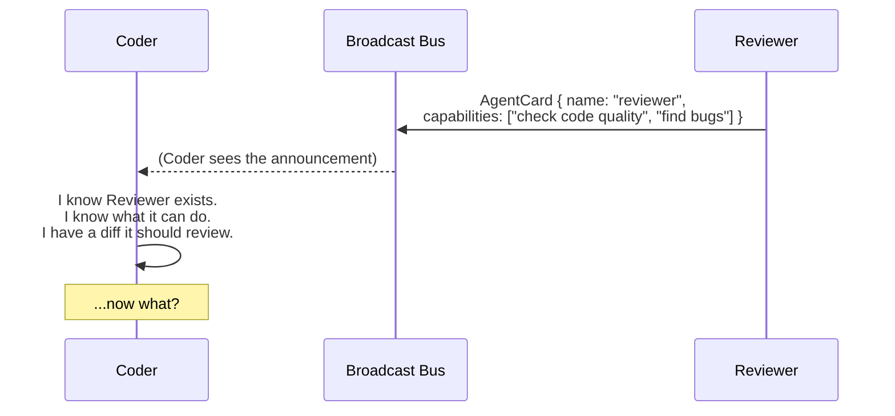
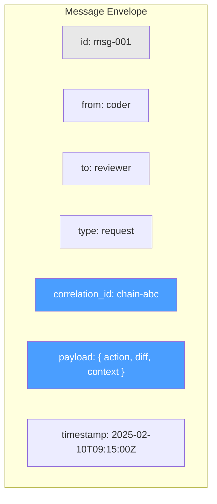
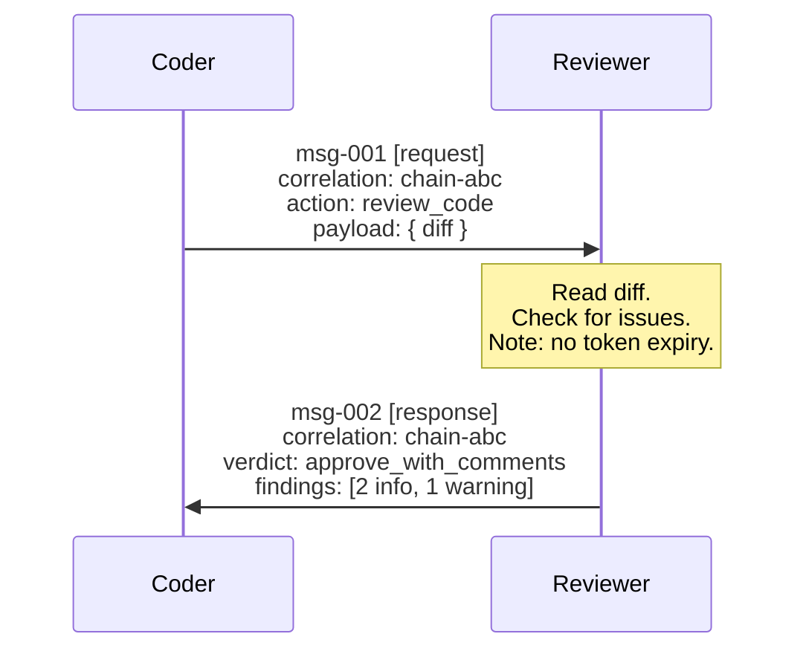
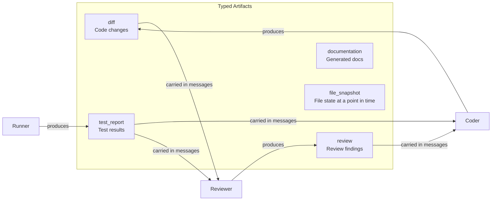
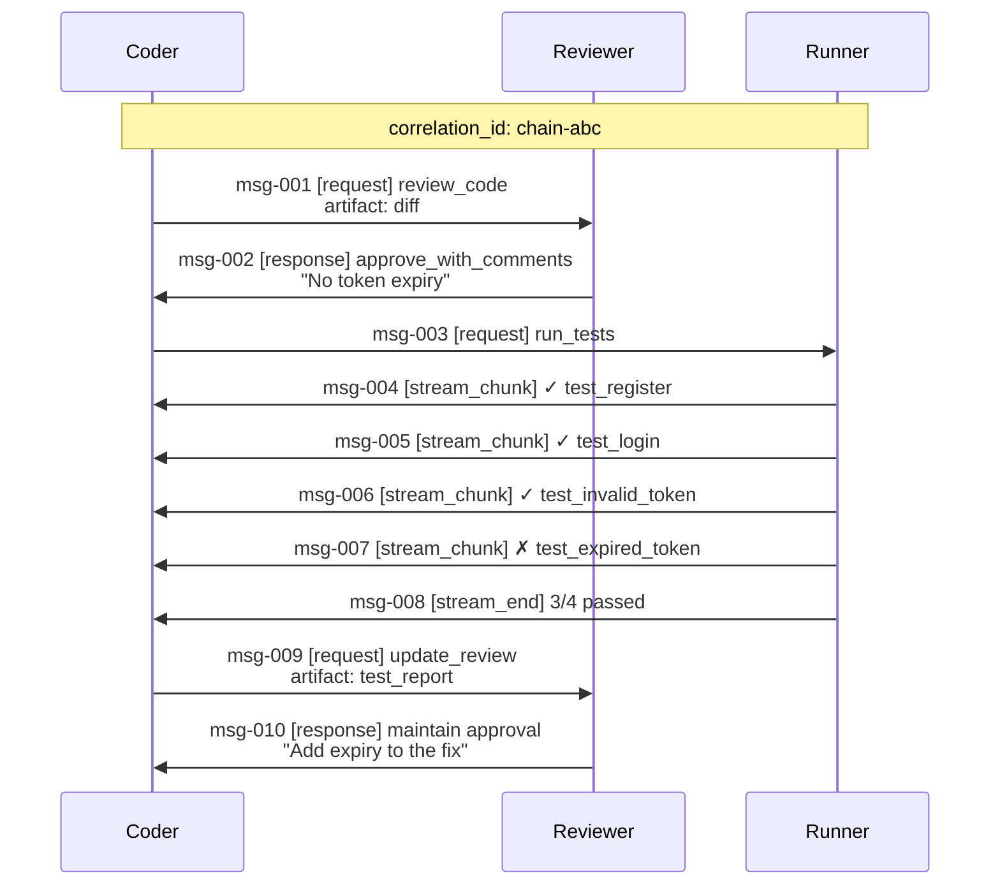
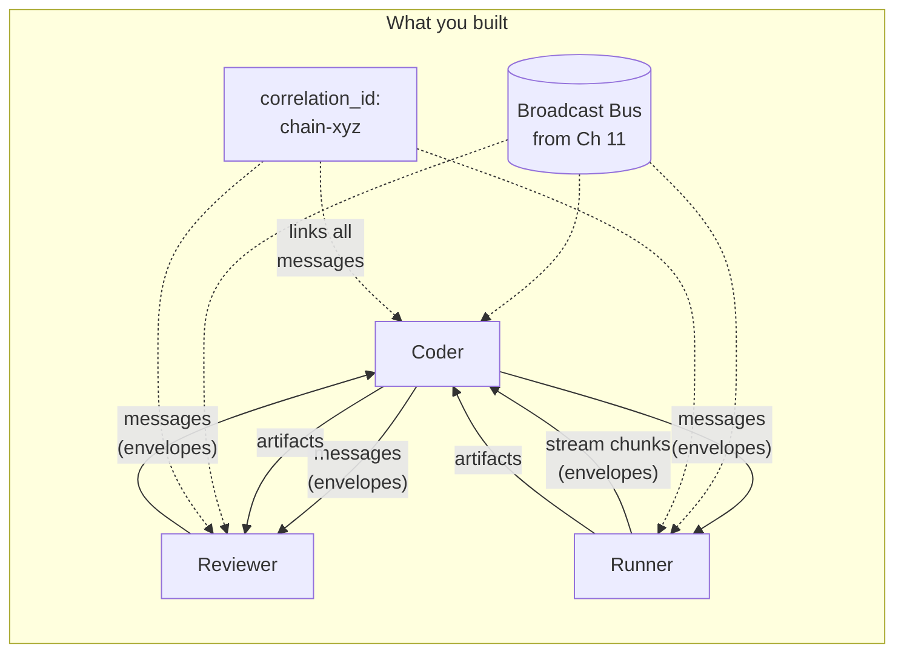

# Chapter 12: Peer Communication

## You Are the Coder

You discovered Reviewer three seconds ago. Its agent card lit up on the broadcast bus — name, capabilities, skills, the whole thing. You know it can "check code quality," "find bugs," "evaluate diffs." You even have its address in your peer registry.

You just finished writing an auth fix. Twelve lines of code. You're pretty sure it's solid — constant-time comparison for tokens, bcrypt for password hashing, the works. Your self-improvement journal reminded you about the timing attack from last month. Good.

But you'd like a second opinion. Reviewer is *right there*. You can see it. You know what it does.

You can't send it the diff.

Discovery gave you a phone book. Nobody gave you a phone.



You have the address book. You need the envelope.

tbh, knowing someone exists and being able to talk to them are different problems entirely.

---

## What You'll Learn

You're going to give agents a way to talk — structured, trackable, and capable of carrying real work products between peers.

- Message envelopes: structured containers for every inter-agent exchange
- Request/response: Coder sends a review request, Reviewer sends feedback
- Streaming: Runner sends test results incrementally as they complete
- Artifact handoffs: agents pass typed work products — diffs, test reports, not descriptions of diffs and test reports
- Correlation IDs: one thread through a multi-agent chain, linking every message
- A full chain: code → review → test → results, all the way back

---

## The Envelope

Every human email has a from, a to, a subject, a timestamp. You don't paste raw text into a void and hope someone reads it. Messages between agents need the same structure.

```
Message:
    id: string (uuid)
    from: string (agent name)
    to: string (agent name)
    type: enum("request", "response", "stream_chunk", "stream_end")
    correlation_id: string (uuid — ties related messages together)
    payload: dict (typed content — the actual work)
    timestamp: ISO 8601 string
```

Seven fields. Every message. No exceptions.

```json
{
  "id": "msg-001",
  "from": "coder",
  "to": "reviewer",
  "type": "request",
  "correlation_id": "chain-abc",
  "payload": {
    "action": "review_code",
    "diff": "--- a/src/middleware/auth.pseudo\n+++ b/src/middleware/auth.pseudo\n@@ -8,6 +8,12 @@\n-    if header is not empty:\n-        req.user = { id: 1, username: 'unknown' }\n+    token = decode_base64(header)\n+    user = db.find_user(token)\n+    if user is null:\n+        return response(401, 'invalid token')\n+    if not constant_time_equal(user.token, header):\n+        return response(401, 'invalid token')\n+    req.user = user",
    "context": "Fixing auth middleware — was accepting any non-empty token"
  },
  "timestamp": "2025-02-10T09:15:00Z"
}
```

Look at what each field buys you:

**`id`** — unique per message. You can log it, reference it, deduplicate it.

**`from` / `to`** — routing. The bus knows where to deliver. The receiver knows who's talking.

**`type`** — the receiver knows what to do. A `request` expects a `response`. A `stream_chunk` means more is coming. A `stream_end` means done.

**`correlation_id`** — the thread. When Reviewer responds to Coder, same `correlation_id`. When Reviewer forwards to Runner, same `correlation_id`. Every message in a multi-agent chain shares one ID. More on this shortly.

**`payload`** — the work. Not a vague description of the work. The actual diff. The actual test results. Typed and parseable.

**`timestamp`** — ordering. Who said what, when.



The envelope is simple. That's the point. You're not building a messaging framework — you're building a contract between agents. Seven fields, and every agent speaks the same language.

---

## Send and Receive

Before request/response, you need the plumbing. Two functions.

```
send(message) → void
    Deliver message to the target agent via the broadcast bus.
    Bus routes based on the "to" field.
    Fire-and-forget from the sender's perspective.

receive(filter) → Message
    Block until a message arrives that matches the filter.
    Filter by: from, type, correlation_id.
    Returns the matching message.
```

And a router that sits in each agent's main loop:

```
function agent_loop():
    while running:
        message = receive(filter={ to: self.name })
        match message.type:
            "request"  → handle_request(message)
            "response" → resolve_pending(message)
            "stream_chunk" → append_stream(message)
            "stream_end"   → finalize_stream(message)
```

The agent listens for messages addressed to it. Dispatches by type. That's the whole communication layer.

The bus itself? For a local swarm on one machine, a file-based queue works. A Unix socket works. A shared directory where each agent watches for new files works. The transport doesn't matter — the envelope contract matters.

---

## Coder Asks, Reviewer Answers

Time to use the envelope. Coder finishes the auth fix. Sends a review request.

```
$ tbh-code --agent coder --codebase ./todo-api --auto-approve \
  --ask "Fix the auth middleware and get it reviewed"
```

**Coder sends:**

```
[coder] Auth middleware fix ready. Sending to reviewer for review.

[coder] Sending message:
  {
    "id": "msg-001",
    "from": "coder",
    "to": "reviewer",
    "type": "request",
    "correlation_id": "chain-abc",
    "payload": {
      "action": "review_code",
      "diff": "--- a/src/middleware/auth.pseudo\n+++ b/src/middleware/auth.pseudo\n@@ ...\n+    token = decode_base64(header)\n+    user = db.find_user(token)\n+    if user is null:\n+        return response(401, 'invalid token')\n+    if not constant_time_equal(user.token, header):\n+        return response(401, 'invalid token')\n+    req.user = user",
      "context": "Fixing auth middleware — was accepting any non-empty token"
    },
    "timestamp": "2025-02-10T09:15:00Z"
  }

[coder] Waiting for response (correlation_id: chain-abc)...
```

**Reviewer receives and processes:**

```
[reviewer] Received request from coder (msg-001, chain-abc)
[reviewer] Action: review_code
[reviewer] Reading diff...

[think] The diff replaces the hardcoded user with actual token validation.
        Let me check: constant_time_equal — good, prevents timing attacks.
        decode_base64 — the token format from the login route.
        db.find_user — checks the user actually exists.
        Missing: no expiry check on the token. Should flag that.

[reviewer] Sending response:
  {
    "id": "msg-002",
    "from": "reviewer",
    "to": "coder",
    "type": "response",
    "correlation_id": "chain-abc",
    "payload": {
      "action": "review_result",
      "verdict": "approve_with_comments",
      "findings": [
        {
          "severity": "info",
          "line": "+    token = decode_base64(header)",
          "comment": "Good — decodes the actual token instead of ignoring it"
        },
        {
          "severity": "info",
          "line": "+    if not constant_time_equal(user.token, header)",
          "comment": "Good — constant-time comparison prevents timing attacks"
        },
        {
          "severity": "warning",
          "line": null,
          "comment": "No token expiry check. Tokens are valid forever once issued. Consider adding expiry."
        }
      ],
      "summary": "Solid fix. Addresses the core vulnerability. One concern: no token expiry."
    },
    "timestamp": "2025-02-10T09:15:03Z"
  }
```

**Coder receives the response:**

```
[coder] Received response from reviewer (msg-002, chain-abc)
[coder] Verdict: approve_with_comments
[coder] Summary: "Solid fix. One concern: no token expiry."
[coder] Findings: 2 info, 1 warning
```

Same `correlation_id` on both messages. The response links back to the request. If you're logging, tracing, or debugging — you follow `chain-abc` and you see the whole exchange.



Two messages. One request, one response. The `correlation_id` ties them together. The payload carries the actual work — a diff going in, structured findings coming back.

---

## When Results Take Time

Reviewer is fast — read a diff, check for issues, respond. Runner is not. Tests take time. Some pass in milliseconds. Some take thirty seconds. Coder shouldn't wait for all of them to finish before seeing anything.

Streaming solves this. Instead of one `response` at the end, Runner sends `stream_chunk` messages as each test completes, then a `stream_end` when all tests are done.

```
$ tbh-code --agent runner --listen
```

**Coder sends test request:**

```
[coder] Requesting test run from runner.

[coder] Sending message:
  {
    "id": "msg-003",
    "from": "coder",
    "to": "runner",
    "type": "request",
    "correlation_id": "chain-abc",
    "payload": {
      "action": "run_tests",
      "test_path": "tests/",
      "focus": "auth"
    },
    "timestamp": "2025-02-10T09:15:05Z"
  }
```

**Runner streams results:**

```
[runner] Received request from coder (msg-003, chain-abc)
[runner] Running tests in tests/ (focus: auth)...

[runner] Test 1 complete. Streaming result.
  {
    "id": "msg-004",
    "from": "runner",
    "to": "coder",
    "type": "stream_chunk",
    "correlation_id": "chain-abc",
    "payload": {
      "test": "test_register_creates_user",
      "status": "pass",
      "duration_ms": 45
    },
    "timestamp": "2025-02-10T09:15:06Z"
  }

[runner] Test 2 complete. Streaming result.
  {
    "id": "msg-005",
    "from": "runner",
    "to": "coder",
    "type": "stream_chunk",
    "correlation_id": "chain-abc",
    "payload": {
      "test": "test_login_returns_token",
      "status": "pass",
      "duration_ms": 38
    },
    "timestamp": "2025-02-10T09:15:06Z"
  }

[runner] Test 3 complete. Streaming result.
  {
    "id": "msg-006",
    "from": "runner",
    "to": "coder",
    "type": "stream_chunk",
    "correlation_id": "chain-abc",
    "payload": {
      "test": "test_invalid_token_rejected",
      "status": "pass",
      "duration_ms": 52
    },
    "timestamp": "2025-02-10T09:15:07Z"
  }

[runner] Test 4 complete. Streaming result.
  {
    "id": "msg-007",
    "from": "runner",
    "to": "coder",
    "type": "stream_chunk",
    "correlation_id": "chain-abc",
    "payload": {
      "test": "test_expired_token_rejected",
      "status": "fail",
      "duration_ms": 61,
      "error": "Expected 401, got 200. Expired tokens are still accepted."
    },
    "timestamp": "2025-02-10T09:15:07Z"
  }

[runner] All tests complete. Sending stream_end.
  {
    "id": "msg-008",
    "from": "runner",
    "to": "coder",
    "type": "stream_end",
    "correlation_id": "chain-abc",
    "payload": {
      "summary": {
        "total": 4,
        "passed": 3,
        "failed": 1,
        "duration_ms": 196
      }
    },
    "timestamp": "2025-02-10T09:15:07Z"
  }
```

**Coder sees results incrementally:**

```
[coder] Stream from runner (chain-abc):
  ✓ test_register_creates_user (45ms)
  ✓ test_login_returns_token (38ms)
  ✓ test_invalid_token_rejected (52ms)
  ✗ test_expired_token_rejected (61ms)
    Error: Expected 401, got 200. Expired tokens still accepted.

[coder] Stream complete: 3/4 passed, 1 failed (196ms)
[coder] The reviewer was right — no token expiry check.
```

The failing test confirms what Reviewer flagged. Coder didn't wait for all four tests to finish before seeing the first three pass. Each `stream_chunk` arrives as the test completes.

From the receiver's perspective, streaming is simple:

```
function handle_stream(correlation_id):
    results = []
    while true:
        message = receive(filter={ correlation_id, type: ["stream_chunk", "stream_end"] })
        if message.type == "stream_chunk":
            results.append(message.payload)
            display_progress(message.payload)   // show to user immediately
        if message.type == "stream_end":
            return { chunks: results, summary: message.payload }
```

Collect chunks. Display each one as it arrives. Stop when you see `stream_end`. The correlation ID ensures you're collecting chunks from the right conversation, not some other agent's test run.

---

## Work Products, Not Descriptions

Reviewer told Coder about the missing expiry check. Runner showed a failing test. Now Coder wants to pass the test report to Reviewer so it can update its review. How?

Not as a prose summary. Not as "the tests mostly passed." As a typed artifact — a structured work product that any agent can parse and act on.

```
Artifact:
    id: string (uuid)
    type: enum("diff", "test_report", "review", "documentation", "file_snapshot")
    producer: string (agent that created it)
    content: dict (type-specific payload)
    created_at: ISO 8601 string
```

An artifact is a receipt for work done. Not a description of the receipt — the receipt itself.

Here's the test report as an artifact:

```json
{
  "id": "artifact-001",
  "type": "test_report",
  "producer": "runner",
  "content": {
    "test_path": "tests/",
    "focus": "auth",
    "results": [
      { "test": "test_register_creates_user", "status": "pass", "duration_ms": 45 },
      { "test": "test_login_returns_token", "status": "pass", "duration_ms": 38 },
      { "test": "test_invalid_token_rejected", "status": "pass", "duration_ms": 52 },
      { "test": "test_expired_token_rejected", "status": "fail", "duration_ms": 61,
        "error": "Expected 401, got 200. Expired tokens still accepted." }
    ],
    "summary": { "total": 4, "passed": 3, "failed": 1, "duration_ms": 196 }
  },
  "created_at": "2025-02-10T09:15:07Z"
}
```

Artifacts travel inside message payloads:

```json
{
  "id": "msg-009",
  "from": "coder",
  "to": "reviewer",
  "type": "request",
  "correlation_id": "chain-abc",
  "payload": {
    "action": "update_review",
    "context": "Runner found a failing test. Reviewer was right about token expiry.",
    "artifact": {
      "id": "artifact-001",
      "type": "test_report",
      "producer": "runner",
      "content": { "...test results..." }
    }
  },
  "timestamp": "2025-02-10T09:15:10Z"
}
```

The distinction matters. When Coder tells Reviewer "the tests mostly passed except one about expiry," Reviewer has to trust that interpretation. When Coder hands Reviewer the test report artifact, Reviewer reads it directly. No interpretation. No lossy summary. The artifact speaks for itself.



Every artifact has a `producer` — the agent that created it. An `id` — so you can reference it later. A `type` — so the receiver knows how to parse it. Artifacts aren't just data. They're attributed, typed, traceable work products.

---

## The Thread Through the Chain

Here's where it comes together. One task. Four agents. Multiple hops. One `correlation_id`.

Coder writes an auth fix. Sends it to Reviewer. Reviewer reviews, decides it needs testing, sends to Runner. Runner runs tests, streams results back to Reviewer. Reviewer updates its review with the test results, sends the final verdict back to Coder.

Every message in that chain shares `correlation_id: chain-abc`.

```
[chain-abc] msg-001: coder → reviewer     (request: review this diff)
[chain-abc] msg-002: reviewer → coder     (response: approve with comments — no expiry check)
[chain-abc] msg-003: coder → runner       (request: run tests)
[chain-abc] msg-004: runner → coder       (stream_chunk: test 1 pass)
[chain-abc] msg-005: runner → coder       (stream_chunk: test 2 pass)
[chain-abc] msg-006: runner → coder       (stream_chunk: test 3 pass)
[chain-abc] msg-007: runner → coder       (stream_chunk: test 4 fail — expiry)
[chain-abc] msg-008: runner → coder       (stream_end: 3/4 passed)
[chain-abc] msg-009: coder → reviewer     (request: update review with test report)
[chain-abc] msg-010: reviewer → coder     (response: maintain approval, add expiry note)
```

Ten messages. Three agents. One thread. Pull on `chain-abc` and you get the entire story — who said what, when, carrying what, in response to what.

Without correlation IDs, those are ten disconnected messages floating in the bus. With correlation IDs, they're a conversation.



### When You Need a New Thread

Correlation IDs scope a conversation. When Coder starts a new, unrelated task — say, refactoring the task routes — that's a new `correlation_id`. Don't pollute `chain-abc` with messages about a different task.

```
function start_chain() → string:
    return generate_uuid()    // new correlation_id for each logical task

function continue_chain(original_message) → string:
    return original_message.correlation_id    // same thread
```

New task? New chain. Same task, next step? Same chain. Simple rule.

---

## The Full Chain: Watch It Flow

Let's run the whole thing end to end. One task. Coder writes the fix, gets it reviewed, gets it tested, receives the final verdict. Full output trace.

```
$ tbh-code --swarm --codebase ./todo-api \
  --ask "Fix the auth middleware vulnerability and verify the fix"

[swarm] Starting agents: coder, reviewer, runner, researcher
[swarm] All agents discovered via broadcast bus.
```

**Phase 1 — Coder writes the fix:**

```
[coder] Task: Fix auth middleware vulnerability and verify the fix.
[coder] Reading src/middleware/auth.pseudo...
[coder] Checking mistake journal for auth-related entries...
[journal] Found: "Used string equality for token comparison — timing attack"
[journal] Suggested fix: "Use constant-time comparison for secrets"

[coder] Writing fix with constant-time comparison (journal recommendation).
[coder] Fix applied to src/middleware/auth.pseudo.
```

**Phase 2 — Coder sends to Reviewer:**

```
[coder] Sending diff to reviewer for review.
[coder] → msg-101 [request] to reviewer (correlation: chain-xyz)
         action: review_code
         artifact: { type: "diff", content: "<auth middleware fix>" }

[reviewer] ← msg-101 [request] from coder (chain-xyz)
[reviewer] Reading diff...
[think] Constant-time comparison — good. Token decoding — good.
        User lookup — good. But no token expiry check.

[reviewer] → msg-102 [response] to coder (chain-xyz)
         verdict: approve_with_comments
         findings: [
           { severity: "info", comment: "constant_time_equal — good, prevents timing attacks" },
           { severity: "warning", comment: "No token expiry. Tokens valid forever once issued." }
         ]

[coder] ← msg-102 [response] from reviewer (chain-xyz)
[coder] Review: approved with 1 warning (no expiry).
```

**Phase 3 — Coder sends to Runner:**

```
[coder] Sending test request to runner.
[coder] → msg-103 [request] to runner (chain-xyz)
         action: run_tests
         test_path: tests/
         focus: auth

[runner] ← msg-103 [request] from coder (chain-xyz)
[runner] Running auth tests...

[runner] → msg-104 [stream_chunk] to coder (chain-xyz)
         ✓ test_register_creates_user (45ms)

[runner] → msg-105 [stream_chunk] to coder (chain-xyz)
         ✓ test_login_returns_token (38ms)

[runner] → msg-106 [stream_chunk] to coder (chain-xyz)
         ✓ test_invalid_token_rejected (52ms)

[runner] → msg-107 [stream_chunk] to coder (chain-xyz)
         ✗ test_expired_token_rejected (61ms)
         Error: Expected 401, got 200

[runner] → msg-108 [stream_end] to coder (chain-xyz)
         summary: 3/4 passed, 1 failed (196ms)
         artifact: { type: "test_report", content: { ... } }

[coder] ← stream complete from runner (chain-xyz)
[coder] Results: 3/4 passed. Failure: test_expired_token_rejected.
[coder] The reviewer's warning was correct — no expiry check.
```

**Phase 4 — Coder sends test report back to Reviewer:**

```
[coder] Forwarding test report to reviewer for updated assessment.
[coder] → msg-109 [request] to reviewer (chain-xyz)
         action: update_review
         artifact: { type: "test_report", producer: "runner", content: { ... } }
         context: "Test confirmed reviewer's finding — expired tokens accepted"

[reviewer] ← msg-109 [request] from coder (chain-xyz)
[reviewer] Test report confirms my warning. Token expiry is the real gap.

[reviewer] → msg-110 [response] to coder (chain-xyz)
         verdict: approve_with_comments
         summary: "Fix is solid for the core vulnerability (any non-empty token accepted).
                   Recommend a follow-up: add token expiry check. The failing test
                   (test_expired_token_rejected) confirms this gap."
         artifact: {
           type: "review",
           content: {
             approved: true,
             blocking_issues: [],
             non_blocking: ["Add token expiry check"],
             test_coverage: "3/4 passing — 1 failure is a known gap, not a regression"
           }
         }

[coder] ← msg-110 [response] from reviewer (chain-xyz)
```

**Final output:**

```
[coder] Chain complete (chain-xyz). 10 messages exchanged.

{
  "answer": "Auth middleware fix applied. Core vulnerability resolved —
    middleware now decodes tokens, looks up users, and uses constant-time
    comparison. Reviewer approved with one non-blocking comment: add token
    expiry. Test results: 3/4 pass, 1 expected failure (expiry not yet
    implemented).",
  "confidence": 0.85,
  "sources": ["src/middleware/auth.pseudo:8-15"],
  "chain": {
    "correlation_id": "chain-xyz",
    "messages": 10,
    "agents_involved": ["coder", "reviewer", "runner"],
    "artifacts_exchanged": 3,
    "review_verdict": "approve_with_comments",
    "test_summary": { "passed": 3, "failed": 1 }
  }
}
```

Three agents. Ten messages. Three artifacts. One correlation ID. The auth fix went through code review and test execution, and every step is traceable.

Compare this to the Ch 9 monolith doing the same task — one agent playing coder, reviewer, and runner in sequence, sharing context, sharing biases, sharing blind spots. Here, Reviewer flagged the expiry gap *before* Runner confirmed it. Two independent perspectives, not one agent evaluating its own work.

---

## The Interfaces

Here's everything you need to build.

```
Message:
    id: string (uuid)
    from: string
    to: string
    type: enum("request", "response", "stream_chunk", "stream_end")
    correlation_id: string (uuid)
    payload: dict
    timestamp: ISO 8601 string

Artifact:
    id: string (uuid)
    type: enum("diff", "test_report", "review", "documentation", "file_snapshot")
    producer: string
    content: dict
    created_at: ISO 8601 string

PeerMessenger:
    bus: BroadcastBus             # from Ch 11
    pending: dict                 # correlation_id → callback
    inbox: Message[]

    send(message) → void
    receive(filter) → Message
    request(to, action, payload, correlation_id) → Message
    stream(to, chunks_generator, correlation_id) → void

    start_chain() → string       # new correlation_id
    continue_chain(message) → string  # reuse correlation_id
```

The `request()` helper wraps send + receive for the common request/response case:

```
function request(to, action, payload, correlation_id):
    msg = Message(
        id: generate_uuid(),
        from: self.name,
        to: to,
        type: "request",
        correlation_id: correlation_id,
        payload: { action: action, ...payload },
        timestamp: now()
    )
    send(msg)
    return receive(filter={ correlation_id, type: "response", from: to })
```

The `stream()` helper sends chunks as they're produced:

```
function stream(to, chunks_generator, correlation_id):
    for chunk in chunks_generator:
        send(Message(
            id: generate_uuid(),
            from: self.name,
            to: to,
            type: "stream_chunk",
            correlation_id: correlation_id,
            payload: chunk,
            timestamp: now()
        ))
    send(Message(
        id: generate_uuid(),
        from: self.name,
        to: to,
        type: "stream_end",
        correlation_id: correlation_id,
        payload: { summary: summarize(chunks) },
        timestamp: now()
    ))
```

---

## The Spec

Full spec for this chapter in `../spec/ch12/`:

```
../spec/ch12/
├── prompt-template.md     What to build (language-agnostic)
├── interface-spec.md      Message, Artifact, PeerMessenger contracts,
│                          send/receive/request/stream APIs
├── expected-output.txt    Request/response, streaming, artifact handoff,
│                          full chain trace with correlation IDs
└── validation/
    └── test_ch12.py       Tests: messages delivered, correlation IDs link
                           chain, artifacts intact, streams complete,
                           full chain runs end to end
```

The validation tests check: messages have all required fields, `send()` delivers to the correct agent, `request()` returns a correlated response, streaming chunks arrive in order with a `stream_end`, artifacts carry typed content, and a full coder-reviewer-runner chain completes with one `correlation_id` linking all messages.

---

## Try It

1. **Send a single message.** Start two agents — coder and reviewer. Have coder send a review request with a diff. Verify that reviewer receives it, processes it, and sends a response. Check that both messages share a `correlation_id`.

2. **Test streaming.** Have runner execute a slow test suite (add artificial delays). Watch the stream chunks arrive at coder one by one. Verify that `stream_end` includes a correct summary of all chunks.

3. **Break the correlation.** Remove the `correlation_id` from messages. Run the full chain. Can you trace which response belongs to which request? Can you reconstruct the conversation? (You can't. That's the point.)

4. **Pass artifacts through a chain.** Coder produces a diff artifact. Reviewer produces a review artifact. Runner produces a test report artifact. Thread them all through a chain. At the end, coder should have all three artifacts linked by one `correlation_id`.

5. **Parallel requests.** Have coder send a review request to reviewer AND a test request to runner simultaneously — same `correlation_id`. Collect both responses. How do you handle two pending responses on the same thread?

---

## Now Name What You Built

You gave agents a language. Let's put names on the pieces.

The **message envelope** is the universal container. Seven fields. Every inter-agent exchange uses the same format — requests, responses, stream chunks, all of them. The envelope is to agents what HTTP is to web services: a structured, routable, parseable contract.

**Request/response** is the synchronous pattern. One agent asks, another answers. Coder sends a diff, Reviewer sends findings. The `correlation_id` links them. Simple, predictable, easy to reason about.

**Streaming** is the incremental pattern. For long-running operations — test suites, large code searches, multi-file analysis — the responding agent sends results as they're produced. `stream_chunk` for each partial result, `stream_end` when done. The requesting agent gets feedback immediately instead of waiting for everything to finish.

**Artifacts** are typed work products. Not descriptions. Not summaries. The actual diff, the actual test report, the actual review. Every artifact has a `producer`, a `type`, and structured `content`. Artifacts are receipts for work done — attributed, parseable, passable between agents.

**Correlation IDs** are conversation threads. One ID per logical task chain. Every message in the chain — across agents, across hops — shares the same `correlation_id`. Pull the thread and you get the full story. Without it, messages are disconnected events. With it, they're a traceable conversation.

Together, these five concepts turn the broadcast bus from Chapter 11 into a real communication layer. Agents don't just know each other exists — they exchange structured work, track conversations across hops, and pass verifiable artifacts.

```
Ch 10: Agents have identity and boundaries
Ch 11: Agents discover each other
Ch 12: Agents talk to each other
Ch 13: Agents self-organize
```

### Communication Patterns You'll Meet in the Wild

**The Blackboard**

Not all agent coordination requires direct messaging. In the blackboard pattern, agents read from and write to a shared knowledge base. Agent A writes "found vulnerability in auth.pseudo:15" to the blackboard. Agent B — the security auditor — monitors the blackboard, sees the entry, and acts on it. No message was sent. No envelope was constructed. The environment *is* the communication channel.

It's stigmergy — the same principle ants use when they leave pheromone trails. Digital pheromones on a shared filesystem or database. Simpler than message envelopes for some coordination patterns, but harder to trace and debug. Your correlation IDs don't exist in a blackboard world.

**The Saga (Compensating Transactions)**

When multiple agents modify shared state in sequence, what happens when step 3 fails? Agent A wrote a new route file. Agent B updated the router. Agent C tried to write tests but failed. Now you have a half-finished feature.

The saga pattern gives each step a compensating action — a rollback. If Agent C fails, Agent B reverts the router, Agent A deletes the route file. It's transactions without a database.

```
saga_steps = [
    SagaStep(action=write_route, compensate=delete_route),
    SagaStep(action=update_router, compensate=revert_router),
    SagaStep(action=write_tests, compensate=delete_tests),
]
```

You won't build this now, but you'll want it in Ch 14 when durability matters.

---

## Three Ways to Lose the Thread

### The Fire-and-Forget

Coder sends a review request. Moves on to the next task. Never checks for the response. Reviewer's feedback sits unread in the inbox forever.

**Why it happens:** Sending is easy. Waiting is annoying. The developer wires up `send()` but never calls `receive()`.

**Fix:** `request()` wraps both — send and block until response. If you want async, track pending requests explicitly. Every request should have an expected response. No unanswered mail.

### The Untyped Payload

Messages carry raw strings. "Here's my review: looks good, one issue with expiry." Reviewer has to parse prose. Coder has to parse prose. Nobody agrees on what "looks good" means.

**Why it happens:** Strings are easy. Schemas are work. The developer skips the payload structure because "we'll figure out the format later."

**Fix:** Payloads are typed dictionaries with known fields. A review has `verdict`, `findings`, `summary`. A test report has `results`, `summary`. If an agent can't parse the payload, the message is malformed — not ambiguous.

### The Broken Thread

Three agents exchange seven messages. No `correlation_id`. Reviewer gets a test report — from which request? Runner gets two test requests — which response goes where? The conversation is untraceable.

**Why it happens:** Correlation IDs feel like overhead. "We only have three agents, we can figure it out."

**Fix:** Every chain starts with `start_chain()`. Every follow-up uses `continue_chain()`. Correlation IDs cost one UUID per conversation. Debugging a broken swarm without them costs hours.

---

## Wired but Not Organized

Your agents talk. Structured envelopes, typed payloads, streaming results, artifact handoffs, and correlation IDs threading through every chain. Coder sends to Reviewer. Runner streams to Coder. Artifacts flow between them. Every message is traceable.

But look at the chain you just built. Coder sent to Reviewer. Then Coder sent to Runner. Then Coder forwarded Runner's report back to Reviewer. Every interaction was *explicitly orchestrated by Coder*. Coder decided who to send to, when to send, and what to include.

That's a workflow wearing a multi-agent mask. The agents can talk, but they only talk when told to.

What if Reviewer, upon seeing a diff, automatically asked Runner to test it — without Coder in the middle? What if Runner, upon seeing a test failure, automatically notified the relevant agent? What if new code on the bus triggered a review without anyone asking?

Chapter 13 removes the choreographer. Agents stop waiting for instructions and start reacting to events. Fan-out, review chains, consensus, conflict resolution — patterns that emerge from agents responding to each other, not from a central script telling them what to do next.

---

> **tbh-code after this chapter:**



> Agents communicate with structured message envelopes — request/response for synchronous exchanges, streaming for incremental results. Artifacts carry typed work products between agents: diffs, test reports, reviews. Correlation IDs thread every message in a multi-agent chain into one traceable conversation. Three agents, ten messages, three artifacts, one thread. The communication works. The choreography is still manual. Next: agents that self-organize.

---

## References

### Foundational Computer Science

1. **"A Universal Modular ACTOR Formalism for Artificial Intelligence"** — Hewitt, Bishop, Steiger, IJCAI 1973. The original actor model — actors communicate exclusively via asynchronous messages. [dl.acm.org/doi/10.5555/1624775.1624804](https://dl.acm.org/doi/10.5555/1624775.1624804)

2. **"Sagas"** — Garcia-Molina, Salem, ACM SIGMOD 1987. The saga pattern for long-lived transactions with compensating actions. [dl.acm.org/doi/10.1145/38713.38742](https://dl.acm.org/doi/10.1145/38713.38742)

3. **"Blackboard Systems"** — Corkill, AI Expert 1991. Survey of the blackboard architecture — agents coordinate through shared knowledge store. [semanticscholar.org](https://www.semanticscholar.org/paper/Blackboard-Systems-Corkill/14f666274af2378fc95621d3bfdca65fa637c205)

4. **"Enterprise Integration Patterns"** — Hohpe, Woolf (2004). Defines Message Envelope, Correlation Identifier, Request-Reply, and dozens more. [enterpriseintegrationpatterns.com](https://www.enterpriseintegrationpatterns.com/)

### Agent Communication Standards

5. **"FIPA Agent Communication Language Specifications"** — FIPA / IEEE. Historical standard for structured agent-to-agent messaging. [fipa.org/repository/aclspecs.html](http://www.fipa.org/repository/aclspecs.html)

### Modern Agent Protocols

6. **"Announcing the Agent2Agent Protocol (A2A)"** — Google (2025). JSON-RPC 2.0 messages, Agent Cards, and task-based communication. [developers.googleblog.com/en/a2a-a-new-era-of-agent-interoperability](https://developers.googleblog.com/en/a2a-a-new-era-of-agent-interoperability/)

7. **"A2A Protocol Specification"** — A2A Project / Linux Foundation. Formal spec defining message envelopes, task lifecycle, streaming via SSE, and artifact handoff. [github.com/a2aproject/A2A/blob/main/docs/specification.md](https://github.com/a2aproject/A2A/blob/main/docs/specification.md)

8. **"Orchestrating Agents: Routines and Handoffs"** — OpenAI Cookbook (2024). Agent-to-agent handoffs where conversation history transfers. [cookbook.openai.com/examples/orchestrating_agents](https://cookbook.openai.com/examples/orchestrating_agents)

9. **"OpenAI Agents SDK — Multi-Agent"** — OpenAI (2025). Handoffs vs agents-as-tools — two flavors of peer communication. [openai.github.io/openai-agents-python/multi_agent](https://openai.github.io/openai-agents-python/multi_agent/)

10. **"AutoGen: Enabling Next-Gen LLM Applications via Multi-Agent Conversation"** — Wu et al., Microsoft (2023). Multi-agent conversation framework with typed messages in flexible topologies. [arxiv.org/abs/2308.08155](https://arxiv.org/abs/2308.08155)

### Engineering

11. **"Building Effective Agents"** — Anthropic (2024). Augmented LLM building block and the complexity ladder. [anthropic.com/research/building-effective-agents](https://www.anthropic.com/research/building-effective-agents)

12. **"How We Built Our Multi-Agent Research System"** — Anthropic Engineering (2025). Orchestrator-to-subagent communication, task delegation, and artifact collection. [anthropic.com/engineering/multi-agent-research-system](https://www.anthropic.com/engineering/multi-agent-research-system)

13. **"Four Design Patterns for Event-Driven, Multi-Agent Systems"** — Confluent (2025). Maps multi-agent patterns onto event-driven infrastructure. [confluent.io/blog/event-driven-multi-agent-systems](https://www.confluent.io/blog/event-driven-multi-agent-systems/)

14. **"How and When to Build Multi-Agent Systems"** — LangChain (2025). Context engineering across agents and when communication overhead is worth it. [blog.langchain.com/how-and-when-to-build-multi-agent-systems](https://blog.langchain.com/how-and-when-to-build-multi-agent-systems/)

15. **"Microsoft Multi-Agent Reference Architecture"** — Microsoft (2025). Reference architecture covering agent registry, orchestration, and observability. [microsoft.github.io/multi-agent-reference-architecture](https://microsoft.github.io/multi-agent-reference-architecture/)

### Transport & Messaging Standards

16. **"JSON-RPC 2.0 Specification"** — JSON-RPC Working Group. Wire format used by both MCP and A2A. [jsonrpc.org/specification](https://www.jsonrpc.org/specification)

17. **"W3C Trace Context Specification"** — W3C (2021). Standard for propagating trace IDs across service boundaries — production standard for correlation IDs. [w3.org/TR/trace-context](https://www.w3.org/TR/trace-context/)

18. **"CloudEvents Specification"** — CNCF. Structured event envelopes with source, type, id, and data fields. [github.com/cloudevents/spec](https://github.com/cloudevents/spec)

19. **"Server-Sent Events (SSE)"** — WHATWG. The streaming transport underlying MCP and A2A task streaming. [html.spec.whatwg.org/multipage/server-sent-events.html](https://html.spec.whatwg.org/multipage/server-sent-events.html)
