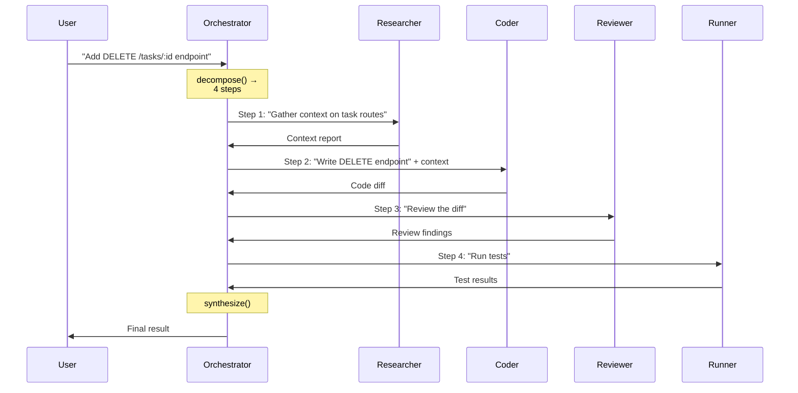
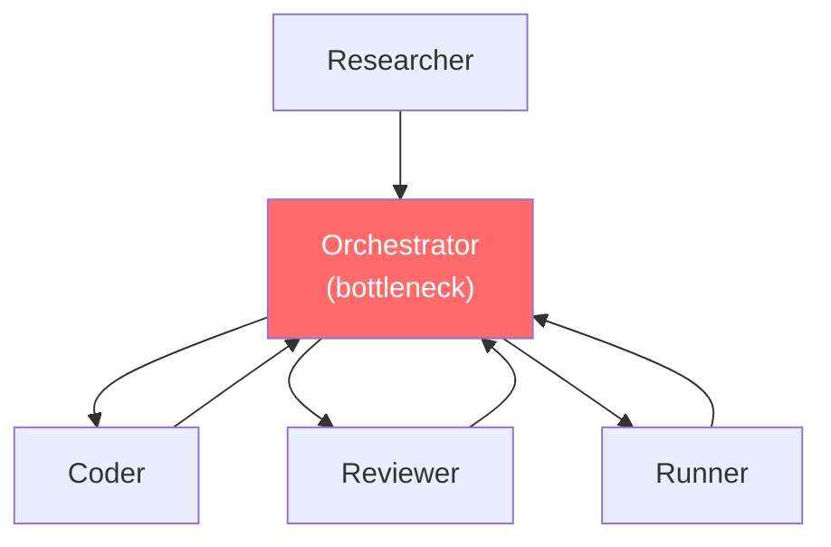
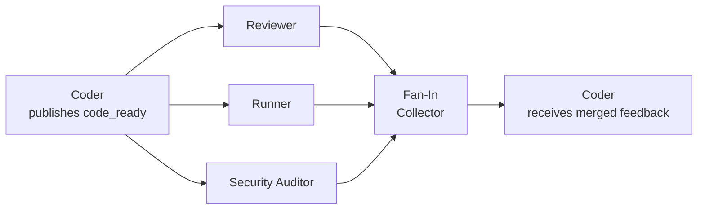
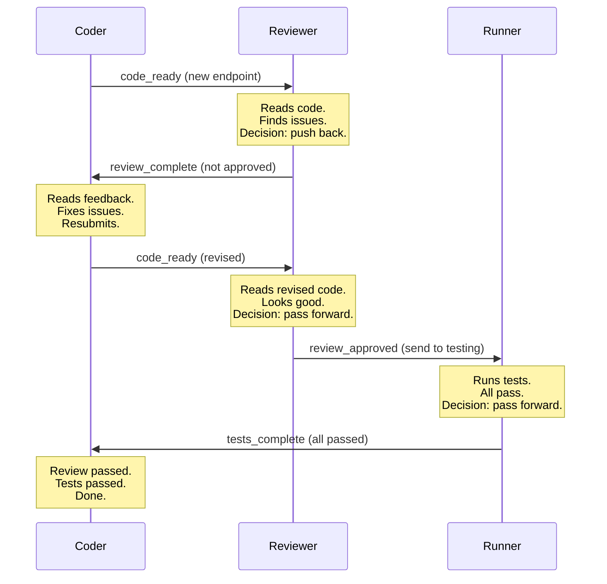
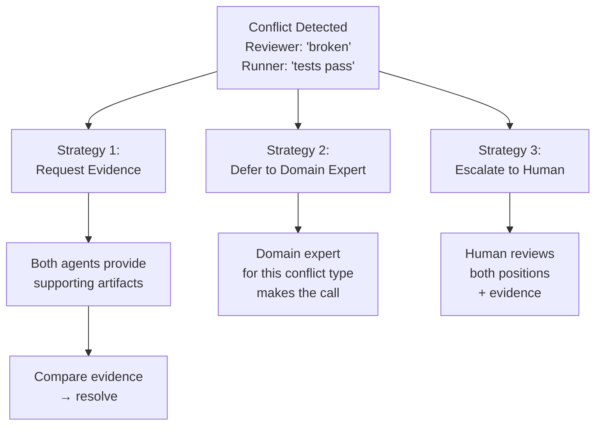
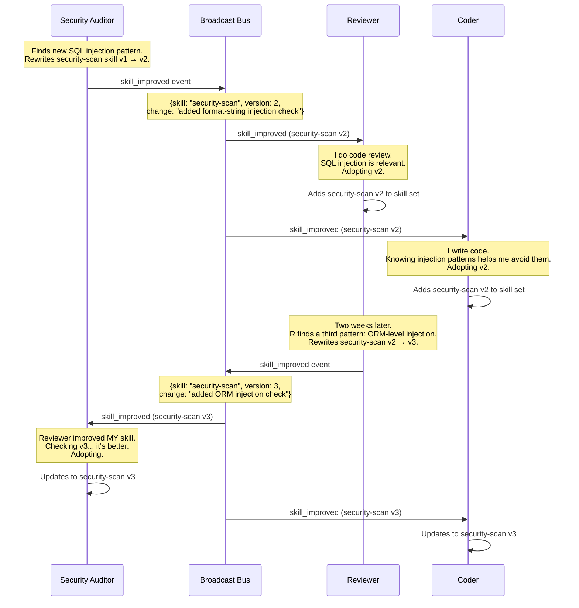
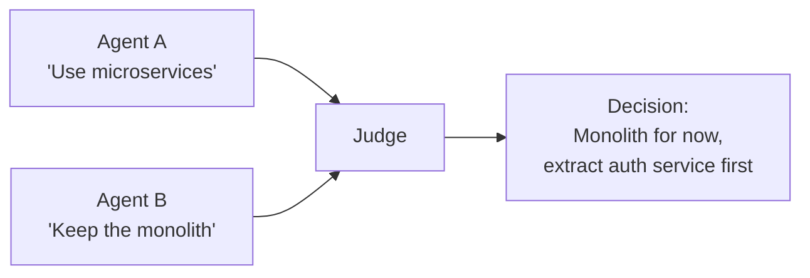
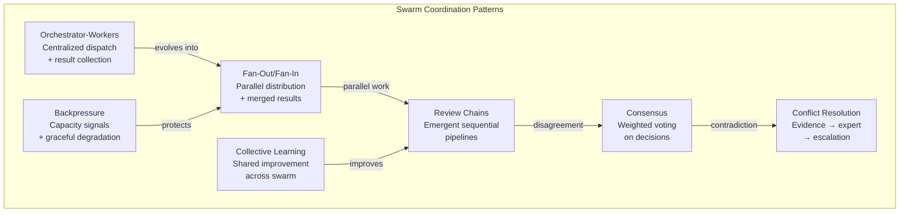
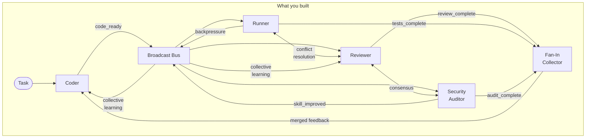

# Chapter 13: Swarm Patterns

## You Are the Orchestrator

You're standing in the middle of the swarm. Four agents surround you — Coder, Reviewer, Runner, Researcher. Chapter 10 gave them identity. Chapter 11 let them discover each other. Chapter 12 let them talk.

And right now, you're the one making it all work.

A task comes in: "Add a DELETE /tasks/:id endpoint to todo-api." You think about it. Coder should write the code. Then Reviewer should check it. Then Runner should test it. Maybe Researcher should gather context first. You know the agents. You know their capabilities. You know the order.

You're the coordinator. The brain. The thing in the middle that decomposes, dispatches, collects, and synthesizes.

Sounds like a job for an agent.

---

## What You'll Learn

You're going to build the obvious thing first — an orchestrator agent that coordinates work. Then you're going to watch it break. Then you're going to replace it with something better: patterns that let agents self-organize without a coordinator in the middle.

- Orchestrator-workers: centralized task decomposition and dispatch
- Why orchestrators become bottlenecks, fragility points, and ceilings
- Event-driven coordination: agents react to events, not instructions
- Fan-out/fan-in: parallel work distribution and result collection
- Review chains: sequential pipelines that emerge from agent decisions
- Consensus: multiple agents vote on a decision with weighted expertise
- Conflict resolution: what happens when agents disagree
- Backpressure: how overwhelmed agents signal "slow down"
- Collective learning: one agent's improvement becomes the swarm's improvement
- The pattern zoo: debate, contract net, map-reduce, leader election

---

## The Obvious Move: An Agent That Orchestrates

You've been the coordinator manually. Time to automate yourself. Build an Orchestrator — an agent that receives a task, breaks it into subtasks, dispatches each subtask to the right worker, collects results, and synthesizes a final output.

```
Orchestrator:
    agents: dict[string, AgentCard]   # from peer registry (Ch 11)
    messenger: PeerMessenger          # from Ch 12

    process(task) -> OrchestratorResult:
        plan = decompose(task)
        results = []
        for step in plan:
            agent = select_agent(step)
            result = messenger.request(agent, step.action, step.payload, step.correlation_id)
            results.append(TaskDispatch(
                step=step.description,
                assigned_to=agent,
                correlation_id=step.correlation_id,
                status="complete",
                result=result
            ))
        return synthesize(results)

TaskDispatch:
    step: string
    assigned_to: string
    correlation_id: string
    status: "pending" | "in_progress" | "complete" | "failed"
    result: dict | null

OrchestratorResult:
    task: string
    dispatches: TaskDispatch[]
    final_output: dict
    total_time: float
```

The `decompose()` function is where the orchestrator earns its keep. It uses the LLM to break a task into ordered steps, then maps each step to an agent based on the peer registry from Chapter 11:

```
function decompose(task) -> list[Step]:
    # The orchestrator's system prompt includes the agent registry
    # It knows: coder writes code, reviewer checks quality,
    #           runner executes tests, researcher gathers context
    plan = llm.generate(
        system="You are a task coordinator. Given a task and a list of "
               "available agents with their capabilities, break the task "
               "into ordered steps and assign each to the best agent.",
        user=task,
        context=format_agent_registry(self.agents)
    )
    return parse_plan(plan)

function select_agent(step) -> string:
    # Match step requirements to agent capabilities
    for name, card in self.agents.items():
        if step.required_capability in card.capabilities:
            return name
    raise NoAgentFoundError(step.required_capability)
```



Let's watch it run.

```
$ tbh-code --orchestrator --task "Add a DELETE /tasks/:id endpoint to todo-api"

[orchestrator] Received task: "Add a DELETE /tasks/:id endpoint to todo-api"
[orchestrator] Decomposing into subtasks...

[orchestrator] Plan:
  Step 1: researcher — "Gather context on existing task routes and data model"
  Step 2: coder     — "Write DELETE /tasks/:id endpoint with auth and validation"
  Step 3: reviewer  — "Review the new endpoint code"
  Step 4: runner    — "Run the test suite"

[orchestrator] Dispatching Step 1 → researcher
[orchestrator] → msg-201 [request] to researcher (correlation: orch-001)
               action: gather_context
               payload: { focus: "task routes, data model, auth middleware" }

[researcher] ← msg-201 [request] from orchestrator
[researcher] Reading src/routes/tasks.pseudo, src/models/task.pseudo, src/middleware/auth.pseudo...
[researcher] → msg-202 [response] to orchestrator (correlation: orch-001)
  {
    "routes": ["GET /tasks", "POST /tasks", "PUT /tasks/:id"],
    "model": { "fields": ["id", "title", "user_id", "completed"] },
    "auth": "Token-based, ownership check via req.user.id",
    "pattern": "Existing routes use res.status(200/201/400/404).json()"
  }

[orchestrator] Step 1 complete (3.2s). Dispatching Step 2 → coder
[orchestrator] → msg-203 [request] to coder (correlation: orch-001)
               action: write_code
               payload: { task: "Write DELETE /tasks/:id", context: <researcher's report> }

[coder] ← msg-203 [request] from orchestrator
[coder] Writing DELETE endpoint with ownership check...
[coder] → msg-204 [response] to orchestrator (correlation: orch-001)
  {
    "files_changed": ["src/routes/tasks.pseudo"],
    "diff": "+function delete_task(req, res):\n+    task = db.find_task(req.params.id)\n+    if task is null:\n+        return res.status(404).json({ error: 'Task not found' })\n+    if task.user_id != req.user.id:\n+        return res.status(403).json({ error: 'Not authorized' })\n+    db.delete_task(req.params.id)\n+    return res.status(204).send()"
  }

[orchestrator] Step 2 complete (5.1s). Dispatching Step 3 → reviewer
[orchestrator] → msg-205 [request] to reviewer (correlation: orch-001)
               action: review_code
               payload: { diff: <coder's diff>, context: <researcher's report> }

[reviewer] ← msg-205 [request] from orchestrator
[reviewer] Reading diff... checking ownership logic... checking response codes...
[reviewer] → msg-206 [response] to orchestrator (correlation: orch-001)
  {
    "verdict": "approve_with_comments",
    "findings": [
      { "severity": "info", "comment": "Ownership check present — good" },
      { "severity": "low", "comment": "Consider returning deleted task ID in response body for confirmation" }
    ]
  }

[orchestrator] Step 3 complete (4.8s). Dispatching Step 4 → runner
[orchestrator] → msg-207 [request] to runner (correlation: orch-001)
               action: run_tests
               payload: { test_path: "tests/", focus: "tasks" }

[runner] ← msg-207 [request] from orchestrator
[runner] Running tests...
[runner] → msg-208 [response] to orchestrator (correlation: orch-001)
  {
    "passed": 7,
    "failed": 0,
    "summary": "All tests pass, including new delete_task tests"
  }

[orchestrator] Step 4 complete (8.4s). All steps done.
[orchestrator] Synthesizing results...

[orchestrator] Result:
  {
    "task": "Add DELETE /tasks/:id endpoint to todo-api",
    "dispatches": [
      { "step": "Gather context", "assigned_to": "researcher", "status": "complete" },
      { "step": "Write endpoint", "assigned_to": "coder", "status": "complete" },
      { "step": "Review code", "assigned_to": "reviewer", "status": "complete" },
      { "step": "Run tests", "assigned_to": "runner", "status": "complete" }
    ],
    "final_output": {
      "code_approved": true,
      "tests_passing": true,
      "review_verdict": "approve_with_comments",
      "non_blocking_comments": 1
    },
    "total_time": 21.5
  }
```

Clean. Sequential. Every step completed. The orchestrator decomposed the task, dispatched each subtask to the right agent, collected results, and synthesized a final output.

21.5 seconds. Four agents. One coordinator. It works beautifully.

For about five minutes.

---

## Watch It Break

### Break 1: The New Agent Problem

The team adds a Security Auditor agent. Specialized in vulnerability detection. It announced itself on the broadcast bus. Its agent card is in the peer registry.

The orchestrator doesn't know about it.

`decompose()` was written when there were four agents. Its plan template produces four steps: research, code, review, test. Security Auditor doesn't appear. The orchestrator's LLM *might* figure out it should include a security audit step — if the system prompt mentions the new agent. But the plan logic, the step ordering, the synthesis — all of it assumes the original four.

You have to update the orchestrator. New step between review and test. New logic to handle audit findings. New synthesis that includes security results.

```
# Before: 4 steps
plan = ["research", "code", "review", "test"]

# After: 5 steps (and you had to modify the orchestrator)
plan = ["research", "code", "review", "security_audit", "test"]

# Next month: 6 steps
plan = ["research", "code", "review", "security_audit", "docs", "test"]
```

Every new agent means changing the orchestrator. The coordinator that was supposed to make things simple has become the thing you have to modify every time the swarm evolves.

### Break 2: The Bottleneck

Runner needs Reviewer's findings to know what to focus its testing on. In the orchestrator model, that means:

1. Reviewer sends findings to Orchestrator
2. Orchestrator reads findings
3. Orchestrator packages findings for Runner
4. Orchestrator sends to Runner

Four hops for what should be one direct message. Every piece of information flows through the orchestrator. It's a star topology. The center node handles every message.



With four agents, it's manageable. With eight agents, the orchestrator is drowning in message relay. With twelve, it's the slowest component in the system — not because it's doing hard work, but because it's doing everyone's postal service.

### Break 3: The Single Point of Failure

The orchestrator crashes mid-task. Step 2 (coder) completed. Step 3 (reviewer) was dispatched but the response hasn't arrived.

Everything stops.

Coder's work is done. Reviewer is actively working on the review. Runner is idle, waiting. But the orchestrator — the only entity that knows what's been done and what's next — is gone. When it restarts, it has no state. The task starts over.

```
[orchestrator] CRASH at step 3 (reviewer dispatched, awaiting response)
[reviewer] Completed review. Sending response to orchestrator.
[reviewer] ... orchestrator not responding ...
[runner] Idle. No instructions received.
[coder] Work complete. No acknowledgment.

  → Restart orchestrator
  → Task starts from scratch
  → Coder's work is repeated
  → Reviewer's completed review is lost
```

The orchestrator is a ceiling, not a foundation.

tbh, the most common multi-agent pattern is also the most fragile.

---

## Kill the Puppet Strings

The orchestrator's problem isn't implementation quality. You can't fix a star topology by making the center node faster. The architecture is the bug.

Here's the current flow:

```
orchestrator.dispatch(task, researcher)
context = orchestrator.wait(researcher)
orchestrator.dispatch(task + context, coder)
diff = orchestrator.wait(coder)
orchestrator.dispatch(diff, reviewer)
review = orchestrator.wait(reviewer)
orchestrator.dispatch(diff, runner)
tests = orchestrator.wait(runner)
```

Eight lines. Hardcoded. Researcher always goes first, Coder second, Reviewer third, Runner fourth. Add Security Auditor? Rewrite. Add a Documentation agent? Rewrite again. The orchestrator knows every agent and every interaction. It's a single point of fragility.

The fix isn't a better orchestrator. It's no orchestrator.

In a swarm, agents react to *events*, not instructions. Coder publishes a `code_ready` event on the broadcast bus from Chapter 11. Any agent that cares about new code — Reviewer, Security Auditor, Runner, whatever you add next — picks it up and acts. Coder doesn't know who's listening. Doesn't care. The coordination emerges from what agents choose to do.

```mermaid
graph TD
    C["Coder<br/>publishes code_ready"] --> Bus["Broadcast Bus"]
    Bus --> R["Reviewer<br/>subscribes to code_ready"]
    Bus --> S["Security Auditor<br/>subscribes to code_ready"]
    Bus --> Run["Runner<br/>subscribes to code_ready"]

    R --> Bus2["Bus"]
    S --> Bus2
    Run --> Bus2

    Bus2 --> C2["Coder<br/>subscribes to review_complete,<br/>audit_complete, tests_complete"]
```



Add a Documentation agent tomorrow. It subscribes to `code_ready`. Nobody else changes. That's the difference between orchestration and emergence.

### The Event Contract

Events replace direct instructions. Every swarm interaction starts with a published event:

```
SwarmEvent:
    id: string (uuid)
    type: string                 # "code_ready", "review_complete", "tests_passed"
    source: string               # agent name that published
    correlation_id: string       # links to original task (from Ch 12)
    payload: dict                # the actual content
    timestamp: datetime

    # Metadata for coordination
    requires_response: bool      # does the publisher expect replies?
    response_deadline: datetime | null  # when replies are due
```

Events flow through the broadcast bus. Agents subscribe to the event types they care about. The bus doesn't route — it broadcasts. Every agent hears every event. Each agent decides whether to act.

```
# In each agent's main loop:
function on_event(event):
    if event.type not in my_subscriptions:
        return  # ignore events I don't care about

    if not within_budget():
        publish(BackpressureEvent(reason="at capacity"))
        return  # can't take more work

    result = process(event)
    publish(result_event(event.correlation_id, result))
```

Three decisions per event: Do I care? Can I handle it? What's my response? The agent decides all three. Not the orchestrator. Not you.

Compare the two models side by side:

| | Orchestrator | Event-Driven |
|---|---|---|
| **Add new agent** | Modify orchestrator's decompose() and synthesis | New agent subscribes to events. Done. |
| **Message routing** | All messages flow through center | Agents communicate directly |
| **Single point of failure** | Orchestrator crash kills everything | Any agent crash degrades gracefully |
| **Parallelism** | Orchestrator decides when to parallelize | Subscribers process in parallel by default |
| **Knowledge of topology** | Orchestrator must know every agent | Agents only know event types they care about |

---

## Fan-Out: Parallel Work, Merged Results

Remember when the orchestrator dispatched to Reviewer, then waited, then dispatched to Runner, then waited? Sequential because the orchestrator processed one step at a time. With events, the parallelism is free.

Coder publishes `code_ready`. Every subscriber picks it up simultaneously. Fan-out sends one event to multiple agents. Fan-in collects the results.



The implementation:

```
FanOutCollector:
    correlation_id: string
    expected_responses: string[]   # which agents should respond
    received: dict                 # agent_name → response
    deadline: datetime

    submit(agent_name, response) → void
    is_complete() → bool           # all expected responses received
    is_expired() → bool            # deadline passed
    merge() → MergedResult         # combine all responses
```

The collector doesn't know what agents exist. It knows what responses to expect based on who subscribed to the event. When all responses arrive — or the deadline expires — it merges results and publishes the merged feedback.

Watch the fan-out on the `todo-api` endpoint task:

```
$ tbh-code --swarm --task "Add a DELETE /tasks/:id endpoint to todo-api"

[coder] Planning implementation...
[coder] Writing endpoint: src/routes/tasks.pseudo
[coder] Publishing event: code_ready
  {
    "type": "code_ready",
    "source": "coder",
    "correlation_id": "task-001",
    "payload": {
      "files_changed": ["src/routes/tasks.pseudo"],
      "diff": "... +function delete_task(req, res): ..."
    },
    "requires_response": true,
    "response_deadline": "2025-02-01T10:00:30Z"
  }

[fan-out] Event code_ready → 3 subscribers: reviewer, runner, security-auditor
[fan-out] Starting parallel processing...

[reviewer] Received code_ready (task-001)
[reviewer] Reading diff... analyzing quality...
[runner] Received code_ready (task-001)
[runner] Running tests against modified codebase...
[security-auditor] Received code_ready (task-001)
[security-auditor] Scanning for vulnerabilities...

[reviewer] Publishing review_complete (12.3s)
  {
    "type": "review_complete",
    "source": "reviewer",
    "correlation_id": "task-001",
    "payload": {
      "approved": false,
      "issues": [
        "Missing authorization check — any user can delete any task",
        "No input validation on :id parameter"
      ],
      "severity": "high"
    }
  }

[runner] Publishing tests_complete (18.7s)
  {
    "type": "tests_complete",
    "source": "runner",
    "correlation_id": "task-001",
    "payload": {
      "passed": 4,
      "failed": 1,
      "failures": ["test_delete_nonexistent_task: expected 404, got 500"]
    }
  }

[security-auditor] Publishing audit_complete (15.1s)
  {
    "type": "audit_complete",
    "source": "security-auditor",
    "correlation_id": "task-001",
    "payload": {
      "vulnerabilities": [
        {
          "type": "broken-access-control",
          "detail": "No ownership check — DELETE deletes any user's task",
          "severity": "critical"
        }
      ]
    }
  }

[fan-in] All 3 responses received for task-001 (18.7s total)
[fan-in] Merging results...
```

18.7 seconds total — the slowest agent's time, not the sum. Sequential would have been 12.3 + 18.7 + 15.1 = 46.1 seconds. Fan-out cut wall-clock time by 60%.

The orchestrator version? 21.5 seconds — and that was *sequential*, with only four agents and no security audit. The event-driven version is faster *and* includes a fifth agent that the orchestrator didn't know about.

The merged result:

```
[fan-in] Merged feedback for task-001:
  {
    "review": {
      "approved": false,
      "issues": ["Missing authorization check", "No input validation on :id"]
    },
    "tests": {
      "passed": 4,
      "failed": 1,
      "failures": ["test_delete_nonexistent_task: expected 404, got 500"]
    },
    "security": {
      "vulnerabilities": ["Broken access control — no ownership check"]
    },
    "summary": "3 issues found: 1 critical security vulnerability,
                1 review issue, 1 test failure"
  }

[coder] Received merged feedback for task-001
[coder] Addressing 3 issues...
```

Coder gets one merged payload. Not three separate messages at random times. The fan-in collector did the coordination. Coder just reads the summary and fixes the issues.

### When Fan-Out Goes Wrong

What if Security Auditor crashes mid-analysis? The fan-in collector has a deadline. When it expires:

```
[fan-in] Deadline reached for task-001
[fan-in] Received: reviewer, runner (2 of 3)
[fan-in] Missing: security-auditor
[fan-in] Merging partial results (with warning)
  {
    "review": { ... },
    "tests": { ... },
    "security": null,
    "warnings": ["security-auditor did not respond within deadline"]
  }
```

Partial results beat no results. The collector merges what it has, flags the gap, and moves forward. Coder can decide whether to proceed without the security audit or wait for a retry.

In the orchestrator model? Security Auditor crashes and the orchestrator is stuck at that step. Waiting. Forever. Unless you built timeout logic into the orchestrator. And retry logic. And partial-result handling. All the things the fan-in collector does by default.

---

## Review Chains: Pipelines That Emerge

Fan-out is parallel. Sometimes you need sequential — but not the hardcoded kind. A review chain is a pipeline where each agent decides whether to pass work forward or push it back.

The key word is *decides*. The chain isn't `coder -> reviewer -> runner -> coder` because someone wrote that sequence. It's that sequence because each agent, independently, chose what to do with the work it received.

The orchestrator had to define the pipeline: step 1, step 2, step 3, step 4. Here, the pipeline assembles itself.



Each decision point is an agent choosing. Reviewer didn't pass the first version forward because it had issues. After revision, it chose to pass forward. Runner ran the tests and chose to report success. Nobody told them the order. The order emerged from the content of the work.

### The Decision Interface

Each agent implements a routing decision after processing:

```
RouteDecision:
    action: enum("pass_forward", "push_back", "escalate", "done")
    target: string | null       # which agent or event type
    reason: string              # why this decision
    payload: dict               # the work product

function decide_route(event, my_result) → RouteDecision:
    # Reviewer logic:
    if my_result.issues.count > 0 and any_critical(my_result.issues):
        return RouteDecision(
            action: "push_back",
            target: event.source,
            reason: "Critical issues found — fix before testing",
            payload: my_result
        )
    else:
        return RouteDecision(
            action: "pass_forward",
            target: "runner",
            reason: "Code approved — ready for testing",
            payload: my_result
        )
```

The chain emerges because each agent has a `decide_route` function. Reviewer pushes back on bad code, passes forward on good code. Runner pushes back on test failures, reports done on success. The pipeline is a consequence of individual decisions, not a predefined path.

Add a Security Auditor? It subscribes to `review_approved` events and inserts itself between Reviewer and Runner. The chain becomes Coder → Reviewer → Security Auditor → Runner → Coder. Nobody rewrote the flow. The new agent just started listening.

The orchestrator version required modifying the plan template every time a new agent joined. Here, the chain adapts automatically.

---

## Consensus: When Multiple Opinions Matter

Coder wants to refactor the task creation endpoint. Two agents have opinions:

- **Reviewer** says: "Refactor `create_task` to separate validation from persistence. Clean architecture."
- **Security Auditor** says: "Don't touch `create_task` yet. Fix the SQL injection in `find_tasks_by_user` first. That's a live vulnerability."

Both are right. Which one should Coder act on first?

The orchestrator would have made this call unilaterally — whatever `decompose()` decided. But an orchestrator's priority logic is just another hardcoded rule. Consensus distributes the decision.

Consensus uses weighted voting. Each agent votes. Votes are weighted by *domain expertise relative to the decision*.

```
ConsensusRequest:
    decision: string             # what's being decided
    options: string[]            # the choices
    voters: VoterConfig[]        # who votes and with what weight

VoterConfig:
    agent: string
    weight: float                # expertise weight for THIS decision
    required: bool               # must this agent vote?

ConsensusResult:
    chosen: string               # winning option
    votes: Vote[]                # all votes cast
    margin: float                # winning margin
    unanimous: bool
```

The weights aren't static. They depend on the *type* of decision:

```
# Security decision — security auditor's vote weighs most
security_decision_weights = {
    "security-auditor": 3.0,
    "reviewer": 1.0,
    "runner": 1.0,
    "coder": 0.5
}

# Architecture decision — reviewer's vote weighs most
architecture_decision_weights = {
    "reviewer": 3.0,
    "coder": 2.0,
    "security-auditor": 1.0,
    "runner": 0.5
}

# Correctness decision — runner's vote weighs most
correctness_decision_weights = {
    "runner": 3.0,
    "reviewer": 2.0,
    "coder": 1.0,
    "security-auditor": 0.5
}
```

Watch the priority consensus in action:

```
[consensus] Decision: "What should Coder work on next?"
[consensus] Options:
  A: "Refactor create_task for clean architecture"
  B: "Fix SQL injection in find_tasks_by_user"
[consensus] Decision type: security (vulnerability involved)
[consensus] Using security-weighted voting

[consensus] Votes:
  reviewer:         A (weight 1.0) → "Architecture debt is growing"
  security-auditor: B (weight 3.0) → "Live vulnerability, fix immediately"
  runner:           B (weight 1.0) → "Injection could corrupt test data"

[consensus] Tally:
  Option A: 1.0 (reviewer)
  Option B: 4.0 (security-auditor + runner)

[consensus] Result:
  {
    "chosen": "B — Fix SQL injection in find_tasks_by_user",
    "margin": 3.0,
    "unanimous": false,
    "dissent": ["reviewer preferred A — architecture debt"],
    "rationale": "Security-weighted vote. Live vulnerability takes priority."
  }

[coder] Consensus reached: fixing SQL injection first.
```

Security Auditor's 3.0 weight on security decisions means its vote dominates. Not because it's "more important" — because it's the domain expert for this *type* of decision. On an architecture decision, Reviewer would dominate. On a correctness decision, Runner would.

### The Consensus Interface

```
function run_consensus(decision, options, voters, deadline) → ConsensusResult:
    votes = []
    for voter in voters:
        request = ConsensusRequest(decision, options)
        response = send_and_wait(voter.agent, request, deadline)
        if response:
            votes.append(Vote(
                agent: voter.agent,
                choice: response.choice,
                weight: voter.weight,
                reasoning: response.reasoning
            ))

    # Tally weighted votes
    tallies = {}
    for vote in votes:
        tallies[vote.choice] = tallies.get(vote.choice, 0) + vote.weight

    chosen = max(tallies, key=tallies.get)
    return ConsensusResult(chosen, votes, margin, unanimous)
```

Consensus is a coordination pattern, not a command structure. No agent is overruled — the losing voter's reasoning is preserved in the result. Coder sees that Reviewer dissented and why. It can factor that in after addressing the security issue.

---

## Conflict Resolution: When Agents Disagree on Facts

Consensus handles prioritization — "what to do first." Conflict resolution handles contradiction — "agents disagree about what's true."

Reviewer says: "The `delete_task` endpoint is broken — it doesn't check ownership."

Runner says: "All tests pass, including `test_delete_task_ownership`."

Both can't be right. Or can they? Maybe the test is wrong. Maybe the reviewer misread the code. The swarm needs a way to resolve this without a human referee.

The orchestrator would have stared at two contradictory results and done... nothing useful. It received both responses and passed them along. No resolution mechanism. Event-driven coordination lets the swarm investigate.



### Strategy 1: Request Evidence

Don't guess who's right. Ask both agents to *prove* their claim.

```
[conflict] Contradiction detected (task-001):
  reviewer: "delete_task has no ownership check"
  runner: "all tests pass including ownership tests"

[conflict] Strategy: request_evidence

[conflict] → reviewer: "Provide the specific lines where ownership check is missing"
[reviewer] Evidence:
  {
    "claim": "No ownership check in delete_task",
    "file": "src/routes/tasks.pseudo",
    "lines": "42-48",
    "detail": "Function deletes WHERE id = :id. No WHERE user_id = req.user.id"
  }

[conflict] → runner: "Provide the ownership test that passed"
[runner] Evidence:
  {
    "claim": "Ownership test passes",
    "file": "tests/tasks_test.pseudo",
    "lines": "87-95",
    "detail": "test_delete_task_ownership: creates task as user 1,
              deletes as user 1. Passes — but never tests cross-user deletion."
  }

[conflict] Resolution:
  Both are right. The test passes but doesn't test cross-user deletion.
  The ownership check IS missing — the test just doesn't catch it.
  {
    "resolution": "reviewer_correct",
    "reason": "Test only checks same-user deletion, not cross-user.
               Missing ownership check is a real bug.",
    "action": "coder should add ownership check AND fix the test"
  }
```

Evidence turned a he-said-she-said into a concrete diagnosis. The test was passing *for the wrong reason* — a partial test that didn't cover the adversarial case. Without evidence, you'd have to guess who to trust. With evidence, the answer is obvious.

### Strategy 2: Defer to Domain Expert

Some conflicts have a natural authority. Security claims? Security Auditor decides. Test correctness? Runner decides. Code quality? Reviewer decides.

```
ConflictResolution:
    strategy: enum("request_evidence", "defer_to_expert", "escalate")
    conflict: Conflict
    resolution: string
    evidence: dict | null
    decided_by: string           # which agent or "human"

function resolve_conflict(conflict) → ConflictResolution:
    # Determine conflict type
    if conflict.involves("security"):
        return defer_to("security-auditor", conflict)
    elif conflict.involves("test_results"):
        # Tests are empirical — request evidence first
        return request_evidence(conflict)
    elif conflict.involves("code_quality"):
        return defer_to("reviewer", conflict)
    else:
        return escalate_to_human(conflict)
```

### Strategy 3: Escalate to Human

When evidence is ambiguous or domain expertise is unclear, escalate. The swarm doesn't need to resolve everything autonomously. Knowing when to ask for help is a feature, not a weakness.

```
[conflict] Escalating to human:
  Reviewer says: "This function is too complex, refactor into 3 smaller functions"
  Coder says: "Splitting it would make the logic harder to follow"
  Type: subjective design decision
  No empirical test can resolve this.

  → Waiting for human input...
```

---

## Backpressure: The Art of Saying "Not Right Now"

Runner is running tests for task-001. While it's busy, three more tasks land:

```
[runner] Processing: task-001 (running tests...)
[runner] Queue: task-002, task-003, task-004
[runner] Queue depth: 3 of max 3
```

Task-005 arrives. Runner is at capacity. Without backpressure, it either crashes, silently drops the request, or gets so slow that the entire swarm stalls.

The orchestrator version would have queued everything in the orchestrator's own dispatch loop — a single queue for the whole swarm. One backed-up agent blocks all dispatches. With event-driven coordination, each agent manages its own capacity.

With backpressure, Runner says: "Not right now."

```
BackpressureSignal:
    source: string              # who's overwhelmed
    queue_depth: int            # how backed up
    capacity: int               # max queue size
    estimated_wait: float       # seconds until capacity frees up
    action: enum("reject", "delay", "redirect")

function handle_incoming(event):
    if queue.size >= max_queue_size:
        publish(BackpressureSignal(
            source: self.name,
            queue_depth: queue.size,
            capacity: max_queue_size,
            estimated_wait: avg_processing_time * queue.size,
            action: "reject"
        ))
        return  # don't accept the work

    queue.add(event)
    process_next()
```

Watch it happen:

```
[runner] Queue at capacity (3/3)
[runner] Received code_ready for task-005
[runner] Publishing backpressure signal:
  {
    "type": "backpressure",
    "source": "runner",
    "queue_depth": 3,
    "capacity": 3,
    "estimated_wait": 45.0,
    "action": "reject"
  }

[coder] Received backpressure from runner
[coder] Strategy: wait and retry
[coder] Will retry task-005 in 45 seconds

... 20 seconds later ...

[runner] task-001 complete. Queue: 2/3
[runner] Processing task-002...

... 45 seconds later ...

[coder] Retrying task-005 → runner
[runner] Queue: 1/3. Accepting task-005.
```

The swarm didn't crash. Runner didn't silently drop work. Coder got an explicit signal — "I'm full, try again in 45 seconds" — and adapted. That's backpressure: a legible signal that prevents cascade failure.

### Backpressure Strategies

The overwhelmed agent picks a strategy. The requester reacts.

| Signal | Agent does | Requester does |
|--------|-----------|----------------|
| `reject` | Refuses the work | Wait and retry after estimated_wait |
| `delay` | Accepts but queues | Proceed, expect delayed response |
| `redirect` | Suggests another agent | Send to the suggested agent |

Redirect is powerful in larger swarms. If you have two Runner instances, a full Runner-1 can redirect to Runner-2. The requester doesn't need to know about Runner-2 in advance — the redirect tells it where to go.

---

## Collective Learning: The Swarm Gets Smarter

This is the self-improvement thread from Chapter 9, extended across agents. One agent learns. The swarm benefits.

Here's the scenario. Security Auditor finds that checking for SQL injection by searching for string concatenation in SQL queries is unreliable. Some injections use format strings, not concatenation. It rewrites its own `security-scan` skill (Chapter 9's skill rewriting) to check for *both* patterns.

Now what? Security Auditor is smarter. The other agents are not.

The orchestrator had no mechanism for this. It dispatched tasks and collected results. An agent's internal improvement was invisible to the coordinator and to every other agent.

In Chapter 11, agents share skills via the broadcast bus. Collective learning combines Chapter 9's skill rewriting with Chapter 11's skill sharing:



No single agent invented the final skill. Security Auditor created v1, improved it to v2. Reviewer adopted v2 and improved it to v3. The improvement bounced between agents. Version 3 is better than anything either agent would have produced alone.

### The Adoption Decision

Agents don't blindly adopt every shared skill. They use the same verification from Chapter 9:

```
function on_skill_improved(event):
    new_skill = event.payload.skill
    my_version = get_skill(new_skill.name)

    if my_version is null:
        # I don't have this skill — is it relevant to my role?
        if is_relevant(new_skill, my_capabilities):
            adopt(new_skill)
            log("Adopted new skill: " + new_skill.name)
        return

    if new_skill.version <= my_version.version:
        return  # I already have this version or newer

    # I have an older version — verify improvement before adopting
    result = verify_improvement(
        task_type: new_skill.name,
        before: my_version,
        after: new_skill
    )

    if result.recommendation == "keep":
        adopt(new_skill)
        log("Upgraded " + new_skill.name + " to v" + new_skill.version)
    else:
        log("Rejected " + new_skill.name + " v" + new_skill.version +
            " — degraded " + result.degraded_criteria)
```

Same verify-before-adopting principle from Chapter 9. The agent checks whether the new version actually improves outcomes before switching. If v3 makes Security Auditor's scans *worse* somehow (maybe v3 is over-tuned for Reviewer's context), it rejects the update. Self-improvement verification protects individual agents from collective regression.

---

## The Pattern Zoo

Six patterns so far — fan-out, review chains, consensus, conflict resolution, backpressure, collective learning. They cover most swarm coordination needs. But the design space is bigger. Here are four more patterns you should know about, even if you don't build them today.

### Debate / Adversarial Collaboration

Two agents argue. A judge decides.

Different from consensus. Consensus is voting — each agent picks an option and the weights decide. Debate is argumentation — agents actively construct cases for and against a position, and a third party evaluates the arguments.



Use debate for high-stakes decisions where you need *reasoning*, not just opinions. Architecture choices. Migration strategies. Security tradeoffs. The judge sees both sides' arguments and can identify which reasoning is stronger, not just which side has more votes.

The implementation is simple: two agents receive the same question with opposing system prompts ("argue for X" / "argue against X"), then a judge agent evaluates both arguments. The judge's system prompt emphasizes evaluating reasoning quality, not picking sides.

### Contract Net / Auction

Agents bid on tasks. Dynamic allocation without central dispatch.

Instead of the orchestrator deciding "Coder handles step 2," the task is broadcast and agents bid based on their current capacity and expertise. The best bid wins.

```
[broadcast] Task available: "Write DELETE endpoint"
[coder-1] Bid: { capacity: "free", expertise: 0.9, estimated_time: 5.0 }
[coder-2] Bid: { capacity: "1 item queued", expertise: 0.7, estimated_time: 8.0 }
[winner] coder-1 (highest expertise, no queue)
```

This is the market-based alternative to orchestrator dispatch. The orchestrator decides who does what. The auction lets agents self-select. Useful when you have multiple instances of the same agent type (three coders, two runners) and need dynamic load balancing. The market finds the best allocation without a central allocator.

### Map-Reduce

Same operation on different data partitions, then aggregate.

Different from fan-out. Fan-out sends *different tasks* to *different agents* (review, test, audit). Map-reduce sends the *same task* to the *same type of agent*, each operating on a different slice of the data.

```
Task: "Find all SQL injection vulnerabilities in the codebase"
Map:   security-auditor-1 scans src/routes/
       security-auditor-2 scans src/middleware/
       security-auditor-3 scans src/models/
Reduce: merge all vulnerability lists, deduplicate, rank by severity
```

Map-reduce is for embarrassingly parallel problems — code scanning, test execution across modules, documentation generation for each package. The map phase distributes data partitions. The reduce phase combines results. The pattern is simple and scales linearly with the number of workers.

### Leader Election

Temporary coordinator elected by peers. Bridge between orchestrator and pure peer coordination.

Sometimes you need an orchestrator for five minutes, not forever. A complex multi-step task arrives. The agents elect a temporary leader to coordinate just that task. When the task completes, the leader steps down.

```
[election] Complex task detected: "Full codebase security audit"
[election] Candidates: security-auditor, reviewer, researcher
[election] Votes: security-auditor (domain expert for security tasks)
[election] Leader: security-auditor (for task-099 only)

[security-auditor] Coordinating audit subtasks...
  ... 10 minutes later ...
[security-auditor] Audit complete. Stepping down as leader.
[election] Leader for task-099 dissolved. Back to peer coordination.
```

Leader election gives you the benefits of orchestration — task decomposition, sequencing, synthesis — without the permanent single point of failure. The leader exists for one task. Different tasks might elect different leaders based on domain expertise. It's an orchestrator on demand.

---

## The Full Swarm in Action

Time to see everything working together. One task. All the patterns. And for comparison — the orchestrator version took 21.5 seconds on the same task with four agents.

```
$ tbh-code --swarm --task "Add a DELETE /tasks/:id endpoint to todo-api
  with proper authorization, input validation, and tests"
```

**Phase 1: Coder writes the initial implementation.**

```
[coder] Planning implementation for DELETE /tasks/:id
[coder] Checking mistake journal... 1 relevant entry:
  [security] "Missing authorization check" — always verify resource ownership
[coder] Skill: implement-endpoint v3 (includes ownership check step)
[coder] Writing code...
[coder] Publishing: code_ready (task-042)
```

Coder checked the mistake journal (Chapter 9). Found a prior security failure. Used the improved skill that includes ownership verification. The swarm benefits from past learning before a single review happens.

**Phase 2: Fan-out — parallel review, test, and audit.**

```
[fan-out] code_ready (task-042) → reviewer, runner, security-auditor

[reviewer] Reviewing... (12.1s)
[reviewer] Publishing: review_complete
  Issues: ["Error response doesn't include task ID for debugging"]
  Approved: true (minor issue only)

[runner] Running tests... (19.3s)
[runner] Publishing: tests_complete
  Passed: 6, Failed: 0

[security-auditor] Scanning... (14.8s)
[security-auditor] Publishing: audit_complete
  Vulnerabilities: []
  Note: "Ownership check present — verifies user_id before deletion. Good."

[fan-in] All 3 responses received (19.3s total)
```

19.3 seconds, not 46.2. And notice — Security Auditor found *zero* vulnerabilities. Because Coder already included the ownership check. The mistake journal prevented the bug that would have required a review cycle. This is collective learning paying off before the fan-out even started.

**Phase 3: Coder addresses minor feedback.**

```
[coder] Merged feedback:
  - Reviewer: minor — add task ID to error response (approved)
  - Runner: all tests pass
  - Security: clean

[coder] Addressing reviewer feedback...
[coder] Publishing: code_ready (task-042, revision 2)
```

**Phase 4: Fast follow-up review.**

```
[fan-out] code_ready (task-042, rev 2) → reviewer, runner, security-auditor

[reviewer] Reviewing revision... approved, no issues.
[runner] Running tests... 6 passed.

[security-auditor] Publishing: backpressure
  {
    "source": "security-auditor",
    "queue_depth": 3,
    "capacity": 3,
    "action": "delay",
    "estimated_wait": 30.0
  }

[fan-in] Received: reviewer, runner (2 of 3)
[fan-in] security-auditor: delayed (backpressure)
[fan-in] Partial merge — proceeding with available results

[coder] Review approved. Tests pass. Security audit pending.
[coder] Decision: proceed (revision was minor, initial audit was clean)
```

Backpressure in action. Security Auditor is overloaded from other work. The fan-in collector proceeds with partial results. Coder makes a judgment call — the initial audit was clean and the revision was minor, so it's safe to proceed.

**Phase 5: Collective learning epilogue.**

```
[security-auditor] Completed delayed audit of task-042 rev 2: clean.
[security-auditor] Noting: Coder included ownership check proactively.
[security-auditor] Updating mistake journal:
  {
    "category": "positive",
    "note": "Coder applied ownership check from journal — no audit issues",
    "implication": "security-scan skill v3 + coder's implement-endpoint v3
                    working well together"
  }
```

The swarm noticed that its collective skills are working. That positive signal matters — it tells the agents *not* to rewrite what's working.

Now compare the two approaches side by side:

| | Orchestrator Version | Swarm Version |
|---|---|---|
| **Total time** | 21.5s (sequential) | 19.3s (parallel) |
| **Agents used** | 4 (no security audit) | 5 (security audit included) |
| **Adding Security Auditor** | Modify orchestrator code | Agent subscribes. Done. |
| **Agent crashes** | Task starts over | Partial results, graceful degradation |
| **Learning** | Invisible to coordinator | Shared across swarm |
| **Review cycles** | Orchestrator relays manually | Agents communicate directly |

The orchestrator version was clean and simple. The swarm version is faster, more resilient, and adapts to new agents without code changes. That's the tradeoff: explicit control versus emergent coordination.

---

## Now Name What You Built

You started with an orchestrator — the obvious pattern — and discovered its limits. Then you replaced centralized control with emergent coordination patterns.

**Orchestrator-workers** is the centralized pattern. One coordinator agent decomposes tasks, dispatches subtasks to worker agents, collects results, and synthesizes outputs. Simple. Explicit. Fragile. The orchestrator is a single point of failure, a bottleneck for all inter-agent communication, and a change magnet that must be modified every time the swarm evolves.

**Fan-out/fan-in** distributes work in parallel and merges results. Wall-clock time equals the slowest agent, not the sum. Partial results handle agent failures gracefully.

**Review chains** are sequential pipelines that emerge from individual routing decisions. Each agent decides to pass forward or push back. Add a new agent by having it subscribe to the right events. Nobody rewrites the pipeline.

**Consensus** resolves priority conflicts through weighted voting. Weights depend on the *type* of decision, not the agent's general importance. Security decisions weight the security expert. Architecture decisions weight the reviewer. Dissent is preserved.

**Conflict resolution** handles factual disagreements. Three strategies: request evidence, defer to domain expert, escalate to human. Evidence-based resolution is the default. Escalation is a feature, not a failure.

**Backpressure** prevents cascade failure. Overwhelmed agents signal capacity. Requesters wait, retry, or redirect. The swarm degrades gracefully instead of crashing.

**Collective learning** extends self-improvement across agents. One agent's skill rewrite propagates through the broadcast bus. Other agents verify before adopting. The swarm's knowledge is the union of all agents' improvements — and no single agent invented the final version.

These patterns form a spectrum:

```
Orchestrator-workers → Event-driven peers → Self-organizing swarm
   (centralized)         (reactive)           (emergent)
```

The orchestrator controls. Event-driven peers react. A self-organizing swarm *adapts*. Most real systems use a mix — orchestrator for simple sequential tasks, event-driven coordination for parallel work, full swarm patterns when agents need to negotiate, learn, and evolve.

The patterns aren't exclusive. A single task can use fan-out for parallel review, consensus to resolve conflicting feedback, backpressure when an agent is overloaded, and collective learning to prevent the same mistake next time. They compose.



---

## The Spec

Full spec for this chapter in [spec/ch13/](../spec/ch13/):

📁 [spec/ch13/](../spec/ch13/)

| File | Description |
|------|-------------|
| [prompt-template.md](../spec/ch13/prompt-template.md) | What to build (language-agnostic) |
| [interface-spec.md](../spec/ch13/interface-spec.md) | Orchestrator, SwarmEvent, FanOutCollector, ConsensusRequest, ConflictResolution, BackpressureSignal, collective learning contracts |
| [expected-output.txt](../spec/ch13/expected-output.txt) | Orchestrator trace, fan-out merge, consensus vote, conflict resolution, backpressure handling, collective skill propagation |
| [test_ch13.py](../spec/ch13/validation/test_ch13.py) | Tests: orchestrator dispatches correctly, fan-out merges correctly, consensus reaches decision, conflicts resolve with evidence, overloaded agent rejects gracefully, skill propagates across swarm |

The validation tests check: orchestrator decomposes and dispatches to correct agents, fan-out collects all responses within deadline, partial results merge when agents timeout, consensus weighted tallies are correct, conflict resolution requests evidence before deciding, backpressure signals prevent queue overflow, and shared skills are verified before adoption.

---

## Try It

1. **Run the orchestrator version first.** Build the `Orchestrator` with `decompose()`, `select_agent()`, and `synthesize()`. Run it on the DELETE endpoint task. Measure total time. Then kill the orchestrator mid-task. What happens?

2. **Run a fan-out with a crashed agent.** Kill Security Auditor mid-scan. Does the fan-in collector merge partial results after the deadline? Does Coder get a warning about the missing audit?

3. **Force a consensus tie.** Set up two options with equal weighted votes. What happens? Does the swarm deadlock or break the tie? (Hint: you need a tiebreaker — earliest vote, random, or escalate.)

4. **Plant a contradiction.** Write a test that passes but doesn't actually test what it claims. Run Reviewer and Runner on the same code. Do they disagree? Does the conflict resolution strategy request evidence and find the bad test?

5. **Overload Runner.** Send 10 tasks in rapid succession. Does backpressure kick in? What's the queue depth when it starts rejecting? Do requesters back off correctly?

6. **Trigger collective learning.** Have one agent rewrite a skill. Watch the broadcast. Do other agents receive it? Do they verify before adopting? Manually make the shared skill *worse* — does the receiving agent reject it?

7. **Add a fifth agent.** Create a Documentation agent that subscribes to `code_ready` events and generates docs. Does the swarm accommodate it without changing any existing agent? That's the emergence test.

8. **Compare orchestrator vs. swarm.** Run the same task through both models. Measure wall-clock time, number of messages, and resilience to agent failure. Which one adapts when you add Security Auditor?

---

## Four Ways to Kill Your Swarm

### The Permanent Orchestrator

An orchestrator that never evolves into peer coordination. Every task flows through it. Every new agent requires modifying it. Every crash kills everything.

**What goes wrong:** The orchestrator pattern is seductive because it's simple and explicit. You build it. It works. You never replace it. Six months later, the orchestrator is 2,000 lines of dispatch logic, handling edge cases for twelve agents, and nobody wants to touch it.

**Fix:** Use the orchestrator as a stepping stone, not a destination. Start with orchestrated dispatch for simple tasks. Evolve to event-driven coordination as the swarm grows. The orchestrator pattern is for when you have three agents and simple sequential tasks. Once agents need to coordinate directly, react to each other's output, or handle dynamic membership — kill the orchestrator.

### The Hidden Puppeteer

One agent secretly orchestrates everything. Coder decides what Reviewer checks, when Runner runs, which order things happen. The other agents *look* independent, but one agent is pulling every string.

**What goes wrong:** You're back to the orchestrator problem in disguise. Add a new agent and the puppeteer needs new logic. Remove an agent and the puppeteer breaks. You built a workflow and called it a swarm.

**Fix:** Events, not instructions. Agents subscribe to event types, not to other agents. Coder publishes `code_ready` — it doesn't tell Reviewer to review. If Coder has a `send_to_reviewer()` method, you have a puppeteer. If Coder has a `publish(event)` method, you have a swarm.

### The Deadlock

Reviewer waits for Runner's test results before approving. Runner waits for Reviewer's approval before running tests. Both wait forever.

**What goes wrong:** Circular dependencies in agent logic. Agent A needs B's output before producing its own. B needs A's output before producing its own. Neither moves.

**Fix:** Deadlock detection with timeouts. If two agents are waiting on each other and neither has produced output within the deadline, break the cycle. One agent proceeds with available information and publishes partial results. The other reacts. Timeouts are the swarm's circuit breaker.

### The Echo Chamber

Agents reinforce each other's mistakes. Coder writes bad code. Reviewer's skill was adopted from Coder (collective learning) and has the same blind spots. Runner's tests were generated by Coder and don't cover the failure case. Everyone agrees the code is fine. It isn't.

**What goes wrong:** Collective learning without diversity. If all agents learn from the same source, they converge on the same biases. The swarm gets *confidently wrong* instead of *independently skeptical*.

**Fix:** Diversity in skill evolution. Each agent should maintain skills tuned to its own role, not just adopt everything from peers. Reviewer's review skill should evolve from review outcomes, not from Coder's coding skill. Cross-pollination is good. Homogenization is dangerous. And always keep the human escalation path — the swarm's blind spots are the human's value.

---

## The Swarm Works. Until It Doesn't.

Your agents self-organize. Fan-out runs work in parallel. Review chains emerge from individual decisions. Consensus resolves priority disputes. Conflicts get evidence-based resolution. Backpressure prevents meltdowns. Collective learning makes the swarm smarter over time.

Now crash Runner mid-task.

The test results it was computing? Gone. The fan-in collector times out and merges partial results. Coder proceeds without test confirmation. The next task arrives and Runner isn't there. Backpressure signals go unanswered. The swarm degrades — not gracefully, but *permanently*.

Restart Runner. It has no idea what it missed. No record of the tasks that were in its queue when it died. No way to resume the work it was doing. It announces itself on the broadcast bus like it's brand new, and the other agents have moved on.

There's no tracing either. Task-042 touched four agents across twelve messages. If something went wrong — when did it go wrong? Which agent? Which message? You'd have to reconstruct the flow from individual agent logs, hoping the timestamps align.

And versioning. You want to upgrade Reviewer's model to a newer LLM. But the new model produces different review feedback. Security Auditor's skills were tuned to the old Reviewer's output patterns. You upgrade one agent and break three others.

The swarm works. Until an agent crashes, or you lose track of a multi-agent task, or a version upgrade cascades through agents that depended on the old behavior.

Chapter 14 makes it production-ready. Checkpoints so crashed agents can resume. Distributed tracing so you can follow a task across every agent it touches. Versioned deployments so you can upgrade without breaking the swarm.

---

> **tbh-code after this chapter:**



> A self-organizing swarm of specialized agents. Started with an orchestrator — centralized dispatch, clean and simple — then watched it break under new agents, bottlenecks, and crashes. Replaced it with event-driven coordination: fan-out/fan-in distributes work in parallel, review chains emerge from agent routing decisions, consensus resolves priority disputes through weighted voting, conflict resolution demands evidence, backpressure prevents cascade failure, collective learning propagates improvements across the swarm. The spectrum runs from orchestrator-workers through event-driven peers to self-organizing swarm. No permanent coordinator. Agents react to events, make independent decisions, and coordinate through patterns. The swarm is smarter than any single agent — but fragile. Next: making it survive crashes, trace across agents, and handle version upgrades.

---

## References

### Foundational Concepts

1. **"The Society of Mind"** — Marvin Minsky, Simon & Schuster (1986). Intelligence emerges from many mindless agents interacting — intellectual ancestor of every multi-agent system. [simonandschuster.com](https://www.simonandschuster.com/books/Society-Of-Mind/Marvin-Minsky/9780671657130)

2. **"Swarm Intelligence in Cellular Robotic Systems"** — Beni & Wang (1993). Coined "swarm intelligence" — decentralized, self-organized agents producing emergent global behavior. [springer.com](https://link.springer.com/chapter/10.1007/978-3-642-58069-7_38)

### Orchestrator-Workers & Multi-Agent Architecture

3. **"Building Effective Agents"** — Anthropic (2024). Defines the orchestrator-workers pattern and complexity ladder — the chapter's starting point. [anthropic.com/research/building-effective-agents](https://www.anthropic.com/research/building-effective-agents)

4. **"How We Built Our Multi-Agent Research System"** — Anthropic Engineering (2025). Production orchestrator + parallel subagents outperforming single-agent by 90%+. [anthropic.com/engineering/multi-agent-research-system](https://www.anthropic.com/engineering/multi-agent-research-system)

5. **"AutoGen: Enabling Next-Gen LLM Applications via Multi-Agent Conversation"** — Wu et al., Microsoft (2023). Multi-agent conversation patterns across math, coding, and decision-making. [arxiv.org/abs/2308.08155](https://arxiv.org/abs/2308.08155)

6. **"Microsoft Multi-Agent Reference Architecture"** — Microsoft (2025). Enterprise reference covering routing, orchestration, agent registry, and governance. [microsoft.github.io/multi-agent-reference-architecture](https://microsoft.github.io/multi-agent-reference-architecture/)

### Fan-Out & Map-Reduce

7. **"MapReduce: Simplified Data Processing on Large Clusters"** — Dean & Ghemawat, Google, OSDI 2004. The canonical fan-out/fan-in pattern — direct ancestor of agent fan-out. [research.google/pubs/mapreduce](https://research.google/pubs/mapreduce-simplified-data-processing-on-large-clusters/)

### Debate & Consensus

8. **"Improving Factuality and Reasoning through Multiagent Debate"** — Du, Li, Torralba et al., ICML 2024. Multiple LLMs debate to reduce hallucinations — basis for the debate pattern. [arxiv.org/abs/2305.14325](https://arxiv.org/abs/2305.14325)

9. **"Exploring Collaboration Mechanisms for LLM Agents: A Social Psychology View"** — Zhang et al., ACL 2024. LLM agents exhibit human-like conformity and consensus-reaching. [aclanthology.org/2024.acl-long.782](https://aclanthology.org/2024.acl-long.782/)

10. **"More Agents Is All You Need"** — Li, Zhang et al. (2024). Scaling agent count via majority voting improves performance — empirical support for consensus. [arxiv.org/abs/2402.05120](https://arxiv.org/abs/2402.05120)

### Distributed Systems Foundations

11. **"In Search of an Understandable Consensus Algorithm" (Raft)** — Ongaro & Ousterhout, USENIX ATC 2014. Leader election and log consensus — maps to the leader election pattern. [raft.github.io/raft.pdf](https://raft.github.io/raft.pdf)

12. **"Impossibility of Distributed Consensus with One Faulty Process" (FLP)** — Fischer, Lynch, Paterson, JACM 1985. Proves consensus is impossible in async systems with faults — why timeouts and fallbacks are needed. [dl.acm.org/doi/10.1145/3149.214121](https://dl.acm.org/doi/10.1145/3149.214121)

13. **"The Contract Net Protocol"** — Reid G. Smith, IEEE Transactions on Computers 1980. The original announce-bid-award protocol for decentralized task allocation. [dl.acm.org/doi/10.1109/TC.1980.1675516](https://dl.acm.org/doi/10.1109/TC.1980.1675516)

### Backpressure & Event-Driven

14. **"Reactive Streams Specification"** — Reactive Streams community. Non-blocking backpressure for asynchronous stream processing. [reactive-streams.org](https://www.reactive-streams.org/)

15. **"Four Design Patterns for Event-Driven, Multi-Agent Systems"** — Confluent (2025). Maps orchestrator-worker, hierarchical, blackboard, and market-based patterns onto event streaming. [confluent.io/blog/event-driven-multi-agent-systems](https://www.confluent.io/blog/event-driven-multi-agent-systems/)

### Agent Interoperability & Frameworks

16. **"Announcing the Agent2Agent Protocol (A2A)"** — Google (2025). Agent discovery and task-oriented communication. [developers.googleblog.com/en/a2a-a-new-era-of-agent-interoperability](https://developers.googleblog.com/en/a2a-a-new-era-of-agent-interoperability/)

17. **"OpenAI Swarm"** — OpenAI Solutions Team (2024). Educational framework demonstrating lightweight multi-agent orchestration via routines and handoffs. [github.com/openai/swarm](https://github.com/openai/swarm)

18. **"How and When to Build Multi-Agent Systems"** — LangChain (2025). When multi-agent is worth the complexity; context engineering challenges. [blog.langchain.com/how-and-when-to-build-multi-agent-systems](https://blog.langchain.com/how-and-when-to-build-multi-agent-systems/)
