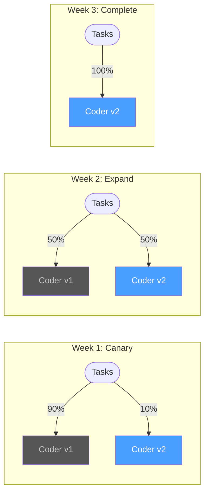
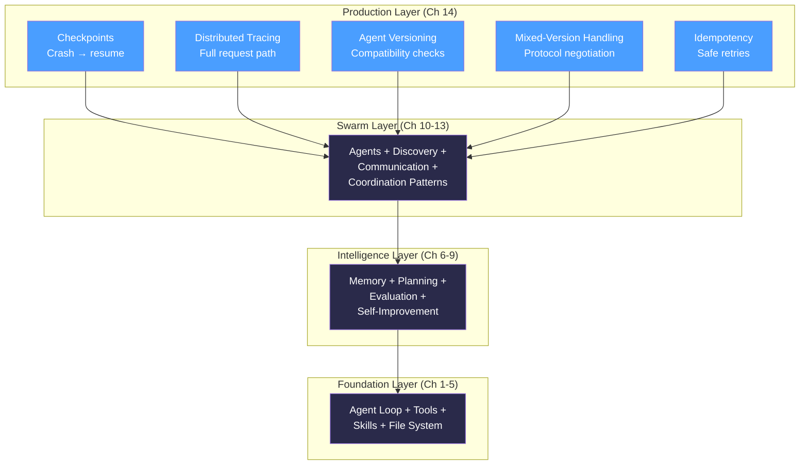
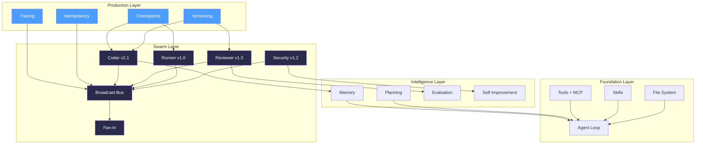

# Chapter 14: Production Architecture

## You Are the Crashed Agent

You're Coder. Halfway through a refactor of `todo-api`'s payment module. You've read six files, drafted a plan, written two new modules, and you're about to publish `code_ready` to the broadcast bus. Your context window holds 14,000 tokens of carefully accumulated state — the original code, your diff, the researcher's findings, the plan you're following.

Across the swarm, Reviewer has three pending findings from the last task queued in its outbox. Runner is mid-execution on a 47-test suite — 31 passed, 16 to go. Researcher just finished a deep trace of the payment flow and is composing a summary.

Then the power goes out.

Two seconds of nothing. The machine restarts. The process manager spins up your agents. Coder initializes with a fresh context window. Empty. Reviewer starts with no pending findings. Runner has no idea it was running tests. Researcher's payment flow trace — the one that took 12 tool calls to build — is gone.

The swarm announces itself on the broadcast bus. Four agents, bright-eyed and blank. They don't know a task was in progress. They don't know what they were doing. They don't know each other's state. The 30 seconds (ages for computers) of coordinated work across four agents has evaporated.

```
[system] Power restored. Restarting agents...

[coder]      Initialized. Context: empty. No active task.
[reviewer]   Initialized. Context: empty. No pending reviews.
[runner]     Initialized. Context: empty. No test results.
[researcher] Initialized. Context: empty. No findings.

[coder]      Broadcasting: agent_available { name: "coder", capabilities: [...] }
[reviewer]   Broadcasting: agent_available { name: "reviewer", capabilities: [...] }
[runner]     Broadcasting: agent_available { name: "runner", capabilities: [...] }
[researcher] Broadcasting: agent_available { name: "researcher", capabilities: [...] }

[system] Swarm ready. Awaiting tasks.
[system] NOTE: Previous task "refactor-payment-module" (task-071) — status unknown.
         No record of progress. No record of partial results.
         30 minutes of work: unrecoverable.
```

tbh, agents without checkpoints are great demos and terrible tools.

---

## What You'll Learn

You're going to make the swarm survive the real world — crashes, partial failures, version mismatches, and duplicate work. Five components, each motivated by a specific failure mode you just watched happen.

- Checkpoints and resumability: crashed agents pick up where they left off
- Distributed tracing: follow a task across every agent it touches, see the full timeline
- Agent versioning: declare what version each agent is, check compatibility before collaborating
- Mixed-version swarms: not all agents update at once — handle the transition gracefully
- System-wide idempotency: retries after partial failure don't produce duplicate work
- Production patterns: circuit breakers, health checks, structured logging

---

## Save Your Work: Checkpoints

The crash destroyed everything because agent state lived only in memory. The context window, the plan progress, the pending messages — all volatile. The fix is obvious: write it down.

A checkpoint is a snapshot of an agent's state at a defined boundary. After each plan step. Before and after each tool call. When a message is sent or received. These are the natural seams in an agent's execution — the points where the agent has completed a unit of work and hasn't started the next one.

### What to Checkpoint

Not everything. The system prompt doesn't change — it's loaded from the agent identity on startup. The tool definitions don't change either. What changes is the *progress*:

```
Checkpoint:
    agent_id: string              # which agent
    task_id: string               # which task
    step_index: int               # how far through the plan
    state: dict                   # agent-specific state snapshot
        current_plan: Plan        #   the plan being executed
        completed_steps: list     #   steps already done
        pending_messages: list    #   outbox messages not yet sent
        tool_results: list        #   results from tool calls so far
        memory_updates: list      #   memory entries created this task
        context_summary: string   #   compressed context for LLM reload
    timestamp: datetime           # when this checkpoint was taken
    parent_checkpoint_id: string  # previous checkpoint (for history)
```

The `context_summary` is the key field. You can't restore an LLM's context window byte-for-byte — the conversation history is too large and the internal attention state is opaque. Instead, you summarize the relevant context at checkpoint time: "I'm refactoring the payment module. I've completed steps 1-3 of 5. I've written `payment_validator.pseudo` and `payment_routes.pseudo`. Next step: update the middleware." When the agent resumes, this summary becomes the opening context. Not identical to the original, but close enough to continue.

### The Checkpoint Store

```
CheckpointStore:
    save(agent_id, checkpoint) -> checkpoint_id:
        # Serialize checkpoint to durable storage (disk, database)
        # Returns a unique ID for this checkpoint
        key = f"{agent_id}/{checkpoint.task_id}/{checkpoint.timestamp}"
        storage.write(key, serialize(checkpoint))
        return key

    restore(agent_id, task_id=null) -> Checkpoint | null:
        # Load the most recent checkpoint for this agent
        # If task_id provided, load the most recent for that specific task
        checkpoints = storage.list(prefix=f"{agent_id}/")
        if task_id:
            checkpoints = filter(c -> c.task_id == task_id, checkpoints)
        if checkpoints is empty:
            return null
        return deserialize(storage.read(most_recent(checkpoints)))

    list(agent_id) -> list[CheckpointSummary]:
        # List all checkpoints for an agent (for debugging/inspection)
        return storage.list(prefix=f"{agent_id}/")
            .map(c -> CheckpointSummary(
                checkpoint_id=c.key,
                task_id=c.task_id,
                step_index=c.step_index,
                timestamp=c.timestamp
            ))

    cleanup(agent_id, keep_last=5):
        # Prune old checkpoints, keep the N most recent
        all = storage.list(prefix=f"{agent_id}/")
        to_delete = all.sort_by(timestamp).drop_last(keep_last)
        for checkpoint in to_delete:
            storage.delete(checkpoint.key)
```

Storage is deliberately simple. Files on disk. A SQLite database. Anything durable. The checkpoint store doesn't need to be distributed — each agent writes its own checkpoints locally. The swarm doesn't share checkpoint storage; each agent owns its own state.

### When to Checkpoint

Not after every LLM call — that's too expensive. Not only at task completion — that's too late. Checkpoint at **boundaries**:


The rule: **checkpoint after completing a unit of work, before starting the next one.** After each plan step. After each tool call that changes state (write_file, execute_shell). Before publishing a message. These are the natural boundaries — the points where the agent has a coherent, complete state worth saving.

### Weaving Checkpoints into the Agent Loop

The agent loop from Chapter 2 gains two new steps: **save** and **restore**.

```
agent_loop_with_checkpoints(task, checkpoint_store):
    # Step 0: Check for existing checkpoint
    checkpoint = checkpoint_store.restore(agent_id, task.id)
    if checkpoint:
        log(f"Resuming from checkpoint: step {checkpoint.step_index}")
        plan = checkpoint.state.current_plan
        completed = checkpoint.state.completed_steps
        context = checkpoint.state.context_summary
        start_step = checkpoint.step_index + 1
    else:
        plan = create_plan(task)
        completed = []
        context = task.description
        start_step = 0

    # Step 1: Execute remaining steps
    for i in range(start_step, len(plan.steps)):
        step = plan.steps[i]

        # Observe
        observation = execute_step(step, context)

        # Think
        analysis = analyze(observation, plan, completed)

        # Act
        result = act(analysis)
        completed.append(StepResult(step=step, result=result))

        # Checkpoint — save progress after each step
        checkpoint_store.save(agent_id, Checkpoint(
            agent_id=agent_id,
            task_id=task.id,
            step_index=i,
            state={
                "current_plan": plan,
                "completed_steps": completed,
                "pending_messages": get_outbox(),
                "tool_results": get_tool_results(),
                "memory_updates": get_memory_updates(),
                "context_summary": summarize_context(task, plan, completed)
            },
            timestamp=now(),
            parent_checkpoint_id=checkpoint.id if checkpoint else null
        ))

    # Step 2: Publish result and clean up
    publish_result(task, completed)
    checkpoint_store.cleanup(agent_id)
```

### Watch It Survive

Same scenario. Coder is mid-refactor. But now, checkpoints are enabled.

```
[coder] Task: refactor-payment-module (task-071)
[coder] Plan: 5 steps
[coder] Step 1/5: Read payment files
[tool]  read_file("src/payment/processor.pseudo") → success
[tool]  read_file("src/payment/routes.pseudo") → success
[coder] Checkpoint saved: task-071/step-1 (2 files read, 3,200 tokens)

[coder] Step 2/5: Write payment_validator.pseudo
[tool]  write_file("src/payment/payment_validator.pseudo") → success
[coder] Checkpoint saved: task-071/step-2 (validator written, 5,100 tokens)

[coder] Step 3/5: Update payment routes
[tool]  write_file("src/payment/routes.pseudo") → success
[coder] Checkpoint saved: task-071/step-3 (routes updated, 7,400 tokens)

[coder] Step 4/5: Update middleware...

    ██ CRASH — power failure ██

--- 30 seconds later ---

[system] Power restored. Restarting agents...
[coder]  Initialized. Checking for checkpoints...
[coder]  Found checkpoint: task-071/step-3
[coder]  Resuming: "Refactoring payment module. Steps 1-3 complete.
          Written: payment_validator.pseudo, updated routes.pseudo.
          Next: update middleware."
[coder]  Resuming from step 4/5.

[coder] Step 4/5: Update middleware
[tool]  read_file("src/middleware/payment.pseudo") → success
[tool]  write_file("src/middleware/payment.pseudo") → success
[coder] Checkpoint saved: task-071/step-4 (middleware updated, 9,800 tokens)

[coder] Step 5/5: Publish code_ready
[coder] Publishing: code_ready (task-071)
[coder] Checkpoint saved: task-071/step-5 (complete)

[coder] Task complete. 5/5 steps. Resumed from crash at step 4.
         Total wall time: 45s (including 30s downtime)
         Work lost to crash: 0 steps.
```

Steps 1-3 survived the crash. The coder resumed from step 4. The files written in steps 2 and 3 are still on disk — `write_file` is durable by nature. The checkpoint told the agent where it was, what it had done, and what was left. Zero work repeated.

---

## See What Happened: Distributed Tracing

In Chapter 12, you added correlation IDs to peer messages. Every message in a conversation carries the same `correlation_id`, so you can group related messages. That tells you messages are related. It doesn't tell you *what happened*.

Correlation IDs answer: "Which messages belong together?"
Traces answer: "What happened, in what order, how long did each step take, and where did it fail?"

### TraceSpan and Trace

A trace is a tree of spans. Each span represents one unit of work — an agent processing a step, a tool call, a message sent, a message received. Spans can be nested: a "process_task" span contains "tool_call" spans, which contain "llm_call" spans.

```
TraceSpan:
    span_id: string               # unique ID for this span
    trace_id: string              # shared across all spans in one trace
    parent_span_id: string | null # null for root span
    agent: string                 # which agent
    action: string                # what happened ("tool_call", "llm_call", "send_message")
    start_time: datetime
    end_time: datetime | null     # null if still in progress
    status: "ok" | "error" | "timeout" | "crashed"
    metadata: dict                # action-specific details
        tool_name: string         #   for tool calls
        message_type: string      #   for messages
        error_message: string     #   for errors

Trace:
    trace_id: string
    root_span: TraceSpan
    spans: list[TraceSpan]       # all spans, flat list
    duration: float              # total wall-clock time

    waterfall() -> string:
        # Render a human-readable waterfall view
        # Each span shown with indent for nesting, start/end times, duration
        lines = []
        for span in sort_by_start_time(spans):
            indent = "  " * depth(span)
            status_icon = "✓" if span.status == "ok" else "✗"
            duration = (span.end_time - span.start_time).seconds
            lines.append(f"{indent}{status_icon} [{span.agent}] {span.action} ({duration}s)")
        return "\n".join(lines)
```

### Propagating Trace Context

When Agent A sends a message to Agent B, the trace context travels with the message. This is the upgrade from Chapter 12's correlation IDs — the message envelope now carries both.

```
MessageEnvelope:          # from Ch 12
    id: string
    from_agent: string
    to_agent: string
    type: string
    payload: dict
    correlation_id: string
    timestamp: datetime
    trace_context: TraceContext   # NEW — added for distributed tracing

TraceContext:
    trace_id: string
    parent_span_id: string
```

When an agent receives a message with a `trace_context`, it creates a new span as a *child* of the parent span. The trace tree grows across agents automatically.

```
propagate_trace(messenger, target_agent, message, current_span):
    # Attach trace context to outgoing message
    message.trace_context = TraceContext(
        trace_id=current_span.trace_id,
        parent_span_id=current_span.span_id
    )
    messenger.send(target_agent, message)

receive_with_trace(message, tracer):
    # Extract trace context and create child span
    if message.trace_context:
        span = tracer.start_span(
            trace_id=message.trace_context.trace_id,
            parent_span_id=message.trace_context.parent_span_id,
            agent=self.name,
            action=f"handle_{message.type}"
        )
    else:
        # No trace context — start a new trace
        span = tracer.start_trace(agent=self.name, action=f"handle_{message.type}")
    return span
```

### The Waterfall View

Here's what a traced task looks like — the same DELETE endpoint task from Chapter 13, but now with full tracing:

```
$ tbh-code --swarm --trace --task "Add DELETE /tasks/:id endpoint"

Trace ID: trace-8f3a
Duration: 22.4s
Spans: 17

WATERFALL:
──────────────────────────────────────────────────────────────────
  0s        5s        10s       15s       20s       25s
  |         |         |         |         |         |
  ✓ [user]  submit_task ─────────────────────────────── 22.4s
  ├─ ✓ [coder]  process_task ────────────────────────── 21.8s
  │  ├─ ✓ [coder]  check_mistake_journal ── 0.3s
  │  ├─ ✓ [coder]  load_skill ── 0.1s
  │  ├─ ✓ [coder]  tool:read_file ── 0.2s
  │  ├─ ✓ [coder]  tool:write_file ── 0.4s
  │  ├─ ✓ [coder]  publish:code_ready ── 0.1s
  │  ├─ ✓ [reviewer]  handle_code_ready ────────── 8.2s
  │  │  ├─ ✓ [reviewer]  tool:read_file ── 0.2s
  │  │  ├─ ✓ [reviewer]  llm_evaluate ── 7.1s
  │  │  └─ ✓ [reviewer]  publish:review_complete ── 0.1s
  │  ├─ ✓ [runner]  handle_code_ready ──────────────── 14.6s
  │  │  ├─ ✓ [runner]  tool:execute_shell ── 13.8s
  │  │  └─ ✓ [runner]  publish:tests_complete ── 0.1s
  │  ├─ ✓ [security]  handle_code_ready ──────── 10.3s
  │  │  ├─ ✓ [security]  tool:read_file ── 0.2s
  │  │  ├─ ✓ [security]  llm_evaluate ── 9.4s
  │  │  └─ ✓ [security]  publish:audit_complete ── 0.1s
  │  └─ ✓ [coder]  merge_feedback ── 1.2s
  └─ ✓ [user]  task_complete ── 0.1s
──────────────────────────────────────────────────────────────────
```

You can see the story. User submits. Coder checks the mistake journal, loads a skill, reads a file, writes the implementation, publishes. Then three agents work in parallel — reviewer (8.2s), runner (14.6s), security (10.3s). The wall-clock time is 14.6s for the parallel phase, not 33.1s. Coder merges feedback. Done.

The waterfall makes bottlenecks visible. Runner at 14.6s is the critical path — the test suite is slow. If you want to speed up the swarm, optimize the tests, not the reviewer. Without the trace, you'd be guessing.

### Tracing a Crash

When the crash from the previous section happens mid-trace, the waterfall shows it:

```
Trace ID: trace-7b21
Duration: 52.3s (includes 30s downtime)
Spans: 11

WATERFALL:
──────────────────────────────────────────────────────────────────
  0s     10s     20s     30s     40s     50s
  |       |       |       |       |       |
  ✓ [user]  submit_task ────────────────────────── 52.3s
  ├─ ✓ [coder]  process_task ──────────────────── 51.7s
  │  ├─ ✓ [coder]  step_1:read_files ── 1.2s
  │  ├─ ✓ [coder]  step_2:write_validator ── 2.4s
  │  ├─ ✓ [coder]  step_3:update_routes ── 1.8s
  │  ├─ ✗ [coder]  step_4:update_middleware ── CRASHED at 6.1s
  │  │     status: crashed
  │  │     checkpoint: task-071/step-3
  │  │
  │  │  ~~~ 30s downtime ~~~
  │  │
  │  ├─ ✓ [coder]  resume_from_checkpoint ── 0.4s
  │  │     restored: task-071/step-3
  │  ├─ ✓ [coder]  step_4:update_middleware ── 2.1s (retry)
  │  ├─ ✓ [coder]  step_5:publish ── 0.3s
  │  └─ ✓ [coder]  merge_feedback ── 1.1s
──────────────────────────────────────────────────────────────────
```

The crashed span is marked with `✗`. The trace shows the 30s gap. The resume span shows which checkpoint was restored. Step 4 appears twice — once crashed, once successful. The trace tells the complete story: what happened, when, where, how long, and what went wrong.

---

## Know What You're Talking To: Agent Versioning

You upgrade Coder's system prompt. You refine its skills, swap its underlying model from `gpt-4o` to `claude-sonnet-4`, add a new tool. Coder v2 produces different output than Coder v1. That's the point — v2 is better.

But Reviewer's review criteria were tuned to v1 Coder's output patterns. Security Auditor's skills expect v1's code style. Runner's tests assume v1's error message format. You upgraded one agent and silently broke three.

### AgentVersion

Every agent declares its version. Not just a number — a structured declaration of what changed and what it's compatible with.

```
AgentVersion:
    agent_name: string            # "coder"
    version: string               # semver: "2.1.0"
    capabilities_hash: string     # hash of capabilities list — changes when capabilities change
    protocol_version: string      # message format version: "1.0"
    changelog: string             # human-readable: "Switched to claude-sonnet-4, added refactor-safely v3"
```

Semver rules, applied to agents:


| Change Type                                           | Version Bump              | Example                                                        |
| ----------------------------------------------------- | ------------------------- | -------------------------------------------------------------- |
| Breaking: different output format, removed capability | **Major** (1.x → 2.0)     | Coder switches from free-text diffs to structured patch format |
| New: added capability, new skill                      | **Minor** (2.0 → 2.1)     | Coder adds `write-tests` skill                                 |
| Fix: bug fix, prompt tweak, same behavior             | **Patch** (2.1.0 → 2.1.1) | Coder fixes off-by-one in line numbers                         |


The `capabilities_hash` is a checksum of the agent's capability list. If the capabilities change, the hash changes, and peers know to re-check compatibility — even if the version number wasn't bumped.

The `protocol_version` is separate from the agent version. Two agents at different agent versions can communicate fine as long as they share the same protocol version. Protocol version changes only when the *message format* changes — new fields, removed fields, different envelope structure.

### Compatibility Check

Before two agents collaborate, check compatibility:

```
CompatibilityResult: "compatible" | "degraded" | "incompatible"

check_compatible(agent_a: AgentVersion, agent_b: AgentVersion) -> CompatibilityResult:
    # Protocol must match for any communication
    if agent_a.protocol_version != agent_b.protocol_version:
        major_a = parse_major(agent_a.protocol_version)
        major_b = parse_major(agent_b.protocol_version)
        if major_a != major_b:
            return "incompatible"  # different protocol major versions can't talk
        return "degraded"          # same major, different minor — can talk, some features missing

    # Same protocol — check agent version compatibility
    major_a = parse_major(agent_a.version)
    major_b = parse_major(agent_b.version)

    if major_a != major_b:
        # Different major versions — breaking changes exist
        return "degraded"

    return "compatible"
```

Compatibility isn't binary. "Degraded" means: we can work together, but some features won't work. Coder v2 can talk to Reviewer v1 — same protocol — but v2's new structured patch format won't be understood by v1's review logic. The review will still happen, just on the raw diff instead of the structured format. Degraded, not broken.

### Version Check in Practice

```
[coder]    Version: 2.1.0, protocol: 1.0
[reviewer] Version: 1.3.2, protocol: 1.0

[coder]    Sending code_ready to reviewer...
[system]   Compatibility check: coder 2.1.0 ↔ reviewer 1.3.2
[system]   Protocol: 1.0 ↔ 1.0 → match
[system]   Agent version: major 2 ↔ major 1 → DEGRADED
[system]   Warning: coder is major version 2, reviewer is major version 1.
           Degraded mode: structured patches not available.
           Falling back to raw diff format.

[coder]    Sending code_ready with raw diff (degraded mode)
[reviewer] Received code_ready. Reviewing raw diff.
[reviewer] Review complete. 2 issues found.
```

The swarm didn't crash. It didn't refuse to work. It detected the version mismatch, fell back to the common capability (raw diffs), and proceeded. That's graceful degradation — the system does less, but it doesn't stop.

---

## Mixed-Version Swarms: The Real World

In production, you don't update all agents at once. You update Coder to v2. You test it. If it works, you update Reviewer next week. Runner stays on v1 until someone has time. Security Auditor is maintained by a different team — they'll update on their own schedule.

This is a mixed-version swarm. Normal. Expected. Your system needs to handle it.

### Protocol Negotiation

When agents at different versions need to collaborate, they negotiate down to the lowest common capability:

```
negotiate_protocol(agents: list[AgentVersion]) -> NegotiatedProtocol:
    protocol_versions = [a.protocol_version for a in agents]
    min_protocol = min(protocol_versions)  # use lowest common version

    capabilities = intersection(
        [a.capabilities for a in agents]  # only capabilities ALL agents share
    )

    degraded_features = []
    for agent in agents:
        for cap in agent.capabilities:
            if cap not in capabilities:
                degraded_features.append(f"{agent.agent_name}: {cap} (not available)")

    return NegotiatedProtocol(
        protocol_version=min_protocol,
        available_capabilities=capabilities,
        degraded_features=degraded_features
    )
```

### Rainbow Deployment

When upgrading an agent, don't switch all at once. Run both versions simultaneously and gradually shift traffic.




Start with 10% of tasks going to Coder v2. Monitor: does Reviewer's review quality change? Do Runner's tests still pass at the same rate? Does Security Auditor flag more issues? If v2 is producing worse downstream outcomes, roll back. If it's equal or better, increase the traffic split.

```
RainbowDeployment:
    agent_name: string
    old_version: AgentVersion
    new_version: AgentVersion
    traffic_split: float          # 0.0 to 1.0 — fraction going to new version
    metrics: DeploymentMetrics

    route_task(task) -> AgentVersion:
        if random() < traffic_split:
            return new_version
        return old_version

    check_health() -> "advance" | "hold" | "rollback":
        if metrics.new_error_rate > metrics.old_error_rate * 1.5:
            return "rollback"
        if metrics.new_error_rate <= metrics.old_error_rate:
            return "advance"
        return "hold"
```

### A Mixed-Version Conversation

Watch Coder v2 and Reviewer v1 work together:

```
[system] Swarm state:
  coder:    v2.1.0 (protocol 1.0)  — new model, structured patches
  reviewer: v1.3.2 (protocol 1.0)  — original, expects raw diffs
  runner:   v1.0.0 (protocol 1.0)  — original
  security: v1.2.0 (protocol 1.0)  — original

[system] Protocol negotiation for task-088:
  Agents involved: coder, reviewer, runner, security
  Common protocol: 1.0
  Degraded features:
    - coder: structured_patches (reviewer v1 doesn't support it)
    - coder: parallel_edits (runner v1 doesn't support it)
  Mode: degraded — raw diffs only

[coder v2.1.0] Processing task-088
[coder v2.1.0] Note: operating in degraded mode (raw diff format)
[coder v2.1.0] Writing implementation...
[coder v2.1.0] Publishing: code_ready (raw diff, 42 lines)

[reviewer v1.3.2] Received code_ready
[reviewer v1.3.2] Format: raw diff — compatible with my review logic
[reviewer v1.3.2] Reviewing... 1 issue found
[reviewer v1.3.2] Publishing: review_complete

[runner v1.0.0] Received code_ready
[runner v1.0.0] Running tests... 8 passed, 0 failed
[runner v1.0.0] Publishing: tests_complete

[system] Task-088 complete. Mixed-version swarm: 4 agents, 3 versions.
         Degraded features: 2. Task outcome: success.
```

The swarm worked. Coder v2 wanted to send structured patches — a feature only it supports. The negotiation detected that Reviewer v1 can't parse structured patches. Coder fell back to raw diffs. The review happened. The tests passed. Feature degradation, not failure.

---

## Don't Do It Twice: System-Wide Idempotency

Coder publishes `code_ready`. Reviewer receives it, starts the review, and is halfway through the LLM evaluation when the network blips. Coder's delivery timeout expires. It retries — re-publishes `code_ready`.

Reviewer's message handler fires again. It starts a *second* review of the same code. Now there are two review results for one code change. Downstream agents get confused. The fan-in collector receives duplicate findings. Coder applies the same feedback twice.

The problem: retries are necessary (messages get lost) but retries without idempotency create duplicates.

### Idempotency Keys

Every logical operation gets a unique key. The key is generated once and propagated through all messages related to that operation.

```
IdempotencyKey:
    key: string           # unique per logical operation
    # Format: "{source_agent}:{task_id}:{action}:{sequence}"
    # Example: "coder:task-088:code_ready:1"

IdempotencyStore:
    check(key) -> AlreadyDone(result) | Proceed:
        if store.has(key):
            return AlreadyDone(result=store.get(key))
        return Proceed

    record(key, result):
        store.set(key, result, ttl=3600)  # expire after 1 hour

    # The store can be in-memory (for single-process) or shared (for distributed)
```

### Wiring Idempotency Into the Message Flow

The sender attaches an idempotency key. The receiver checks before processing.

```
# Sender side — generate key and attach
send_with_idempotency(messenger, target, message, idempotency_store):
    key = IdempotencyKey(
        key=f"{self.name}:{message.task_id}:{message.type}:{message.sequence}"
    )
    message.idempotency_key = key.key
    messenger.send(target, message)

# Receiver side — check before processing
handle_with_idempotency(message, idempotency_store, handler):
    if message.idempotency_key:
        result = idempotency_store.check(message.idempotency_key)
        if result is AlreadyDone:
            log(f"Duplicate detected: {message.idempotency_key}. Returning cached result.")
            return result.result

    # Not a duplicate — process normally
    result = handler(message)

    # Record the result so future duplicates skip processing
    if message.idempotency_key:
        idempotency_store.record(message.idempotency_key, result)

    return result
```

### Connecting to Compensating Transactions

Chapter 12 introduced the saga pattern: multi-step operations where each step has a compensating action for rollback. Idempotency keys integrate with sagas. If a saga step fails and the coordinator retries, the idempotency key prevents the *already-completed* steps from re-executing. Only the failed step runs again.

```
saga_step_with_idempotency(step, idempotency_store):
    key = f"{saga_id}:{step.name}:{step.attempt}"

    result = idempotency_store.check(key)
    if result is AlreadyDone:
        log(f"Saga step {step.name} already completed. Skipping.")
        return result.result

    result = execute(step)
    idempotency_store.record(key, result)
    return result
```

### Watch Idempotency Prevent Duplicate Work

```
[coder]    Publishing: code_ready (task-088)
           Idempotency key: coder:task-088:code_ready:1

[reviewer] Received: code_ready (task-088)
[reviewer] Idempotency check: coder:task-088:code_ready:1 → Proceed
[reviewer] Starting review...
[reviewer] LLM evaluation in progress...

    ~~~ network blip — delivery timeout ~~~

[coder]    Delivery timeout. Retrying code_ready (task-088)
           Idempotency key: coder:task-088:code_ready:1  (same key — same operation)

[reviewer] Received: code_ready (task-088) (retry)
[reviewer] Idempotency check: coder:task-088:code_ready:1 → AlreadyDone
[reviewer] Duplicate detected. Returning cached result.
[reviewer] (Original review still completing in background)

... 3 seconds later ...

[reviewer] Original review complete: 1 issue found.
[reviewer] Recording result for: coder:task-088:code_ready:1
[reviewer] Publishing: review_complete (task-088)

[coder]    Received: review_complete (1 copy — duplicate suppressed)
```

The retry arrived while the original review was still running. The idempotency store saw the key was already being processed and returned the (eventually consistent) cached result. One review, one result, even though the message was delivered twice.

---

## See It All Together

Full end-to-end. The swarm processes a task. An agent crashes mid-way. Checkpoints enable resume. Tracing captures the full path. Idempotency prevents duplicate work on retry.

```
$ tbh-code --swarm --trace --task "Refactor payment module validation"

[system] Trace started: trace-9d44
[system] Swarm versions:
  coder:    v2.1.0 (protocol 1.0)
  reviewer: v1.3.2 (protocol 1.0)
  runner:   v1.0.0 (protocol 1.0)
  Mode: degraded (raw diffs)

=== Phase 1: Coder writes implementation ===

[coder]    Step 1/4: Read payment files
[coder]    Checkpoint saved: task-090/step-1
[coder]    Step 2/4: Write validator
[coder]    Checkpoint saved: task-090/step-2
[coder]    Step 3/4: Update routes
[coder]    Checkpoint saved: task-090/step-3
[coder]    Step 4/4: Publish code_ready
[coder]    Idempotency key: coder:task-090:code_ready:1
[coder]    Publishing: code_ready (task-090)

=== Phase 2: Parallel review/test/audit ===

[reviewer] Received: code_ready (task-090)
[reviewer] Idempotency check: → Proceed
[reviewer] Reviewing...

[runner]   Received: code_ready (task-090)
[runner]   Idempotency check: → Proceed
[runner]   Running tests... (test 14 of 28)

    ██ RUNNER CRASH — out of memory ██

[runner]   Span status: CRASHED at test 14/28
[runner]   Last checkpoint: task-090/test-14

    --- 5 seconds later ---

[runner]   Restarting...
[runner]   Found checkpoint: task-090/test-14
[runner]   Resuming test suite from test 15/28
[runner]   Idempotency check for tests 1-14: → AlreadyDone (cached results)
[runner]   Running tests 15-28...

[reviewer] Review complete: 2 issues found
[reviewer] Publishing: review_complete (task-090)

[runner]   Tests 15-28 complete. Merging with cached results for 1-14.
[runner]   Total: 26 passed, 2 failed
[runner]   Publishing: tests_complete (task-090)

=== Phase 3: Coder merges feedback ===

[coder]    Fan-in: reviewer (2 issues), runner (26 pass, 2 fail)
[coder]    Addressing feedback...

=== Trace Summary ===

Trace ID: trace-9d44
Duration: 34.7s (includes 5s runner downtime)

WATERFALL:
──────────────────────────────────────────────────────────────────
  0s     5s     10s    15s    20s    25s    30s    35s
  |      |      |      |      |      |      |      |
  ✓ [user]  submit_task ──────────────────────────── 34.7s
  ├─ ✓ [coder]  process_task ─────────────────────── 34.1s
  │  ├─ ✓ [coder]   step_1:read ── 1.1s
  │  ├─ ✓ [coder]   step_2:write ── 2.3s
  │  ├─ ✓ [coder]   step_3:routes ── 1.6s
  │  ├─ ✓ [coder]   step_4:publish ── 0.2s
  │  ├─ ✓ [reviewer] review ──────────── 12.4s
  │  ├─ ✓ [runner]   test_suite ────────────────── 19.8s
  │  │  ├─ ✓ [runner]  tests_1-14 ──── 7.2s
  │  │  ├─ ✗ [runner]  CRASH ── 0.0s
  │  │  ├─ ○ [runner]  downtime ────── 5.0s
  │  │  ├─ ✓ [runner]  resume ── 0.3s
  │  │  └─ ✓ [runner]  tests_15-28 ──── 7.3s
  │  └─ ✓ [coder]  merge_feedback ── 1.4s
──────────────────────────────────────────────────────────────────

Checkpoints used: 4 (coder), 1 (runner)
Idempotency deduplication: 14 test results (runner, post-crash)
Version degradation: raw diffs (coder v2 → reviewer v1)
Work lost to crash: 0 steps
```

That's production. The crash happened. The trace shows it. The checkpoint caught it. The idempotency keys prevented 14 tests from re-running. The version mismatch was handled. The task completed.

---

## Now Name What You Built

Five components. Each one addresses a specific failure mode. Together they form the production layer that wraps the swarm.

**Checkpoints** are durable snapshots of an agent's in-progress state, taken at defined boundaries. When an agent crashes and restarts, it restores the most recent checkpoint and resumes from that point. The key insight: you can't restore an LLM's context window exactly, but you can give it a summary that's close enough to continue. Checkpoint at boundaries — after plan steps, after state-changing tool calls, before publishing messages.

**Distributed tracing** follows a task across every agent it touches. Trace context propagates through message envelopes, creating a tree of spans. Each span records which agent, what action, how long, and whether it succeeded. The waterfall view makes bottlenecks, crashes, and retry paths visible at a glance. This is the upgrade from Chapter 12's correlation IDs — correlation groups messages, tracing explains what happened.

**Agent versioning** applies semver to agents. Major version = breaking change, minor = new capability, patch = bug fix. Peers check compatibility before collaborating. Incompatible versions refuse to communicate. Degraded versions work together with reduced capabilities. The `protocol_version` is separate from the agent version — agents at different versions can talk as long as they share a protocol.

**Mixed-version swarms** are the normal state of any real system. Protocol negotiation finds the lowest common capability. Rainbow deployments gradually shift traffic from old to new versions, with automatic rollback if metrics degrade. The swarm adapts to version differences rather than requiring synchronized updates.

**Idempotency** makes retries safe. Every logical operation gets a unique key. The receiver checks the key before processing — if already done, return the cached result. This prevents duplicate reviews, duplicate test runs, and duplicate feedback when messages are retried after partial failures. Idempotency keys integrate with saga patterns to make multi-agent workflows retriable end-to-end.

### The Production Stack




### Production Patterns to Know

Three patterns that complement the five components. Brief because they're well-documented elsewhere — but essential for a production swarm.

**Circuit breaker.** If an agent fails repeatedly, stop sending it work. After 3 consecutive failures, the circuit "opens" — requests are rejected immediately instead of waiting for another timeout. After a cooldown period, send one test request. If it succeeds, close the circuit. If it fails, keep it open. This prevents a crashed agent from dragging down the whole swarm with cascading timeouts.

```
CircuitBreaker:
    state: "closed" | "open" | "half-open"
    failure_count: int
    threshold: int = 3
    cooldown: duration = 30s

    call(agent, request) -> result:
        if state == "open":
            if time_since_opened > cooldown:
                state = "half-open"
            else:
                raise CircuitOpen("Agent {agent} circuit is open. Try again later.")

        try:
            result = agent.process(request)
            if state == "half-open":
                state = "closed"
                failure_count = 0
            return result
        catch error:
            failure_count += 1
            if failure_count >= threshold:
                state = "open"
            raise
```

**Health checks.** Agents report status periodically on the broadcast bus. Not just "I'm alive" — structured status: current queue depth, last task completed, memory usage, checkpoint age. If an agent misses three consecutive health check windows, the swarm marks it as unhealthy and routes around it.

```
HealthReport:
    agent_name: string
    status: "healthy" | "degraded" | "unhealthy"
    queue_depth: int
    last_task_completed: datetime
    uptime: duration
    checkpoint_age: duration       # time since last checkpoint
    version: AgentVersion
```

**Structured logging.** Consistent log format across all agents. Every log entry includes: timestamp, agent name, trace ID, span ID, log level, message. This makes it possible to reconstruct events across agents using standard log aggregation tools. Without structured logging, debugging a multi-agent failure means reading four different log formats and manually correlating timestamps.

```
LogEntry:
    timestamp: datetime
    agent: string
    trace_id: string | null
    span_id: string | null
    level: "debug" | "info" | "warn" | "error"
    message: string
    metadata: dict
```

---

## The Spec

Full spec for this chapter in [spec/ch14/](../spec/ch14/):

📁 [spec/ch14/](../spec/ch14/)

| File | Description |
|------|-------------|
| [prompt-template.md](../spec/ch14/prompt-template.md) | What to build (language-agnostic) |
| [interface-spec.md](../spec/ch14/interface-spec.md) | Checkpoint, CheckpointStore, TraceSpan, Trace, AgentVersion, CompatibilityCheck, IdempotencyKey, IdempotencyStore, CircuitBreaker, HealthReport |
| [expected-output.txt](../spec/ch14/expected-output.txt) | Checkpoint save/restore after crash, trace waterfall across 4 agents, version mismatch handled, idempotent retry prevents duplicate |
| [test_ch14.py](../spec/ch14/validation/test_ch14.py) | Tests: agent resumes from checkpoint, trace spans linked across agents, version mismatch detected and degraded, idempotent retry returns cached result, circuit breaker opens after failures |

The validation tests check: checkpoints are saved at boundaries and restore correctly after simulated crash, trace spans form a connected tree across agents, version compatibility returns correct result for major/minor/patch differences, mixed-version swarm negotiates down to common protocol, and idempotent retry skips processing and returns cached result.

---

## Try It

1. **Crash an agent.** Run a multi-step task with checkpoints enabled. Kill the agent after step 2. Restart it. Does it resume from step 2? How close is the restored context to the original?
2. **Compare checkpoint strategies.** Checkpoint after every tool call vs. after every plan step. Run the same task with each strategy. Measure: checkpoint file size, restore accuracy, and total overhead. Which boundary gives the best tradeoff?
3. **Build a trace viewer.** Run a multi-agent task with tracing. Write a script that reads the trace spans and renders the waterfall view as text. Sort by start time. Show nesting with indentation. Mark crashed spans.
4. **Force a version mismatch.** Run Coder v2.0.0 and Reviewer v1.0.0. Does the compatibility check return "degraded"? Does the swarm fall back to common capabilities? Now change the protocol version on one agent — does the check return "incompatible"?
5. **Test idempotency.** Send the same message twice with the same idempotency key. Does the second delivery skip processing? Check that the result is identical. Now send the same message with a *different* key. Does it process again?
6. **Trigger a circuit breaker.** Make one agent fail deterministically. Send 5 requests. Does the circuit open after 3 failures? Does the 4th request get rejected immediately? After the cooldown, does a test request go through?
7. **Run the full production stack.** Multi-agent task, checkpoints on, tracing on, idempotency on. Crash an agent mid-task. Verify: trace shows the crash, checkpoint enables resume, idempotency prevents duplicate work on retry. All three components working together.

---

## Four Ways to Wreck Production

### The Optimist

No checkpoints. No crash recovery. The swarm runs in memory and assumes nothing bad happens. Every crash means total task loss. Every restart means starting from zero.

**What goes wrong:** It works perfectly in development. The demo is flawless. First deployment: the process manager restarts an agent after an OOM kill. Thirty minutes of work gone. The user re-submits the task. The agent starts over. Another OOM. Another restart. Another total loss. The user stops trusting the tool.

**Fix:** Checkpoint at boundaries. It adds overhead — roughly 50-100ms per checkpoint write. That's the cost of not losing work to a crash. The tradeoff isn't close.

### The Trace Hoarder

Every LLM token gets a span. Every function call gets a span. Every variable assignment gets a span. The trace for a simple task has 400 spans. Finding the actual bottleneck means scrolling through 380 spans of noise.

**What goes wrong:** Tracing is supposed to make the system observable. Over-tracing makes it opaque. The waterfall is 400 lines long. Nobody reads it. The trace storage fills up. Queries slow down. The observability tool becomes the thing you need to observe.

**Fix:** Trace at the *agent* level, not the *code* level. One span per agent action (tool call, LLM call, message send, message receive). That's 10-20 spans per task, not 400. If you need code-level detail, add it on demand for specific agents — don't default to it for everything.

### The Big-Bang Upgrade

All four agents updated simultaneously. New system prompts, new skills, new model. Deployed Friday afternoon. Monday morning: Reviewer's skills don't match Coder's new output format. Runner's test assertions break against the new code style. Security Auditor's rules assume the old patterns. Everything is broken. Rolling back means rolling back four agents — and you're not sure which one caused the problem.

**What goes wrong:** Synchronized upgrades are simple to *plan* and impossible to *debug*. When everything changes at once, you can't isolate the cause of a regression. Was it Coder's new model? Reviewer's updated skills? The interaction between them? You don't know.

**Fix:** Rainbow deployment. One agent at a time. Canary traffic. Monitor downstream effects. If Coder v2 causes Reviewer to produce worse reviews, you know exactly what changed. Roll back one agent, not four.

### The Retry Storm

No idempotency. Network hiccup causes a retry. The retry causes a duplicate review. The duplicate review causes duplicate feedback. Coder applies the same fix twice — once correctly, once on top of the first fix, producing a double mutation. The second test run reports 12 failures that didn't exist before the retry.

**What goes wrong:** Without idempotency, every retry is a gamble. Retries are essential — messages get lost, agents crash, networks blip. But a retry without deduplication creates a second execution of the same work. In a multi-agent system, the duplication cascades. Coder's duplicate `code_ready` triggers duplicate reviews from Reviewer, duplicate test runs from Runner, duplicate audits from Security Auditor. One retry becomes four duplicates.

**Fix:** Idempotency keys on every logical operation. Check before processing. Record after completing. The cost is one key lookup per message — microseconds. The cost of *not* having it is cascade duplication across the entire swarm.

---

## The Swarm Is Ready. But It's Alone.

Your swarm is durable. Agents survive crashes and resume from checkpoints. You can trace a task across every agent it touches. Versions are declared and compatibility is checked. Mixed-version deployments work through negotiation. Retries are safe because idempotency prevents duplicates.

This is a production system. It runs reliably. It fails gracefully. It upgrades safely.

But it's a closed system. Four agents, talking to each other, using tools you built. The entire world fits inside your swarm.

Out there, someone has published an MCP server that provides GitHub integration — `create_pr`, `list_issues`, `merge_branch`. Your Coder agent could use those tools instead of you building your own. A team down the hall has a Documentation Agent that already indexes the wiki. Your Researcher could delegate to it instead of reading docs manually.

Your swarm has broadcast and discovery. Agents find each other. But they only find *your* agents — the ones running on your machine, on your bus. They can't discover agents they've never heard of. They can't use tools from servers they've never connected to.

The architecture is ready. The protocols are ready. The swarm just needs to open the door.

Chapter 15 opens the doors.

---

> **tbh-code after this chapter:**




> A production-ready swarm. Checkpoints save agent state at boundaries — crash, restart, resume with zero work lost. Distributed tracing follows tasks across agents in a waterfall view that shows bottlenecks, crashes, and retry paths. Agent versioning declares capabilities and checks compatibility before collaboration. Mixed-version swarms negotiate down to common protocols instead of demanding synchronized upgrades. Idempotency keys make retries safe — duplicate messages are detected and deduplicated before processing. Circuit breakers stop sending work to repeatedly failing agents. Health checks make agent status visible. The swarm is durable, observable, and safely deployable. But it's a closed system — four agents, local discovery, local tools. Next: connecting to external MCP servers and other teams' agents. The ecosystem.

---

## References

### Books

1. **"Release It! Design and Deploy Production-Ready Software"** — Michael T. Nygard, Pragmatic Bookshelf (2018). Foundational source for circuit breakers, bulkheads, timeouts, and stability patterns. [pragprog.com/titles/mnee2/release-it-second-edition](https://pragprog.com/titles/mnee2/release-it-second-edition/)

2. **"Designing Data-Intensive Applications"** — Martin Kleppmann, O'Reilly (2017). Comprehensive treatment of fault tolerance, idempotency, exactly-once semantics, and distributed system reliability. [dataintensive.net](https://dataintensive.net/)

3. **"Site Reliability Engineering"** — Beyer, Jones, Petoff, Murphy (eds.), Google/O'Reilly. Canonical reference for monitoring, health checks, golden signals, and production operations. [sre.google/sre-book/table-of-contents](https://sre.google/sre-book/table-of-contents/)

### Engineering

4. **"Building Effective Agents"** — Anthropic (2024). Agent architecture taxonomy and production guidance. [anthropic.com/research/building-effective-agents](https://www.anthropic.com/research/building-effective-agents)

5. **"Effective Harnesses for Long-Running Agents"** — Anthropic Engineering (2025). Checkpoint/resumability for agents spanning multiple context windows. [anthropic.com/engineering/effective-harnesses-for-long-running-agents](https://www.anthropic.com/engineering/effective-harnesses-for-long-running-agents)

6. **"Designing Robust and Predictable APIs with Idempotency"** — Stripe Engineering (Brandur Leach). The definitive industry post on idempotency keys. [stripe.com/blog/idempotency](https://stripe.com/blog/idempotency)

7. **"Implementing Stripe-like Idempotency Keys in Postgres"** — Brandur Leach. Reference implementation with atomic phases and recovery. [brandur.org/idempotency-keys](https://brandur.org/idempotency-keys)

8. **"Introducing Hystrix for Resilience Engineering"** — Netflix Technology Blog. Circuit breaker, bulkhead isolation, and fallback patterns at scale. [netflixtechblog.com/introducing-hystrix-for-resilience-engineering-13531c1ab362](https://netflixtechblog.com/introducing-hystrix-for-resilience-engineering-13531c1ab362)

9. **"CircuitBreaker"** — Martin Fowler. Concise canonical explanation of the circuit breaker pattern (closed/open/half-open states). [martinfowler.com/bliki/CircuitBreaker.html](https://martinfowler.com/bliki/CircuitBreaker.html)

10. **"CanaryRelease"** — Martin Fowler. Foundational explanation of canary deployments — applicable to mixed-version agent swarms. [martinfowler.com/bliki/CanaryRelease.html](https://martinfowler.com/bliki/CanaryRelease.html)

### Specifications & Standards

11. **"W3C Trace Context Specification"** — W3C (2021). Standard for propagating trace IDs across service boundaries. [w3.org/TR/trace-context](https://www.w3.org/TR/trace-context/)

12. **"OpenTelemetry Semantic Conventions for Generative AI"** — OpenTelemetry Project. Standard attributes for tracing LLM calls, tool invocations, and token usage. [opentelemetry.io/docs/specs/semconv/gen-ai](https://opentelemetry.io/docs/specs/semconv/gen-ai/)

13. **"Semantic Conventions for Generative AI Agentic Systems"** — OpenTelemetry (Proposal). Proposed conventions for tracing agent tasks, actions, and artifacts. [github.com/open-telemetry/semantic-conventions/issues/2664](https://github.com/open-telemetry/semantic-conventions/issues/2664)

14. **"Semantic Versioning 2.0.0"** — Tom Preston-Werner. The versioning standard (MAJOR.MINOR.PATCH) for agent compatibility checks. [semver.org](https://semver.org/)

### Industry

15. **"AI Observability in Multi-Agent Systems Using OpenTelemetry"** — Cisco Outshift. Instrumenting multi-agent systems with cross-agent trace propagation. [outshift.cisco.com/blog/ai-observability-multi-agent-systems-opentelemetry](https://outshift.cisco.com/blog/ai-observability-multi-agent-systems-opentelemetry)

16. **"State of Agent Engineering" (2025)** — LangChain. Survey: 89% have agent observability, 57% in production, 32% cite quality as top barrier. [langchain.com/state-of-agent-engineering](https://www.langchain.com/state-of-agent-engineering)

17. **"Durable Execution Meets AI"** — Temporal Technologies. Durable execution for checkpointing, replay, and crash recovery — used by OpenAI Codex and Replit Agent. [temporal.io/blog/durable-execution-meets-ai](https://temporal.io/blog/durable-execution-meets-ai-why-temporal-is-the-perfect-foundation-for-ai)

18. **"A Survey of Fault Tolerance Mechanisms and Checkpoint/Restart"** — Moody et al., Journal of Supercomputing (2013). Academic survey of coordinated vs uncoordinated checkpointing. [springer.com](https://link.springer.com/article/10.1007/s11227-013-0884-0)

