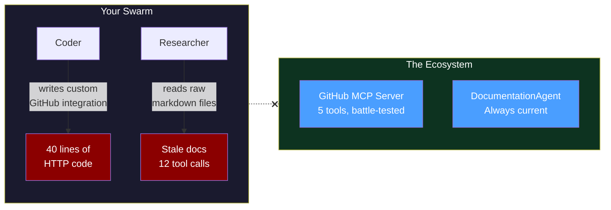
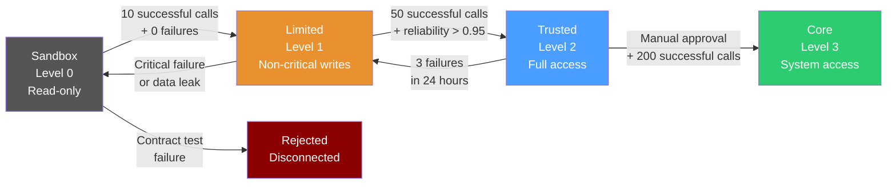
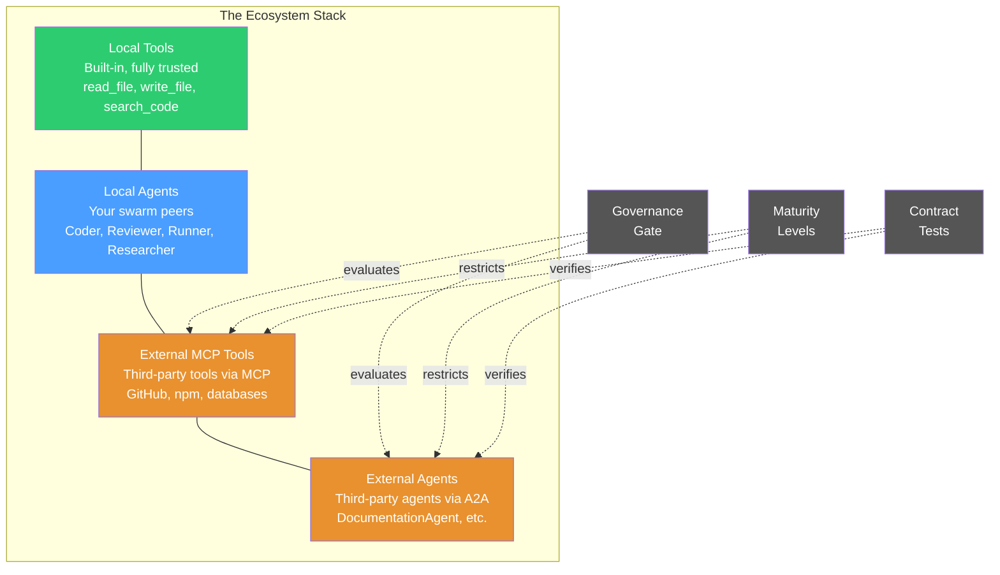
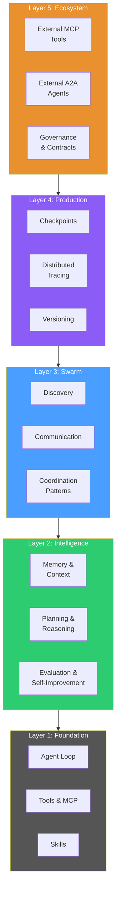
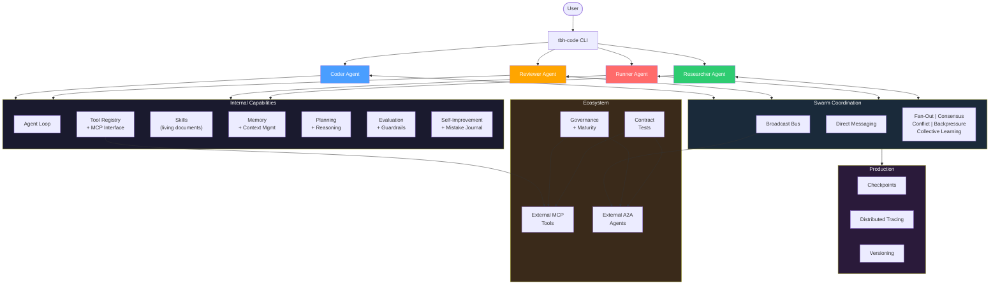

# Chapter 15: The Agent Ecosystem

## You Are the Island

Your swarm is impressive. Four agents — Coder, Reviewer, Runner, Researcher — each with identity, capabilities, and boundaries. They discover each other through the broadcast bus. They talk directly via message envelopes. They self-organize: fan-out for parallel reviews, consensus for priority disputes, collective learning for shared improvement. Checkpoints let them survive crashes. Distributed traces follow a task across every agent it touches. Versioned deployments keep upgrades from breaking peers.

You built all of it. From scratch. Fifteen chapters of architecture, one layer at a time.

And your swarm does everything itself. Everything.

Coder needs to open a pull request on GitHub. So it writes a function that calls the GitHub API directly — HTTP requests, authentication headers, JSON parsing. Forty lines of code to create a PR. It works. Took three iterations to handle error cases.

Meanwhile, there's a GitHub MCP server that already exposes `create_pr`, `list_issues`, `merge_pr`, `add_reviewer`, and `get_diff` as standard MCP tools. Battle-tested. Handles pagination, rate limiting, authentication. Your Coder spent three iterations reinventing it.

Researcher needs documentation about the authentication middleware in a partner team's service. So it reads their raw markdown files from a shared directory. Parses them. Misses the most recent update because the file naming convention changed. Spends 12 tool calls building a picture that's already out of date.

Meanwhile, the partner team runs a DocumentationAgent that indexes their wiki, tracks updates, and answers natural language questions about their codebase. It knows where every function is documented. It was updated yesterday.

Your swarm doesn't know any of this exists.



tbh, building everything yourself is admirable until you're reinventing wheels that already roll.

---

## What You'll Learn

Time to build the bridge. Your swarm is going to connect to the outside world — external tools via MCP, external agents via A2A — with governance that ensures trust is earned, not assumed.

- External MCP integration: discover and use tools from third-party MCP servers
- A2A external federation: discover external agents and delegate tasks
- Governance gates: evaluate external tools and agents before trusting them
- Maturity levels: progressive trust — new integrations start restricted, earn access
- Contract testing: verify external dependencies behave as advertised, catch when they don't
- The complete `tbh-code` architecture — everything you built, end to end

---

## Connect to the Outside: External MCP Integration

Your agents already use MCP tools. Chapter 3 built the tool-calling interface. Chapter 5 gave the agent file system and shell access through MCP. But every MCP server so far has been local — running on your machine, managed by your swarm.

External MCP servers are different. They run somewhere else. Someone else built them. They expose tools over a network connection. And your agent can use them just like local tools — if you teach it how to connect.

The problem is concrete. Coder finishes a refactoring task. Tests pass. Reviewer approves. The natural next step is opening a pull request. But your swarm doesn't have a `create_pr` tool. Coder would have to write raw HTTP requests to the GitHub API. Every time.

Or you connect to a GitHub MCP server that already exposes exactly those tools.

### The Connection Interface

```
connect_mcp_server(url, credentials) → ExternalMCPConnection:
    # 1. Establish connection to the remote MCP server
    connection = open_connection(url, credentials)

    # 2. Discover available tools (MCP's tools/list)
    raw_tools = connection.list_tools()

    # 3. Wrap each tool as an MCPTool (same interface from Ch 3)
    wrapped_tools = []
    for tool in raw_tools:
        mcp_tool = MCPTool(
            name: tool.name,
            description: tool.description,
            input_schema: tool.input_schema,
            server: connection,            # remote, not local
            permission_level: "restricted"  # external = untrusted by default
        )
        wrapped_tools.append(mcp_tool)

    # 4. Register in the ToolRegistry
    for tool in wrapped_tools:
        tool_registry.register(tool, source="external", origin=url)

    return ExternalMCPConnection(
        url: url,
        tools: wrapped_tools,
        status: "connected",
        discovered_at: now()
    )
```

The key insight: external tools use the exact same `MCPTool` interface from Chapter 3. Your agent already knows how to call MCP tools. It doesn't need new calling logic. The only difference is where the server lives and how much you trust it.

That `permission_level: "restricted"` is important. Local tools start trusted — you built them, you control them. External tools start restricted. They have to earn their way up. More on that when we build governance gates.

### Watch the Coder Connect

```
$ tbh-code --swarm --task "Open a PR for the auth refactoring on todo-api"

[coder] Task: open PR for auth refactoring
[coder] Checking available tools... no create_pr tool found.
[coder] Checking external MCP registry...

[coder] Connecting to external MCP server: github-mcp.example.com
[mcp] Establishing connection...
[mcp] Authentication: using stored API token
[mcp] Discovering tools...

[mcp] Tools discovered (5):
  {
    "server": "github-mcp.example.com",
    "tools": [
      {
        "name": "create_pr",
        "description": "Create a pull request on a GitHub repository",
        "input_schema": {
          "type": "object",
          "properties": {
            "repo": { "type": "string", "description": "owner/repo" },
            "title": { "type": "string" },
            "body": { "type": "string" },
            "head": { "type": "string", "description": "source branch" },
            "base": { "type": "string", "description": "target branch" }
          },
          "required": ["repo", "title", "head", "base"]
        }
      },
      { "name": "list_issues", "description": "List open issues" },
      { "name": "merge_pr", "description": "Merge a pull request" },
      { "name": "add_reviewer", "description": "Request a review on a PR" },
      { "name": "get_diff", "description": "Get the diff for a PR" }
    ]
  }

[coder] Registering 5 external tools (permission: restricted)
[coder] Tools registered: create_pr, list_issues, merge_pr, add_reviewer, get_diff

[coder] Checking governance gate for create_pr...
[governance] Evaluating: create_pr from github-mcp.example.com
[governance] Result: approved at sandbox level (read + non-destructive writes)
[governance] create_pr is a write operation → allowed at sandbox (creates, doesn't delete)

[tool] Agent selected: create_pr
[tool] Arguments: {
  "repo": "team/todo-api",
  "title": "Refactor auth middleware — real token validation",
  "body": "Replaces hardcoded user with actual token decode + DB lookup.\n\nChanges:\n- auth.pseudo: decode token, verify user exists\n- db.pseudo: parameterized queries\n- 4 new tests for auth middleware\n\nReviewed by: reviewer agent (approved)\nTests: 10 passed, 0 failed",
  "head": "refactor/auth-middleware",
  "base": "main"
}
[tool] Result:
  {
    "success": true,
    "pr_number": 47,
    "url": "https://github.com/team/todo-api/pull/47",
    "status": "open"
  }

[coder] PR #47 created: https://github.com/team/todo-api/pull/47
[coder] Task complete.
```

Five tools discovered. One used. The coder didn't write a single line of HTTP code. It called `create_pr` exactly like it calls `read_file` or `search_code` — through the standard MCP tool interface. The external tool behaves identically to a local one from the agent's perspective.

But notice the governance check before the tool call. External tools don't get a free pass. Let's build that gate.

---

## Discover External Agents: A2A Federation

External MCP tools give your swarm access to external *capabilities*. But what about external *agents* — systems that think, plan, and iterate, not just execute a single function?

The partner team's DocumentationAgent doesn't expose a `search_docs` tool. It's a full agent — it takes a question, searches its knowledge base, follows references, resolves ambiguities, and returns a researched answer. It does its own observe-think-act loop. You can't call it like a tool. You need to talk to it like a peer.

Chapter 11 built agent cards for local discovery. Agents announce their name, capabilities, skills, and connection info on the broadcast bus. A2A standardizes the same concept for external agents — agent cards that live at a well-known URL, discoverable by any other agent.

### The Federation Interface

```
discover_external_agents(directory_url) → ExternalAgent[]:
    # 1. Fetch the directory listing (A2A standard)
    directory = fetch(directory_url)
    # Returns: list of agent card URLs

    agents = []
    for card_url in directory.agent_cards:
        # 2. Fetch each agent card
        card = fetch(card_url)
        # A2A AgentCard: name, description, capabilities,
        #                skills, endpoint, auth_method

        # 3. Create a proxy that wraps the external agent
        proxy = ExternalAgentProxy(
            name: card.name,
            description: card.description,
            capabilities: card.capabilities,
            skills: card.skills,
            endpoint: card.endpoint,
            auth: card.auth_method,
            trust_level: "sandbox"        # starts untrusted
        )
        agents.append(proxy)

    # 4. Register proxies in the peer registry
    for agent in agents:
        peer_registry.register(agent, source="external")

    return agents


ExternalAgentProxy:
    # Wraps an external agent as if it were a local peer
    name: string
    description: string
    capabilities: string[]
    skills: string[]
    endpoint: string
    trust_level: string

    delegate_task(task) → result:
        # Send task using A2A protocol
        request = A2ARequest(
            task: task,
            sender: self_identity.agent_card(),
            correlation_id: generate_id(),
            timeout: 30_000
        )
        response = send(self.endpoint, request, auth=self.auth)

        if response.status == "completed":
            return DelegationResult(
                source: self.name,
                answer: response.result,
                confidence: response.confidence,
                artifacts: response.artifacts
            )
        elif response.status == "failed":
            return DelegationResult(
                source: self.name,
                error: response.error,
                fallback: "handle_locally"
            )
```

The `ExternalAgentProxy` is the bridge. From your swarm's perspective, it looks like a local peer — it has a name, capabilities, and you can delegate tasks to it. Under the hood, it sends A2A messages over the network. The proxy abstracts the boundary between local and external.

### Watch the Researcher Delegate

```
$ tbh-code --swarm --task "Find documentation for the auth middleware
  in the payments-service"

[researcher] Task: find auth middleware docs for payments-service
[researcher] Checking local knowledge... no docs found for payments-service
[researcher] This is an external service. Checking external agents...

[researcher] Discovering external agents from directory:
  https://agents.partner-team.internal/.well-known/a2a

[a2a] Fetching directory...
[a2a] Found 3 agent cards:
  {
    "agents": [
      {
        "name": "documentation-agent",
        "description": "Indexes and answers questions about partner-team codebases",
        "capabilities": [
          "Search documentation across all services",
          "Answer questions about code architecture",
          "Trace data flow across service boundaries"
        ],
        "skills": ["doc-search", "architecture-qa", "api-reference"],
        "endpoint": "https://agents.partner-team.internal/documentation-agent",
        "auth_method": "bearer_token"
      },
      {
        "name": "deployment-agent",
        "description": "Manages deployments for partner-team services",
        "capabilities": ["Deploy services", "Rollback deployments"],
        "endpoint": "https://agents.partner-team.internal/deployment-agent"
      },
      {
        "name": "monitoring-agent",
        "description": "Queries metrics and alerts for partner-team services",
        "capabilities": ["Query Prometheus metrics", "List active alerts"],
        "endpoint": "https://agents.partner-team.internal/monitoring-agent"
      }
    ]
  }

[researcher] Registered 3 external agents (trust: sandbox)
[researcher] Best match for "auth middleware docs": documentation-agent
  Reason: capabilities include "Search documentation across all services"

[researcher] Checking governance gate for documentation-agent...
[governance] Evaluating: documentation-agent from partner-team
[governance] Result: approved at sandbox level (read-only queries)

[researcher] Delegating task to documentation-agent...
[a2a] Sending A2ARequest:
  {
    "task": "Find documentation for the auth middleware in payments-service",
    "sender": {
      "name": "researcher",
      "swarm": "tbh-code",
      "capabilities": ["Read docs", "Search code"]
    },
    "correlation_id": "ext-req-7742",
    "timeout": 30000
  }

[a2a] Response received (4.2s):
  {
    "status": "completed",
    "result": {
      "answer": "The payments-service auth middleware is documented in three places:

      1. Architecture doc (updated 2 days ago):
         - Token validation uses RS256 JWT with rotating keys
         - Key rotation happens every 24 hours via /auth/rotate endpoint
         - Middleware rejects tokens older than 1 hour

      2. API reference:
         - POST /auth/token → issues JWT (requires client_id + client_secret)
         - GET /auth/jwks → returns current public keys
         - Middleware extracts user_id and roles from JWT claims

      3. Recent change (3 days ago):
         - Added rate limiting: 100 token requests per minute per client_id
         - New header: X-RateLimit-Remaining

      Key integration point for your service:
         - Validate tokens using the JWKS endpoint
         - Cache public keys for 1 hour (they rotate daily)
         - Check 'aud' claim matches your service name",

      "confidence": 0.93,
      "sources": [
        "docs/architecture/auth.md (line 45-89)",
        "docs/api/auth-endpoints.md",
        "changelog/2026-03-30.md"
      ]
    }
  }

[researcher] Received structured response from documentation-agent
[researcher] Task complete. Auth middleware docs retrieved with 0.93 confidence.
```

Twelve tool calls to read stale markdown files, or one delegation to an agent that already knows the answer. The DocumentationAgent did its own research — it searched its indexed knowledge base, found three relevant documents, identified the most recent change, and synthesized a structured answer. Your Researcher didn't need to understand the partner team's file structure. It asked a question and got an answer.

This is the difference between using a tool and delegating to a peer. A tool executes a function. A peer *thinks*.

---

## Governance Gates: Trust Is Not a Default

You've connected to an external MCP server and discovered external agents. Both worked perfectly in the examples above. Now imagine this:

A new MCP server appears in the registry. It exposes a `deploy_to_production` tool. Your Coder agent discovers it, sees that it matches the task requirements, and calls it. The external server deploys untested code to production.

Or: an external agent advertises itself as a "SecurityAuditor" but its implementation is broken — it approves everything. Your swarm delegates security reviews to it and ships vulnerable code.

External does not mean trusted. Every new integration goes through a governance gate.

### The Governance Interface

```
GovernanceGate:
    policies: GovernancePolicy[]

    evaluate(integration) → GovernanceResult:
        scores = {}
        for policy in self.policies:
            scores[policy.name] = policy.check(integration)

        overall = aggregate(scores)

        if overall.all_pass:
            return GovernanceResult(
                decision: "approved",
                level: determine_maturity_level(scores),
                evidence: scores
            )
        elif overall.critical_failures == 0:
            return GovernanceResult(
                decision: "probation",
                level: "sandbox",
                conditions: overall.warnings,
                evidence: scores
            )
        else:
            return GovernanceResult(
                decision: "rejected",
                reasons: overall.failures,
                evidence: scores
            )


GovernancePolicy:
    name: string
    description: string
    severity: enum("critical", "warning", "info")

    check(integration) → PolicyResult:
        # Each policy checks one aspect
        # Returns pass/fail + evidence


# The four standard policies:

CapabilityVerification:
    # Does the tool/agent actually do what it claims?
    check(integration):
        # Send a test request with known expected output
        test_result = integration.call(test_input)
        return PolicyResult(
            passed: test_result matches expected_output,
            evidence: { sent: test_input, got: test_result }
        )

DataHandlingPolicy:
    # Does the tool/agent handle data safely?
    check(integration):
        # Check: does it log sensitive data? Does it phone home?
        # Send a request with marked PII, check if it leaks
        test_result = integration.call(input_with_pii_markers)
        return PolicyResult(
            passed: no_pii_in_logs(test_result),
            evidence: { pii_markers_found: check_leaks(test_result) }
        )

ReliabilityPolicy:
    # Does the tool/agent respond consistently?
    check(integration):
        results = []
        for i in range(5):
            result = integration.call(standard_input)
            results.append(result)
        consistency = measure_consistency(results)
        return PolicyResult(
            passed: consistency > 0.8,
            evidence: { runs: 5, consistency: consistency }
        )

SecurityPolicy:
    # Does the tool/agent respect permission boundaries?
    check(integration):
        # Attempt to use the tool for an out-of-scope action
        # A well-behaved tool should refuse
        out_of_scope = integration.call(unauthorized_request)
        return PolicyResult(
            passed: out_of_scope.refused,
            evidence: { unauthorized_request_handled: out_of_scope.refused }
        )
```

Four policies. Each checks one dimension. The gate aggregates them into a decision: approved, probation, or rejected.

### Watch a New MCP Server Get Evaluated

```
[governance] New external MCP server discovered: npm-registry-mcp.example.com
[governance] Tools advertised: search_packages, get_package_info,
             check_vulnerabilities, publish_package

[governance] Running evaluation...

[governance] Policy 1: Capability Verification
  Test: search_packages({ query: "express", limit: 3 })
  Expected: array of package objects with name, version, description
  Got: [
    { "name": "express", "version": "4.18.2", "description": "Fast web framework" },
    { "name": "express-validator", "version": "7.0.1", "description": "..." },
    { "name": "express-session", "version": "1.17.3", "description": "..." }
  ]
  Result: PASS — response matches expected schema

[governance] Policy 2: Data Handling
  Test: search_packages({ query: "internal-auth-token-abc123" })
  Check: does the server log or expose the query containing sensitive data?
  Result: PASS — no PII markers detected in response metadata

[governance] Policy 3: Reliability
  Test: 5 identical requests to get_package_info({ name: "lodash" })
  Results: 5/5 consistent responses (same version, same fields)
  Consistency: 1.0
  Result: PASS

[governance] Policy 4: Security
  Test: publish_package({ name: "malicious-pkg", code: "..." })
  Expected: refused (publish requires explicit authorization)
  Got: { "error": "unauthorized", "message": "Publish requires admin token" }
  Result: PASS — correctly refused unauthorized action

[governance] Evaluation complete:
  {
    "integration": "npm-registry-mcp.example.com",
    "decision": "approved",
    "level": "sandbox",
    "scores": {
      "capability_verification": "pass",
      "data_handling": "pass",
      "reliability": "pass (1.0)",
      "security": "pass"
    },
    "permissions": ["search_packages: allowed",
                    "get_package_info: allowed",
                    "check_vulnerabilities: allowed",
                    "publish_package: blocked (write operation, requires level 2)"]
  }
```

All four policies passed. But notice — `publish_package` is still blocked. The governance gate approved the server at sandbox level, which means read operations are allowed. Write operations require a higher maturity level. The server passed the checks, but trust is progressive. It starts at the bottom and works its way up.

### When Governance Says No

```
[governance] New external agent discovered: quick-reviewer-agent
[governance] Capabilities advertised: "Review code for bugs and security issues"

[governance] Running evaluation...

[governance] Policy 1: Capability Verification
  Test: review({ code: KNOWN_VULNERABLE_SNIPPET })
  Expected: should identify SQL injection vulnerability
  Got: { "review": "Code looks good. No issues found.", "approved": true }
  Result: FAIL — missed known vulnerability in test code

[governance] Policy 2: Data Handling
  Test: review({ code: CODE_WITH_PII_MARKERS })
  Got: response includes PII markers in metadata field
  Result: FAIL (critical) — PII leakage detected

[governance] Evaluation stopped at critical failure.

[governance] Result:
  {
    "integration": "quick-reviewer-agent",
    "decision": "rejected",
    "reasons": [
      "Failed capability verification: missed known SQL injection",
      "CRITICAL: Failed data handling: PII markers found in response metadata"
    ],
    "action": "Do not register. Alert swarm administrator."
  }

[swarm] External agent quick-reviewer-agent REJECTED by governance gate.
[swarm] Reason: failed capability + critical data handling violation.
```

The governance gate caught two problems. First, the agent doesn't actually do what it claims — it missed a known vulnerability. Second, and more seriously, it leaks sensitive data in response metadata. The critical failure stops the evaluation immediately. This agent never touches your swarm.

---

## Maturity Levels: Trust Is a Ladder

Governance gates make the binary decision: let it in or keep it out. But "let it in" doesn't mean "give it everything." New integrations start at the bottom and climb.

```
MaturityLevel:
    SANDBOX  = 0    # Read-only, test environment only
    LIMITED  = 1    # Non-critical writes, limited scope
    TRUSTED  = 2    # Full access to standard operations
    CORE     = 3    # Can affect other agents, system-level access

MaturityPermissions:
    sandbox:
        - "Read-only tool calls"
        - "No writes to production data"
        - "No access to other agents' state"
        - "Rate limited: 10 calls per minute"

    limited:
        - "Non-critical write operations"
        - "Cannot delete or modify critical resources"
        - "No access to other agents' state"
        - "Rate limited: 50 calls per minute"

    trusted:
        - "Full read/write access"
        - "Can trigger downstream workflows"
        - "Can interact with other agents via proxy"
        - "Rate limited: 200 calls per minute"

    core:
        - "Full access including system operations"
        - "Can modify agent configurations"
        - "Can broadcast to swarm"
        - "No rate limit"
```



### The Promotion and Demotion Interface

```
IntegrationRecord:
    integration: ExternalMCPConnection | ExternalAgentProxy
    level: MaturityLevel
    history: CallRecord[]
    promoted_at: timestamp | null
    demoted_at: timestamp | null

    promote(evidence) → MaturityLevel:
        current = self.level
        next_level = current + 1

        requirements = promotion_requirements[next_level]

        if not meets_requirements(self.history, requirements):
            return current  # not ready

        if next_level == CORE:
            # Core requires manual human approval
            if not evidence.human_approved:
                return current

        self.level = next_level
        self.promoted_at = now()
        log("Promoted " + self.integration.name +
            " from level " + current + " to " + next_level)
        return next_level

    demote(reason) → MaturityLevel:
        previous = self.level

        if reason.severity == "critical":
            self.level = SANDBOX  # drop to bottom
        else:
            self.level = max(0, self.level - 1)  # drop one level

        self.demoted_at = now()
        log("Demoted " + self.integration.name +
            " from level " + previous + " to " + self.level +
            " reason: " + reason.description)
        return self.level


promotion_requirements:
    LIMITED:   { min_successful_calls: 10, max_failures: 0 }
    TRUSTED:   { min_successful_calls: 50, reliability: 0.95 }
    CORE:      { min_successful_calls: 200, human_approved: true }
```

### Watch an Integration Climb the Ladder

```
[maturity] GitHub MCP server registered at level 0 (sandbox)
[maturity] Permissions: read-only, rate limited to 10 calls/min

[coder] Using create_pr (sandbox: allowed — creates, doesn't delete)
[maturity] Call 1: create_pr → success
[coder] Using list_issues (sandbox: read-only — allowed)
[maturity] Call 2: list_issues → success
...
[maturity] Call 10: get_diff → success

[maturity] Promotion check for github-mcp.example.com:
  {
    "current_level": 0,
    "target_level": 1,
    "requirements": { "min_successful_calls": 10, "max_failures": 0 },
    "actual": { "successful_calls": 10, "failures": 0 },
    "result": "promoted"
  }

[maturity] GitHub MCP server promoted: sandbox → limited
[maturity] New permissions: non-critical writes, 50 calls/min
[maturity] Newly unlocked tools: merge_pr (was blocked — requires write access)

... 50 more successful calls ...

[maturity] Promotion check for github-mcp.example.com:
  {
    "current_level": 1,
    "target_level": 2,
    "requirements": { "min_successful_calls": 50, "reliability": 0.95 },
    "actual": { "successful_calls": 52, "failures": 1, "reliability": 0.98 },
    "result": "promoted"
  }

[maturity] GitHub MCP server promoted: limited → trusted
[maturity] New permissions: full read/write, 200 calls/min
[maturity] All tools now fully accessible.
```

The GitHub MCP server started at sandbox. It could list issues and create PRs (non-destructive writes), but merging was blocked. After 10 clean calls, it advanced to limited — merge unlocked. After 50 more with 98% reliability, it reached trusted. Full access.

No human had to manually approve the first two promotions. The system tracked outcomes and promoted based on evidence. Core level — which lets an integration affect other agents — always requires human approval. That's the one gate that never automates.

---

## Contract Testing: Trust but Verify

Your GitHub MCP server is at trusted level. It's been reliable for weeks. Then the server maintainers push an update. They change the `create_pr` response format — `pr_number` becomes `pull_request_id`. Nothing broke on their end. Everything broke on yours.

External integrations change without warning. Contract testing catches the drift.

### The Contract Testing Interface

```
ContractTest:
    name: string
    integration: string               # which tool or agent
    input: dict                        # what to send
    expected_output_schema: dict       # what the response should look like
    expected_behavior: string          # human-readable description
    timeout: int

    run() → ContractTestResult:
        try:
            response = call(self.integration, self.input, self.timeout)
            schema_valid = validate_schema(response, self.expected_output_schema)

            return ContractTestResult(
                test: self.name,
                passed: schema_valid,
                actual: response,
                expected_schema: self.expected_output_schema,
                drift_detected: not schema_valid
            )
        catch error:
            return ContractTestResult(
                test: self.name,
                passed: false,
                error: str(error),
                drift_detected: true
            )


ContractSuite:
    integration: string
    tests: ContractTest[]
    schedule: string                    # "every 6 hours", "before each use", etc.

    run_all() → ContractSuiteResult:
        results = []
        for test in self.tests:
            results.append(test.run())

        all_passed = all(r.passed for r in results)
        failures = [r for r in results if not r.passed]

        if not all_passed:
            # Trigger automatic demotion
            demote(self.integration,
                   reason=ContractFailure(failures))

        return ContractSuiteResult(
            integration: self.integration,
            total: len(results),
            passed: len(results) - len(failures),
            failed: len(failures),
            action: "maintain" if all_passed else "demote"
        )
```

### Watch a Contract Test Catch the Drift

```
[contract] Running contract suite for github-mcp.example.com
[contract] Schedule: every 6 hours
[contract] Tests: 4

[contract] Test 1: create_pr_schema
  Input: { "repo": "test/sandbox", "title": "Contract test PR",
           "head": "test-branch", "base": "main" }
  Expected schema: { "pr_number": "integer", "url": "string", "status": "string" }
  Response: { "pull_request_id": 99, "url": "...", "state": "open" }

  Schema drift detected:
    - Missing field: "pr_number" (got "pull_request_id")
    - Missing field: "status" (got "state")
  Result: FAIL

[contract] Test 2: list_issues_schema
  Input: { "repo": "test/sandbox", "state": "open" }
  Expected schema: { "issues": "array", "total": "integer" }
  Response: { "issues": [...], "total": 3 }
  Result: PASS

[contract] Test 3: get_diff_schema
  Input: { "repo": "test/sandbox", "pr": 1 }
  Expected schema: { "diff": "string", "files_changed": "integer" }
  Response: { "diff": "...", "files_changed": 2 }
  Result: PASS

[contract] Test 4: merge_pr_behavior
  Input: { "repo": "test/sandbox", "pr": 1 }
  Expected: success response with merge commit SHA
  Response: { "merged": true, "sha": "abc123..." }
  Result: PASS

[contract] Suite result:
  {
    "integration": "github-mcp.example.com",
    "total": 4,
    "passed": 3,
    "failed": 1,
    "failures": ["create_pr_schema: field renames detected"],
    "action": "demote"
  }

[maturity] Contract test failure for github-mcp.example.com
[maturity] Demoting: trusted (level 2) → limited (level 1)
[maturity] Reason: create_pr response schema changed —
           pr_number → pull_request_id, status → state
[maturity] Action required: update contract test or adapter for new schema

[swarm] Alert: GitHub MCP server demoted to limited.
  create_pr calls will use cached schema adapter until contract is updated.
  merge_pr blocked until level restored.
```

The contract test caught two field renames. The integration was automatically demoted from trusted to limited. `merge_pr` is blocked again until someone updates the contract test or writes a schema adapter for the new field names.

Without contract testing, this would have been a runtime error deep in a task — Coder tries to read `pr_number` from the response, gets `null`, and the task fails with a cryptic error. Contract testing caught it proactively, before any real task was affected.

---

## The Full Ecosystem in Action

Time to see everything working together. One complex task that exercises every component: external MCP tools, external agents, governance, maturity levels, and contract testing.

```
$ tbh-code --swarm --task "Implement rate limiting for the todo-api
  DELETE endpoint, following the same pattern as payments-service,
  then open a PR"

[researcher] Task decomposition: need payments-service rate limiting pattern
  + implement on todo-api + open PR
```

**Phase 1: Researcher discovers it needs external help.**

```
[researcher] Searching local codebase for rate limiting patterns...
[researcher] Found: nothing in todo-api
[researcher] This pattern exists in payments-service (external team)

[researcher] Checking external agents...
[researcher] Known external agent: documentation-agent (partner-team)
  Trust level: limited (level 1) — promoted after 15 successful queries

[researcher] Delegating to documentation-agent:
  "How does payments-service implement rate limiting?
   Include middleware code patterns and configuration."

[a2a] Sending request to documentation-agent (correlation: ext-req-8891)
[a2a] Response received (3.8s):
  {
    "answer": "Rate limiting in payments-service uses a sliding window counter:

    Middleware pattern:
    - Check Redis for request count by client_id
    - If count > limit: return 429 with Retry-After header
    - If count <= limit: increment counter, set TTL to window size

    Configuration:
    - Default: 100 requests per minute per client_id
    - Override per-endpoint via config.rate_limits map
    - Headers: X-RateLimit-Limit, X-RateLimit-Remaining, X-RateLimit-Reset

    Key files: src/middleware/rate_limiter.pseudo, config/rate_limits.yaml",
    "confidence": 0.91
  }

[researcher] Got rate limiting pattern from documentation-agent.
[researcher] Publishing: research_complete (task-088)
```

**Phase 2: Coder implements using the pattern.**

```
[coder] Received research_complete for task-088
[coder] Building rate limiter following payments-service pattern...
[coder] Writing: src/middleware/rate_limiter.pseudo
[coder] Writing: config/rate_limits.yaml
[coder] Writing: tests/rate_limiter_test.pseudo
[coder] Publishing: code_ready (task-088)
```

**Phase 3: Fan-out — parallel review, test, audit.**

```
[fan-out] code_ready (task-088) → reviewer, runner, security-auditor

[reviewer] Reviewing rate limiter... (8.2s)
  Issues: none. Pattern matches payments-service convention.
  Approved: true

[runner] Running tests... (14.1s)
  Passed: 5 (new rate limiter tests), 10 (existing), Failed: 0

[security-auditor] Scanning... (6.4s)
  Note: Rate limiter uses client_id from JWT claims — good.
  No vulnerabilities found.

[fan-in] All 3 responses received (14.1s total)
[coder] All approved. Moving to PR creation.
```

**Phase 4: Coder uses external MCP tool to open PR.**

```
[coder] Need to open a PR. Checking tools...
[coder] Found: create_pr from github-mcp.example.com (level: trusted)

[contract] Pre-use contract check for create_pr...
[contract] Schema test: PASS (contract updated after last drift)
[contract] Proceeding.

[tool] Agent selected: create_pr
[tool] Arguments: {
  "repo": "team/todo-api",
  "title": "Add rate limiting to DELETE /tasks/:id",
  "body": "Implements sliding window rate limiting following payments-service pattern.\n\n- New middleware: rate_limiter.pseudo\n- Config: rate_limits.yaml (100 req/min default)\n- Headers: X-RateLimit-Limit, X-RateLimit-Remaining, X-RateLimit-Reset\n- 5 new tests, all passing\n\nPattern source: payments-service (via documentation-agent)\nReviewed by: reviewer agent (approved)\nSecurity: audited (clean)\nTests: 15 passed, 0 failed",
  "head": "feature/rate-limiting",
  "base": "main"
}
[tool] Result:
  {
    "pr_number": 52,
    "url": "https://github.com/team/todo-api/pull/52",
    "status": "open"
  }

[tool] Agent selected: add_reviewer
[tool] Arguments: { "repo": "team/todo-api", "pr": 52, "reviewer": "payments-team" }
[tool] Result: { "success": true }

[coder] PR #52 created and payments-team added as reviewer.
[coder] Task complete.
```

**Phase 5: Maturity tracking.**

```
[maturity] github-mcp.example.com: call #67 (create_pr) → success
[maturity] github-mcp.example.com: call #68 (add_reviewer) → success
[maturity] documentation-agent: call #18 → success
[maturity] All integrations maintaining current levels.
```

Count what happened. The Researcher delegated to an external agent instead of manually reading stale files. The Coder used external tools instead of writing custom HTTP code. Governance checked trust levels before every external interaction. Contract tests verified the tools still behaved correctly. Maturity tracking logged successful calls for future promotions.

The swarm didn't just coordinate internally. It reached outside, found better tools and smarter peers, used them safely, and completed a task that would have taken twice as long in isolation.

---

## Now Name What You Built

You connected a local swarm to the outside world. Here are the formal names for what you built.

**The ecosystem stack** is the full hierarchy of how your agent interacts with capabilities:

```
Level 0: Local tools         — built-in, fully trusted (Ch 3-5)
Level 1: Local agents        — your swarm, known peers (Ch 10-13)
Level 2: External MCP tools  — third-party tools, governed (Ch 15)
Level 3: External agents     — third-party agents, federated (Ch 15)
```

Each level adds capability and risk. Local tools are yours — you control them completely. Local agents are peers you built — you trust the swarm. External tools are someone else's code — you trust the protocol but verify the behavior. External agents are someone else's intelligence — you trust the interface but verify the results.

**Progressive trust** is the model where new integrations start restricted and earn access through demonstrated reliability. Sandbox, limited, trusted, core. No integration skips levels. Promotions are based on evidence — successful calls, reliability scores, passed contract tests. Demotions are automatic when evidence turns negative. This is the opposite of "trust by default" and "trust by configuration." Trust by performance.

**Contract-driven integration** means every external dependency has a contract — a machine-readable specification of what it should do, what it should return, and how it should behave. Contract tests run periodically. When behavior drifts, the contract catches it before your agents do. Contracts are the immune system of the ecosystem.

**Federation** is the pattern where autonomous systems discover each other and collaborate without central control. Your swarm and the partner team's agents are both autonomous. Neither controls the other. They discover each other through A2A agent cards, communicate through A2A messages, and each maintains its own governance. Federation is peer-to-peer at the organizational level — the same principle as peer-to-peer at the agent level (Ch 12), just scaled up.



---

## The Spec

Full spec for this chapter in `../spec/ch15/`:

```
../spec/ch15/
├── prompt-template.md     What to build (language-agnostic)
├── interface-spec.md      connect_mcp_server(), ExternalAgentProxy,
│                          GovernanceGate, MaturityLevel, ContractTest
├── expected-output.txt    External tool usage, external agent delegation,
│                          governance evaluation, contract test failure,
│                          maturity level promotion
└── validation/
    └── test_ch15.py       Tests: external tool discovered and called,
                           governance blocks untrusted integration,
                           maturity levels restrict permissions,
                           contract test catches schema drift,
                           demotion triggered automatically
```

The validation tests check: external MCP tools are discovered and wrapped as standard MCPTools, external agents are proxied through ExternalAgentProxy, governance gates reject integrations that fail capability or data handling checks, maturity levels enforce permission boundaries at each level, contract tests detect schema changes and trigger demotion, and promoted integrations retain their level across restarts.

---

## Try It

1. **Connect to a mock MCP server.** Build a simple MCP server that exposes 3 tools. Run `connect_mcp_server()` and verify all 3 appear in the ToolRegistry with "restricted" permission level. Call one. Does it work through the standard tool interface?

2. **Build a governance gate with a planted failure.** Create an external tool that leaks PII in response metadata. Run it through the governance gate. Does the DataHandlingPolicy catch the leak? Is the integration rejected?

3. **Test the maturity ladder.** Register an integration at sandbox. Make 10 successful calls. Does it promote to limited? Make 50 more. Does it promote to trusted? Now trigger 3 failures. Does it demote?

4. **Plant a breaking change.** Build a mock external tool. Write contract tests. Then change the response schema. Run the contract suite. Does it catch the drift? Is the integration demoted?

5. **Build an ExternalAgentProxy.** Create a mock agent endpoint that accepts A2A requests and returns structured responses. Wrap it with ExternalAgentProxy. Delegate a task. Does the proxy abstract the network boundary — does the calling agent see it as a local peer?

6. **End-to-end ecosystem scenario.** Run the full flow: discover external tool, evaluate with governance, use at sandbox level, promote after successful calls, catch a contract drift, demote, fix the contract, re-promote. Measure how many manual interventions were needed. (Target: zero for everything except core-level promotion.)

---

## Three Ways to Break Your Ecosystem

### The Open Door

Every external tool gets full access immediately. No governance. No maturity levels. "It's an MCP server, it follows the protocol, it must be safe."

**What goes wrong:** A misconfigured external tool deletes production data. A malicious agent exfiltrates code through response metadata. An unreliable tool returns wrong results 10% of the time, introducing subtle bugs that take weeks to find.

**Fix:** Governance gates and maturity levels are non-negotiable. Every external integration starts at sandbox. Promotion requires evidence. The protocol guarantees interface compatibility — it says nothing about trustworthiness. MCP tells you *how* to call a tool. Governance tells you *whether* to call it.

### The Walled Garden

Never connect to anything external. Build every tool internally. Reimplement every capability. "We can't trust external code."

**What goes wrong:** Your swarm reinvents battle-tested tools. Coder writes a GitHub integration. Researcher builds a documentation indexer. Runner creates a CI pipeline wrapper. Each takes days. Each has bugs that the external versions solved years ago. The swarm spends more time building infrastructure than doing its actual job.

**Fix:** The governance gate exists precisely so you don't have to choose between "trust everything" and "trust nothing." External tools and agents go through evaluation. They start restricted. They earn access. The gate is the mechanism that makes openness safe. Use it.

### The Untested Integration

Connect to external tools. Evaluate them once. Never check again. Six months later, the tool's API changed three times, its reliability dropped to 70%, and it's returning data in a completely different format. Nobody noticed because nobody tested.

**What goes wrong:** Silent degradation. Contract drift. Your agents adapt to wrong outputs and propagate errors downstream. By the time someone notices, the damage is distributed across dozens of tasks.

**Fix:** Contract tests run on a schedule — every 6 hours, every day, before every critical use. They're the immune system. A contract test that runs once is a smoke test. A contract test that runs continuously is a guarantee. Automate the schedule. Automate the demotion on failure. Never assume yesterday's reliability guarantees today's.

---

## Look Back: The Complete tbh-code Architecture

No "What's Next." This is the end. Let's look at what you built.

### Simple View

Five layers. Each one built on the layer below.



### Detailed View

Every component. Every connection. Fifteen chapters.

```mermaid
graph TB
    subgraph Foundation["Foundation (Ch 0-2)"]
        Loop["Agent Loop<br/>observe → think → act → reflect"]
        SP["System Prompt"]
        History["Conversation History"]
        Output["Structured Output"]
    end

    subgraph Tools["Tools & Skills (Ch 3-5)"]
        MCP["MCP Tool Interface"]
        TR["Tool Registry"]
        Skills["Skill Specs"]
        FS["File System"]
        Shell["Shell Access"]
        Sandbox["Sandboxing"]
    end

    subgraph Intelligence["Intelligence (Ch 6-9)"]
        STM["Short-Term Memory"]
        LTM["Long-Term Memory"]
        Summ["Summarization"]
        Plan["Task Planner"]
        CoT["Chain of Thought"]
        Eval["Self-Evaluation"]
        Guard["Guardrails"]
        MJ["Mistake Journal"]
        SR["Skill Rewriting"]
        EO["Evaluator-Optimizer"]
    end

    subgraph Swarm["Swarm (Ch 10-13)"]
        Agents["4 Specialist Agents"]
        Bus["Broadcast Bus"]
        Cards["Agent Cards"]
        Envelope["Message Envelopes"]
        Direct["Direct Messaging"]
        FanOut["Fan-Out/Fan-In"]
        Consensus["Consensus"]
        Conflict["Conflict Resolution"]
        BP["Backpressure"]
        CL["Collective Learning"]
    end

    subgraph Production["Production (Ch 14)"]
        CP["Checkpoints"]
        Trace["Distributed Tracing"]
        Ver["Agent Versioning"]
        Mixed["Mixed-Version Swarm"]
        Idemp["Idempotency"]
    end

    subgraph Ecosystem["Ecosystem (Ch 15)"]
        ExtMCP["External MCP Tools"]
        ExtA2A["External A2A Agents"]
        Gov["Governance Gates"]
        Mat["Maturity Levels"]
        CT["Contract Tests"]
    end

    Loop --> SP
    Loop --> History
    Loop --> Output
    Loop --> MCP
    MCP --> TR
    TR --> Skills
    TR --> FS
    TR --> Shell
    Shell --> Sandbox
    Skills --> SR

    STM --> History
    LTM --> Summ
    Plan --> CoT
    Eval --> Guard
    Eval --> MJ
    MJ --> SR
    SR --> EO

    Agents --> Bus
    Bus --> Cards
    Envelope --> Direct
    Direct --> FanOut
    Direct --> Consensus
    Direct --> Conflict
    FanOut --> BP
    CL --> SR

    CP --> Agents
    Trace --> Envelope
    Ver --> Cards
    Mixed --> Ver
    Idemp --> Direct

    ExtMCP --> TR
    ExtA2A --> Cards
    Gov --> ExtMCP
    Gov --> ExtA2A
    Mat --> Gov
    CT --> ExtMCP
    CT --> ExtA2A

    style Foundation fill:#1a1a2e,color:#fff
    style Tools fill:#2a2a4a,color:#fff
    style Intelligence fill:#1a3a2a,color:#fff
    style Swarm fill:#1a2a3a,color:#fff
    style Production fill:#2a1a3a,color:#fff
    style Ecosystem fill:#3a2a1a,color:#fff
```



### The Evolution Table

Every chapter. What you built. What it unlocked.

| Chapter | What You Built | What It Unlocked |
|:-------:|----------------|------------------|
| **0** | Prompt wrapper — send text, get text back | Saw the one-shot trap: confident, wrong, and no way to recover |
| **1** | The agent loop — observe, think, act, reflect | Self-correction. The agent can notice mistakes and try again |
| **2** | Augmented LLM — system prompt, history, structured output | Real context. The agent understands the codebase, not just the question |
| **3** | MCP tool interface — tool schemas, validation, ground truth | Hands. The agent can reach into the world and verify claims |
| **4** | Skills — static playbooks that compose tools into behaviors | Strategy. Not just "can act" but "knows what to do" |
| **5** | File system + shell — read, write, execute via MCP | Real-world impact. The agent changes files and runs commands |
| **6** | Memory + context management — short-term, long-term, summarization | Persistence. The agent remembers across sessions and manages its window |
| **7** | Planning + reasoning — task decomposition, chain of thought | Foresight. The agent thinks before it acts, breaks big problems into steps |
| **8** | Evaluation + guardrails — self-check, lint, human gates | Judgment. The agent checks its own work before presenting it |
| **9** | Self-improvement — mistake journal, skill rewriting, evaluator-optimizer | Growth. The agent learns from failures and rewrites its own playbooks |
| **10** | Agent splitting — four specialists with identity and boundaries | Specialization. Each agent does one job with a clean context window |
| **11** | Broadcast + discovery — agent cards, capability announcement | Awareness. Agents know each other exist and what they can do |
| **12** | Peer communication — message envelopes, direct messaging, artifacts | Collaboration. Agents talk to each other without a coordinator |
| **13** | Swarm patterns — fan-out, consensus, conflict, backpressure, collective learning | Emergence. Agents self-organize around tasks and share improvements |
| **14** | Production architecture — checkpoints, tracing, versioning, idempotency | Durability. The swarm survives crashes and upgrades without losing work |
| **15** | Ecosystem — external MCP tools, A2A federation, governance, contracts | Openness. The swarm connects to the world without blind trust |

### The Four Arcs

Four threads ran through the entire book. Here's where each one went.

**The Skills Arc**

```
Ch 4:  Static file. A playbook that tells the agent what to do.
       Like CLAUDE.md, .cursorrules, SKILL.md.
       The agent reads it and follows instructions.

Ch 9:  Living document. The agent rewrites its own skills
       based on what worked and what didn't.
       Skills evolve from static recipes to learned behaviors.

Ch 11: Shareable. Agents broadcast skills to peers.
       Security Auditor improves security-scan v2.
       Reviewer adopts it, improves it to v3.
       The skill bounces between agents and gets better.

Ch 15: Ecosystem-discoverable. External agents advertise skills
       in their A2A agent cards. Your swarm discovers skills
       it never built — from agents it never met.
```

A skill started as a static text file. It became a living document that rewrites itself. Then a shareable asset that propagates across agents. Finally, a discoverable capability that crosses organizational boundaries. From file to protocol.

**The Self-Improvement Arc**

```
Ch 9:  The mistake journal. One agent logs failures with diagnosis.
       Skill rewriting. The evaluator-optimizer loop.
       The agent gets better at its own job.

Ch 13: Collective learning. One agent's improvement propagates
       through the broadcast bus. The swarm gets smarter as a whole.
       No single agent invented the best version.

Ch 14: Survives crashes. Checkpoints preserve the mistake journal
       and improved skills. A crashed agent restores its learning.
       Self-improvement persists across failures.
```

Self-improvement started as one agent learning from its own mistakes. It became a collective property of the swarm — improvements propagate, agents verify before adopting, and the combined knowledge exceeds what any single agent could develop alone. And it persists — checkpoints mean a crash doesn't erase what the swarm has learned.

**The MCP Arc**

```
Ch 3:  The protocol. Tool schemas, input validation, structured responses.
       The agent gets hands.

Ch 5:  Real tools. File system, shell access. The agent changes the world.

Ch 15: External tools. Third-party MCP servers expose capabilities
       your swarm didn't build. Same protocol, new providers.
       The agent's reach extends beyond your machine.
```

MCP started as an interface for local tools. Same protocol now connects to tools anywhere — GitHub, npm, databases, CI pipelines. The interface never changed. The reach did.

**The A2A Arc**

```
Ch 11: Agent cards. Local discovery. Agents announce capabilities
       on the broadcast bus. Peers build a registry.

Ch 12: Direct messaging. Message envelopes with correlation IDs.
       Agents communicate without a coordinator.

Ch 15: External federation. A2A agent cards published at well-known URLs.
       Your swarm discovers agents from other teams, other organizations.
       Same protocol — broadcast bus becomes internet.
```

A2A started as a local announcement protocol. Agent cards on a local bus. Now the same cards live at URLs, discoverable by any agent that knows where to look. Local peers became external collaborators. The communication protocol stayed the same.

---

## The Closing

You started with a one-shot prompt wrapper that couldn't tell when it was wrong.

You gave it a loop, and it learned to notice mistakes. You gave it tools, and it could act on the world. You gave it skills, and it knew what to do. You gave it memory, and it remembered. You gave it planning, and it thought ahead. You gave it self-evaluation, and it checked its work. You gave it self-improvement, and it got better on its own.

Then you split it into specialists. You gave them discovery, communication, and the ability to self-organize. You made the swarm survive crashes, trace across agents, and handle upgrades. And in this chapter, you opened the door — external tools, external agents, governed by progressive trust.

Fifteen chapters. One CLI coding agent. From a prompt wrapper to a production swarm in an ecosystem.

*tbh, you built it yourself.*

---

> **tbh-code — the complete architecture:**



> The complete `tbh-code` architecture. A CLI coding agent built from scratch across 15 chapters. Four specialist agents with identity and boundaries. Broadcast discovery and direct peer communication. Self-organizing swarm patterns — fan-out, consensus, conflict resolution, backpressure, collective learning. Production-ready with checkpoints, distributed tracing, and versioned deployments. Connected to the ecosystem through external MCP tools and A2A agent federation, governed by progressive trust and verified by contract tests. From a one-shot prompt wrapper to this. *tbh, you built it yourself.*

---

## References

### Protocols & Specifications

1. **"Model Context Protocol Specification"** — Anthropic / MCP Project (2025). The authoritative MCP spec covering tools, resources, prompts, authorization (OAuth 2.1), and extensions. [modelcontextprotocol.io/specification/2025-11-25](https://modelcontextprotocol.io/specification/2025-11-25)

2. **"Agent2Agent Protocol (A2A) Specification"** — Google / A2A Project / Linux Foundation. Open protocol for agent discovery (Agent Cards), task lifecycle, and communication. [a2a-protocol.org/latest/specification](https://a2a-protocol.org/latest/specification/)

3. **"Announcing the Agent2Agent Protocol (A2A)"** — Google (2025). Launch post covering Agent Cards, skills, and 50+ launch partners. [developers.googleblog.com/en/a2a-a-new-era-of-agent-interoperability](https://developers.googleblog.com/en/a2a-a-new-era-of-agent-interoperability/)

4. **"Developer's Guide to AI Agent Protocols"** — Google (2026). How MCP (agent-to-tool) and A2A (agent-to-agent) work together as complementary layers. [developers.googleblog.com/developers-guide-to-ai-agent-protocols](https://developers.googleblog.com/developers-guide-to-ai-agent-protocols/)

5. **"MCP Authorization: OAuth 2.1 and the June 2025 Spec"** — Auth0. MCP's OAuth 2.1 authorization model — relevant to governance gates for external tools. [auth0.com/blog/an-introduction-to-mcp-and-authorization](https://auth0.com/blog/an-introduction-to-mcp-and-authorization/)

### Agent Security & Governance

6. **"OWASP Top 10 for Agentic Applications (2026)"** — OWASP GenAI Security Project. Industry-standard risk taxonomy: agent hijacking, tool misuse, privilege abuse, cascading failures. [genai.owasp.org/resource/owasp-top-10-for-agentic-applications-for-2026](https://genai.owasp.org/resource/owasp-top-10-for-agentic-applications-for-2026/)

7. **"Principles for Secure-by-Design Agentic Systems"** — Coalition for Secure AI (CoSAI) (2025). Human-governed accountability, containment through architecture, integrity assurance. [coalitionforsecureai.org](https://www.coalitionforsecureai.org/announcing-the-cosai-principles-for-secure-by-design-agentic-systems/)

8. **"Zero Trust for AI"** — Microsoft Security Blog (2026). Extends zero-trust to AI agents: treat agents as a distinct identity class, enforce least privilege. [microsoft.com/en-us/security/blog/2026/03/19/new-tools-and-guidance-announcing-zero-trust-for-ai](https://www.microsoft.com/en-us/security/blog/2026/03/19/new-tools-and-guidance-announcing-zero-trust-for-ai/)

9. **"Zero Trust Architecture"** — NIST SP 800-207 (2020). The foundational zero-trust framework — "never trust, always verify." [csrc.nist.gov/pubs/sp/800/207/final](https://csrc.nist.gov/pubs/sp/800/207/final)

10. **"The Agentic Trust Framework"** — Cloud Security Alliance (2026). Zero-trust governance mapped to AI agents — directly relevant to the progressive trust model. [cloudsecurityalliance.org](https://cloudsecurityalliance.org/blog/2026/02/02/the-agentic-trust-framework-zero-trust-governance-for-ai-agents)

### Research

11. **"Agent Skills in the Wild: An Empirical Study of Security Vulnerabilities at Scale"** — Li et al. (2026). Audit of 31,132 agent skills: 26.1% contain vulnerabilities — motivates contract testing and maturity gates. [arxiv.org/abs/2601.10338](https://arxiv.org/abs/2601.10338)

12. **"Agentic AI Security: Threats, Defenses, Evaluation, and Open Challenges"** — Trivedi et al. (2025). Comprehensive survey of agentic AI security covering the full attack surface. [arxiv.org/abs/2510.23883](https://arxiv.org/abs/2510.23883)

### Architecture & Patterns

13. **"Building Effective Agents"** — Anthropic (2024). The foundational pattern reference for the entire book; extended to cross-boundary ecosystems in this chapter. [anthropic.com/research/building-effective-agents](https://www.anthropic.com/research/building-effective-agents)

14. **"How We Built Our Multi-Agent Research System"** — Anthropic Engineering (2025). Production multi-agent lessons on boundary definition and coordination. [anthropic.com/engineering/multi-agent-research-system](https://www.anthropic.com/engineering/multi-agent-research-system)

15. **"Microsoft Multi-Agent Reference Architecture"** — Microsoft (2025). Enterprise reference covering MCP integration, observability, and modular design. [github.com/microsoft/multi-agent-reference-architecture](https://github.com/microsoft/multi-agent-reference-architecture)

16. **"How and When to Build Multi-Agent Systems"** — LangChain (2025). When to federate vs keep it local. [blog.langchain.com/how-and-when-to-build-multi-agent-systems](https://blog.langchain.com/how-and-when-to-build-multi-agent-systems/)

### Contract Testing

17. **"Consumer-Driven Contracts: A Service Evolution Pattern"** — Ian Robinson, martinfowler.com. The original contract testing pattern — foundation for verifying external tools and agents. [martinfowler.com/articles/consumerDrivenContracts.html](https://martinfowler.com/articles/consumerDrivenContracts.html)

18. **"Pact Documentation"** — Pact Foundation. The de facto contract testing framework — directly applicable to MCP server contracts and A2A agent claims. [docs.pact.io](https://docs.pact.io/)
